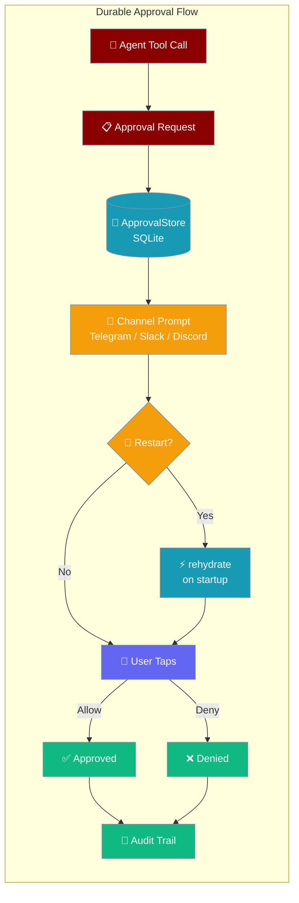
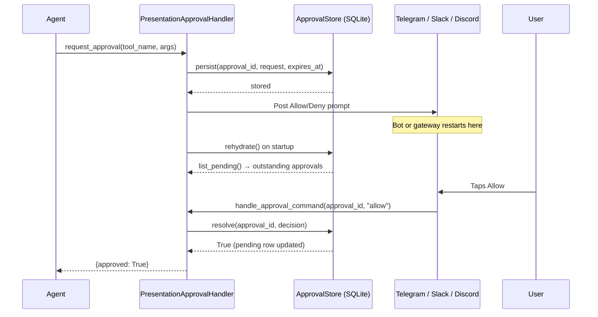

A late Allow/Deny tap still resolves — even after a deploy, crash, or restart between request and decision.



## Quick Start

<Steps>

<Step title="Wire a durable store to your bot handler">
Three lines to make approvals survive restarts.

```python
from praisonaiagents import Agent
from praisonai.bots import TelegramBot
from praisonai.bots._approval_store import ApprovalStore
from praisonai.bots._presentation_approval import PresentationApprovalHandler

agent = Agent(name="Admin", instructions="Manage the server", approval=True)

store = ApprovalStore(path="approvals.sqlite")
handler = PresentationApprovalHandler(store=store)

rehydrated = await handler.rehydrate()
```

On startup `rehydrate()` loads any pending approvals from the SQLite file so a late tap still resolves.
</Step>

<Step title="In-memory default (no persistence)">
Omit the store for the original zero-dependency behaviour — pending approvals are lost on restart.

```python
from praisonaiagents import Agent
from praisonai.bots import TelegramBot
from praisonai.bots._presentation_approval import PresentationApprovalHandler

agent = Agent(name="Admin", instructions="Manage the server", approval=True)
handler = PresentationApprovalHandler()  # store=None — in-memory only

bot = TelegramBot(token="...", agent=agent)
await bot.start()
```
</Step>

<Step title="Explicit handler wiring with rehydration">
Full startup pattern for bots that construct their own runtime.

```python
import asyncio
from praisonaiagents import Agent
from praisonai.bots import TelegramBot
from praisonai.bots._approval_store import ApprovalStore
from praisonai.bots._presentation_approval import PresentationApprovalHandler

agent = Agent(
    name="Admin",
    instructions="Manage the server",
    approval=True,
)

store = ApprovalStore(
    path="~/.praisonai/state/approvals.sqlite",
    ttl_seconds=7 * 86400,
)
handler = PresentationApprovalHandler(store=store, history_limit=1000)

async def main():
    rehydrated = await handler.rehydrate()
    print(f"Re-hydrated {rehydrated} pending approvals")
    bot = TelegramBot(token="...", agent=agent)
    await bot.start()

asyncio.run(main())
```
</Step>

</Steps>

---

## How It Works



| Step | What happens |
|------|-------------|
| **persist** | Pending approval written to SQLite before the channel prompt is sent |
| **restart** | Process exits; SQLite file remains on disk |
| **rehydrate** | On startup, `handler.rehydrate()` loads outstanding rows and recreates in-memory futures |
| **resolve** | User tap matches the durable row; decision recorded as audit trail |
| **stale tap** | If the row is already expired/resolved, `resolve()` returns `False` and the tap is safely ignored |

### Four terminal states

| Status | Cause |
|--------|-------|
| `approved` | User tapped Allow |
| `denied` | User tapped Deny |
| `expired` (timeout) | Request timed out with no response |
| `expired` (send-failure) | Channel delivery failed — durable row is cleared immediately; no orphaned rows |

---

## Configuration Options

### `ApprovalStore`

```python
from praisonai.bots._approval_store import ApprovalStore

store = ApprovalStore(
    path="~/.praisonai/state/approvals.sqlite",
    ttl_seconds=7 * 86400,
)
```

| Option | Type | Default | Description |
|--------|------|---------|-------------|
| `path` | `str \| Path` | required | SQLite file path; parent dirs are created automatically; `~` expanded |
| `ttl_seconds` | `int` | `604800` (7 days) | Resolved/expired entries are evicted after this many seconds |

### `PresentationApprovalHandler`

```python
from praisonai.bots._presentation_approval import PresentationApprovalHandler

handler = PresentationApprovalHandler(
    store=store,
    history_limit=1000,
)
```

| Option | Type | Default | Description |
|--------|------|---------|-------------|
| `store` | `ApprovalStoreProtocol \| None` | `None` | Durable backend; `None` = in-memory only (original behaviour) |
| `history_limit` | `int` | `1000` | Max resolved-id and audit-log retention; FIFO eviction keeps memory bounded |

---

## What Gets Stored

The SQLite table gives operators full visibility into every approval, past and present.

```sql
pending_approvals(
    approval_id TEXT PRIMARY KEY,   -- uuid4 hex from ApprovalRequest.approval_id
    ts REAL,                        -- created timestamp (Unix)
    expires_at REAL,                -- request timeout (Unix)
    request TEXT,                   -- JSON of ApprovalRequest
    status TEXT,                    -- pending | approved | denied | expired
    decision TEXT,                  -- JSON of ApprovalDecision (when resolved)
    approver TEXT,                  -- who resolved (user id or "system")
    resolved_at REAL                -- resolution timestamp (Unix)
)
```

Introspect at runtime with `store.get(approval_id)` or the count helpers below.

---

## Audit Trail

Every resolved approval is permanently recorded — including timeouts and delivery failures.

```python
import asyncio
from praisonai.bots._approval_store import ApprovalStore

store = ApprovalStore(path="approvals.sqlite")

row = store.get("abc123...")
print(row["status"])       # "approved" | "denied" | "expired"
print(row["approver"])     # user id, or "system" for timeouts/failures
print(row["resolved_at"])  # Unix timestamp

print(store.pending_count())  # approvals still waiting
print(store.stale_count())    # approvals past their deadline
print(store.size())           # total rows including resolved
```

For in-memory audit entries on the running handler:

```python
from praisonai.bots._presentation_approval import PresentationApprovalHandler

handler = PresentationApprovalHandler(store=store)

for entry in handler.audit_log:
    print(entry["approval_id"], entry["actor"], entry["decision"], entry["approved"])
```

---

## Common Patterns

### Persisting across deploys

Put the SQLite file on a mounted volume so it survives container recreation:

```python
import os
from praisonai.bots._approval_store import ApprovalStore

store = ApprovalStore(
    path=os.environ.get("APPROVALS_DB", "/data/approvals.sqlite"),
    ttl_seconds=14 * 86400,
)
```

### Expiring stale pending rows

Mark pending approvals past their deadline as `expired` (useful in scheduled maintenance):

```python
expired_count = await store.expire_overdue()
print(f"Expired {expired_count} stale approvals")
```

### Purging or rotating the store

```python
removed = store.purge()
print(f"Purged {removed} entries")
```

---

## Best Practices

<AccordionGroup>

<Accordion title="Use a persistent volume for the SQLite file">
The default path (`approvals.sqlite`) is relative to the working directory. In containerised deployments this is ephemeral. Mount a persistent volume and set `path` to a path on that volume — otherwise a restart defeats the whole purpose.

```python
store = ApprovalStore(path="/data/approvals.sqlite")
```
</Accordion>

<Accordion title="Set ttl_seconds long enough to audit but short enough to bound disk">
The default 7 days covers most human decision windows. Increase for compliance-heavy workflows; decrease for high-volume bots. Resolved rows are evicted lazily (on the next `persist` call) so disk growth is bounded automatically.
</Accordion>

<Accordion title="Do not supply your own approval_id">
`ApprovalRequest.approval_id` is auto-generated as a uuid4 hex. The store actively refuses to overwrite an active pending row with a different request on a reused id — that would allow an id to hijack an active prompt window. Let the SDK generate the id.
</Accordion>

<Accordion title="One ApprovalStore instance per process">
`ApprovalStore` uses a per-instance `threading.Lock` and WAL journal mode for safety. Multiple processes writing to the same file simultaneously may work with SQLite WAL in practice, but is not validated. Run one store per process; use separate files for separate gateway instances.
</Accordion>

<Accordion title="Call rehydrate() before accepting user messages">
Always `await handler.rehydrate()` before starting the bot's message loop. Outstanding approvals from before the restart need to be in-memory before the first callback arrives, otherwise the handler won't recognise the approval id and will log a warning.

```python
async def main():
    handler = PresentationApprovalHandler(store=store)
    rehydrated = await handler.rehydrate()
    await bot.start()
```
</Accordion>

</AccordionGroup>

---

## Related

<CardGroup cols={2}>
<Card title="Approval" icon="shield-check" href="/docs/features/approval">
Primary approval doc — enable approval on agents, YAML config, CLI flags
</Card>
<Card title="Approval Protocol" icon="plug" href="/docs/features/approval-protocol">
Backends: Slack, Telegram, Discord, Webhook, HTTP, Agent
</Card>
<Card title="Interactive Bot Actions" icon="hand-pointer" href="/docs/features/interactive-bot-actions">
Button UX that benefits from durable approvals
</Card>
<Card title="Messaging Bots" icon="robot" href="/docs/features/messaging-bots">
Bot runtimes that use the approval system
</Card>
</CardGroup>
