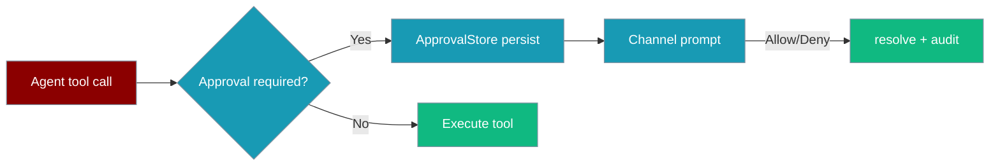
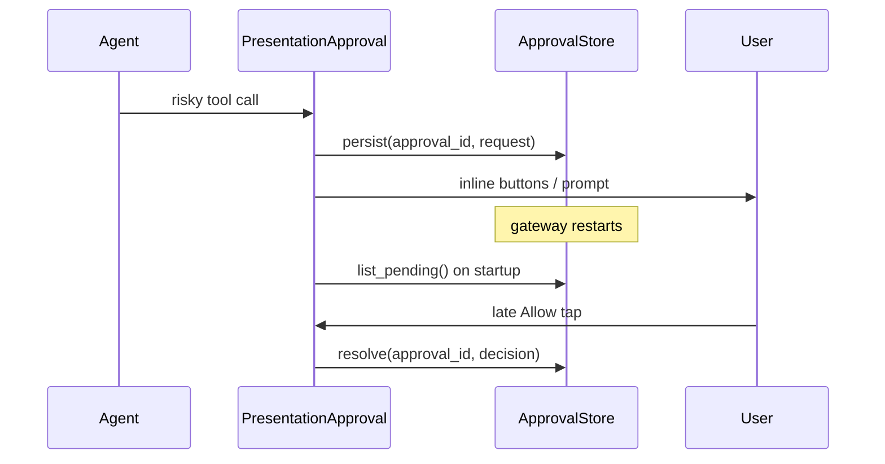
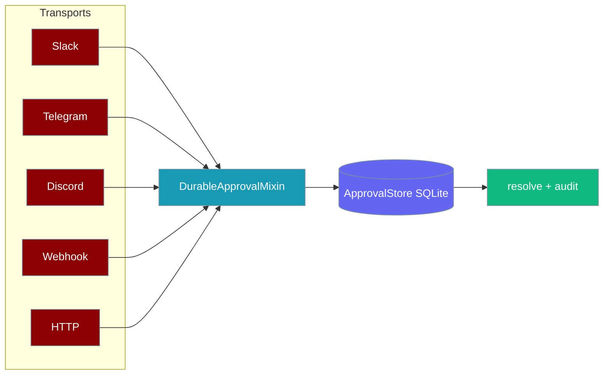

Pending tool approvals normally live in process memory — a gateway restart loses in-flight decisions. A durable approval store persists them so a late Allow/Deny tap still resolves correctly.

<Note>
**Two durable stores, different jobs:**
- **This page** — the bot **pending-approval queue** (`ApprovalStore` at `~/.praisonai/state/approvals.sqlite`) tracks in-flight tap prompts waiting for a decision.
- **Sibling** — the gateway **allow-list store** ([Gateway Scoped Approvals](/docs/features/gateway-scoped-approvals), `ScopedAllowlistStore` at `~/.praisonai/state/gateway/approvals.sqlite`) tracks "allow always" grants that skip future prompts.
</Note>

<Note>
**Under the hood:** approval decisions are journalled as `KIND_APPROVAL` events in the [Run-State Journal](/docs/features/run-state-journal). Combined with `interrupted_runs()`, this is what enables durable **pause-for-approval** HITL: a run that stops for approval can be safely resumed later — the loop replays journalled decisions rather than re-invoking tools.
</Note>

<Note>
**Transport wiring for Telegram** is auto-configured — see [Telegram Durable Approval](/docs/features/telegram-durable-approval). This page covers the underlying store used by that path.
</Note>

```python
from praisonai.bots import ApprovalStore, Bot
from praisonaiagents import Agent

agent = Agent(name="assistant", instructions="Be helpful")
bot = Bot(
    "telegram",
    agent=agent,
    approval_store=ApprovalStore(path="~/.praisonai/state/approvals.sqlite"),
)
bot.run()
```

The user taps Allow or Deny on a channel; the durable store resolves the pending approval even after a gateway restart.




## Quick Start

<Steps>
<Step title="Create a store">
```python
from praisonai.bots import ApprovalStore

store = ApprovalStore(
    path="~/.praisonai/state/approvals.sqlite",
    ttl_seconds=7 * 86400,  # evict resolved rows after 7 days
)
```
</Step>

<Step title="Pass it to your bot">
```python
from praisonai.bots import Bot
from praisonaiagents import Agent

agent = Agent(name="assistant", instructions="Be helpful")
bot = Bot("telegram", agent=agent, approval_store=store)
bot.run()
```
</Step>

<Step title="Restart safely">
On startup, outstanding pending approvals are re-hydrated. Users can tap Allow/Deny on messages sent before the restart.
</Step>
</Steps>

---

## How It Works



Each `ApprovalRequest` carries a stable `approval_id` (UUID hex) used as the correlation key across restarts.

<Note>
Persisted approvals can be recorded as reusable command prefixes — see [Reusable Approval Scopes](/docs/features/reusable-approval-scopes) for the `reusable_scope=True` opt-in.
</Note>

---

## Durable Chat-Native Backends

Every standalone chat backend — `SlackApproval`, `TelegramApproval`, `DiscordApproval`, `WebhookApproval`, and `HTTPApproval` — now accepts an optional `store=` for one-line restart safety.

Pass a store to any backend and the pending approval is persisted before polling; recover in-flight approvals on startup with `rehydrate()`.

```python
from praisonaiagents import Agent
from praisonai.bots import SlackApproval, ApprovalStore

store = ApprovalStore(path="~/.praisonai/state/approvals.sqlite")

agent = Agent(
    name="ops",
    instructions="Ask before destructive commands.",
    approval=SlackApproval(channel="#approvals", store=store),  # durable
)

agent.start("Clean up /tmp/cache")
```

Recover outstanding approvals after a restart:

```python
# On process startup, recover outstanding approvals from disk
backend = SlackApproval(channel="#approvals", store=store)
pending = await backend.rehydrate()
print(f"Recovered {len(pending)} pending approvals")
```



The shared `DEFAULT_APPROVAL_TIMEOUT` (300 seconds) is the single source of truth for the human-in-the-loop wait window across all five backends. Omit `store=` and behaviour is unchanged — durability is fully opt-in and backward-compatible.

<Note>
`rehydrate()` and `store=` come from the shared `DurableApprovalMixin` in `praisonai_bot.bots._approval_base`, inherited by every chat backend. As of praisonaiagents `1.6.156+` / praisonai-bot `0.0.37+`, `rehydrate()` output is always accurate — send failures and early exits record a fallback denial, so no phantom `pending` rows survive a restart.
</Note>

---

## ApprovalStore API

| Method | Description |
|---|---|
| `persist(approval_id, request, *, expires_at)` | Store a pending approval; refuses to overwrite resolved rows |
| `list_pending()` | Return outstanding un-expired approvals |
| `resolve(approval_id, decision)` | Record final decision; returns `False` if already resolved |
| `expire_overdue()` | Mark past-expiry pending rows as `expired` |
| `get(approval_id)` | Inspect a row for audit/doctor |
| `purge()` | Delete all entries |

---

## What Gets Stored

```
pending_approvals(
    approval_id TEXT PRIMARY KEY,
    ts REAL,
    expires_at REAL,
    request TEXT,        -- JSON ApprovalRequest
    status TEXT,         -- pending | approved | denied | expired
    decision TEXT,       -- JSON ApprovalDecision when resolved
    approver TEXT,
    resolved_at REAL
)
```

<Note>
Without a store, behaviour is unchanged — in-memory approvals remain the zero-dependency default. The core SDK defines `ApprovalStoreProtocol`; the SQLite implementation lives in `praisonai.bots`.
</Note>

`PersistentApproval` entries in `approvals.json` carry a `derived: bool` field (default `False`). When `derived=True`, the pattern was auto-generated by the reusable command-prefix scope derivation — for example `bash:git status *` instead of the literal `bash:git status -s`. Derived patterns match the bare prefix too (`bash:git status` with no trailing args). Approvals from older `approvals.json` files default to `derived=False` and behave as before. See [Reusable Approval Scopes](/docs/features/reusable-approval-scopes).

---

## Secure, Actor-Authorised Approval Backend

The `secure` (alias: `presentation`) backend wraps `PresentationApprovalHandler` and `ApprovalStore` together into a single `ApprovalProtocol` adapter — adding actor authorisation and fail-closed behaviour on top of the base durability layer.

<Warning>
`--approval secure` is **fail-closed**: if `PRAISONAI_APPROVAL_ACTORS` is empty or not set, the gateway refuses to start. This prevents an empty allow-list from silently permitting any actor to approve.
</Warning>

### Activate via CLI

```bash
export PRAISONAI_APPROVAL_ACTORS="telegram:12345,slack:U0123456"
praisonai serve gateway --config gateway.yaml --approval secure
```

### Activate via Python

```python
from praisonaiagents import Agent
from praisonai.bots import Bot

agent = Agent(name="assistant", instructions="Be helpful")
bot = Bot("telegram", agent=agent, approval="secure")
bot.run()
```

### How it differs from the base ApprovalStore

| Feature | `ApprovalStore` alone | `--approval secure` |
|---------|----------------------|----------------------|
| Persist to SQLite | ✅ | ✅ |
| Rehydrate on restart | ✅ | ✅ |
| Actor allow-list | ❌ | ✅ (`PRAISONAI_APPROVAL_ACTORS`) |
| LLM classifier for Allow/Deny | Some backends | ❌ (never uses LLM) |
| Fail-closed on empty allow-list | ❌ | ✅ |
| Approval ID binding | ✅ | ✅ (unguessable UUID) |

### Configuration

| Setting | How to set | Required |
|---------|-----------|----------|
| Allow-list | `PRAISONAI_APPROVAL_ACTORS=telegram:123,slack:U456` | Yes (fail-closed) |
| Store path | `PRAISONAI_HOME=/path/to/dir` (approvals stored in `<HOME>/state/approvals.sqlite`) | No (default: `~/.praisonai`) |

### Rehydration guarantee

Allow-list actors are stored alongside each pending approval. On restart, re-hydrated approvals carry the original allow-list — late Allow/Deny taps after a redeploy are still bound to the original requester.

---

## Best Practices

<AccordionGroup>
<Accordion title="Use for long-running bots">
Telegram, Slack, and Discord bots that restart for deploys benefit most — users won't lose half-resolved prompts.
</Accordion>

<Accordion title="Set a sensible TTL">
Default eviction is 7 days. Tune `ttl_seconds` to bound disk growth while keeping an audit trail.
</Accordion>

<Accordion title="Optional, not required">
Console and webhook backends work without a store. Add one only when restart-safety matters.
</Accordion>
</AccordionGroup>

---

## Related

<CardGroup cols={2}>
<Card title="Approval" icon="shield-check" href="/docs/features/approval">
  Default approval behaviour and backends
</Card>
<Card title="Approval Protocol" icon="plug" href="/docs/features/approval-protocol">
  ApprovalStoreProtocol and backend contracts
</Card>
<Card title="Messaging Bots" icon="robot" href="/docs/features/messaging-bots">
  Deploy agents to chat channels
</Card>
</CardGroup>
