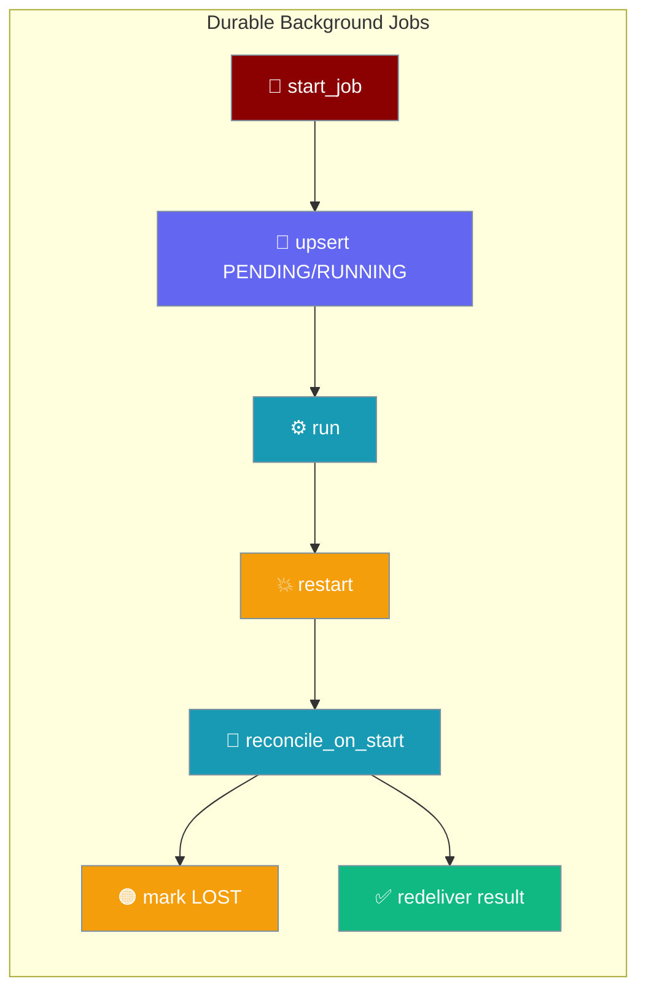
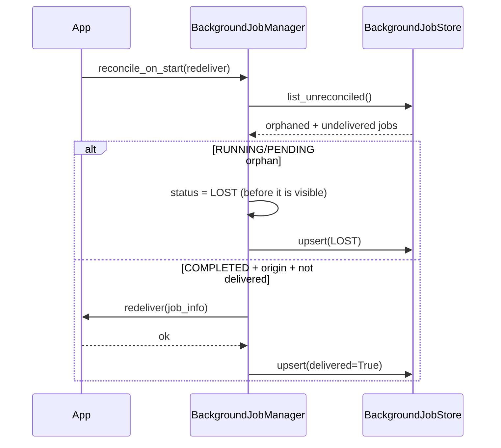
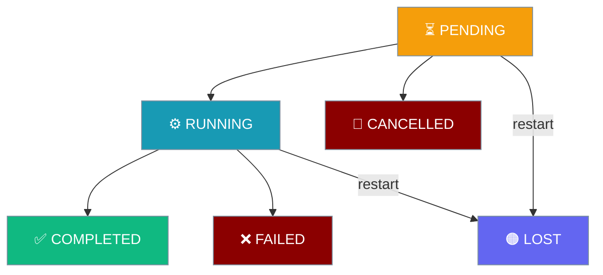

```python
from praisonaiagents.background.job_manager import BackgroundJobManager

# Your app supplies a store that implements the BackgroundJobStore protocol
manager = BackgroundJobManager(store=my_store)

# Once at startup, after wiring the deliver-back handler:
counts = manager.reconcile_on_start(redeliver=on_job_complete)
```

Durable background jobs persist every state transition so a crash mid-job no longer silently drops the work or the promised deliver-back — orphans become a queryable `LOST` state and undelivered results are replayed on the next boot.

Durability is opt-in: leave `store=None` (the default) for pure in-memory behaviour with zero overhead; supply a store and jobs survive a restart.



## Quick Start

<Steps>
<Step title="Enable persistence (opt-in)">

Pass a `store=` that implements the `BackgroundJobStore` protocol. Every job transition is now persisted:

```python
from praisonaiagents.background.job_manager import BackgroundJobManager

manager = BackgroundJobManager(store=my_store)
```
</Step>

<Step title="Reconcile on startup">

Call `reconcile_on_start()` once at boot, after wiring the deliver-back handler:

```python
counts = manager.reconcile_on_start(redeliver=on_job_complete)
# {"lost": 0, "redelivered": 0, "rehydrated": 0} on a clean start
print(f"jobs reconciled: {counts}")
```
</Step>

<Step title="Query a job after a restart">

Status lookups work after a restart — even before `reconcile_on_start()` runs, `get_status` falls through to the store:

```python
from praisonaiagents.background.job_manager import JobStatus

status = manager.get_status(job_id)  # e.g. JobStatus.LOST
```
</Step>

<Step title="Handle LOST jobs">

Inspect orphaned jobs and decide whether to retry or surface them to the user — abandoned work is never auto-re-run:

```python
from praisonaiagents.background.job_manager import JobStatus

lost = manager.list_jobs(status=JobStatus.LOST)
for job_id, info in lost.items():
    print(f"orphaned: {job_id} (origin={info.origin})")
```
</Step>
</Steps>

---

## How It Works

`reconcile_on_start()` reads `store.list_unreconciled()` and follows two paths: orphaned jobs become `LOST`; completed-but-undelivered jobs are replayed.



Every persisted job is re-hydrated into the in-memory map so `get_status(job_id)` keeps working after a restart. `redeliver=None` is safe — undelivered jobs are re-hydrated but not delivered.

### State machine

`LOST` is a new terminal state reached only via restart reconciliation.



---

## The BackgroundJobStore Protocol

Implement this `@runtime_checkable` protocol to plug in your own durable store. A concrete SQLite implementation lives in the wrapper/bot layer alongside the other durable stores (`OutboundQueue`, DLQ, approvals).

```python
from typing import Protocol, runtime_checkable, Optional, List
from praisonaiagents.background.job_manager import JobInfo

@runtime_checkable
class BackgroundJobStore(Protocol):
    def upsert(self, job: JobInfo) -> None: ...
    def get(self, job_id: str) -> Optional[JobInfo]: ...
    def list_unreconciled(self) -> List[JobInfo]: ...
```

| Method | Purpose |
|--------|---------|
| `upsert(job)` | Insert or update the persisted record, keyed by `job_id` |
| `get(job_id)` | Return the persisted `JobInfo`, or `None` if unknown |
| `list_unreconciled()` | Return orphaned (`PENDING`/`RUNNING`) jobs plus `COMPLETED`-with-`origin` jobs never marked `delivered` |

<Warning>The runner calls `upsert()` from its worker threads — your store implementation **must be thread-safe**.</Warning>

---

## Configuration

| Symbol | Type | Default | Description |
|--------|------|---------|-------------|
| `store` | `Optional[BackgroundJobStore]` | `None` | Keyword-only. Enable persistence when supplied; pure in-memory when `None` |
| `JobStatus.LOST` | enum value | — | Terminal state for `RUNNING`/`PENDING` jobs interrupted by a crash |
| `JobInfo.delivered` | `bool` | `False` | Whether the deliver-back to `origin` has fired |
| `reconcile_on_start` | method | — | `reconcile_on_start(redeliver=None) -> Dict[str, int]` |

### Reconciliation counts

`reconcile_on_start()` returns a counts dict — use it for a single startup log line:

```python
counts = manager.reconcile_on_start(redeliver=on_job_complete)
# {"lost": 2, "redelivered": 1, "rehydrated": 3}
```

| Key | Meaning |
|-----|---------|
| `lost` | Orphaned `RUNNING`/`PENDING` jobs transitioned to `LOST` |
| `redelivered` | `COMPLETED`-but-undelivered jobs whose deliver-back was replayed |
| `rehydrated` | Total jobs re-loaded into the in-memory map |

---

## Best Practices

<AccordionGroup>
<Accordion title="Call reconcile_on_start() exactly once, at startup">

Run it once at boot, after all deliver-back handlers are wired — mirroring how `OutboundQueue.drain_pending()` is wired. Calling it later risks a partially-wired `redeliver`.
</Accordion>

<Accordion title="Make redeliver idempotent">

`redeliver` receives the persisted `JobInfo`. A transient failure inside it means "retry on the next boot" — the job is left undelivered, never silently lost. Design the handler so a double-fire is harmless.
</Accordion>

<Accordion title="Sweep LOST records with cleanup_completed()">

`LOST` is age-evictable by `cleanup_completed(max_age=...)`. Run a periodic sweep so reconciled orphans don't accumulate across restarts.
</Accordion>

<Accordion title="Keep the store thread-safe">

`upsert()` is called from `BackgroundJobManager`'s worker threads. Guard shared state (or use a per-thread connection) so concurrent transitions don't corrupt the store.
</Accordion>

<Accordion title="Leave store=None when you don't need durability">

Persistence is opt-in. Omitting `store=` keeps the runner pure in-memory with zero overhead and unchanged behaviour — only reach for a store when surviving crashes matters.
</Accordion>
</AccordionGroup>

---

## Related

<CardGroup cols={2}>
<Card title="Background Tasks" icon="clock" href="/docs/features/background-tasks">
  The synchronous job manager and background runner patterns.
</Card>
<Card title="Background Subagents" icon="rocket" href="/docs/features/background-subagents">
  Spawn subagents that deliver results back to chat when done.
</Card>
<Card title="Durable Delivery" icon="shield-check" href="/docs/features/durable-delivery">
  Persist outbound bot messages with retry and crash-safe drain.
</Card>
<Card title="Hook Events" icon="webhook" href="/docs/features/hook-events">
  Subscribe to JOB_COMPLETED and other lifecycle events.
</Card>
</CardGroup>
