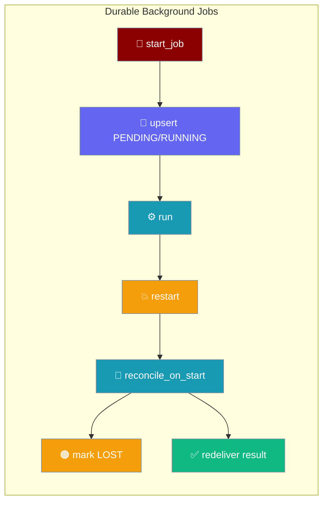
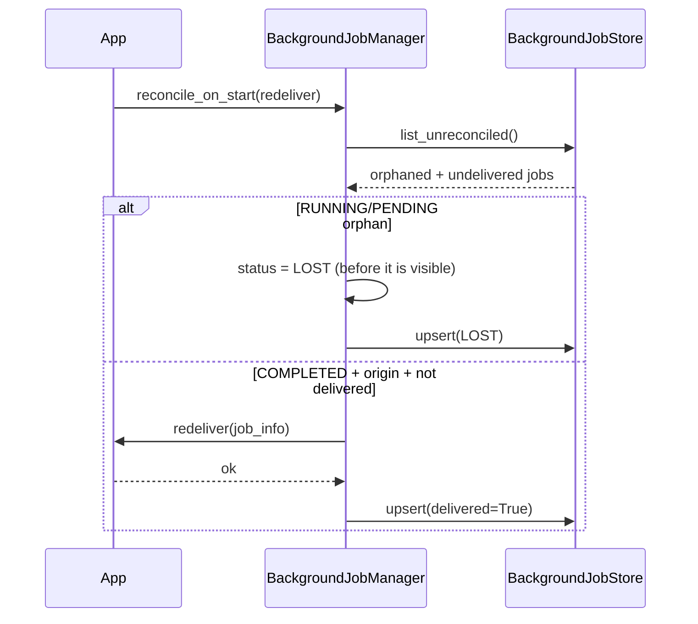
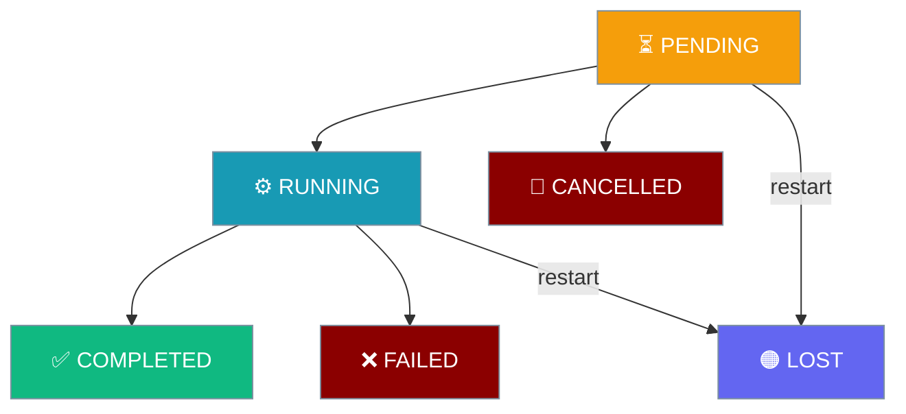

```python
from praisonaiagents import Agent

# Background subagent deliver-back — durable out of the box.
# If the process restarts mid-job, the deliver-back is replayed on
# the next boot from <PRAISONAI_HOME>/background_jobs.db.
agent = Agent(
    name="Researcher",
    instructions="Do long-running research and hand back a summary.",
)

result_id = agent.spawn_subagent(
    task="Summarise the last week of arXiv AI papers",
    background=True,
    deliver="chat",
)
```

Durable background jobs persist every state transition so a crash mid-job no longer silently drops the work or the promised deliver-back — orphans become a queryable `LOST` state and undelivered results are replayed on the next boot.

Durability is **on by default**: the shared manager returned by `get_job_manager()` — the same one the chat `/tasks` command and background subagent deliver-backs use — automatically persists to `<runs_dir>/background_jobs.db` and reconciles on boot. Opt out with `PRAISONAI_BACKGROUND_JOB_STORE=0` for the prior pure in-memory behaviour.


```mermaid
graph LR
    subgraph "Durable Background Jobs"
        Submit[🤖 start_job] --> Persist[💾 upsert PENDING/RUNNING]
        Persist --> Run[⚙️ run]
        Run --> Crash[💥 restart]
        Crash --> Reconcile[🔁 reconcile_on_start]
        Reconcile --> Lost[🟠 mark LOST]
        Reconcile --> Redeliver[✅ redeliver result]
    end

    classDef agent fill:#8B0000,stroke:#7C90A0,color:#fff
    classDef process fill:#189AB4,stroke:#7C90A0,color:#fff
    classDef storage fill:#6366F1,stroke:#7C90A0,color:#fff
    classDef success fill:#10B981,stroke:#7C90A0,color:#fff
    classDef warn fill:#F59E0B,stroke:#7C90A0,color:#fff

    class Submit agent
    class Run,Reconcile process
    class Persist storage
    class Redeliver success
    class Crash,Lost warn
```

Three ways to reach durability — pick the row that matches your setup.


```mermaid
graph TB
    Start[👤 Need background jobs?] --> Q1{Using<br/>get_job_manager?}
    Q1 -->|Yes ✅| Default[💾 Durable by default<br/>SqliteBackgroundJobStore<br/>at &lt;runs_dir&gt;/background_jobs.db]
    Q1 -->|No, custom manager| Q2{Need durability?}
    Q2 -->|Yes| Custom[🧩 Pass store=SqliteBackgroundJobStore&#40;&#41;<br/>or your own BackgroundJobStore]
    Q2 -->|No| Mem[⚡ store=None — in-memory only]
    Default --> OptOut[🔌 Opt out:<br/>PRAISONAI_BACKGROUND_JOB_STORE=0]

    classDef start fill:#8B0000,stroke:#7C90A0,color:#fff
    classDef question fill:#F59E0B,stroke:#7C90A0,color:#fff
    classDef path fill:#10B981,stroke:#7C90A0,color:#fff
    classDef alt fill:#189AB4,stroke:#7C90A0,color:#fff
    classDef config fill:#6366F1,stroke:#7C90A0,color:#fff

    class Start start
    class Q1,Q2 question
    class Default,Custom path
    class Mem alt
    class OptOut config
```

## Quick Start

<Steps>
<Step title="You already have durability">

The shared manager returned by `get_job_manager()` is already backed by `SqliteBackgroundJobStore` and has already reconciled orphaned jobs on first construction — zero code, zero setup:

```python
from praisonaiagents.background.job_manager import get_job_manager

manager = get_job_manager()  # already backed by SqliteBackgroundJobStore
                             # already ran reconcile_on_start() once
```
</Step>

<Step title="Enable persistence on a custom manager">

Building your own `BackgroundJobManager`? Pass `store=SqliteBackgroundJobStore()` (or any store implementing the `BackgroundJobStore` protocol). Every job transition is now persisted:

```python
from praisonaiagents.background import SqliteBackgroundJobStore
from praisonaiagents.background.job_manager import BackgroundJobManager

manager = BackgroundJobManager(store=SqliteBackgroundJobStore())
```
</Step>

<Step title="Reconcile on startup">

`get_job_manager()` already ran this once. On a custom manager, call `reconcile_on_start()` once at boot, after wiring the deliver-back handler:

```python
counts = manager.reconcile_on_start(redeliver=on_job_complete)
# {"lost": 0, "redelivered": 0, "rehydrated": 0} on a clean start
print(f"jobs reconciled: {counts}")
```
</Step>

<Step title="Query a job after a restart">

Status lookups work after a restart — even before `reconcile_on_start()` runs, `get_status` falls through to the store:

```python
from praisonaiagents.background.job_manager import JobStatus

status = manager.get_status(job_id)  # e.g. JobStatus.LOST
```
</Step>

<Step title="Handle LOST jobs">

Inspect orphaned jobs and decide whether to retry or surface them to the user — abandoned work is never auto-re-run:

```python
from praisonaiagents.background.job_manager import JobStatus

lost = manager.list_jobs(status=JobStatus.LOST)
for job_id, info in lost.items():
    print(f"orphaned: {job_id} (origin={info.origin})")
```
</Step>
</Steps>

---

## How It Works

`reconcile_on_start()` reads `store.list_unreconciled()` and follows two paths: orphaned jobs become `LOST`; completed-but-undelivered jobs are replayed.


```mermaid
sequenceDiagram
    participant App
    participant Manager as BackgroundJobManager
    participant Store as BackgroundJobStore

    App->>Manager: reconcile_on_start(redeliver)
    Manager->>Store: list_unreconciled()
    Store-->>Manager: orphaned + undelivered jobs
    alt RUNNING/PENDING orphan
        Manager->>Manager: status = LOST (before it is visible)
        Manager->>Store: upsert(LOST)
    else COMPLETED + origin + not delivered
        Manager->>App: redeliver(job_info)
        App-->>Manager: ok
        Manager->>Store: upsert(delivered=True)
    end
```

Every persisted job is re-hydrated into the in-memory map so `get_status(job_id)` keeps working after a restart. `redeliver=None` is safe — undelivered jobs are re-hydrated but not delivered.

### State machine

`LOST` is a new terminal state reached only via restart reconciliation.


```mermaid
graph TB
    PENDING[⏳ PENDING] --> RUNNING[⚙️ RUNNING]
    RUNNING --> COMPLETED[✅ COMPLETED]
    RUNNING --> FAILED[❌ FAILED]
    PENDING --> CANCELLED[🚫 CANCELLED]
    PENDING -->|restart| LOST[🟠 LOST]
    RUNNING -->|restart| LOST

    classDef pending fill:#F59E0B,stroke:#7C90A0,color:#fff
    classDef process fill:#189AB4,stroke:#7C90A0,color:#fff
    classDef success fill:#10B981,stroke:#7C90A0,color:#fff
    classDef fail fill:#8B0000,stroke:#7C90A0,color:#fff
    classDef lost fill:#6366F1,stroke:#7C90A0,color:#fff

    class PENDING pending
    class RUNNING process
    class COMPLETED success
    class FAILED,CANCELLED fail
    class LOST lost
```

---

## The BackgroundJobStore Protocol

Implement this `@runtime_checkable` protocol to plug in your own durable store. A concrete SQLite implementation — `SqliteBackgroundJobStore` — now ships in core (`praisonaiagents.background`) and backs `get_job_manager()` by default; you only implement the protocol yourself for a non-SQLite backend.

```python
from typing import Protocol, runtime_checkable, Optional, List
from praisonaiagents.background.job_manager import JobInfo

@runtime_checkable
class BackgroundJobStore(Protocol):
    def upsert(self, job: JobInfo) -> None: ...
    def get(self, job_id: str) -> Optional[JobInfo]: ...
    def list_unreconciled(self) -> List[JobInfo]: ...
```

| Method | Purpose |
|--------|---------|
| `upsert(job)` | Insert or update the persisted record, keyed by `job_id` |
| `get(job_id)` | Return the persisted `JobInfo`, or `None` if unknown |
| `list_unreconciled()` | Return orphaned (`PENDING`/`RUNNING`) jobs plus `COMPLETED`-with-`origin` jobs never marked `delivered` |

<Warning>The runner calls `upsert()` from its worker threads — your store implementation **must be thread-safe**.</Warning>

---

## Built-in SqliteBackgroundJobStore

`SqliteBackgroundJobStore` is the concrete, stdlib-only store that backs `get_job_manager()` by default. Import it, or omit `db_path` to use the default location:

```python
from praisonaiagents.background import SqliteBackgroundJobStore

# Default location: <runs_dir>/background_jobs.db (honours PRAISONAI_HOME)
store = SqliteBackgroundJobStore()

# In-memory database for tests
test_store = SqliteBackgroundJobStore(db_path=":memory:")
```

| Aspect | Detail |
|--------|--------|
| Import | `from praisonaiagents.background import SqliteBackgroundJobStore` (or `from praisonaiagents.background.sqlite_store import SqliteBackgroundJobStore`) |
| Constructor | `SqliteBackgroundJobStore(db_path: Optional[str] = None)` |
| Default DB path | `<runs_dir>/background_jobs.db` — under `PRAISONAI_HOME`, alongside the run ledger and event log |
| Tests | Pass `db_path=":memory:"` |
| Extra method | `close()` closes the underlying connection |

### Schema

A single `background_jobs` table with an index on `status`:

| Column | Type | Notes |
|--------|------|-------|
| `job_id` | `TEXT` | Primary key |
| `status` | `TEXT` | `pending` / `running` / `completed` / `failed` / `cancelled` / `lost` |
| `created_at` | `REAL` | Spawn timestamp |
| `started_at` | `REAL` | Nullable |
| `completed_at` | `REAL` | Nullable |
| `result` | `TEXT` | JSON-serialised job result |
| `error` | `TEXT` | Nullable error string |
| `origin` | `TEXT` | JSON-serialised deliver-back context |
| `delivered` | `INTEGER` | `0`/`1` — deliver-back fired |

Index: `idx_background_jobs_status` on `status`.

### Thread-safety & durability posture

A single re-entrant lock guards one shared connection opened `check_same_thread=False` — safe to share across the runner's worker threads. Durability matches its siblings `SQLiteRunLedger` and `SqliteEventLog`: WAL journal mode, `busy_timeout=5000`, `synchronous=NORMAL`.

---

## Configuration

| Symbol | Type | Default | Description |
|--------|------|---------|-------------|
| `store` | `Optional[BackgroundJobStore]` | `None` | Keyword-only. Enable persistence when supplied; pure in-memory when `None`. `get_job_manager()` supplies a `SqliteBackgroundJobStore` automatically |
| `JobStatus.LOST` | enum value | — | Terminal state for `RUNNING`/`PENDING` jobs interrupted by a crash |
| `JobInfo.delivered` | `bool` | `False` | Whether the deliver-back to `origin` has fired |
| `reconcile_on_start` | method | — | `reconcile_on_start(redeliver=None) -> Dict[str, int]` |

### Environment variable

| Env var | Default | Purpose |
|---------|---------|---------|
| `PRAISONAI_BACKGROUND_JOB_STORE` | `1` (on) | Set to `0` / `false` to force the shared `get_job_manager()` back to pure in-memory (no store attached, no reconcile). |

### Reconciliation counts

`reconcile_on_start()` returns a counts dict — use it for a single startup log line:

```python
counts = manager.reconcile_on_start(redeliver=on_job_complete)
# {"lost": 2, "redelivered": 1, "rehydrated": 3}
```

| Key | Meaning |
|-----|---------|
| `lost` | Orphaned `RUNNING`/`PENDING` jobs transitioned to `LOST` |
| `redelivered` | `COMPLETED`-but-undelivered jobs whose deliver-back was replayed |
| `rehydrated` | Total jobs re-loaded into the in-memory map |

---

## Best Practices

<AccordionGroup>
<Accordion title="Call reconcile_on_start() exactly once, at startup">

Run it once at boot, after all deliver-back handlers are wired — mirroring how `OutboundQueue.drain_pending()` is wired. Calling it later risks a partially-wired `redeliver`.
</Accordion>

<Accordion title="Make redeliver idempotent">

`redeliver` receives the persisted `JobInfo`. A transient failure inside it means "retry on the next boot" — the job is left undelivered, never silently lost. Design the handler so a double-fire is harmless.
</Accordion>

<Accordion title="Sweep LOST records with cleanup_completed()">

`LOST` is age-evictable by `cleanup_completed(max_age=...)`. Run a periodic sweep so reconciled orphans don't accumulate across restarts.
</Accordion>

<Accordion title="Keep the store thread-safe">

`upsert()` is called from `BackgroundJobManager`'s worker threads. Guard shared state (or use a per-thread connection) so concurrent transitions don't corrupt the store.
</Accordion>

<Accordion title="Opt out with the env var if you truly want in-memory">

For the shared `get_job_manager()` the escape hatch is the environment variable, not the constructor kwarg — set `PRAISONAI_BACKGROUND_JOB_STORE=0` to get pure in-memory behaviour (no store, no reconcile). When you construct `BackgroundJobManager` yourself, omitting `store=` keeps that manager in-memory with zero overhead.
</Accordion>
</AccordionGroup>

---

## Related

<CardGroup cols={2}>
<Card title="Background Tasks" icon="clock" href="/features/background-tasks">
  The synchronous job manager and background runner patterns.
</Card>
<Card title="Background Subagents" icon="rocket" href="/features/background-subagents">
  Spawn subagents that deliver results back to chat when done.
</Card>
<Card title="Durable Delivery" icon="shield-check" href="/features/durable-delivery">
  Persist outbound bot messages with retry and crash-safe drain.
</Card>
<Card title="Hook Events" icon="webhook" href="/features/hook-events">
  Subscribe to JOB_COMPLETED and other lifecycle events.
</Card>
</CardGroup>
