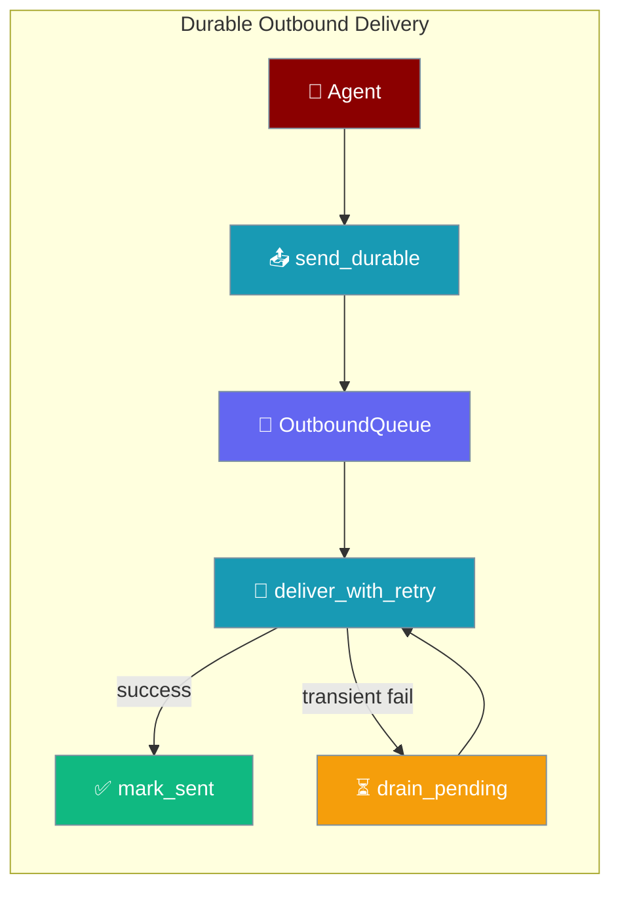
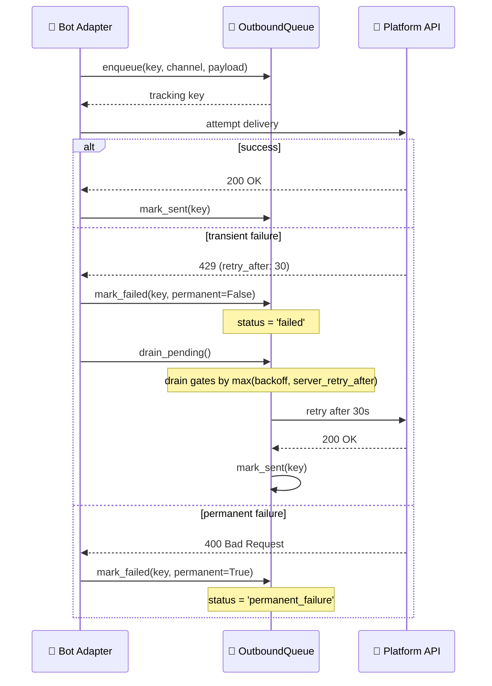
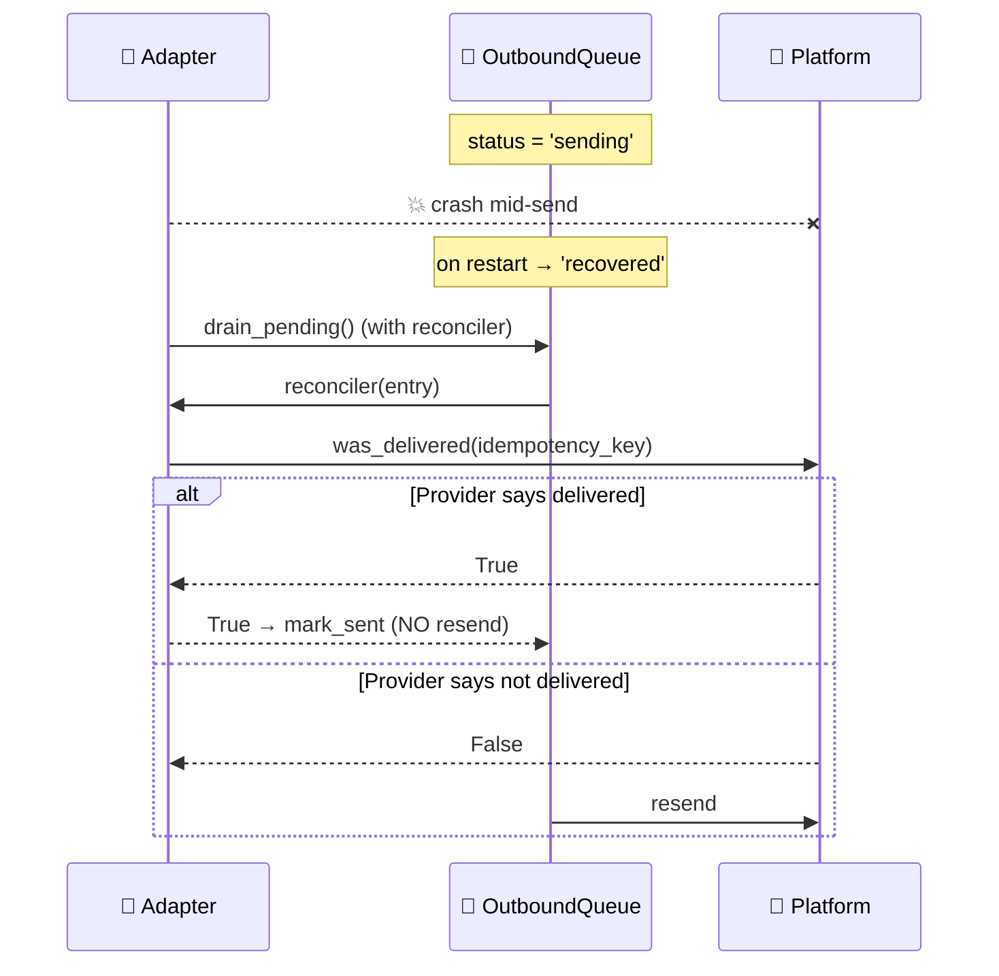
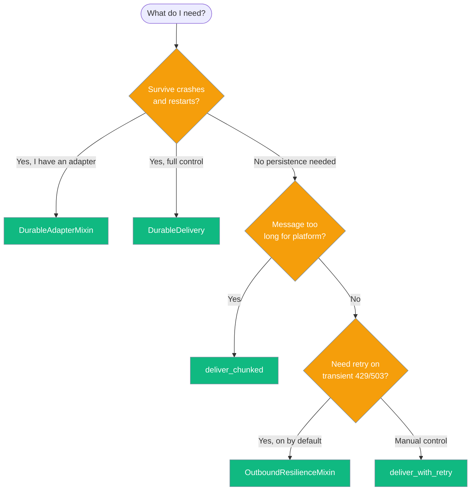

```python
from praisonaiagents import Agent

agent = Agent(name="bot-agent", instructions="Reply on messaging channels.")
agent.start("Send the user a confirmation once the job completes.")
```
Durable Delivery persists every outbound bot message to a SQLite outbox so retries, restarts, and platform outages never drop a reply. For **permanently** dead targets — bot kicked, chat deleted — see [Dead Target Registry](/docs/features/dead-target-registry), which suppresses doomed sends instead of queuing them.

<Note>
This page covers **outbound** durability (`DurableDelivery` / `OutboundQueue`). For **inbound** durability — which is now on by default for all gateway/bot runs — see [Inbound Journal](/docs/features/inbound-journal) and [Inbound DLQ](/docs/features/inbound-dlq).
</Note>

<Note>
**Durable Delivery vs Outbound Resilience.** Durable Delivery is the heavy option — a SQLite outbox that survives crashes and lets you `send_durable()` explicitly. The lighter [Outbound Resilience](/docs/features/outbound-resilience) is now on by default in every bot adapter and retries transient failures without changing any code. Use Outbound Resilience for typical "don't drop replies on a 429" scenarios; reach for Durable Delivery when you also need to survive process crashes.
</Note>

The user expects a bot reply; durable delivery queues outbound messages, retries transient failures, and drains after restarts.




## Quick Start

<Steps>
<Step title="Easiest path — DurableAdapterMixin">
Add three lines to any existing adapter and every `send_durable()` call is crash-safe:

```python
import os
from praisonaiagents import Agent
from praisonai.bots import TelegramBot

# TelegramBot already supports durable delivery via DurableAdapterMixin
agent = Agent(name="assistant", instructions="Help users")
bot = TelegramBot(
    token=os.getenv("TELEGRAM_BOT_TOKEN"),
    agent=agent,
)

# Drain any messages queued before the last crash — call this at startup
await bot.drain_outbox()

# Send with durability
await bot.send_durable(
    channel_id="12345",
    content="Hello! I'm crash-safe.",
    idempotency_key="welcome-msg-12345",
)
```
</Step>

<Step title="Configure manually with DurableDelivery">
For full control, wire up `OutboundQueue` and `DurableDelivery` directly:

```python
import os
from praisonaiagents import Agent
from praisonai.bots import OutboundQueue, DurableDelivery, TelegramBot

outbox = OutboundQueue(path="~/.praisonai/state/outbox.sqlite")
adapter = TelegramBot(
    token=os.getenv("TELEGRAM_BOT_TOKEN"),
    agent=Agent(name="assistant", instructions="Help users"),
)
delivery = DurableDelivery(outbox, adapter, platform="telegram")

# On startup: replay anything queued before the last crash
succeeded, failed = await delivery.drain_pending()

# Send with durability — idempotent if you reuse the key
success = await delivery.send(
    channel_id="12345",
    content="Hello, world!",
    idempotency_key="msg-123",
)
```
</Step>
</Steps>

---

## How It Works



Each message moves through statuses: `pending` → `sending` → `sent` (or `failed` / `permanent_failure`).

### State Machine

The outbox tracks six statuses: `pending`, `sending`, `recovered`, `sent`, `failed`, and `permanent_failure`.

On restart, stale `sending` entries transition to **`recovered`** instead of `pending`. This preserves the information that the send was in-flight when the crash occurred.

```
status = 'sending'  (crash)  ──►  status = 'recovered'  (on restart)
```

`recovered` entries are retryable like `pending`, but when a reconciler is supplied to `drain()`, they are offered to it first — allowing adapters that can check the platform to confirm delivery and avoid re-sending an already-delivered message (**effectively-once**). Without a reconciler, `recovered` entries are re-sent as normal (at-least-once, unchanged behaviour).

<Note>
Status-update writes (`mark_sent`, `mark_failed`, `_claim_entry`) now call `conn.commit()`. Without this, a terminal status could be lost on a crash, causing an already-delivered message to be redelivered. This is a reliability fix — no API change is required.
</Note>

---

## Effectively-Once Delivery

Adapters that can confirm whether a prior send actually landed can upgrade durable delivery from at-least-once to effectively-once.



<Steps>
<Step title="Declare the capability">
Set `reconciles_unknown_send=True` on `PlatformCapabilities`:

```python
from praisonaiagents.bots import PlatformCapabilities

class MyAdapter(DurableAdapterMixin):
    platform_capabilities = PlatformCapabilities(
        reconciles_unknown_send=True,
    )
```
</Step>

<Step title="Implement was_delivered">
Add an async method that checks the platform for a prior send:

```python
async def was_delivered(self, idempotency_key: str) -> bool:
    status = await my_provider.get_message_status(idempotency_key)
    return status == "sent"
```
</Step>

<Step title="Call drain_pending() at startup">
`DurableDelivery` auto-wires the reconciler from the adapter's capability — no extra configuration required:

```python
from praisonaiagents.bots import PlatformCapabilities
from praisonai.bots._adapter_base import DurableAdapterMixin


class AcmeAdapter(DurableAdapterMixin):
    platform_capabilities = PlatformCapabilities(
        reconciles_unknown_send=True,
    )

    async def was_delivered(self, idempotency_key: str) -> bool:
        status = await acme_client.messages.lookup(idempotency_key)
        return status.delivered

    async def send_message(self, channel_id: str, content: str) -> None:
        await acme_client.messages.send(channel_id, content)


# DurableDelivery picks up the reconciler automatically.
succeeded, failed = await adapter.drain_outbox()
```
</Step>
</Steps>

---

## Choosing the Right Primitive



| I need to… | Use |
|---|---|
| Auto-retry transient failures — no config, works everywhere | [`OutboundResilienceMixin`](/docs/features/outbound-resilience) (on by default in every adapter) |
| Manual retry with explicit backoff policy | `deliver_with_retry()` |
| Send a message that may exceed platform length limits | `deliver_chunked()` |
| Survive process crashes / platform outages with replay | `DurableDelivery` or `DurableAdapterMixin` |
| Build a brand-new custom adapter with durability built in | `DurableAdapterMixin` |

---

## Configuration Options

### `OutboundQueue`

SQLite-backed outbox. All parameters after `path` are keyword-only.

| Parameter | Type | Default | Description |
|---|---|---|---|
| `path` | `str \| Path` | _(required)_ | SQLite file path. Parent dirs are created automatically. |
| `max_size` | `int` | `50_000` | Max entries kept. Oldest sent entries are evicted when exceeded. |
| `ttl_seconds` | `int` | `604800` (7 days) | Sent entries older than this are evicted. |
| `max_attempts` | `int` | `5` | Max delivery attempts before marking permanent failure. |
| `backoff` | `BackoffPolicy` | `BackoffPolicy()` | Retry backoff configuration. |

#### `OutboundQueue.drain()` signature

```python
async def drain(
    self,
    sender: Callable[[str, Dict[str, Any]], Awaitable[bool]],
    limit: Optional[int] = None,
    *,
    reconciler: Optional[Callable[[OutboundEntry], Awaitable[bool]]] = None,
) -> Tuple[int, int]:
```

| Parameter | Type | Default | Description |
|---|---|---|---|
| `sender` | `async callable` | _(required)_ | Async callable that sends the message. |
| `limit` | `int \| None` | `None` | Max entries to drain in this call. |
| `reconciler` | `async callable \| None` | `None` | Called only for `recovered` entries. Returns `True` → mark sent without re-dispatch (effectively-once). Returns `False` → re-send as normal. Raises → falls back to re-send (logged at WARNING). |

```python
from praisonai.bots import OutboundQueue

outbox = OutboundQueue(
    path="~/.praisonai/state/outbox.sqlite",
    max_size=10_000,
    ttl_seconds=3 * 86400,  # 3 days
    max_attempts=3,
)
```

### `DurableDelivery`

Wraps an `OutboundQueue` and an adapter to provide a simple `.send()` / `.drain_pending()` API.

| Parameter | Type | Default | Description |
|---|---|---|---|
| `outbox` | `OutboundQueue` | _(required)_ | The outbound queue to persist messages. |
| `adapter` | adapter instance | _(required)_ | Bot adapter with a `send_message(channel_id, content)` method. |
| `platform` | `str` | `""` | Platform name for platform-aware error classification. |
| `backoff` | `BackoffPolicy` | `BackoffPolicy()` | Retry backoff configuration. |
| `max_attempts` | `int` | `3` | Max delivery attempts. |

### `DurableAdapterMixin.setup_durable_delivery()`

Call once in your adapter's `__init__` to wire up the outbox.

| Parameter | Type | Default | Description |
|---|---|---|---|
| `outbox_path` | `str \| None` | `None` | Path to SQLite outbox. `None` disables durability. |
| `platform` | `str` | `""` | Platform name for error classification. |
| `max_attempts` | `int` | `3` | Max delivery attempts per message. |
| `max_size` | `int` | `50_000` | Max messages in outbox. |
| `ttl_seconds` | `int` | `604800` (7 days) | TTL for sent messages. |

### `deliver_with_retry()`

Bounded retry without persistence — on a recoverable failure, the delay is the **server-mandated wait** (`server_retry_after(err)`) when present, otherwise `compute_backoff(policy, attempt)`.

| Parameter | Type | Default | Description |
|---|---|---|---|
| `send_func` | `async callable` | _(required)_ | Async callable to execute (the send operation). |
| `policy` | `BackoffPolicy` | `BackoffPolicy(max_attempts=3)` | Retry backoff configuration. |
| `is_recoverable` | `callable \| None` | `None` | Function to classify errors as transient. Defaults to `is_recoverable_error(e, platform)`. |
| `platform` | `str` | `""` | Platform name for platform-specific error rules. |
| `rate_limiter` | `Optional[RateLimiter]` | `None` | When supplied, a server-mandated wait (Telegram `retry_after`, HTTP `Retry-After`) triggers `await rate_limiter.penalise(channel_id, delay)` so subsequent sends to the same channel hold off until the platform's window elapses. |
| `parked_store` | `Any \| None` | `None` | Optional DLQ for failed sends. |
| `reply_data` | `dict \| None` | `None` | Optional metadata for DLQ storage. |

```python
from praisonai.bots._delivery import deliver_with_retry
from praisonai.bots._rate_limit import RateLimiter
from praisonai.bots._resilience import BackoffPolicy

limiter = RateLimiter.for_platform("telegram")
ok, err = await deliver_with_retry(
    send_fn, channel_id="telegram-chat-12345",
    rate_limiter=limiter,
    policy=BackoffPolicy(initial_ms=2000, max_ms=30000, max_attempts=5),
    platform="telegram",
)
```

### `server_retry_after()`

Extracts a server-mandated wait (seconds) from an error or response. Used internally by `deliver_with_retry`, `ConnectionMonitor.record_error`, and `OutboundQueue.drain` to honour explicit throttle signals over the policy backoff.

```python
from praisonai.bots._resilience import server_retry_after

# Telegram RetryAfter
wait = server_retry_after(err)          # -> 30.0

# HTTP Retry-After header (seconds or HTTP-date)
wait = server_retry_after(http_err)     # -> 5.0 or seconds-until-date

# No hint present
wait = server_retry_after(generic_err)  # -> None
```

| Source | Where it's read | Notes |
|---|---|---|
| Telegram `RetryAfter` | `err.retry_after` attribute | python-telegram-bot exposes this directly. |
| Telegram raw API 429 | `err.parameters["retry_after"]` | Raw API shape. |
| HTTP `Retry-After` | `err.headers`, `err.response.headers`, or `err.resp.headers` | Integer seconds **or** HTTP-date (parsed via `email.utils.parsedate_to_datetime`; missing tz treated as UTC; clamped `>= 0`). |
| Text fallback | regex on `str(err)` | Matches `retry after <n>` / `retry_after: <n>`. |

Returns `None` when no hint is present — callers fall back to the policy backoff.

### `deliver_chunked()`

Splits a long message at paragraph boundaries and sends each chunk separately. Returns the number of chunks sent.

| Parameter | Type | Default | Description |
|---|---|---|---|
| `adapter` | adapter instance | _(required)_ | Bot adapter with `send_message(channel_id, content)`. |
| `channel_id` | `str` | _(required)_ | Target channel. |
| `content` | `str` | _(required)_ | Message text to split and send. |
| `max_length` | `int` | `4096` | Max characters per chunk (Telegram limit is 4096). |
| `preserve_fences` | `bool` | `True` | Keep code fence blocks intact even if they exceed `max_length`. |

```python
from praisonai.bots._chunk import chunk_message

# chunk_message is the underlying splitter
chunks = chunk_message(long_text, max_length=4096, preserve_fences=True)
for chunk in chunks:
    await adapter.send_message(channel_id, chunk)
```

### `BackoffPolicy`

Controls retry timing for both `deliver_with_retry` and `OutboundQueue.drain`.

| Attribute | Type | Default | Description |
|---|---|---|---|
| `initial_ms` | `float` | `2000.0` | Initial delay in milliseconds. |
| `max_ms` | `float` | `30000.0` | Maximum delay in milliseconds. |
| `factor` | `float` | `1.8` | Multiplicative factor per attempt. |
| `jitter` | `float` | `0.25` | Random jitter fraction (0.0–1.0). |
| `max_attempts` | `int` | `0` | Max retry attempts. `0` = unlimited. |

---

## Idempotency & Drain on Startup

### Idempotency Keys

Every message has an `idempotency_key` — a UUID generated automatically if you omit it. Reusing the same key for the same logical message prevents double-sends across retries.

```python
# Webhook-triggered reply: derive key from inbound message ID
inbound_id = webhook_payload["message_id"]
await delivery.send(
    channel_id=chat_id,
    content=reply_text,
    idempotency_key=f"reply-{inbound_id}",
)
```

If the webhook is redelivered and `send()` is called again with the same key, the outbox skips the enqueue (SQLite `UNIQUE` constraint) and marks the existing row sent.

### Drain on Startup

Call `drain_pending()` once at adapter startup to replay anything that was queued before the last crash:

```python
# On adapter startup
succeeded, failed = await delivery.drain_pending()
# Log output: "Drained outbox: 3 sent, 0 failed"

# Or with the mixin:
succeeded, failed = await adapter.drain_outbox()
```

The drain replays oldest messages first and skips messages that have exceeded `max_attempts`. The retry gate is `max(compute_backoff(policy, attempts + 1), server_retry_after(stored_err))` — the platform's mandated wait survives across process restarts.

<Note>
The hint is recovered from the **stored error string**, not the live exception. Only hints that survive `str(err)` (python-telegram-bot `RetryAfter` repr, HTTP headers folded into the error message, text-form "retry after N") are honoured on drain.
</Note>

---

## Best Practices

<AccordionGroup>
<Accordion title="Set reconciles_unknown_send=True only if you can answer the question reliably">
  A flaky `was_delivered` that returns `False` for an already-delivered message will cause a duplicate send. A reconciler that raises falls back to at-least-once re-send (safe, but logged at WARNING). Only opt in when your platform provides a reliable message-status API.
</Accordion>

<Accordion title="Don't rely on supports_idempotency_token alone for dedupe">
  `supports_idempotency_token=True` is informational only — the outbox does not currently forward the token on resend. Adapters relying on provider-side deduplication should also set `reconciles_unknown_send=True` to get effectively-once delivery.
</Accordion>

<Accordion title="Always set platform= for accurate error classification">
The `is_recoverable_error()` function checks platform-specific patterns (e.g., Telegram's HTTP 409 conflict, rate-limit "retry after" responses) when a platform name is provided. Without it, only generic patterns are checked and some transient errors may be misclassified as permanent.

```python
delivery = DurableDelivery(outbox, adapter, platform="telegram")
```
</Accordion>

<Accordion title="Use a stable idempotency_key derived from the inbound message">
When bridging a webhook to an outbound reply, derive the key from the inbound message ID. This ensures webhook redeliveries don't produce duplicate outbound sends.

```python
# ✅ Good: stable key tied to the inbound event
await delivery.send(
    channel_id=chat_id,
    content=reply,
    idempotency_key=f"reply-{inbound_message_id}",
)

# ❌ Bad: new UUID every call — no deduplication across retries
import uuid
await delivery.send(channel_id=chat_id, content=reply, idempotency_key=str(uuid.uuid4()))
```
</Accordion>

<Accordion title="Keep the outbox on persistent local disk">
Store the outbox on a persistent, local filesystem path — not `/tmp` and not a Docker tmpfs. The default suggestion is `~/.praisonai/state/outbox.sqlite`.

```python
# ✅ Good: persistent path
outbox = OutboundQueue(path="~/.praisonai/state/outbox.sqlite")

# ❌ Bad: lost on restart or container rebuild
outbox = OutboundQueue(path="/tmp/outbox.sqlite")
```
</Accordion>

<Accordion title="Call drain_pending() exactly once per adapter start">
Multiple concurrent drainers fight over the same rows via SQLite's `status = 'sending'` claim mechanism. A 5-minute claim timeout releases stale claims, but concurrent drainers still produce redundant work and log noise.

```python
# ✅ Good: single drain at startup
async def on_start():
    succeeded, failed = await delivery.drain_pending()

# ❌ Bad: two drainers in separate tasks
asyncio.create_task(delivery.drain_pending())
asyncio.create_task(delivery.drain_pending())
```
</Accordion>
</AccordionGroup>

---

## Proactive Path

The proactive path (`BotOS.deliver`) now honours `idempotency_key` too — but the guarantee is weaker than the reply-path outbox.

| Property | Reply-path outbox (`delivery.send`) | Proactive path (`BotOS.deliver`) |
|----------|------------------------------------|----------------------------------|
| Persistence | SQLite outbox, survives restart | In-memory LRU, resets on restart |
| Cross-worker dedup | Yes (`UNIQUE` on `idempotency_key`) | No — process-local, best-effort |
| Rate limiter shared | ✅ same bucket | ✅ same bucket (post PraisonAI #2578) |
| Adapter `was_delivered` reconciliation | ✅ | ❌ not applicable |
| Bounded cache size | Unbounded (durable) | 4096 keys (LRU eviction) |

<Note>
Use `delivery.send(...)` when you need durability across restarts and workers. Use `BotOS.deliver(...)` when the send is agent-initiated and same-process dedup is enough.
</Note>

---

## Related

<CardGroup cols={2}>
<Card title="Dead Target Registry" icon="shield-x" href="/docs/features/dead-target-registry">
  Suppress permanently-dead channels — the permanent-failure complement to durable retry
</Card>
<Card title="Inbound Journal" icon="book" href="/docs/features/inbound-journal">
  Inbound counterpart — deduplicate webhook redeliveries and recover in-flight messages
</Card>
<Card title="Inbound DLQ" icon="inbox" href="/docs/features/inbound-dlq">
  Dead-letter queue for failed inbound message processing
</Card>
<Card title="Dead Target Registry" icon="x-circle" href="/docs/features/dead-target-registry">
  Skip permanently-dead chat targets to prevent retry storms
</Card>
<Card title="Delivery Config" icon="settings" href="/docs/features/delivery-config">
  Configure outbound resilience for all six bot channels
</Card>
<Card title="Bot Streaming Replies" icon="waveform" href="/docs/features/bot-streaming-replies">
  Live-edit streaming UX for bot responses
</Card>
<Card title="Messaging Bots" icon="message-circle" href="/docs/features/messaging-bots">
  Top-level guide to building bots with PraisonAI
</Card>
</CardGroup>
