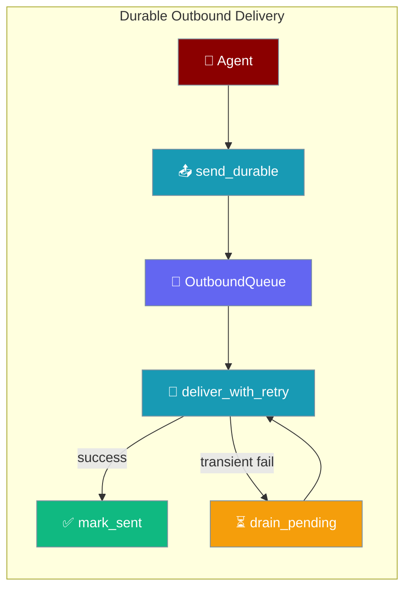
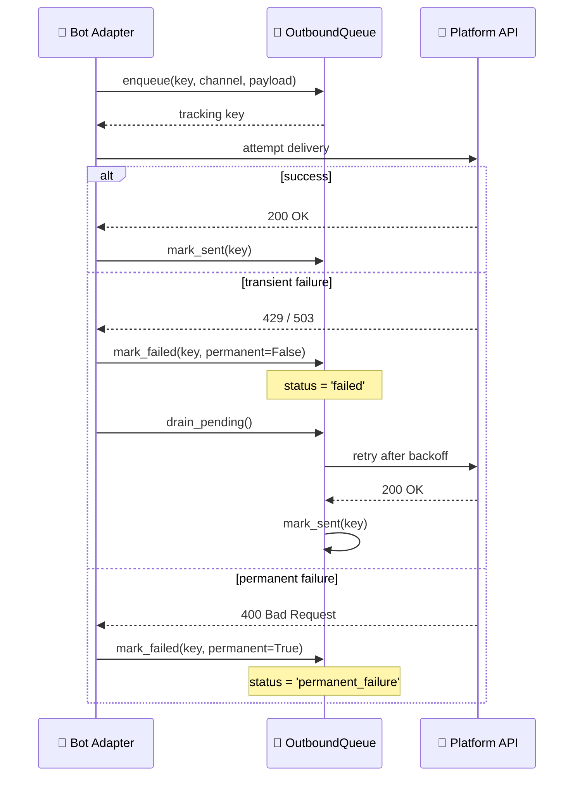
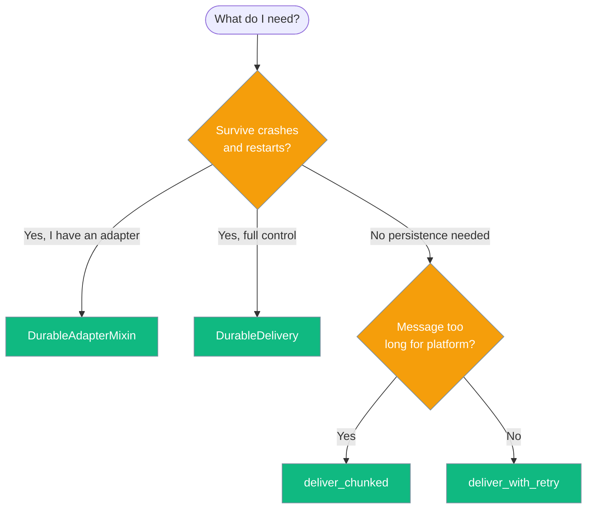

Durable Delivery persists every outbound bot message to a SQLite outbox so retries, restarts, and platform outages never drop a reply.



## Quick Start

<Steps>
<Step title="Easiest path — DurableAdapterMixin">
Add three lines to any existing adapter and every `send_durable()` call is crash-safe:

```python
from praisonaiagents import Agent
from praisonai.bots import TelegramBot

# TelegramBot already supports durable delivery via DurableAdapterMixin
agent = Agent(name="assistant", instructions="Help users")
bot = TelegramBot(
    token="YOUR_BOT_TOKEN",
    agent=agent,
)

# Drain any messages queued before the last crash — call this at startup
await bot.drain_outbox()

# Send with durability
await bot.send_durable(
    channel_id="12345",
    content="Hello! I'm crash-safe.",
    idempotency_key="welcome-msg-12345",
)
```
</Step>

<Step title="Configure manually with DurableDelivery">
For full control, wire up `OutboundQueue` and `DurableDelivery` directly:

```python
from praisonaiagents import Agent
from praisonai.bots import OutboundQueue, DurableDelivery, TelegramBot

outbox = OutboundQueue(path="~/.praisonai/state/outbox.sqlite")
adapter = TelegramBot(token="YOUR_BOT_TOKEN", agent=Agent(name="assistant", instructions="Help users"))
delivery = DurableDelivery(outbox, adapter, platform="telegram")

# On startup: replay anything queued before the last crash
succeeded, failed = await delivery.drain_pending()

# Send with durability — idempotent if you reuse the key
success = await delivery.send(
    channel_id="12345",
    content="Hello, world!",
    idempotency_key="msg-123",
)
```
</Step>
</Steps>

---

## How It Works



Each message moves through statuses: `pending` → `sending` → `sent` (or `failed` / `permanent_failure`). On startup, stale `sending` entries are reset to `pending` automatically so crashes never leave orphaned rows.

---

## Choosing the Right Primitive



| I need to… | Use |
|---|---|
| Send one message, retry on transient failures, no persistence | `deliver_with_retry()` |
| Send a message that may exceed platform length limits | `deliver_chunked()` |
| Survive process crashes / platform outages with replay | `DurableDelivery` or `DurableAdapterMixin` |
| Build a brand-new custom adapter with durability built in | `DurableAdapterMixin` |

---

## Configuration Options

### `OutboundQueue`

SQLite-backed outbox. All parameters after `path` are keyword-only.

| Parameter | Type | Default | Description |
|---|---|---|---|
| `path` | `str \| Path` | _(required)_ | SQLite file path. Parent dirs are created automatically. |
| `max_size` | `int` | `50_000` | Max entries kept. Oldest sent entries are evicted when exceeded. |
| `ttl_seconds` | `int` | `604800` (7 days) | Sent entries older than this are evicted. |
| `max_attempts` | `int` | `5` | Max delivery attempts before marking permanent failure. |
| `backoff` | `BackoffPolicy` | `BackoffPolicy()` | Retry backoff configuration. |

```python
from praisonai.bots import OutboundQueue

outbox = OutboundQueue(
    path="~/.praisonai/state/outbox.sqlite",
    max_size=10_000,
    ttl_seconds=3 * 86400,  # 3 days
    max_attempts=3,
)
```

### `DurableDelivery`

Wraps an `OutboundQueue` and an adapter to provide a simple `.send()` / `.drain_pending()` API.

| Parameter | Type | Default | Description |
|---|---|---|---|
| `outbox` | `OutboundQueue` | _(required)_ | The outbound queue to persist messages. |
| `adapter` | adapter instance | _(required)_ | Bot adapter with a `send_message(channel_id, content)` method. |
| `platform` | `str` | `""` | Platform name for platform-aware error classification. |
| `backoff` | `BackoffPolicy` | `BackoffPolicy()` | Retry backoff configuration. |
| `max_attempts` | `int` | `3` | Max delivery attempts. |

### `DurableAdapterMixin.setup_durable_delivery()`

Call once in your adapter's `__init__` to wire up the outbox.

| Parameter | Type | Default | Description |
|---|---|---|---|
| `outbox_path` | `str \| None` | `None` | Path to SQLite outbox. `None` disables durability. |
| `platform` | `str` | `""` | Platform name for error classification. |
| `max_attempts` | `int` | `3` | Max delivery attempts per message. |
| `max_size` | `int` | `50_000` | Max messages in outbox. |
| `ttl_seconds` | `int` | `604800` (7 days) | TTL for sent messages. |

### `deliver_with_retry()`

Bounded exponential backoff retry without persistence — returns when the message is sent or max attempts is reached.

| Parameter | Type | Default | Description |
|---|---|---|---|
| `send_func` | `async callable` | _(required)_ | Async callable to execute (the send operation). |
| `policy` | `BackoffPolicy` | `BackoffPolicy(max_attempts=3)` | Retry backoff configuration. |
| `is_recoverable` | `callable \| None` | `None` | Function to classify errors as transient. Defaults to `is_recoverable_error(e, platform)`. |
| `platform` | `str` | `""` | Platform name for platform-specific error rules. |
| `parked_store` | `Any \| None` | `None` | Optional DLQ for failed sends. |
| `reply_data` | `dict \| None` | `None` | Optional metadata for DLQ storage. |

```python
from praisonai.bots._resilience import deliver_with_retry, BackoffPolicy

await deliver_with_retry(
    send_func=lambda: adapter.send_message(channel_id, text),
    policy=BackoffPolicy(initial_ms=2000, max_ms=30000, max_attempts=5),
    platform="telegram",
)
```

### `deliver_chunked()`

Splits a long message at paragraph boundaries and sends each chunk separately. Returns the number of chunks sent.

| Parameter | Type | Default | Description |
|---|---|---|---|
| `adapter` | adapter instance | _(required)_ | Bot adapter with `send_message(channel_id, content)`. |
| `channel_id` | `str` | _(required)_ | Target channel. |
| `content` | `str` | _(required)_ | Message text to split and send. |
| `max_length` | `int` | `4096` | Max characters per chunk (Telegram limit is 4096). |
| `preserve_fences` | `bool` | `True` | Keep code fence blocks intact even if they exceed `max_length`. |

```python
from praisonai.bots._chunk import chunk_message

# chunk_message is the underlying splitter
chunks = chunk_message(long_text, max_length=4096, preserve_fences=True)
for chunk in chunks:
    await adapter.send_message(channel_id, chunk)
```

### `BackoffPolicy`

Controls retry timing for both `deliver_with_retry` and `OutboundQueue.drain`.

| Attribute | Type | Default | Description |
|---|---|---|---|
| `initial_ms` | `float` | `2000.0` | Initial delay in milliseconds. |
| `max_ms` | `float` | `30000.0` | Maximum delay in milliseconds. |
| `factor` | `float` | `1.8` | Multiplicative factor per attempt. |
| `jitter` | `float` | `0.25` | Random jitter fraction (0.0–1.0). |
| `max_attempts` | `int` | `0` | Max retry attempts. `0` = unlimited. |

---

## Idempotency & Drain on Startup

### Idempotency Keys

Every message has an `idempotency_key` — a UUID generated automatically if you omit it. Reusing the same key for the same logical message prevents double-sends across retries.

```python
# Webhook-triggered reply: derive key from inbound message ID
inbound_id = webhook_payload["message_id"]
await delivery.send(
    channel_id=chat_id,
    content=reply_text,
    idempotency_key=f"reply-{inbound_id}",
)
```

If the webhook is redelivered and `send()` is called again with the same key, the outbox skips the enqueue (SQLite `UNIQUE` constraint) and marks the existing row sent.

### Drain on Startup

Call `drain_pending()` once at adapter startup to replay anything that was queued before the last crash:

```python
# On adapter startup
succeeded, failed = await delivery.drain_pending()
# Log output: "Drained outbox: 3 sent, 0 failed"

# Or with the mixin:
succeeded, failed = await adapter.drain_outbox()
```

The drain replays oldest messages first, respects backoff delays between attempts, and skips messages that have exceeded `max_attempts`.

---

## Best Practices

<AccordionGroup>
<Accordion title="Always set platform= for accurate error classification">
The `is_recoverable_error()` function checks platform-specific patterns (e.g., Telegram's HTTP 409 conflict, rate-limit "retry after" responses) when a platform name is provided. Without it, only generic patterns are checked and some transient errors may be misclassified as permanent.

```python
delivery = DurableDelivery(outbox, adapter, platform="telegram")
```
</Accordion>

<Accordion title="Use a stable idempotency_key derived from the inbound message">
When bridging a webhook to an outbound reply, derive the key from the inbound message ID. This ensures webhook redeliveries don't produce duplicate outbound sends.

```python
# ✅ Good: stable key tied to the inbound event
await delivery.send(
    channel_id=chat_id,
    content=reply,
    idempotency_key=f"reply-{inbound_message_id}",
)

# ❌ Bad: new UUID every call — no deduplication across retries
import uuid
await delivery.send(channel_id=chat_id, content=reply, idempotency_key=str(uuid.uuid4()))
```
</Accordion>

<Accordion title="Keep the outbox on persistent local disk">
Store the outbox on a persistent, local filesystem path — not `/tmp` and not a Docker tmpfs. The default suggestion is `~/.praisonai/state/outbox.sqlite`.

```python
# ✅ Good: persistent path
outbox = OutboundQueue(path="~/.praisonai/state/outbox.sqlite")

# ❌ Bad: lost on restart or container rebuild
outbox = OutboundQueue(path="/tmp/outbox.sqlite")
```
</Accordion>

<Accordion title="Call drain_pending() exactly once per adapter start">
Multiple concurrent drainers fight over the same rows via SQLite's `status = 'sending'` claim mechanism. A 5-minute claim timeout releases stale claims, but concurrent drainers still produce redundant work and log noise.

```python
# ✅ Good: single drain at startup
async def on_start():
    succeeded, failed = await delivery.drain_pending()

# ❌ Bad: two drainers in separate tasks
asyncio.create_task(delivery.drain_pending())
asyncio.create_task(delivery.drain_pending())
```
</Accordion>
</AccordionGroup>

---

## Related

<CardGroup cols={2}>
<Card title="Inbound Journal" icon="book" href="/docs/features/inbound-journal">
  Inbound counterpart — deduplicate webhook redeliveries and recover in-flight messages
</Card>
<Card title="Inbound DLQ" icon="inbox" href="/docs/features/inbound-dlq">
  Dead-letter queue for failed inbound message processing
</Card>
<Card title="Bot Streaming Replies" icon="waveform" href="/docs/features/bot-streaming-replies">
  Live-edit streaming UX for bot responses
</Card>
<Card title="Messaging Bots" icon="message-circle" href="/docs/features/messaging-bots">
  Top-level guide to building bots with PraisonAI
</Card>
</CardGroup>
