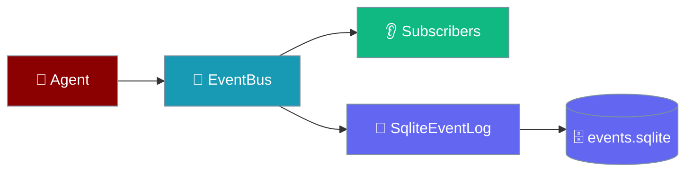
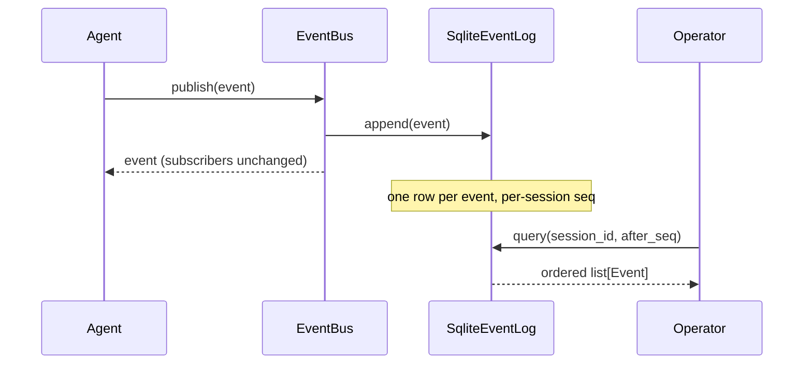

Attach a durable sink to the event bus so every lifecycle event survives restart and reads back per session, in order.

```python
from praisonaiagents import Agent
from praisonaiagents.bus import get_default_bus, SqliteEventLog

bus = get_default_bus()
bus.attach_sink(SqliteEventLog())            # opt-in; nothing persists without this

agent = Agent(name="Assistant", instructions="Be helpful")
agent.start("Hello!")
```



Nothing is persisted by default — a bare `Agent()` attaches no sink and the zero-overhead in-memory path stays untouched. You opt in by attaching a sink.

## Quick Start

<Steps>
<Step title="Attach a sink and publish">

```python
from praisonaiagents.bus import EventBus, EventType, SqliteEventLog

bus = EventBus()
log = SqliteEventLog(db_path="./events.sqlite")
bus.attach_sink(log)

# Even with no subscribers, the sink receives the event.
bus.publish(EventType.SESSION_CREATED, {"session_id": "s1"})
bus.publish(EventType.MESSAGE_CREATED, {"session_id": "s1", "text": "hi"})

for ev in log.query("s1"):
    print(ev.metadata["seq"], ev.type, ev.data)
# 1 session_created {'session_id': 's1'}
# 2 message_created {'session_id': 's1', 'text': 'hi'}
```

</Step>

<Step title="Read the timeline after a restart">

```python
from praisonaiagents.bus import SqliteEventLog

# Re-open the same file in a fresh process.
log = SqliteEventLog(db_path="./events.sqlite")
timeline = log.query("s1")
log.close()
```

</Step>

<Step title="Walk the timeline with a cursor">

```python
last_seq = 0
while True:
    batch = log.query("s1", after_seq=last_seq, limit=100)
    if not batch:
        break
    for ev in batch:
        handle(ev)
    last_seq = batch[-1].metadata["seq"]
```

</Step>
</Steps>

---

## How It Works



The log persists the same `Event` / `EventType` shapes as the in-memory bus — one row per event, keyed by `session_id` with a monotonic per-session `seq`. Writes are best-effort (a broken sink never breaks the turn), on-disk databases use WAL, and `prune` keeps the file bounded.

| Guarantee | Behaviour |
|-----------|-----------|
| Opt-in | Nothing persists until you `attach_sink`. |
| No-subscriber path | Sinks receive events even when no one is subscribed. |
| Failure isolation | A raising sink is swallowed (logged at DEBUG); publish still returns. |
| Restart-durable | Re-open the file and `query` returns the full ordered timeline. |
| Monotonic cursor | A full prune never rewinds `seq`; consumers holding `after_seq` still advance. |
| Shared file | Two instances on one file allocate `seq` without collision. |

Sinks resolve the session from `event.data["session_id"]`, then `event.metadata["session_id"]`, then `event.source`. With none present, the event is stored under an empty session id.

---

## Configuration Options

| Option | Type | Default | Description |
|--------|------|---------|-------------|
| `db_path` | `str \| None` | `<runs_dir>/events.sqlite` | Path to the SQLite file. Parent directories are created. Use `":memory:"` for tests. |

---

## API

| Method | Purpose |
|--------|---------|
| `append(event)` | Best-effort persist. Never raises into the caller. |
| `query(session_id, after_seq=0, limit=500)` | Ordered cursor read of events with `seq > after_seq`. |
| `prune(older_than_days, max_rows)` | Trim by age and/or row count. Returns rows removed. Pass `0` to skip a dimension. |
| `close()` | Close the database connection. |

Bus wiring:

| Method / Property | Purpose |
|-------------------|---------|
| `EventBus.attach_sink(sink)` | Register a durable sink (idempotent). |
| `EventBus.detach_sink(sink) -> bool` | Deregister a sink; `True` if it was attached. |
| `EventBus.has_sinks` | `True` if any sink is attached. |

---

## Common Patterns

**Timeline export:**

```python
for ev in log.query("s1", limit=10_000):
    print(ev.metadata["seq"], ev.type, ev.data)
```

**Periodic prune:**

```python
log.prune(older_than_days=30, max_rows=1_000_000)
```

**Custom sink** — implement `EventLogProtocol` to send events to Postgres, Kafka, or JSONL:

```python
from praisonaiagents.bus import EventBus

class JsonlSink:
    def __init__(self, path):
        self._f = open(path, "a")

    def append(self, event):
        self._f.write(f"{event.type} {event.data}\n")

    def query(self, session_id, after_seq=0, limit=500):
        return []

    def prune(self, *, older_than_days, max_rows):
        return 0

bus = EventBus()
bus.attach_sink(JsonlSink("events.jsonl"))
```

---

## Best Practices

<AccordionGroup>
<Accordion title="Create the log once and share it">
`attach_sink` is idempotent per instance, but re-instantiating `SqliteEventLog` on every publish is wasteful. Build it once and attach it.
</Accordion>

<Accordion title="Pass session_id in data">
Sinks resolve the session via `event.data["session_id"]`, then `event.metadata["session_id"]`, then `event.source`. When emitting your own events, put `session_id` in `data` for clarity.
</Accordion>

<Accordion title="Prune to keep the file bounded">
`log.prune(older_than_days=30, max_rows=1_000_000)` trims by age and row count. Run it from your housekeeping loop.
</Accordion>

<Accordion title="Watch the log if events look missing">
A slow or broken sink must never block a turn, so failures are swallowed at DEBUG. Check application logs under `praisonaiagents.bus.event_log` when events seem absent.
</Accordion>
</AccordionGroup>

---

## Related

<CardGroup cols={2}>
<Card title="Event Bus" icon="broadcast-tower" href="/features/event-bus">
  Pub/sub side of the same events
</Card>
<Card title="Run Ledger" icon="database" href="/features/run-ledger">
  Sibling durable store for run status
</Card>
</CardGroup>
