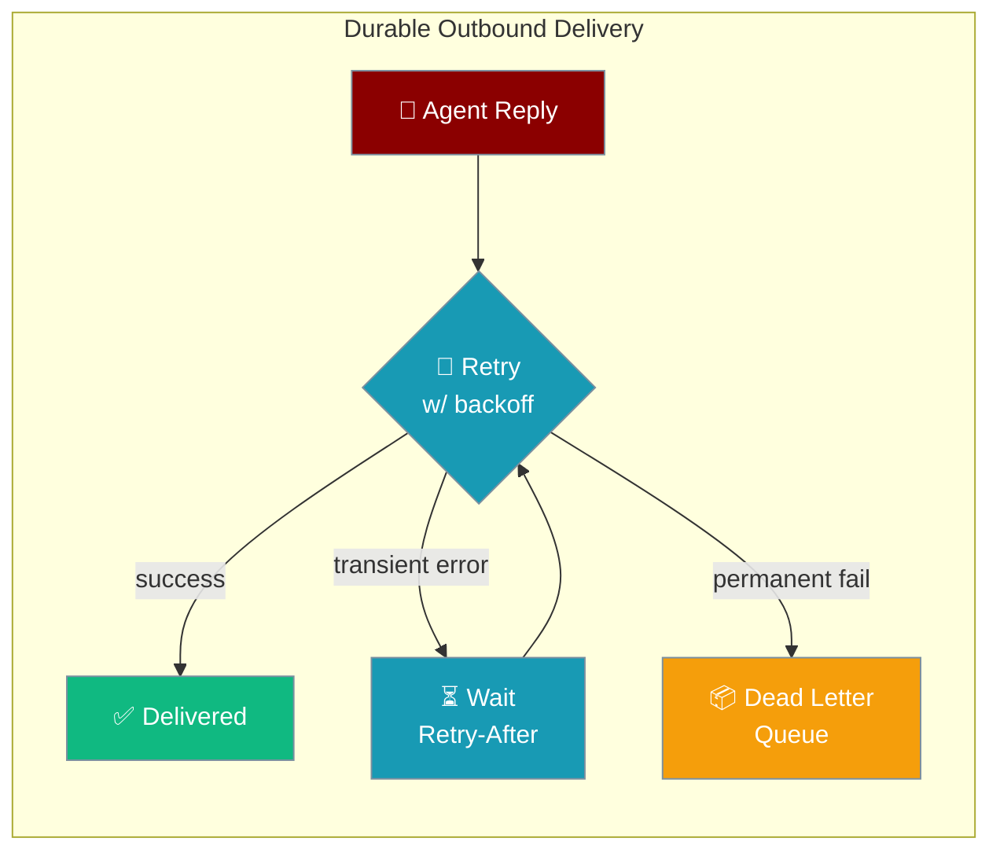
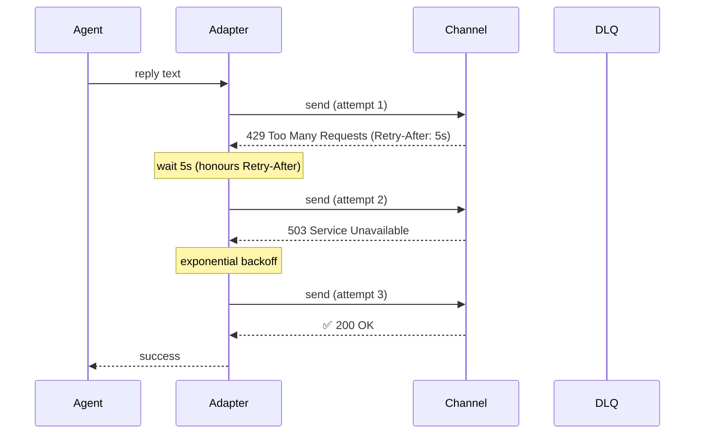

```python
from praisonaiagents import Agent

agent = Agent(name="support", instructions="Reply helpfully on Slack or Telegram.")
agent.start("Tell the user their ticket was updated.")
```
Every bot reply now survives transient channel errors — 5xx responses, 429 rate limits, and network blips are automatically retried with bounded exponential backoff before parking in a Dead Letter Queue on permanent failure.

The user sends a bot reply; transient channel errors retry with backoff before a permanent failure lands in the dead-letter queue.



## Quick Start

<Steps>
<Step title="Zero Configuration (Transient Retry)">
All six adapters now retry on transient failures by default — no config needed:

```python
from praisonaiagents import Agent
from praisonai.bots import TelegramBot

agent = Agent(
    name="Support Agent",
    instructions="Answer user questions helpfully.",
)

bot = TelegramBot(token="YOUR_TOKEN", agent=agent)
await bot.start()
```

Slack, Discord, WhatsApp, Email, Linear, and AgentMail behave identically — transient 5xx and 429 errors are retried automatically.
</Step>

<Step title="Enable Dead Letter Queue">
Add a `dlq_path` so permanently-failed replies are parked for later replay:

```python
from praisonaiagents import Agent
from praisonai.bots import SlackBot, BotConfig, OutboundResilienceConfig

config = BotConfig(
    outbound_resilience=OutboundResilienceConfig(
        dlq_path="~/.praisonai/state/outbound_dlq.db",
        max_attempts=5,
        initial_ms=1000,
        max_ms=30000,
    )
)

agent = Agent(name="Slack Agent", instructions="Help the team.")
bot = SlackBot(token="YOUR_TOKEN", agent=agent, config=config)
await bot.start()
```
</Step>

<Step title="Tune Backoff Parameters">
Fine-tune retry behaviour per channel:

```python
from praisonai.bots import BotConfig, OutboundResilienceConfig

config = BotConfig(
    outbound_resilience=OutboundResilienceConfig(
        initial_ms=500,       # first retry after 500ms
        max_ms=15000,         # cap at 15s
        factor=2.0,           # double each attempt
        max_attempts=4,       # give up after 4 tries
        jitter=0.3,           # add 30% random jitter
        dlq_path="~/.praisonai/state/dlq.db",
    )
)
```
</Step>
</Steps>

---

## How It Works



The mixin (`OutboundResilienceMixin`) wraps each adapter's raw send with `deliver_outbound()`. State is initialised lazily from `self.config.outbound_resilience` — existing adapter constructors need no changes.

---

## Channel Support

All six channels now share the same durable delivery path:

| Channel | Retry + backoff | DLQ support | Notes |
|---------|----------------|-------------|-------|
| Telegram | ✅ | ✅ | Had this previously; unchanged |
| Slack | ✅ | ✅ | New in PR #2484 |
| Discord | ✅ | ✅ | New in PR #2484 |
| WhatsApp | ✅ | ✅ | Previously swallowed errors silently — now fixed |
| Email | ✅ | ✅ | New in PR #2484 |
| Linear | ✅ | ✅ | New in PR #2484 |
| AgentMail | ✅ | ✅ | New in PR #2484 |

<Warning>
WhatsApp previously swallowed permanent send errors silently. This was fixed: permanent failures now propagate, matching every other channel.
</Warning>

---

## What Gets Retried

| Error type | Retried? | Notes |
|-----------|----------|-------|
| HTTP 5xx | ✅ | Full backoff sequence |
| HTTP 429 | ✅ | Waits for `Retry-After` header first |
| Network blips / timeout | ✅ | Transient |
| HTTP 401 Unauthorized | ❌ → DLQ | Token/account issue, not per-message |
| HTTP 403 Forbidden | ❌ → DLQ | Permanent — bot kicked or blocked |
| HTTP 404 Not Found | ❌ → DLQ | Chat deleted or not found |
| HTTP 410 Gone | ❌ → DLQ | Permanently removed |
| Platform patterns ("bot was kicked") | ❌ → DLQ | Platform-specific classification |

---

## Configuration Options

| Option | Type | Default | Description |
|--------|------|---------|-------------|
| `initial_ms` | `int` | `1000` | First retry delay in milliseconds |
| `max_ms` | `int` | `10000` | Maximum retry delay cap |
| `factor` | `float` | `1.5` | Backoff multiplier per attempt |
| `max_attempts` | `int` | `3` | Total attempts before parking in DLQ |
| `jitter` | `float` | `0.25` | Random jitter fraction (0–1) |
| `dlq_path` | `str` | `None` | Path to SQLite DLQ file; no DLQ when omitted |
| `enabled` | `bool` | `True` | Set `False` to opt a channel out of durable delivery |

---

## Best Practices

<AccordionGroup>
<Accordion title="Always configure a DLQ path in production">
Without `dlq_path`, failed replies after max attempts are re-raised and logged but not recoverable. A DLQ lets you replay them after fixing an outage.
</Accordion>

<Accordion title="Respect rate limits with Retry-After">
The mixin reads the `Retry-After` response header and waits exactly that long before the next attempt, so your bot stays within platform rate limits without sleeping longer than necessary.
</Accordion>

<Accordion title="Opt channels out individually">
Set `outbound_resilience.enabled = False` in a channel's config to disable durable delivery for that channel only — useful for fire-and-forget channels where retries would send duplicates.
</Accordion>

<Accordion title="Monitor your DLQ">
Parked entries are permanent failures. Set up alerts on DLQ growth to detect channels that are consistently unreachable (e.g. bots kicked from a workspace).
</Accordion>
</AccordionGroup>

---

## Related

<CardGroup cols={2}>
<Card title="Dead-Target Registry" icon="skull" href="/docs/features/dead-target-registry">
  Short-circuit known-dead channels before sending
</Card>
<Card title="Bot Channels" icon="message-circle" href="/docs/features/messaging-bots">
  Overview of all supported messaging channels
</Card>
<Card title="Delivery Config" icon="settings" href="/docs/features/delivery-config">
  Full delivery configuration reference
</Card>
<Card title="Inbound DLQ" icon="inbox" href="/docs/features/inbound-dlq">
  Dead-letter queue for inbound messages
</Card>
</CardGroup>
