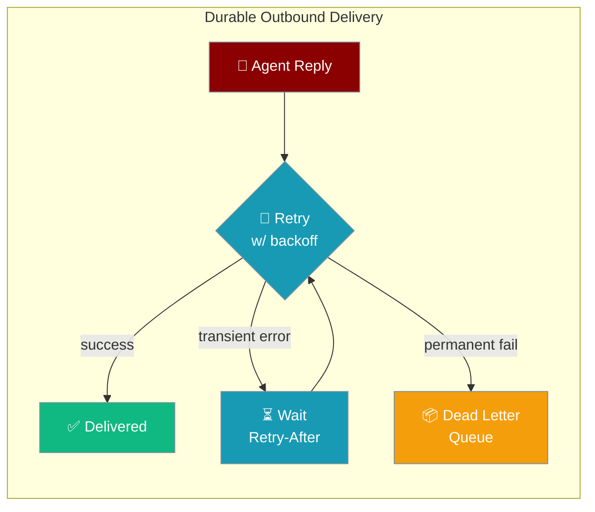
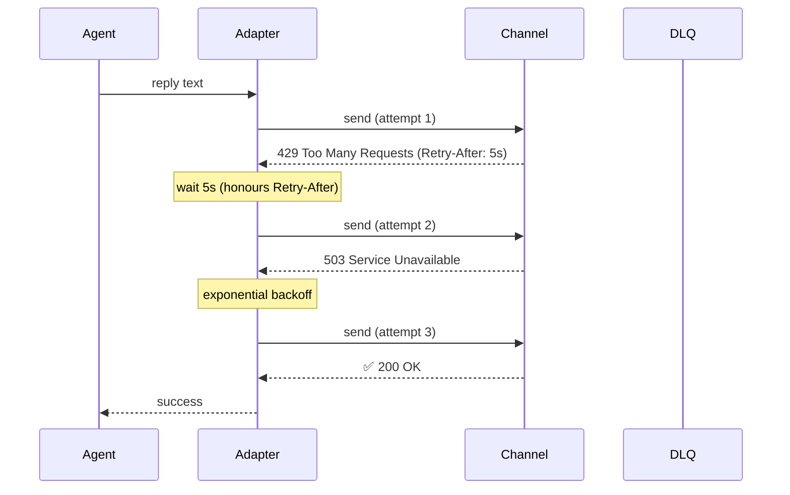
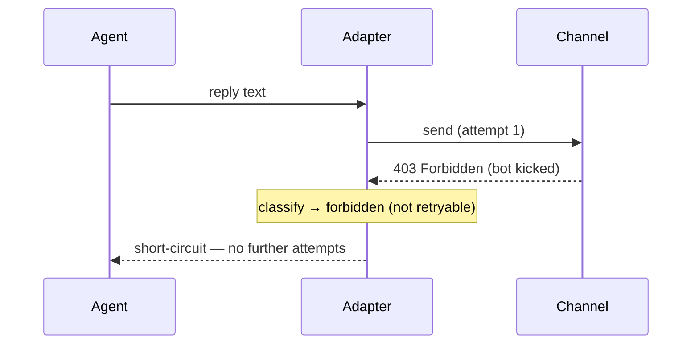
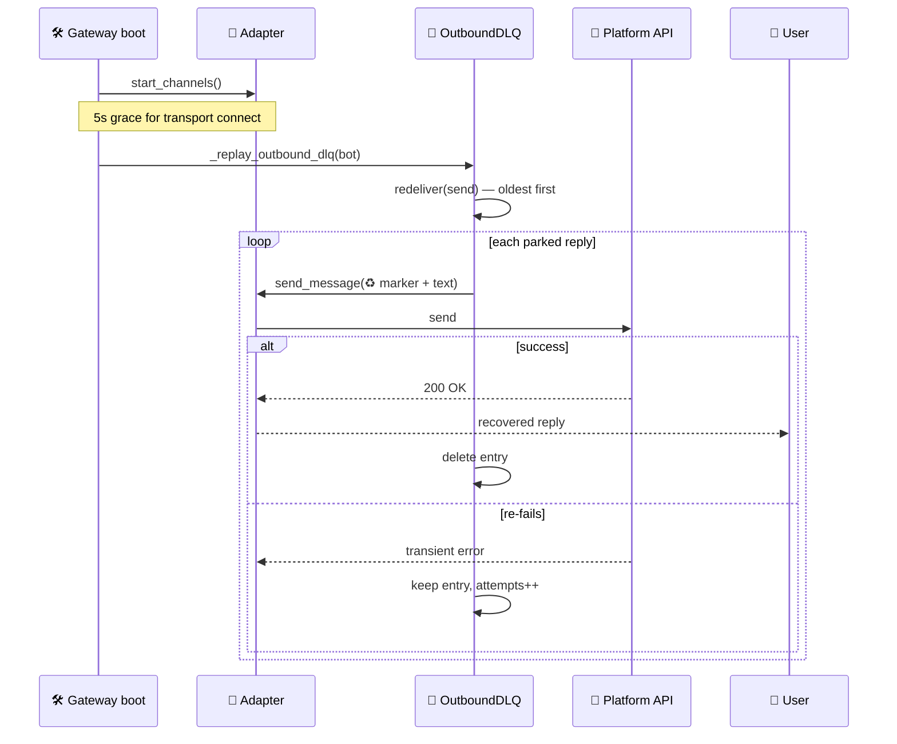

```python
from praisonaiagents import Agent

agent = Agent(name="support", instructions="Reply helpfully on Slack or Telegram.")
agent.start("Tell the user their ticket was updated.")
```
Every bot reply now survives transient channel errors — 5xx responses, 429 rate limits, and network blips are automatically retried with bounded exponential backoff before parking in a Dead Letter Queue on permanent failure.

The user sends a bot reply; transient channel errors retry with backoff before a permanent failure lands in the dead-letter queue.


```mermaid
graph LR
    subgraph "Durable Outbound Delivery"
        Reply[🤖 Agent Reply] --> Retry{🔄 Retry\nw/ backoff}
        Retry -->|success| Sent[✅ Delivered]
        Retry -->|transient error| Wait[⏳ Wait\nRetry-After]
        Wait --> Retry
        Retry -->|permanent fail| DLQ[📦 Dead Letter\nQueue]
    end

    classDef agent fill:#8B0000,stroke:#7C90A0,color:#fff
    classDef process fill:#189AB4,stroke:#7C90A0,color:#fff
    classDef success fill:#10B981,stroke:#7C90A0,color:#fff
    classDef warning fill:#F59E0B,stroke:#7C90A0,color:#fff
    classDef config fill:#6366F1,stroke:#7C90A0,color:#fff

    class Reply agent
    class Retry,Wait process
    class Sent success
    class DLQ warning
```

## Quick Start

<Steps>
<Step title="Zero Configuration (Retry + Durable Park)">
Every adapter now retries transient failures **and** parks permanent / exhausted failures in a per-platform DLQ by default — no config needed:

```python
from praisonaiagents import Agent
from praisonai.bots import TelegramBot

agent = Agent(
    name="Support Agent",
    instructions="Answer user questions helpfully.",
)

bot = TelegramBot(token="YOUR_TOKEN", agent=agent)
await bot.start()
# Transient errors retry with backoff; permanent / exhausted failures are
# parked at ~/.praisonai/state/telegram/outbound_dlq.sqlite automatically.
```

Slack, Discord, WhatsApp, Email, Linear, and AgentMail behave identically — each writes to its own `~/.praisonai/state/<platform>/outbound_dlq.sqlite` file.
</Step>

<Step title="Override the default DLQ path or tune retries">
`dlq_path` is optional — set it only if you need the DLQ on a different filesystem (e.g. a shared volume, a specific bind mount). If you just want to tune retries, all the other keys work the same as before.

```python
from praisonaiagents import Agent
from praisonai.bots import SlackBot, BotConfig, OutboundResilienceConfig

config = BotConfig(
    outbound_resilience=OutboundResilienceConfig(
        # dlq_path is optional; default is ~/.praisonai/state/slack/outbound_dlq.sqlite
        dlq_path="/mnt/state/slack-outbound-dlq.sqlite",
        max_attempts=5,
        initial_ms=1000,
        max_ms=30000,
    )
)

agent = Agent(name="Slack Agent", instructions="Help the team.")
bot = SlackBot(token="YOUR_TOKEN", agent=agent, config=config)
await bot.start()
```

To disable durable parking entirely for one channel:

```python
config = BotConfig(
    outbound_resilience=OutboundResilienceConfig(enabled=False)
)
```
</Step>

<Step title="Tune Backoff Parameters">
Fine-tune retry behaviour per channel:

```python
from praisonai.bots import BotConfig, OutboundResilienceConfig

config = BotConfig(
    outbound_resilience=OutboundResilienceConfig(
        initial_ms=500,       # first retry after 500ms
        max_ms=15000,         # cap at 15s
        factor=2.0,           # double each attempt
        max_attempts=4,       # give up after 4 tries
        jitter=0.3,           # add 30% random jitter
        dlq_path="~/.praisonai/state/dlq.db",
    )
)
```
</Step>
</Steps>

---

## How It Works


```mermaid
sequenceDiagram
    participant Agent
    participant Adapter
    participant Channel
    participant DLQ

    Agent->>Adapter: reply text
    Adapter->>Channel: send (attempt 1)
    Channel-->>Adapter: 429 Too Many Requests (Retry-After: 5s)
    Note over Adapter: wait 5s (honours Retry-After)
    Adapter->>Channel: send (attempt 2)
    Channel-->>Adapter: 503 Service Unavailable
    Note over Adapter: exponential backoff
    Adapter->>Channel: send (attempt 3)
    Channel-->>Adapter: ✅ 200 OK
    Adapter-->>Agent: success
```

The mixin (`OutboundResilienceMixin`) wraps each adapter's raw send with `deliver_outbound()`. State is initialised lazily from `self.config.outbound_resilience`. When no `dlq_path` is configured, the mixin falls back to `resolve_durable_store_dir(<platform>) / "outbound_dlq.sqlite"` so the default is durable-by-default without touching existing adapter constructors.

---

## Channel Support

All six channels now share the same durable delivery path:

| Channel | Retry + backoff | DLQ support | Notes |
|---------|----------------|-------------|-------|
| Telegram | ✅ | ✅ | Had this previously; unchanged |
| Slack | ✅ | ✅ | New in PR #2484 |
| Discord | ✅ | ✅ | New in PR #2484 |
| WhatsApp | ✅ | ✅ | Previously swallowed errors silently — now fixed |
| Email | ✅ | ✅ | New in PR #2484 |
| Linear | ✅ | ✅ | New in PR #2484 |
| AgentMail | ✅ | ✅ | New in PR #2484 |

<Warning>
WhatsApp previously swallowed permanent send errors silently. This was fixed: permanent failures now propagate, matching every other channel.
</Warning>

---

## What Gets Retried

| Error type | Retried? | Notes |
|-----------|----------|-------|
| HTTP 5xx | ✅ | Full backoff sequence |
| HTTP 429 | ✅ | Waits for `Retry-After` header first |
| Network blips / timeout | ✅ | Transient |
| HTTP 401 Unauthorized | ❌ → DLQ | Token/account issue, not per-message |
| HTTP 403 Forbidden | ❌ → DLQ | Permanent — bot kicked or blocked |
| HTTP 404 Not Found | ❌ → DLQ | Chat deleted or not found |
| HTTP 410 Gone | ❌ → DLQ | Permanently removed |
| Platform patterns ("bot was kicked") | ❌ → DLQ | Platform-specific classification |

---

## Structured error classification

Each failure is tagged with a machine-readable [`SendErrorKind`](/features/send-error-taxonomy) before the retry decision. Permanent kinds (`forbidden`, `target_not_found`, `auth_fatal`, `invalid_request`) **short-circuit immediately** rather than exhausting `max_retries` against a dead target; transient and rate-limited failures still retry with backoff.


```mermaid
sequenceDiagram
    participant Agent
    participant Adapter
    participant Channel

    Agent->>Adapter: reply text
    Adapter->>Channel: send (attempt 1)
    Channel-->>Adapter: 403 Forbidden (bot kicked)
    Note over Adapter: classify → forbidden (not retryable)
    Adapter-->>Agent: short-circuit — no further attempts
```

See [Send Error Taxonomy](/features/send-error-taxonomy) for the full kind reference and how to classify your own adapter's native exceptions.

---

## Automatic crash-recovery on start

Every gateway-managed channel redelivers any reply parked by a crash on a previous run — no operator step, symmetric with the inbound journal's `replay()` sweep.

The gateway schedules `WebSocketGateway._replay_outbound_dlq(bot)` about 5 seconds after each channel task starts (a grace period for the transport to connect), then calls `OutboundDLQ.redeliver(send)` — draining parked replies oldest-first through the adapter's own `send_message`, so the platform's normal retry/backoff still applies. A redelivery that fails again is kept for the next boot, bounded by the DLQ's existing TTL / `max_size` / `attempts` invariants. Failure never blocks channel start.

Users receive redelivered replies with a **visible duplicate marker**:

> ♻️ Recovered after restart — this reply may be a duplicate.
>
> &lt;original reply text&gt;

When something is recovered you'll see this line in the gateway log:

```
Outbound crash-recovery: redelivered N parked repl(y/ies) on start (marked as possible duplicates)
```


```mermaid
sequenceDiagram
    participant Boot as 🛠️ Gateway boot
    participant Bot as 📡 Adapter
    participant DLQ as 💾 OutboundDLQ
    participant Platform as 📱 Platform API
    participant User as 👤 User

    Boot->>Bot: start_channels()
    Note over Boot,Bot: 5s grace for transport connect
    Boot->>DLQ: _replay_outbound_dlq(bot)
    DLQ->>DLQ: redeliver(send) — oldest first
    loop each parked reply
        DLQ->>Bot: send_message(♻️ marker + text)
        Bot->>Platform: send
        alt success
            Platform-->>Bot: 200 OK
            Bot-->>User: recovered reply
            DLQ->>DLQ: delete entry
        else re-fails
            Platform-->>Bot: transient error
            DLQ->>DLQ: keep entry, attempts++
        end
    end
```

<Note>
This section is shared with [Outbound Resilience → Automatic crash-recovery on start](/features/outbound-resilience#automatic-crash-recovery-on-start), the canonical page for the boot-time drainer.
</Note>

---

## When Held Replies Drain

The durable outbox re-attempts held replies on three triggers:

1. **Adapter startup** — replays anything queued before the last crash.
2. **Channel recovery** *(Issue #4043)* — when `ChannelSupervisor` sees a channel come back after a transient outage, it re-drains the outbox in the background so held replies go out promptly, without waiting for the next inbound turn.
3. **Lazy on next inbound turn** — the next `chat()` turn also drains opportunistically.

See [Durable Delivery → When the Outbox Drains](/features/durable-delivery#when-the-outbox-drains) for the full explanation and behavioural notes.

---

## Configuration Options

| Option | Type | Default | Description |
|--------|------|---------|-------------|
| `initial_ms` | `int` | `1000` | First retry delay in milliseconds |
| `max_ms` | `int` | `10000` | Maximum retry delay cap |
| `factor` | `float` | `1.5` | Backoff multiplier per attempt |
| `max_attempts` | `int` | `3` | Total attempts before parking in DLQ |
| `jitter` | `float` | `0.25` | Random jitter fraction (0–1) |
| `dlq_path` | `str` | _(canonical per-platform path — see below)_ | Override the DLQ file location. Defaults to `~/.praisonai/state/<platform>/outbound_dlq.sqlite` so a permanent failure is always parked without configuration. |
| `enabled` | `bool` | `True` | Set `False` to opt a channel out of durable delivery |

The default path is resolved by the shared `resolve_durable_store_dir(<platform>)` helper (the same store the inbound journal uses). Set the `PRAISONAI_HOME` environment variable to relocate the whole `~/.praisonai/` root — handy in tests or containers.

---

## Best Practices

<AccordionGroup>
<Accordion title="Durable park is on by default — override the path only when you need to">
Permanent and exhausted failures are parked in `~/.praisonai/state/<platform>/outbound_dlq.sqlite` automatically. Override `dlq_path` only if you need the DLQ on a specific filesystem (shared volume, bind mount, SSD). To disable durable parking entirely, set `outbound_resilience.enabled = false`.
</Accordion>

<Accordion title="Respect rate limits with Retry-After">
The mixin reads the `Retry-After` response header and waits exactly that long before the next attempt, so your bot stays within platform rate limits without sleeping longer than necessary.
</Accordion>

<Accordion title="Opt channels out individually">
Set `outbound_resilience.enabled = False` in a channel's config to disable durable delivery for that channel only — useful for fire-and-forget channels where retries would send duplicates.
</Accordion>

<Accordion title="Monitor your DLQ">
Parked entries are permanent failures. Set up alerts on DLQ growth to detect channels that are consistently unreachable (e.g. bots kicked from a workspace).
</Accordion>
</AccordionGroup>

---

## Related

<CardGroup cols={2}>
<Card title="Dead-Target Registry" icon="skull" href="/features/dead-target-registry">
  Short-circuit known-dead channels before sending
</Card>
<Card title="Bot Channels" icon="message-circle" href="/features/messaging-bots">
  Overview of all supported messaging channels
</Card>
<Card title="Delivery Config" icon="settings" href="/features/delivery-config">
  Full delivery configuration reference
</Card>
<Card title="Inbound DLQ" icon="inbox" href="/features/inbound-dlq">
  Dead-letter queue for inbound messages
</Card>
</CardGroup>
