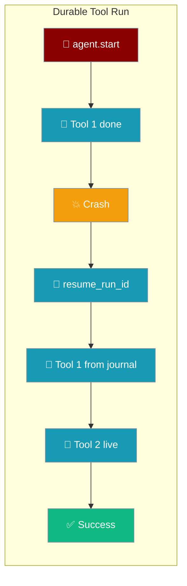
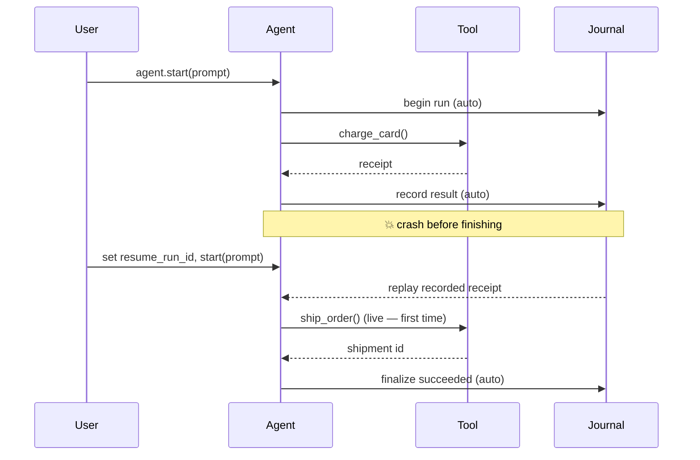

Turn on durability with one flag: the agent journals every model and tool boundary, so a crash mid-loop resumes from the exact step it left off — recorded tool results replay instead of re-executing.



## Quick Start

<Steps>
<Step title="Enable durable execution">
Set `durable=True` on `ExecutionConfig`, then capture `agent.last_durable_run_id` after the run and persist it alongside your business record.

```python
from praisonaiagents import Agent, ExecutionConfig

def charge_card(amount: float, customer_id: str) -> dict:
    return payment_gateway.charge(amount, customer_id)

agent = Agent(
    name="Order Processor",
    instructions="Charge the card and ship the order.",
    tools=[charge_card, ship_order, notify_customer],
    execution=ExecutionConfig(
        durable=True,
        journal_path="./journal.db",   # optional; defaults to ~/.praisonai/runs/journal.db
    ),
)

result = agent.start("Process order #A-1042 for customer C-99")

# Persist alongside your business record so a restart can find it
run_id = agent.last_durable_run_id
```
</Step>

<Step title="Resume after a crash">
Set `resume_run_id` to the saved id and call `start()` with the **same prompt**. Recorded tool results replay from the journal — side-effecting tools do not fire again.

```python
# SAME agent, SAME prompt
agent.execution.resume_run_id = run_id
result = agent.start("Process order #A-1042 for customer C-99")

# charge_card does NOT fire again — the recorded result replays from the journal.
# resume_run_id auto-clears to None once the turn ends terminally.
```

<Warning>
The prompt must match on resume. A different prompt raises `ValueError("Resume prompt does not match ...")`, an unknown id raises `ValueError("Cannot resume unknown durable run ...")`, and a terminal run raises `ValueError("Cannot resume terminal durable run ... (status=...)")`.
</Warning>
</Step>
</Steps>

---

## How It Works

The agent records one event per boundary. On resume the loop is re-driven from the top; journalled steps return their recorded payload instantly, and only un-journalled steps do real work.



---

## Run Outcomes

Each terminal outcome maps to an auto-finalize state and controls whether `resume_run_id` clears itself.

| Outcome | Auto-finalize | `resume_run_id` auto-clears |
|---------|---------------|-----------------------------|
| Success | `succeeded` | Yes |
| `ToolExecutionError(is_retryable=False)` | `failed` | Yes |
| `ToolExecutionError(is_retryable=True)` | *(none — stays `running`)* | No |
| `InterruptedError` / `asyncio.CancelledError` | `cancelled` | Yes |
| Streaming `GeneratorExit` | `cancelled` | Yes |

A retryable failure leaves the run resumable. A non-retryable failure marks it `failed` and non-resumable.

---

## Configuration Options

Three fields on `ExecutionConfig` control durability. `Agent.last_durable_run_id` is the read-side companion.

| Option | Type | Default | Description |
|--------|------|---------|-------------|
| `durable` | `bool` | `False` | Enable journal writes and resume. Zero overhead when `False` — the journal is not constructed. |
| `journal_path` | `Optional[str]` | `None` → `~/.praisonai/runs/journal.db` | SQLite path for the run journal. Use `":memory:"` in tests, a mounted volume in containers. |
| `resume_run_id` | `Optional[str]` | `None` | Set to a prior run's id to resume it. Auto-cleared to `None` after any terminal turn. |

---

## Idempotency Contract for Tools

Any tool whose signature accepts `idempotency_key` (or `**kwargs`) automatically receives a stable per-call key on every invocation. Non-declaring tools work unchanged.

```python
def charge_card(amount: float, customer_id: str, idempotency_key: str = "") -> dict:
    return payment_gateway.charge(amount, customer_id, idem_key=idempotency_key)
```

The key shape is `"{run_id}:{seq}:{function_name}"` — the same on resume, so a tool that dedups on it stays safe even before journal replay records its result.

---

## Discovering Resumable Runs

When your process restarts and you don't have the `run_id` handy, ask the journal directly for runs still `running`.

```python
from praisonaiagents.runtime import RunJournal

journal = RunJournal("./journal.db")

for run_id in journal.interrupted_runs():
    print(f"Resumable: {run_id}")
    # Set agent.execution.resume_run_id = run_id and re-run the original prompt
```

---

## Advanced

Framework and tool authors integrating a custom executor can reach the durable context directly through `praisonaiagents.agent.durable`.

```python
from praisonaiagents.agent.durable import get_durable_idempotency_key

def charge_card(amount: float, customer_id: str) -> dict:
    key = get_durable_idempotency_key()   # stable per-call key, or None outside a durable run
    return payment_gateway.charge(amount, customer_id, idem_key=key)
```

The module also exposes `begin_durable_run`, `abegin_durable_run`, `end_durable_run`, `get_durable_run`, and `DurableRunContext` for wiring the journal into a bespoke tool loop.

---

## Common Patterns

Long-running scheduled job that survives a container restart:

```python
from praisonaiagents import Agent, ExecutionConfig
from praisonaiagents.runtime import RunJournal

agent = Agent(
    name="Nightly Reconciler",
    instructions="Reconcile pending orders.",
    tools=[reconcile_order],
    execution=ExecutionConfig(durable=True, journal_path="/data/praisonai/journal.db"),
)

# On startup, resume anything left running by a previous crash
for run_id in RunJournal("/data/praisonai/journal.db").interrupted_runs():
    agent.execution.resume_run_id = run_id
    agent.start("Reconcile pending orders.")
```

Batch of paid API calls that must never double-charge — the recorded receipt replays instead of re-calling:

```python
agent = Agent(
    name="Billing Runner",
    instructions="Charge each pending invoice once.",
    tools=[charge_card],
    execution=ExecutionConfig(durable=True),
)

result = agent.start("Charge invoice #A-1042")
invoice_run_id = agent.last_durable_run_id   # store next to the invoice row

# After a crash: resume without re-charging
agent.execution.resume_run_id = invoice_run_id
agent.start("Charge invoice #A-1042")
```

Pause-for-approval flows survive a restart because the approval decision is journalled — see [Durable Approvals](/features/durable-approvals).

---

## Best Practices

<AccordionGroup>
<Accordion title="Persist last_durable_run_id with your business record">
Capture `agent.last_durable_run_id` right after `start()`/`chat()` and store it next to the order id or ticket id. That's the value you set into `resume_run_id` later.
</Accordion>

<Accordion title="Point journal_path at a persistent volume in containers">
The default `~/.praisonai/runs/journal.db` is lost when a container is recreated. Pass an explicit path on a mounted volume so the journal survives restarts.
</Accordion>

<Accordion title="Keep tools idempotent as belt-and-braces">
Opt into the auto-injected `idempotency_key` so a tool that crashes *before* recording its result still dedups on retry.
</Accordion>

<Accordion title="Distinguish retryable vs terminal failures">
`ToolExecutionError(is_retryable=True)` leaves the run resumable; `is_retryable=False` marks it `failed` and non-resumable.
</Accordion>

<Accordion title="Close streams cleanly">
Calling `stream.close()` finalizes the run as `cancelled`, so aborting a stream never leaves a ghost `running` row.
</Accordion>
</AccordionGroup>

---

## Related

<CardGroup cols={2}>
<Card title="Run-State Journal" icon="book-bookmark" href="/features/run-state-journal">
The SQLite layer under durable runs.
</Card>
<Card title="Durable Approvals" icon="user-check" href="/features/durable-approvals">
Pause-for-approval that survives a restart.
</Card>
<Card title="Execution" icon="play" href="/features/execution">
Agent execution limits and configuration.
</Card>
<Card title="Gateway Session Persistence" icon="database" href="/features/gateway-session-persistence">
Persist gateway sessions across restarts.
</Card>
</CardGroup>
