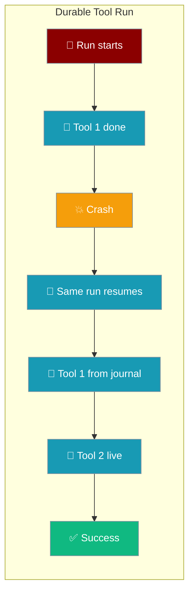
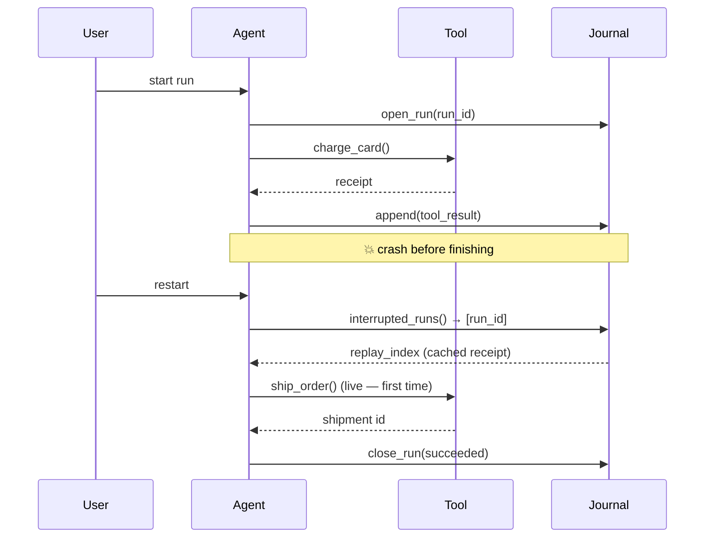

Durable tool runs journal every model and tool boundary so a crash mid-loop resumes from the exact step it left off — recorded tool results replay instead of re-executing.



## Quick Start

<Steps>
<Step title="Record each boundary">
Open a run under a stable id and append an event at every model decision and tool result.

```python
from praisonaiagents.runtime import RunJournal, JournalEvent

journal = RunJournal()  # ~/.praisonai/runs/journal.db
journal.open_run("order-A-1042", agent="Order Processor", task="Process order #A-1042")

# Record boundaries as the tool loop runs
journal.append(JournalEvent("order-A-1042", 0, "model_decision", {"text": "charge the card"}))
journal.append(JournalEvent("order-A-1042", 0, "tool_result", {"receipt": "rcpt_88f21"}))

journal.close_run("order-A-1042", "succeeded")
```
</Step>

<Step title="Resume after a crash">
Re-open the same run id, then replay recorded steps so side-effecting tools do not fire twice.

```python
from praisonaiagents.runtime import RunJournal

journal = RunJournal()

# Runs left "running" after a crash are the resume candidates
for run_id in journal.interrupted_runs():
    replay = journal.replay_index(run_id)          # {(seq, kind): payload}
    receipt = replay.get((0, "tool_result"))       # cached — charge_card does NOT re-run
    if receipt:
        print(f"Resuming {run_id}, replaying receipt {receipt['receipt']}")
    journal.close_run(run_id, "succeeded")
```
</Step>
</Steps>

---

## How It Works

The journal records one event per boundary keyed by `(run_id, seq, kind)`. On resume the loop is re-driven from the top; journalled steps return their recorded payload instantly, and only un-journalled steps do real work.



A run moves through three states:

| State | Meaning | Resumed on restart? |
|-------|---------|---------------------|
| `running` | Open, in progress — or a process died before closing it | Yes — surfaced by `interrupted_runs()` |
| `succeeded` / `cancelled` | Closed with a terminal outcome | No |
| `failed` | Closed after an unrecoverable error | No |

---

## Event Kinds

Each boundary is recorded under a `kind`. Recorded results replay on resume instead of re-executing.

| Kind (string) | Records | Replayed on resume? |
|---------------|---------|---------------------|
| `model_decision` | The LLM decision text | Yes — the model is not re-called or re-billed |
| `tool_call` | `{name, args, idempotency_key}` | Marks the call |
| `tool_result` | The tool's returned value | Yes — side-effecting tools do not re-run |
| `approval` | A human/policy approval decision | Yes — pause-for-approval survives a restart |
| `iteration` | `{index}` — the loop cursor | Yes — restores the cursor exactly |

---

## Configuration Options

`RunJournal(db_path=None)` — the constructor is the whole surface.

| Option | Type | Default | Description |
|--------|------|---------|-------------|
| `db_path` | `str` | `None` → `~/.praisonai/runs/journal.db` | SQLite path for the journal. Use `":memory:"` in tests. |

Key methods:

| Method | Purpose |
|--------|---------|
| `open_run(run_id, *, agent="", task="", checkpoint_id=None, metadata=None)` | Register a run as `running` (idempotent; re-opening on resume preserves the journal). |
| `append(JournalEvent(...))` | Append a boundary event (idempotent on `(run_id, seq, kind)`). |
| `replay_index(run_id)` | Return `{(seq, kind): payload}` for memoised replay. |
| `last_iteration(run_id)` | Highest journalled iteration index, to restore the loop cursor. |
| `interrupted_runs()` | Ids of runs still `running` — resume candidates after a restart. |
| `close_run(run_id, outcome)` | Mark terminal (`succeeded` / `failed` / `cancelled`) so it is not resumed again. |

---

## Common Patterns

Long-running scheduled job that survives a container restart:

```python
from praisonaiagents.runtime import RunJournal

journal = RunJournal("/data/praisonai/journal.db")  # persistent volume

pending = journal.interrupted_runs()
if pending:
    for run_id in pending:
        replay = journal.replay_index(run_id)
        # feed replay into your tool loop; recorded steps return instantly
```

Batch of paid API calls that must never double-charge — replay the recorded receipt instead of re-calling:

```python
replay = journal.replay_index("order-A-1042")
receipt = replay.get((3, "tool_result"))     # step 3 = payment
if receipt is None:
    receipt = charge_card(order="A-1042")     # only if never recorded
    journal.append(JournalEvent("order-A-1042", 3, "tool_result", receipt))
```

Pause-for-approval flows survive a restart because the `approval` decision is journalled — see [Durable Approvals](/features/durable-approvals).

---

## Best Practices

<AccordionGroup>
<Accordion title="Use a stable run id per business transaction">
Key the run on the order id, ticket id, or job id (`"order-A-1042"`) so a restart can find the right journal row with `interrupted_runs()` or `replay_index()`.
</Accordion>

<Accordion title="Point journal_path at a persistent volume in containers">
The default `~/.praisonai/runs/journal.db` is lost when a container is recreated. Pass an explicit path on a mounted volume, e.g. `RunJournal("/data/praisonai/journal.db")`.
</Accordion>

<Accordion title="Keep tools idempotent as belt-and-braces">
The journal prevents re-execution of *recorded* completions. A tool that crashed *before* its `tool_result` was appended still needs an idempotency key at the tool layer.
</Accordion>

<Accordion title="Do not reuse a run id across different tasks">
The journal keys on `run_id` verbatim. Reusing an id for a different task replays the wrong recorded steps.
</Accordion>
</AccordionGroup>

---

## Related

<CardGroup cols={2}>
<Card title="Run-State Journal" icon="book-bookmark" href="/features/run-state-journal">
The SQLite layer under durable runs.
</Card>
<Card title="Durable Approvals" icon="user-check" href="/features/durable-approvals">
The `approval` event — pause-for-approval that survives a restart.
</Card>
<Card title="Execution" icon="play" href="/features/execution">
Agent execution limits and configuration.
</Card>
<Card title="Gateway Session Persistence" icon="database" href="/features/gateway-session-persistence">
Persist gateway sessions across restarts.
</Card>
</CardGroup>
