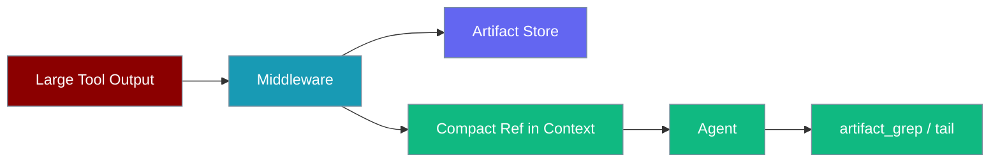
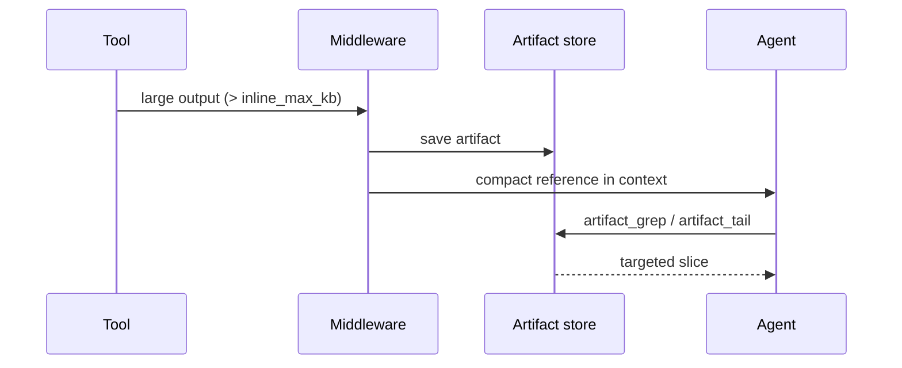

Large tool outputs are queued to artifacts automatically — the agent sees compact references instead of flooding context, and explores data on demand with artifact tools.



## Quick Start

<Steps>
<Step title="Enable dynamic context on an agent">

```python
from praisonaiagents import Agent
from praisonai.context import setup_dynamic_context

ctx = setup_dynamic_context()

agent = Agent(
    name="Analyst",
    instructions="You are a data analyst.",
    tools=ctx.get_tools(),
    hooks=[ctx.get_middleware()],
)

agent.start("Fetch and analyse the large dataset")
```

Outputs over 32 KB are saved as artifacts; the agent receives references and uses `artifact_tail`, `artifact_grep`, etc.

</Step>

<Step title="Tune the inline threshold">

```python
ctx = setup_dynamic_context(
    inline_max_kb=16,
    redact_secrets=True,
    history_enabled=True,
)
```

</Step>
</Steps>

---

## How It Works



Outputs above `inline_max_kb` are written to disk under `base_dir`. The agent sees a short reference and pulls only the lines it needs via artifact tools — context stays bounded even after heavy tool runs.

---

## Available Tools

| Tool | Description |
|------|-------------|
| `artifact_tail` | Last N lines |
| `artifact_head` | First N lines |
| `artifact_grep` | Search for pattern |
| `artifact_chunk` | Line range |
| `artifact_list` | List artifacts |

## Configuration

| Parameter | Default | Description |
|-----------|---------|-------------|
| `inline_max_kb` | `32` | Queue outputs larger than this |
| `redact_secrets` | `True` | Redact API keys and passwords |
| `history_enabled` | `True` | Persist conversation history |
| `base_dir` | `~/.praisonai/runs` | Artifact storage directory |

Environment variables: `PRAISONAI_ARTIFACT_DIR`, `PRAISONAI_ARTIFACT_INLINE_MAX_KB`, `PRAISONAI_ARTIFACT_REDACT`.

## Best Practices

<AccordionGroup>
<Accordion title="Lower inline_max_kb for memory-heavy agents">
16 KB keeps more headroom in context for long multi-tool sessions.
</Accordion>

<Accordion title="Keep redact_secrets enabled in production">
Automatic redaction prevents credentials in tool output from reaching the LLM or disk logs.
</Accordion>

<Accordion title="Use artifact_grep before loading full files">
Search artifacts first — avoid pulling entire multi-MB outputs into a single prompt.
</Accordion>
</AccordionGroup>

## Related

<CardGroup cols={2}>
  <Card title="Context Management" icon="layer-group" href="/docs/features/context-management">
    Full context system
  </Card>
  <Card title="Security & Redaction" icon="shield" href="/docs/features/context-security-redaction">
    Secret redaction details
  </Card>
</CardGroup>
