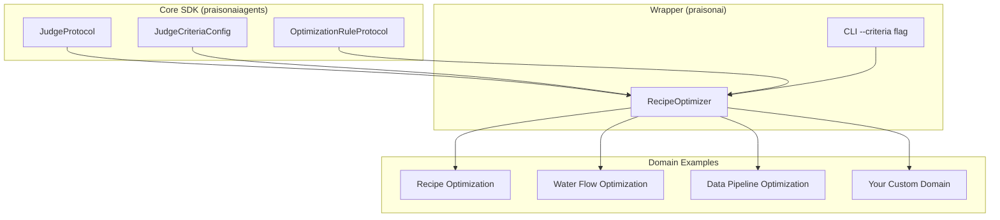
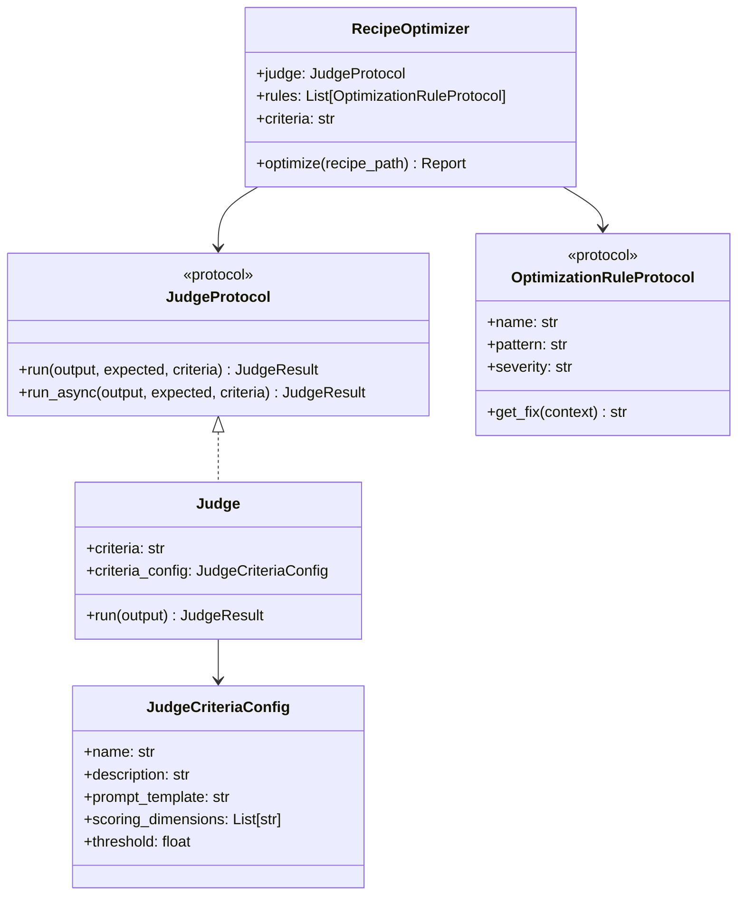

The Dynamic Judge Architecture enables PraisonAI to evaluate and optimize **any domain**, not just agent recipes. Whether you're optimizing water flow systems, data pipelines, manufacturing processes, or AI workflows, the same judge infrastructure adapts to your needs.

## Overview

<Accordion title="What is a Dynamic Judge?">
A Dynamic Judge is a configurable evaluation system that can assess outputs against custom criteria. Unlike hardcoded judges that only evaluate agent recipes, dynamic judges accept:

- **Custom criteria** - Define what "good" means for your domain
- **Custom prompt templates** - Control how the LLM evaluates outputs
- **Custom optimization rules** - Pluggable fix patterns for your domain
</Accordion>



## Quick Start

### CLI Usage

The simplest way to use custom criteria is via the CLI:

```bash
# Default recipe optimization
praisonai recipe optimize my-recipe

# Custom criteria for water flow optimization
praisonai recipe optimize my-recipe --criteria "Water flow is optimal: no leaks, pressure within 50-100 PSI, efficient routing"

# Custom criteria for data pipeline
praisonai recipe optimize my-recipe --criteria "Data pipeline is efficient: no bottlenecks, correct transformations, validated output"
```

### Python API

<CodeGroup>
```python Simple Usage
from praisonaiagents.eval import Judge

# Create a judge with custom criteria
judge = Judge(criteria="Response is helpful, accurate, and concise")

# Evaluate an output
result = judge.run(output="The capital of France is Paris.")
print(f"Score: {result.score}/10")
print(f"Reasoning: {result.reasoning}")
```

```python Domain-Agnostic Usage
from praisonaiagents.eval import Judge, JudgeCriteriaConfig

# Water flow optimization
water_config = JudgeCriteriaConfig(
    name="water_flow",
    description="Evaluate water flow optimization",
    prompt_template="""
    Evaluate the water flow system output:
    {output}
    
    Criteria:
    - No leaks detected
    - Pressure within 50-100 PSI
    - Efficient routing (minimal distance)
    
    Score from 1-10.
    """,
    scoring_dimensions=["leak_detection", "pressure", "efficiency"],
    threshold=7.0,
)

judge = Judge(criteria_config=water_config)
result = judge.run(output="Pressure: 75 PSI, No leaks, Route: optimal")
```

```python With RecipeOptimizer
from praisonai.cli.features.recipe_optimizer import RecipeOptimizer
from praisonaiagents.eval import Judge

# Create custom judge
custom_judge = Judge(
    criteria="Manufacturing output meets quality standards: dimensions within tolerance, surface finish acceptable"
)

# Use with optimizer
optimizer = RecipeOptimizer(
    max_iterations=3,
    score_threshold=8.0,
    judge=custom_judge,
)

report = optimizer.optimize(recipe_path)
```
</CodeGroup>

## JudgeCriteriaConfig

The `JudgeCriteriaConfig` dataclass enables full control over evaluation:

| Field | Type | Description |
|-------|------|-------------|
| `name` | `str` | Name of the criteria configuration |
| `description` | `str` | Description of what is being evaluated |
| `prompt_template` | `str` | Custom prompt with `{output}` placeholder |
| `scoring_dimensions` | `List[str]` | Dimensions to score (e.g., `["accuracy", "efficiency"]`) |
| `threshold` | `float` | Score threshold for passing (default: 7.0) |

### Template Placeholders

Your `prompt_template` can use these placeholders:

- `{output}` - The output being evaluated
- `{input}` or `{input_text}` - The original input
- `{expected}` - Expected output (if provided)

## OptimizationRuleProtocol

Create custom optimization rules for your domain:

```python
from praisonaiagents.eval import OptimizationRuleProtocol, add_optimization_rule

class WaterLeakRule:
    """Example: Water flow optimization rule."""
    name = "water_leak"
    pattern = r"(leak|overflow|pressure.drop)"
    severity = "critical"
    
    def get_fix(self, context):
        location = context.get("location", "unknown")
        return f"Check valve at {location} for leaks"

# Register the rule
add_optimization_rule("water_leak", WaterLeakRule)
```

### Rule Registry Functions

| Function | Description |
|----------|-------------|
| `add_optimization_rule(name, rule_class)` | Register a custom rule |
| `get_optimization_rule(name)` | Get a rule by name |
| `list_optimization_rules()` | List all registered rules |
| `remove_optimization_rule(name)` | Remove a rule |

## Architecture



## Domain Examples

<Accordion title="Water Flow Optimization">
```python
from praisonaiagents.eval import Judge, JudgeCriteriaConfig

config = JudgeCriteriaConfig(
    name="water_flow",
    description="Evaluate water distribution system",
    prompt_template="""
    Evaluate the water flow system:
    {output}
    
    Criteria:
    - No leaks (critical)
    - Pressure 50-100 PSI (high)
    - Flow rate optimal (medium)
    - Routing efficient (medium)
    
    Score 1-10 based on criteria compliance.
    """,
    scoring_dimensions=["leak_detection", "pressure", "flow_rate", "routing"],
    threshold=8.0,
)

judge = Judge(criteria_config=config)
```
</Accordion>

<Accordion title="Data Pipeline Optimization">
```python
from praisonaiagents.eval import Judge, JudgeCriteriaConfig

config = JudgeCriteriaConfig(
    name="data_pipeline",
    description="Evaluate data pipeline efficiency",
    prompt_template="""
    Evaluate the data pipeline output:
    {output}
    
    Criteria:
    - No data loss
    - Correct transformations
    - Performance within SLA
    - Validated output schema
    
    Score 1-10.
    """,
    scoring_dimensions=["data_integrity", "transformation", "performance", "validation"],
    threshold=7.0,
)

judge = Judge(criteria_config=config)
```
</Accordion>

<Accordion title="Manufacturing Quality">
```python
from praisonaiagents.eval import Judge, JudgeCriteriaConfig

config = JudgeCriteriaConfig(
    name="manufacturing_quality",
    description="Evaluate manufacturing output quality",
    prompt_template="""
    Evaluate the manufacturing output:
    {output}
    
    Quality Standards:
    - Dimensions within ±0.1mm tolerance
    - Surface finish Ra < 1.6μm
    - No visible defects
    - Material properties verified
    
    Score 1-10.
    """,
    scoring_dimensions=["dimensions", "surface_finish", "defects", "material"],
    threshold=9.0,
)

judge = Judge(criteria_config=config)
```
</Accordion>

## Backward Compatibility

The dynamic judge system is fully backward compatible:

```python
# Old usage still works
from praisonaiagents.eval import Judge, AccuracyJudge, CriteriaJudge

# Simple criteria
judge = Judge(criteria="Response is helpful")

# Accuracy evaluation
accuracy = AccuracyJudge()

# Criteria evaluation
criteria = CriteriaJudge(criteria="Test")

# RecipeOptimizer without custom judge
from praisonai.cli.features.recipe_optimizer import RecipeOptimizer
optimizer = RecipeOptimizer()  # Uses default ContextEffectivenessJudge
```

## Best Practices

<CardGroup cols={2}>
  <Card title="Be Specific" icon="bullseye">
    Define clear, measurable criteria. Vague criteria like "good output" lead to inconsistent scores.
  </Card>
  <Card title="Use Dimensions" icon="chart-bar">
    Break evaluation into scoring dimensions for more granular feedback.
  </Card>
  <Card title="Set Appropriate Thresholds" icon="sliders">
    Higher thresholds (8-9) for critical systems, lower (6-7) for exploratory work.
  </Card>
  <Card title="Test Your Criteria" icon="flask">
    Run your judge on known good/bad outputs to calibrate scoring.
  </Card>
</CardGroup>
