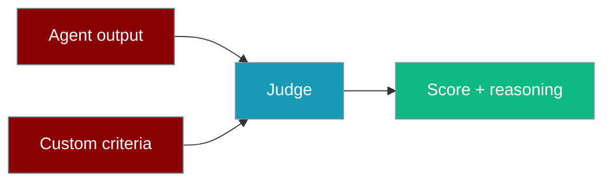

Score agent responses against your own criteria — recipe quality, data pipelines, manufacturing checks, or any custom rubric.

```python
from praisonaiagents import Agent
from praisonaiagents.eval import Judge

agent = Agent(name="assistant", instructions="Answer briefly and accurately")
output = agent.start("What is the capital of France?")

result = Judge(criteria="Answer is correct and concise").run(output=output)
print(f"Score: {result.score}/10")
```


```mermaid
graph LR
    Agent[Agent output] --> Judge[Judge]
    Criteria[Custom criteria] --> Judge
    Judge --> Score[Score + reasoning]

    classDef agent fill:#8B0000,stroke:#7C90A0,color:#fff
    classDef process fill:#189AB4,stroke:#7C90A0,color:#fff
    classDef output fill:#10B981,stroke:#7C90A0,color:#fff

    class Agent,Criteria agent
    class Judge process
    class Score output
```

## Quick Start

<Steps>
<Step title="Simple criteria">

```python
from praisonaiagents import Agent
from praisonaiagents.eval import Judge

agent = Agent(name="assistant", instructions="Be helpful")
output = agent.start("Explain photosynthesis in one sentence")

judge = Judge(criteria="Response is accurate and concise")
result = judge.run(output=output)
print(result.score, result.reasoning)
```

</Step>

<Step title="Domain-specific config">

```python
from praisonaiagents.eval import Judge, JudgeCriteriaConfig

config = JudgeCriteriaConfig(
    name="data_pipeline",
    description="Evaluate pipeline output",
    prompt_template="Evaluate this output:\n{output}\n\nScore 1-10 for data integrity and performance.",
    scoring_dimensions=["integrity", "performance"],
    threshold=7.0,
)

judge = Judge(criteria_config=config)
result = judge.run(output="ETL complete: 1.2M rows, 0 errors")
```

</Step>

<Step title="CLI recipe optimisation">

```bash
praisonai recipe optimize my-recipe --criteria "No bottlenecks, validated output schema"
```

</Step>
</Steps>

---

## Configuration Options

### JudgeCriteriaConfig

| Field | Type | Default | Description |
|-------|------|---------|-------------|
| `name` | `str` | — | Criteria configuration name |
| `description` | `str` | — | What is being evaluated |
| `prompt_template` | `str` | — | Prompt with `{output}`, `{input}`, `{expected}` placeholders |
| `scoring_dimensions` | `List[str]` | — | Dimensions to score |
| `threshold` | `float` | `7.0` | Passing score |

### JudgeConfig

| Field | Type | Default | Description |
|-------|------|---------|-------------|
| `model` | `str` | `gpt-4o-mini` | LLM for judging |
| `temperature` | `float` | `0.1` | Sampling temperature |
| `max_tokens` | `int` | `500` | Max response tokens |
| `threshold` | `float` | `7.0` | Passing score |
| `criteria` | `str` | `None` | Simple criteria string |

---

## Custom Optimisation Rules

Register domain-specific fix patterns with `add_optimization_rule`:

```python
from praisonaiagents.eval import add_optimization_rule

class WaterLeakRule:
    name = "water_leak"
    pattern = r"(leak|overflow|pressure.drop)"
    severity = "critical"

    def get_fix(self, context):
        return f"Check valve at {context.get('location', 'unknown')}"

add_optimization_rule("water_leak", WaterLeakRule)
```

| Function | Description |
|----------|-------------|
| `add_optimization_rule(name, rule_class)` | Register a rule |
| `get_optimization_rule(name)` | Get rule by name |
| `list_optimization_rules()` | List registered rules |

---

## Best Practices

<AccordionGroup>
<Accordion title="Define measurable criteria">
Vague rubrics like "good output" produce inconsistent scores. Use specific, testable dimensions.
</Accordion>

<Accordion title="Calibrate thresholds">
Use 8–9 for production-critical checks; 6–7 for exploratory workflows.
</Accordion>

<Accordion title="Test on known outputs">
Run the judge on good and bad examples before wiring it into optimisation loops.
</Accordion>

<Accordion title="Use scoring dimensions">
Break evaluation into dimensions for clearer feedback and targeted fixes.
</Accordion>
</AccordionGroup>

---

## Related

<CardGroup cols={2}>
<Card title="CLI Eval" icon="terminal" href="/docs/cli/eval">
  Run evaluations from the command line
</Card>
<Card title="Evaluator Optimiser" icon="rotate" href="/docs/features/evaluator-optimiser">
  Optimise agents with evaluator feedback loops
</Card>
</CardGroup>
