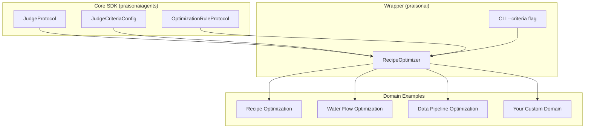

The Dynamic Judge Architecture enables PraisonAI to evaluate and optimize **any domain**, not just agent recipes. Whether you're optimizing water flow systems, data pipelines, manufacturing processes, or AI workflows, the same judge infrastructure adapts to your needs.

## Overview

<Accordion title="What is a Dynamic Judge?">
A Dynamic Judge is a configurable evaluation system that can assess outputs against custom criteria. Unlike hardcoded judges that only evaluate agent recipes, dynamic judges accept:

- **Custom criteria** - Define what "good" means for your domain
- **Custom prompt templates** - Control how the LLM evaluates outputs
- **Custom optimization rules** - Pluggable fix patterns for your domain
</Accordion>


```mermaid
flowchart TB
    subgraph "Core SDK (praisonaiagents)"
        JudgeProtocol["JudgeProtocol"]
        JudgeCriteriaConfig["JudgeCriteriaConfig"]
        OptimizationRuleProtocol["OptimizationRuleProtocol"]
    end
    
    subgraph "Wrapper (praisonai)"
        RecipeOptimizer["RecipeOptimizer"]
        CLI["CLI --criteria flag"]
    end
    
    subgraph "Domain Examples"
        RecipeJudge["Recipe Optimization"]
        WaterJudge["Water Flow Optimization"]
        DataJudge["Data Pipeline Optimization"]
        CustomJudge["Your Custom Domain"]
    end
    
    JudgeProtocol --> RecipeOptimizer
    JudgeCriteriaConfig --> RecipeOptimizer
    OptimizationRuleProtocol --> RecipeOptimizer
    CLI --> RecipeOptimizer
    
    RecipeOptimizer --> RecipeJudge
    RecipeOptimizer --> WaterJudge
    RecipeOptimizer --> DataJudge
    RecipeOptimizer --> CustomJudge
```

## Quick Start


<Steps>
<Step title="Simple Usage">
### CLI Usage

The simplest way to use custom criteria is via the CLI:

```bash
# Default recipe optimization
praisonai recipe optimize my-recipe

# Custom criteria for water flow optimization
praisonai recipe optimize my-recipe --criteria "Water flow is optimal: no leaks, pressure within 50-100 PSI, efficient routing"

# Custom criteria for data pipeline
praisonai recipe optimize my-recipe --criteria "Data pipeline is efficient: no bottlenecks, correct transformations, validated output"
```
</Step>

<Step title="With Configuration">
### Python API

<CodeGroup>
```python Simple Usage
from praisonaiagents.eval import Judge

# Create a judge with custom criteria
judge = Judge(criteria="Response is helpful, accurate, and concise")

# Evaluate an output
result = judge.run(output="The capital of France is Paris.")
print(f"Score: {result.score}/10")
print(f"Reasoning: {result.reasoning}")
```

```python Domain-Agnostic Usage
from praisonaiagents.eval import Judge, JudgeCriteriaConfig

# Water flow optimization
water_config = JudgeCriteriaConfig(
    name="water_flow",
    description="Evaluate water flow optimization",
    prompt_template="""
    Evaluate the water flow system output:
    {output}
    
    Criteria:
    - No leaks detected
    - Pressure within 50-100 PSI
    - Efficient routing (minimal distance)
    
    Score from 1-10.
    """,
    scoring_dimensions=["leak_detection", "pressure", "efficiency"],
    threshold=7.0,
)

judge = Judge(criteria_config=water_config)
result = judge.run(output="Pressure: 75 PSI, No leaks, Route: optimal")
```

```python With RecipeOptimizer
from praisonai.cli.features.recipe_optimizer import RecipeOptimizer
from praisonaiagents.eval import Judge

# Create custom judge
custom_judge = Judge(
    criteria="Manufacturing output meets quality standards: dimensions within tolerance, surface finish acceptable"
)

# Use with optimizer
optimizer = RecipeOptimizer(
    max_iterations=3,
    score_threshold=8.0,
    judge=custom_judge,
)

report = optimizer.optimize(recipe_path)
```
</CodeGroup>
</Step>
</Steps>


## Best Practices

<AccordionGroup>
  <Accordion title="Start simple">
    Enable the feature with a single parameter before adding configuration. Verify it works, then layer in options.
  </Accordion>
  <Accordion title="Use environment variables for secrets">
    Never hardcode API keys or tokens. Use `os.getenv("KEY_NAME")` to read from environment variables.
  </Accordion>
  <Accordion title="Test with minimal examples first">
    Copy the Quick Start example, run it, then extend it. This confirms your environment is set up correctly.
  </Accordion>
  <Accordion title="Check the logs">
    Set `verbose=True` on your agent to see detailed execution logs when debugging unexpected behavior.
  </Accordion>
</AccordionGroup>

## Related

<CardGroup cols={2}>
  <Card title="Features Overview" icon="grid-2" href="/docs/features">
    Browse all PraisonAI features
  </Card>
  <Card title="Quick Start" icon="rocket" href="/docs/introduction">
    Get started with PraisonAI agents
  </Card>
</CardGroup>
