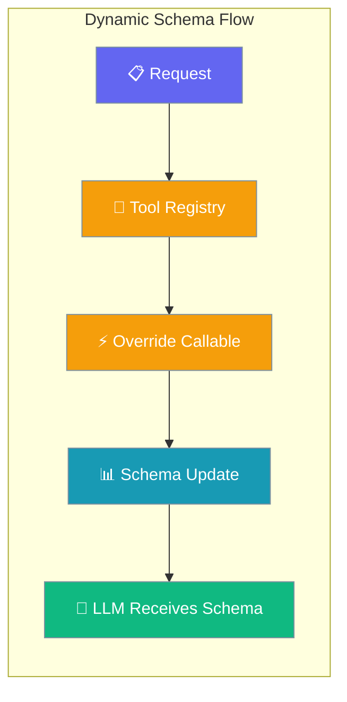
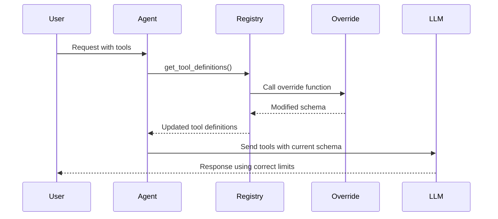

Dynamic tool schemas let your tool's parameter limits and descriptions reflect live configuration, so the agent always sees the truth.



## Quick Start

<Steps>
<Step title="Simple Agent with Dynamic Tool">
Use the `@tool` decorator with `dynamic_schema_overrides` to create a tool whose schema changes based on runtime state.

```python
from praisonaiagents import Agent
from praisonaiagents.tools import tool

# Runtime configuration that can change
current_limit = {"max_concurrent": 1}

@tool(
    dynamic_schema_overrides=lambda base: {
        **base,
        "function": {
            **base["function"],
            "description": f"Delegate a task. Current concurrency limit: {current_limit['max_concurrent']}",
            "parameters": {
                **base["function"]["parameters"],
                "properties": {
                    **base["function"]["parameters"]["properties"],
                    "priority": {
                        "type": "integer",
                        "minimum": 1,
                        "maximum": current_limit["max_concurrent"],
                        "description": f"Task priority (1-{current_limit['max_concurrent']})"
                    }
                }
            }
        },
    }
)
def delegate_task(task: str, priority: int = 1) -> str:
    return f"Delegated: {task} (priority: {priority})"

agent = Agent(
    name="Coordinator",
    instructions="Delegate work to sub-agents using available priority levels.",
    tools=[delegate_task],
)

# The schema reflects current limits
current_limit["max_concurrent"] = 5  # Schema updates on next agent turn
agent.start("Delegate three research tasks with different priorities")
```
</Step>

<Step title="Using BaseTool Subclass">
For more control, subclass `BaseTool` and provide the override in the constructor.

```python
from praisonaiagents import Agent, BaseTool

class ConfigurableSearchTool(BaseTool):
    def __init__(self, api_keys_available: dict):
        self.api_keys_available = api_keys_available
        super().__init__(
            dynamic_schema_overrides=self._update_schema_for_available_sources
        )
        
    def _update_schema_for_available_sources(self, base_schema):
        # Filter enum options based on available API keys
        available_sources = [
            source for source, has_key in self.api_keys_available.items() 
            if has_key
        ]
        
        return {
            **base_schema,
            "function": {
                **base_schema["function"],
                "parameters": {
                    **base_schema["function"]["parameters"],
                    "properties": {
                        **base_schema["function"]["parameters"]["properties"],
                        "source": {
                            "type": "string",
                            "enum": available_sources,
                            "description": f"Search source. Available: {', '.join(available_sources)}"
                        }
                    }
                }
            }
        }
    
    def run(self, query: str, source: str) -> str:
        return f"Searched '{query}' using {source}"

# Configure available APIs
search_tool = ConfigurableSearchTool({
    "google": True,
    "bing": False,
    "duckduckgo": True
})

agent = Agent(
    name="Researcher", 
    tools=[search_tool]
)

agent.start("Research the latest AI developments")
```
</Step>
</Steps>

---

## How It Works



The override function is called every time the agent needs tool definitions, ensuring schemas always reflect current runtime state.

| Component | Purpose |
|-----------|---------|
| **Override Function** | Updates schema based on current configuration |
| **Registry** | Manages tools and applies overrides on each read |
| **Base Schema** | Original tool parameter structure |
| **Runtime State** | Current limits, API keys, or other dynamic values |

---

## Common Patterns

### Pattern A: Concurrency Limits

Reflect runtime concurrency settings in parameter constraints.

```python
import os

@tool(
    dynamic_schema_overrides=lambda base: {
        **base,
        "function": {
            **base["function"],
            "parameters": {
                **base["function"]["parameters"],
                "properties": {
                    **base["function"]["parameters"]["properties"],
                    "max_workers": {
                        "type": "integer",
                        "maximum": os.cpu_count(),
                        "description": f"Max workers (system has {os.cpu_count()} CPUs)"
                    }
                }
            }
        }
    }
)
def parallel_process(data: list, max_workers: int = 1) -> list:
    return [f"processed_{item}" for item in data]
```

### Pattern B: API Key Filtering

Show only services with valid API keys in enum options.

```python
import os

def get_available_models():
    available = []
    if os.getenv("OPENAI_API_KEY"):
        available.extend(["gpt-4", "gpt-3.5-turbo"])
    if os.getenv("ANTHROPIC_API_KEY"):
        available.extend(["claude-3-opus", "claude-3-sonnet"])
    return available

@tool(
    dynamic_schema_overrides=lambda base: {
        **base,
        "function": {
            **base["function"],
            "parameters": {
                **base["function"]["parameters"],
                "properties": {
                    **base["function"]["parameters"]["properties"],
                    "model": {
                        "type": "string",
                        "enum": get_available_models(),
                        "description": "Available AI models"
                    }
                }
            }
        }
    }
)
def generate_text(prompt: str, model: str) -> str:
    return f"Generated text using {model}: {prompt}"
```

### Pattern C: Live Status Updates

Include current quotas or status information in tool descriptions.

```python
@tool(
    dynamic_schema_overrides=lambda base: {
        **base,
        "function": {
            **base["function"],
            "description": f"{base['function']['description']} (Quota: {get_remaining_quota()}/1000)"
        }
    }
)
def api_call(endpoint: str) -> dict:
    return {"result": f"Called {endpoint}"}
```

---

## Best Practices

<AccordionGroup>
<Accordion title="Keep Override Functions Fast and Pure">
Override functions run on every schema read, so avoid expensive operations like network calls or file I/O. Cache expensive computations and update them periodically rather than computing on each schema request.

```python
# Good: Fast computation
@tool(dynamic_schema_overrides=lambda base: update_cpu_count(base))

# Avoid: Slow network calls in override
@tool(dynamic_schema_overrides=lambda base: fetch_api_limits_from_server(base))
```
</Accordion>

<Accordion title="Return Fresh Dict Objects">
Always return a new dictionary rather than mutating the input schema. The base schema is already a deep copy, but your modifications should create new objects to avoid side effects.

```python
# Good: Create new structure
def my_override(base_schema):
    return {
        **base_schema,
        "function": {
            **base_schema["function"],
            "description": "Updated description"
        }
    }

# Avoid: Mutating input
def bad_override(base_schema):
    base_schema["function"]["description"] = "Updated"  # Don't mutate
    return base_schema
```
</Accordion>

<Accordion title="Handle Failures Gracefully">
If your override function raises an exception, the tool falls back to its base schema with a warning logged. Don't rely on the override for critical functionality—it should enhance the schema, not make it functional.

```python
def safe_override(base_schema):
    try:
        return update_with_live_config(base_schema)
    except Exception as e:
        # Log the error but don't re-raise
        logging.warning(f"Schema override failed: {e}")
        return base_schema  # Graceful fallback
```
</Accordion>

<Accordion title="Use Decorator Form for Simple Functions">
Prefer the `@tool(dynamic_schema_overrides=...)` decorator for plain functions. Only subclass `BaseTool` when you need richer lifecycle methods or complex state management.

```python
# Preferred: Simple decorator
@tool(dynamic_schema_overrides=lambda base: update_schema(base))
def my_function(x: str) -> str:
    return x

# Use subclass only when needed
class ComplexTool(BaseTool):
    def __init__(self):
        super().__init__(dynamic_schema_overrides=self.complex_override)
```
</Accordion>
</AccordionGroup>

---

## Related

<CardGroup cols={2}>
<Card title="Tool Schema Validation" icon="shield-check" href="/docs/features/tool-schema-validation">
  Validate tool schemas for OpenAI compatibility
</Card>
<Card title="Tool Parameter Types" icon="shapes" href="/docs/features/tool-parameter-types">
  Optional, Union, Literal, and Enum in tool parameters
</Card>
</CardGroup>