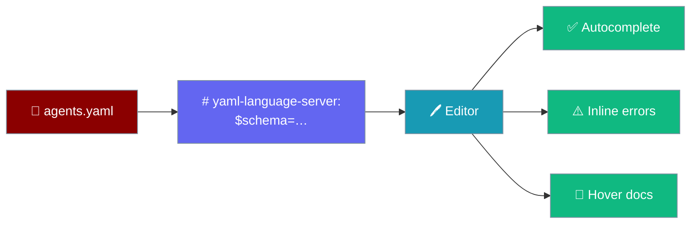
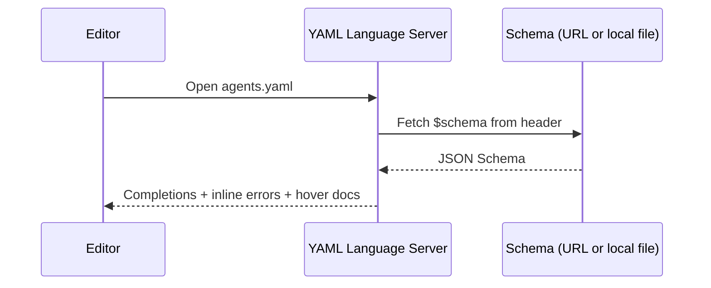
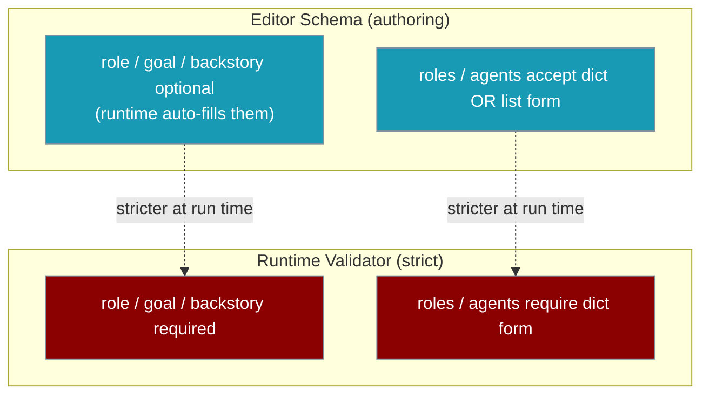

Every new `agents.yaml` PraisonAI scaffolds comes pre-wired for editor autocomplete — no setup required.



## Quick Start

<Steps>
<Step title="Zero-config — scaffold a new project">
```bash
praisonai --init "research team"
```

The generated `agents.yaml` has the schema directive on line 1:

```yaml
# yaml-language-server: $schema=https://raw.githubusercontent.com/MervinPraison/PraisonAI/main/src/praisonai/praisonai/config/agents.schema.json
framework: praisonai
roles:
  researcher:
    role: Research Analyst
    goal: Research the topic
    backstory: Expert researcher.
```

Open it in VS Code (with the Red Hat YAML extension) and you get autocomplete immediately.
</Step>

<Step title="Add it to an existing agents.yaml">
Paste this one line at the top of any `agents.yaml`:

```yaml
# yaml-language-server: $schema=https://raw.githubusercontent.com/MervinPraison/PraisonAI/main/src/praisonai/praisonai/config/agents.schema.json
```

Your editor fetches the schema and starts suggesting fields as you type.
</Step>

<Step title="Pin the schema locally">
For offline or air-gapped setups, write the schema to a file:

```bash
praisonai validate schema -o agents.schema.json
```

Then point the header at the local copy:

```yaml
# yaml-language-server: $schema=./agents.schema.json
```
</Step>
</Steps>

---

## How It Works

The header is a leading YAML comment, so `yaml.safe_load` ignores it — runtime parsing and execution are unchanged. It's authoring-time only.



| Step | What happens |
|------|--------------|
| Header read | The YAML language server reads the `$schema` directive on line 1 |
| Schema load | It fetches the URL (or reads the local file for pinned setups) |
| Assist | It returns field completions, red-underlines invalid values, and shows hover docs |

---

## Editor Support

| Editor | Setup |
|--------|-------|
| VS Code | Install the [YAML extension by Red Hat](https://marketplace.visualstudio.com/items?itemName=redhat.vscode-yaml); the header is picked up automatically |
| JetBrains IDEs (PyCharm, WebStorm, IntelliJ) | YAML support is built in; the schema directive is honoured automatically |
| Neovim / Vim | Install `yaml-language-server` via any LSP client (coc.nvim, nvim-lspconfig) |
| Zed | Built-in YAML language server support |
| Sublime Text | Install `LSP-yaml` |

---

## Two Flavours

The published (editor) schema is intentionally a touch more permissive than the strict runtime validator, so editors never red-underline valid, executable YAML.



Two intentional relaxations in the editor schema:

- `role`/`goal`/`backstory` are optional — the runtime auto-fills `role`/`goal` from the agent key and maps `instructions` → `backstory`.
- `roles` and `agents` accept **either** the canonical dict form **or** a list form (`anyOf`).

The strict validator behind `praisonai validate` still requires the dict form and all three fields, so run `validate` before shipping.

---

## Best Practices

<AccordionGroup>
<Accordion title="Pin the schema locally for air-gapped setups">
Run `praisonai validate schema -o agents.schema.json` and point the header at `./agents.schema.json` so authoring works with no network access.
</Accordion>

<Accordion title="Use the header and praisonai validate together">
The header catches typos while you type; `praisonai validate` enforces the strict runtime rules before you run. They cover different layers — use both.
</Accordion>

<Accordion title="Regenerate the pinned schema after upgrading">
After `pip install -U praisonai`, refresh your local copy: `praisonai validate schema -o agents.schema.json`.
</Accordion>

<Accordion title="Embed the schema in your own tooling (advanced)">
Power users can import `AGENTS_SCHEMA_URL`, `AGENTS_SCHEMA_HEADER`, and `generate_agents_schema()` from `praisonai.config` to generate or host the schema themselves.
</Accordion>
</AccordionGroup>

---

## Related

<CardGroup cols={2}>
  <Card title="Validate CLI" icon="circle-check" href="/cli/validate">
    Fail-fast YAML validation and the `schema --agents` / `-o` flags
  </Card>
  <Card title="YAML Configuration Reference" icon="book" href="/features/yaml-configuration-reference">
    Complete field reference for agents.yaml and workflow.yaml
  </Card>
</CardGroup>
