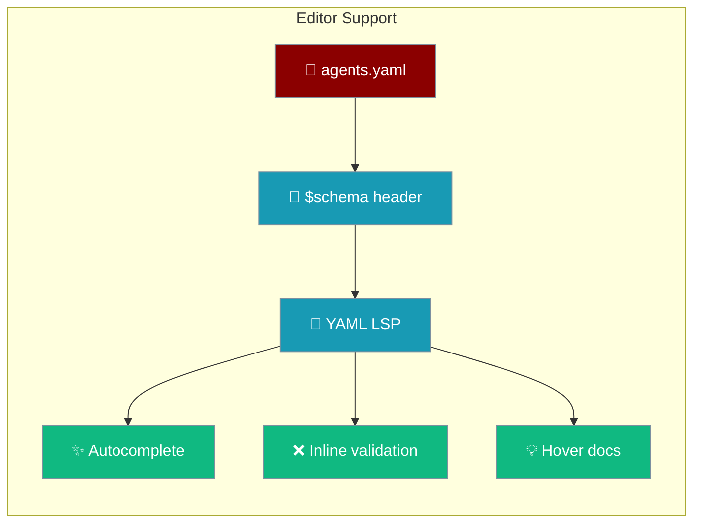
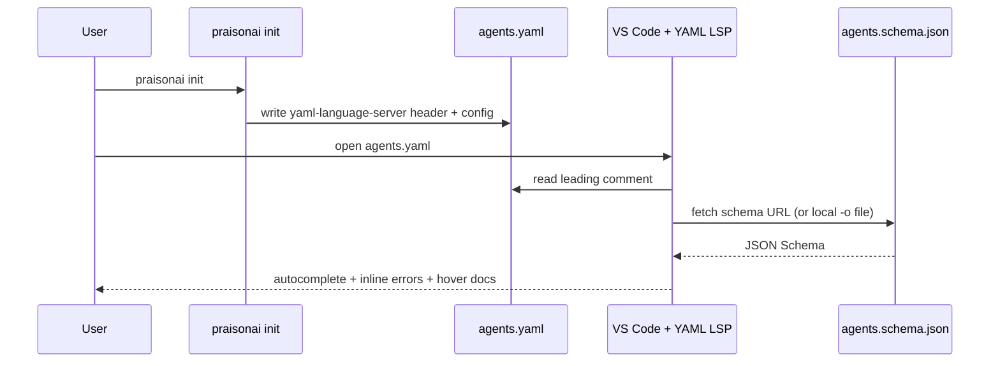
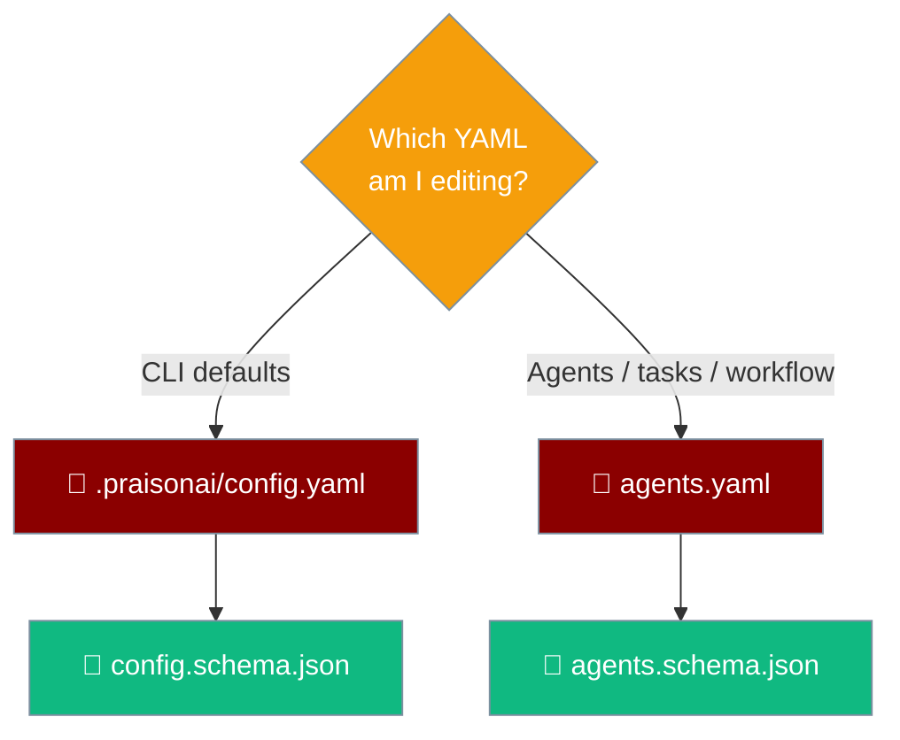

A single comment line at the top of `agents.yaml` unlocks autocomplete, inline validation, and hover docs in any LSP-aware editor.



```python
from praisonaiagents import Agent

# The scaffolded agents.yaml now ships with editor autocomplete out of the box.
# Runtime behaviour is unchanged — the header is a YAML comment.
agent = Agent(
    name="Researcher",
    instructions="Find and summarise the latest info on {topic}",
)

agent.start("quantum error correction breakthroughs in 2026")
```

## Quick Start

<Steps>
<Step title="Scaffold a new project">

`praisonai init` writes `agents.yaml` with the `# yaml-language-server: $schema=…` header already in place. Open it in VS Code with the YAML extension and you immediately get autocomplete for `roles`, `agents`, `tasks`, `tools`, `llm`, and `workflow`.

```bash
praisonai init
```

</Step>

<Step title="Add editor support to an existing agents.yaml">

Paste one comment line at the top of any existing file:

```yaml
# yaml-language-server: $schema=https://raw.githubusercontent.com/MervinPraison/PraisonAI/main/src/praisonai/praisonai/config/agents.schema.json
roles:
  researcher:
    role: Research Analyst
    goal: Find and summarise the latest info on {topic}
    backstory: Expert at spotting reliable primary sources.
```

</Step>
</Steps>

---

## How the header wires it up

The editor reads the leading comment, fetches the schema, and starts validating as you type.



---

## What you get

The header enables four editor affordances against the published schema:

- **Key/value autocomplete** — `roles`, `agents`, `tasks`, `tools`, `llm`, `workflow` at the correct nesting level.
- **Inline error markers** — a red squiggle on unknown keys the moment you type them.
- **Hover docs** — descriptions sourced from the Pydantic `description=…` fields.
- **Structural checks** — e.g. workflow steps needing both `agent` and `task`.

---

## Emit the schema locally

Offline or air-gapped setups can generate the schema file and point the editor at it.

```bash
praisonai validate schema --agents              # print to stdout
praisonai validate schema -o agents.schema.json # write to a file
```

Successful write output:

```
✓ Wrote agents JSON Schema to agents.schema.json
```

The emitted file starts like this:

```json
{
  "$schema": "http://json-schema.org/draft-07/schema#",
  "$id": "https://raw.githubusercontent.com/MervinPraison/PraisonAI/main/src/praisonai/praisonai/config/agents.schema.json",
  "title": "PraisonAI Agents Configuration",
  "description": "Schema for agents.yaml consumed by the PraisonAI agent runtime (roles/agents, tasks, tools, llm, workflow).",
  "type": "object",
  "properties": {
    "roles": {
      "title": "Roles",
      "description": "Agent role definitions"
    }
  }
}
```

Then point the editor at the local file:

```yaml
# yaml-language-server: $schema=./agents.schema.json
```

---

## Editor setup

<Tabs>
<Tab title="VS Code">

Install the [YAML extension by Red Hat](https://marketplace.visualstudio.com/items?itemName=redhat.vscode-yaml). The header is enough — no `settings.json` change needed.

Optional: pin via `yaml.schemas` when you cannot embed the header (e.g. a shared config):

```json
{
  "yaml.schemas": {
    "https://raw.githubusercontent.com/MervinPraison/PraisonAI/main/src/praisonai/praisonai/config/agents.schema.json": "agents*.yaml"
  }
}
```

</Tab>

<Tab title="Neovim / Helix">

Install `yaml-language-server`; the header is respected by any LSP-aware editor.

```bash
npm install -g yaml-language-server
```

</Tab>

<Tab title="JetBrains IDEs">

In PyCharm/WebStorm: *Settings → Languages & Frameworks → Schemas and DTDs → JSON Schema Mappings*. Add either the URL or the file emitted by `-o`, with the file mask `agents*.yaml`.

</Tab>
</Tabs>

---

## Which schema for which file

PraisonAI publishes two schemas — one for the CLI config, one for agent definitions.



| File | Schema | Published URL |
|------|--------|---------------|
| `.praisonai/config.yaml` (CLI defaults) | `config.schema.json` | https://raw.githubusercontent.com/MervinPraison/PraisonAI/main/src/praisonai/praisonai/cli/configuration/config.schema.json |
| `agents.yaml` (agent/task/workflow definitions) | `agents.schema.json` | https://raw.githubusercontent.com/MervinPraison/PraisonAI/main/src/praisonai/praisonai/config/agents.schema.json |

---

## User Interaction Flow

1. Run `praisonai init` → get `.praisonai/config.yaml` **and** `agents.yaml`, both with the language-server header.
2. Open `agents.yaml` in VS Code (YAML extension installed).
3. Type `ro` under the root → autocomplete offers `roles` / `role` at the correct nesting level with hover docs.
4. Misspell `backstroy:` → a red squiggle appears immediately, before saving or running any command.
5. On an air-gapped machine: run `praisonai validate schema -o agents.schema.json` once, commit the file, and swap the header to `# yaml-language-server: $schema=./agents.schema.json`.

<Note>
The header is a YAML comment — `yaml.safe_load` ignores it, so `praisonai start agents.yaml` behaves identically with or without it.
</Note>

---

## Common Patterns

### Add editor support to an existing config

```yaml
# yaml-language-server: $schema=https://raw.githubusercontent.com/MervinPraison/PraisonAI/main/src/praisonai/praisonai/config/agents.schema.json

roles:
  researcher:
    role: Research Analyst
    goal: Find and summarise the latest info on {topic}
    backstory: Expert at spotting reliable primary sources.
    tasks:
      collect_sources:
        description: Collect 5 recent, authoritative sources on {topic}.
        expected_output: A bulleted list of sources with one-line summaries.
```

### Pin a local schema for offline work

```bash
# Print to stdout (useful for piping to jq / diff)
praisonai validate schema --agents

# Write a local file the editor can point at
praisonai validate schema -o agents.schema.json
```

Then in `agents.yaml`:

```yaml
# yaml-language-server: $schema=./agents.schema.json
```

---

## Best Practices

<AccordionGroup>
<Accordion title="Let praisonai init add the header for you">
Scaffolded `agents.yaml` files ship with the header already in place — no manual step. Just install the YAML extension and start typing.
</Accordion>

<Accordion title="Pin a local schema for air-gapped machines">
Run `praisonai validate schema -o agents.schema.json` once, commit the file, and point the header at `./agents.schema.json` so editors work without network access.
</Accordion>

<Accordion title="Use yaml.schemas when you cannot embed the header">
For shared configs where a leading comment is undesirable, map the schema in VS Code `settings.json` via `yaml.schemas` with the `agents*.yaml` file mask instead.
</Accordion>

<Accordion title="Remember the header never affects runtime">
The header is a plain YAML comment. Runtime parsing and execution are unchanged, so it is always safe to keep it committed.
</Accordion>
</AccordionGroup>

---

## Related

<CardGroup cols={2}>
  <Card title="Validate" icon="circle-check" href="/docs/cli/validate">
    Emit the machine-readable schema and validate configs
  </Card>
  <Card title="Config CLI" icon="sliders" href="/docs/cli/config">
    Manage project and global configuration
  </Card>
  <Card title="Init" icon="wand-magic-sparkles" href="/docs/cli/init">
    Scaffold a project with the editor header in place
  </Card>
  <Card title="CLI Configuration" icon="gear" href="/docs/features/cli-configuration">
    Layered, project-aware CLI defaults
  </Card>
</CardGroup>
