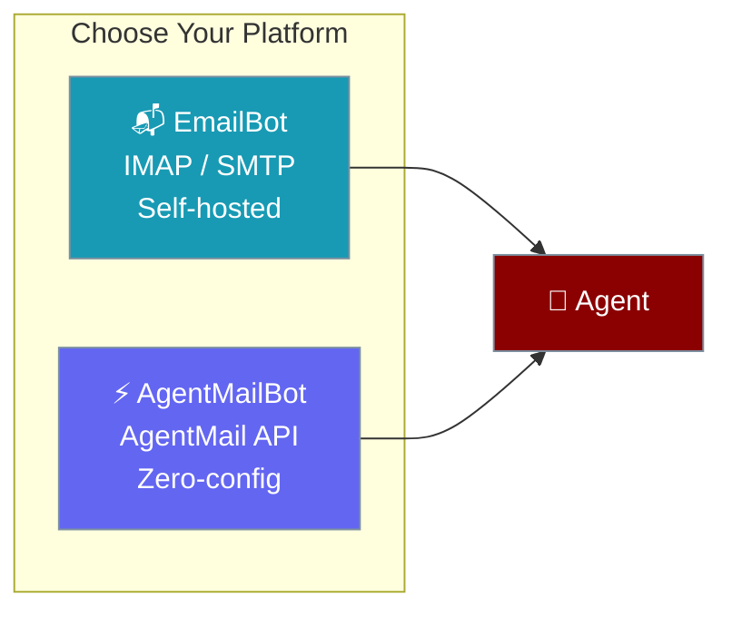
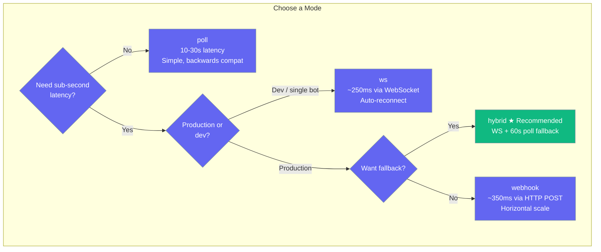

Email bots connect your AI agents to email. Choose between **IMAP/SMTP** (self-hosted) or **AgentMail** (zero-config API with event-driven modes).



## Quick Start

<Tabs>
<Tab title="AgentMail (Recommended)">
Zero-config email — no IMAP/SMTP setup. Get an email address instantly.

<Steps>
<Step title="Set API Key">
```bash
export AGENTMAIL_API_KEY="am_..."
```
</Step>

<Step title="Start Bot">
```python
from praisonai.bots import AgentMailBot
from praisonaiagents import Agent

agent = Agent(name="assistant", instructions="Handle emails concisely")

bot = AgentMailBot(token="am_...", agent=agent)

import asyncio
asyncio.run(bot.start())
# Prints: ✅ AgentMailBot connected: agent-123@agentmail.to
```
</Step>
</Steps>
</Tab>

<Tab title="IMAP/SMTP (Self-Hosted)">
Use your own Gmail, Outlook, or corporate email server.

<Steps>
<Step title="Set Environment Variables">
```bash
export EMAIL_ADDRESS="your-bot@gmail.com"
export EMAIL_APP_PASSWORD="xxxx xxxx xxxx xxxx"
# Optional: defaults to Gmail
export EMAIL_IMAP_SERVER="imap.gmail.com"
export EMAIL_SMTP_SERVER="smtp.gmail.com"
```
</Step>

<Step title="Start Bot">
```python
from praisonai.bots import Bot
from praisonaiagents import Agent

agent = Agent(name="assistant", instructions="Handle emails professionally")

bot = Bot("email", agent=agent)

import asyncio
asyncio.run(bot.start())
```
</Step>
</Steps>
</Tab>
</Tabs>

---

## Platform Comparison

| Feature | EmailBot (IMAP/SMTP) | AgentMailBot (API) |
|---------|---------------------|--------------------|
| **Setup** | Email credentials + IMAP/SMTP config | API key only |
| **Email Address** | Your existing address | Auto-generated (`@agentmail.to`) |
| **Custom Domains** | ✅ Any provider | ✅ Via `create_inbox(domain=...)` |
| **Inbox Lifecycle** | ❌ Manual | ✅ `create_inbox()` / `delete_inbox()` |
| **Event-Driven Modes** | ❌ Poll only | ✅ `poll`, `ws`, `webhook`, `hybrid` |
| **Fastest Latency** | 10-30s (poll interval) | ~250ms (WebSocket push) |
| **Dependencies** | None (stdlib) | `pip install agentmail` |
| **Best For** | Corporate/existing email | New projects, multi-inbox, real-time |

---

## Event-Driven Modes (AgentMail)

AgentMailBot supports 4 reception modes. Choose based on your latency and reliability needs.



| Mode | Trigger | Latency | Use Case |
|------|---------|---------|----------|
| `poll` | Timer (default) | 10-30s | Backwards compat, simple |
| `ws` | AgentMail WebSocket push | ~250ms | Dev, single-bot, self-hosted |
| `webhook` | AgentMail HTTP POST | ~350ms | Production, horizontal scale |
| `hybrid` | WS primary + 60s poll fallback | ~250ms | **Recommended** — fast + reliable |

### YAML Configuration

````carousel
```yaml
# Poll (default — omit mode)
channels:
  agentmail:
    token: ${AGENTMAIL_API_KEY}
```
<!-- slide -->
```yaml
# WebSocket (simplest event-driven)
channels:
  agentmail:
    token: ${AGENTMAIL_API_KEY}
    mode: ws
```
<!-- slide -->
```yaml
# Webhook (production, scalable)
channels:
  agentmail:
    token: ${AGENTMAIL_API_KEY}
    mode: webhook
    webhook_url: https://my-server.com
    webhook_port: 8080
```
<!-- slide -->
```yaml
# Hybrid (recommended)
channels:
  agentmail:
    token: ${AGENTMAIL_API_KEY}
    mode: hybrid
```
````

### Python API

````carousel
```python
# Poll (default)
bot = AgentMailBot(token="am_...", agent=agent)
await bot.start()  # polls every 10s
```
<!-- slide -->
```python
# WebSocket — sub-second
bot = AgentMailBot(token="am_...", agent=agent, mode="ws")
await bot.start()  # opens WS, receives events instantly
```
<!-- slide -->
```python
# Hybrid — recommended
bot = AgentMailBot(token="am_...", agent=agent, mode="hybrid")
await bot.start()  # WS primary + 60s poll fallback
```
<!-- slide -->
```python
# Webhook — production
bot = AgentMailBot(
    token="am_...", agent=agent,
    mode="webhook", webhook_port=9090
)
await bot.start()  # starts HTTP server, registers webhook
```
````

---

## Inbox Lifecycle Management

AgentMailBot implements the `EmailProtocol` from the core SDK, enabling programmatic inbox creation:

```python
# Create a new inbox
inbox = await bot.create_inbox(domain="mycompany.com")
print(inbox["email_address"])  # support-abc@mycompany.com

# List all inboxes
inboxes = await bot.list_inboxes()

# Delete an inbox
await bot.delete_inbox(inbox["id"])
```

<Tip>
Use `isinstance(bot, EmailProtocol)` to check if a bot supports inbox lifecycle management at runtime.
</Tip>

---

## Using as Agent Tools

Don't need a full bot? Use email as one-shot agent tools — auto-detects backend from env vars:

```python
from praisonaiagents import Agent
from praisonaiagents.tools.email_tools import (
    send_email, list_emails, read_email, reply_email,
    search_emails, archive_email, draft_email
)

agent = Agent(
    name="Mailer",
    instructions="Send, read, and manage emails",
    tools=[send_email, list_emails, read_email, reply_email, search_emails, archive_email, draft_email]
)

agent.start("Search my inbox for emails from Bob and archive the old ones")
```

<Tabs>
<Tab title="AgentMail Backend">
```bash
export AGENTMAIL_API_KEY="am_..."
export AGENTMAIL_INBOX_ID="you@agentmail.to"
# Same code, uses AgentMail API
```
</Tab>

<Tab title="Gmail / Outlook Backend">
```bash
export EMAIL_ADDRESS="you@gmail.com"
export EMAIL_PASSWORD="xxxx xxxx xxxx xxxx"
# Same code, uses SMTP/IMAP
```
</Tab>
</Tabs>

<Tip>
Or use the `email` profile: `tools=resolve_profiles("email")` — includes send, list, read, reply.
</Tip>

---

## Shared Features

Both `EmailBot` and `AgentMailBot` share these capabilities:

- **Auto-Reply Prevention**: Detects `Auto-Submitted` headers and common bot addresses to prevent infinite loops.
- **Blocked Sender Filtering**: Configurable via `BotConfig.blocked_users`.
- **Email Address Extraction**: Parses `"Name <email>"` format consistently.
- **Session Isolation**: Per-sender `AgentState` for independent conversations.
- **Command Handling**: Subject-based commands (e.g., `START:`, `STOP:`).
- **Thread Correlation**: `In-Reply-To` and `References` headers maintained.

---

## Capabilities Matrix

| Capability | EmailBot (IMAP) | AgentMailBot |
|------------|:---------------:|:------------:|
| Receive email (poll) | ✅ | ✅ |
| Receive email (WebSocket) | ❌ | ✅ |
| Receive email (webhook) | ❌ | ✅ |
| Receive email (hybrid) | ❌ | ✅ |
| Send / reply email | ✅ | ✅ |
| Sub-second latency | ❌ | ✅ (~250ms) |
| Auto-reconnect | ❌ | ✅ (1s→60s backoff) |
| No missed messages | ❌ (poll gaps) | ✅ (hybrid mode) |
| Webhook server + health check | ❌ | ✅ (`GET /health`) |
| YAML `mode:` config | ❌ | ✅ |
| Graceful shutdown (all modes) | ⚠️ Poll only | ✅ All modes |
| Async client | ❌ | ✅ (lazy `AsyncAgentMail`) |

---

## Configuration

### Environment Variables

| Variable | Platform | Default | Description |
|----------|----------|---------|-------------|
| `AGENTMAIL_API_KEY` | AgentMail | — | AgentMail API key |
| `AGENTMAIL_INBOX_ID` | AgentMail | — | Existing inbox to connect to |
| `AGENTMAIL_DOMAIN` | AgentMail | — | Custom domain for new inboxes |
| `EMAIL_ADDRESS` | IMAP/SMTP | — | Bot email address |
| `EMAIL_APP_PASSWORD` | IMAP/SMTP | — | App Password (recommended) |
| `EMAIL_IMAP_SERVER` | IMAP/SMTP | `imap.gmail.com` | IMAP server |
| `EMAIL_SMTP_SERVER` | IMAP/SMTP | `smtp.gmail.com` | SMTP server |
| `EMAIL_POLL_INTERVAL` | Both | `60` / `10` | Seconds between checks |

### BotConfig Options

| Option | Type | Default | Description |
|--------|------|---------|-------------|
| `mode` | `str` | `"poll"` | Reception mode: `poll`, `ws`, `webhook`, `hybrid` |
| `webhook_url` | `str` | `None` | Public URL for webhook registration |
| `webhook_path` | `str` | `"/webhook"` | Webhook endpoint path |
| `webhook_port` | `int` | `8080` | Webhook server port |
| `polling_interval` | `float` | `1.0` | Seconds between polls |

---

## Best Practices

<AccordionGroup>
<Accordion title="Use Hybrid Mode for Production">
`mode: hybrid` gives sub-second latency via WebSocket with a 60-second poll fallback to catch any missed messages. Best of both worlds.
</Accordion>

<Accordion title="Use Dedicated App Passwords">
Never use your main account password. Generate a platform-specific App Password for the bot.
</Accordion>

<Accordion title="Configure Blocked Senders">
Use `BotConfig.blocked_users` to exclude `noreply` addresses or known marketing domains.
</Accordion>

<Accordion title="Use AgentMail for Multi-Tenant">
Need separate inboxes per customer? Use `AgentMailBot.create_inbox()` to provision on demand.
</Accordion>
</AccordionGroup>

---

## Related

<CardGroup cols={2}>
<Card title="Messaging Bots" icon="robot" href="/docs/features/messaging-bots">
All supported messaging platforms
</Card>
<Card title="Bot Commands" icon="terminal" href="/docs/features/bot-commands">
Register custom commands
</Card>
</CardGroup>
