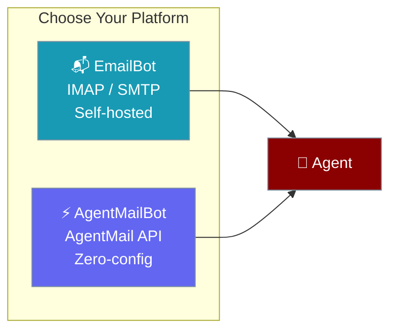

Email bots connect your AI agents to email. Choose between **IMAP/SMTP** (self-hosted) or **AgentMail** (zero-config API).



## Quick Start

<Tabs>
<Tab title="AgentMail (Recommended)">
Zero-config email — no IMAP/SMTP setup. Get an email address instantly.

<Steps>
<Step title="Set API Key">
```bash
export AGENTMAIL_API_KEY="am_..."
```
</Step>

<Step title="Start Bot">
```python
from praisonai.bots import AgentMailBot
from praisonaiagents import Agent

agent = Agent(name="assistant", instructions="Handle emails concisely")

bot = AgentMailBot(token="am_...", agent=agent)

import asyncio
asyncio.run(bot.start())
# Prints: ✅ AgentMailBot connected: agent-123@agentmail.to
```
</Step>
</Steps>
</Tab>

<Tab title="IMAP/SMTP (Self-Hosted)">
Use your own Gmail, Outlook, or corporate email server.

<Steps>
<Step title="Set Environment Variables">
```bash
export EMAIL_ADDRESS="your-bot@gmail.com"
export EMAIL_APP_PASSWORD="xxxx xxxx xxxx xxxx"
# Optional: defaults to Gmail
export EMAIL_IMAP_SERVER="imap.gmail.com"
export EMAIL_SMTP_SERVER="smtp.gmail.com"
```
</Step>

<Step title="Start Bot">
```python
from praisonai.bots import Bot
from praisonaiagents import Agent

agent = Agent(name="assistant", instructions="Handle emails professionally")

bot = Bot("email", agent=agent)

import asyncio
asyncio.run(bot.start())
```
</Step>
</Steps>
</Tab>
</Tabs>

---

## Platform Comparison

| Feature | EmailBot (IMAP/SMTP) | AgentMailBot (API) |
|---------|---------------------|--------------------|
| **Setup** | Email credentials + IMAP/SMTP config | API key only |
| **Email Address** | Your existing address | Auto-generated (`@agentmail.to`) |
| **Custom Domains** | ✅ Any provider | ✅ Via `create_inbox(domain=...)` |
| **Inbox Lifecycle** | ❌ Manual | ✅ `create_inbox()` / `delete_inbox()` |
| **Dependencies** | None (stdlib) | `pip install agentmail` |
| **Best For** | Corporate/existing email | New projects, multi-inbox |

---

## AgentMail Features

### Inbox Lifecycle Management

AgentMailBot implements the `EmailProtocol` from the core SDK, enabling programmatic inbox creation:

```python
# Create a new inbox
inbox = await bot.create_inbox(domain="mycompany.com")
print(inbox["email_address"])  # support-abc@mycompany.com

# List all inboxes
inboxes = await bot.list_inboxes()

# Delete an inbox
await bot.delete_inbox(inbox["id"])
```

<Tip>
Use `isinstance(bot, EmailProtocol)` to check if a bot supports inbox lifecycle management at runtime.
</Tip>

### Thread Correlation

Both bots maintain email threading via `In-Reply-To` and `References` headers. Each sender gets an isolated `AgentState` session for personalized interactions.

---

## Using as Agent Tools

Don't need a full bot? Use email as one-shot agent tools instead:

<Tabs>
<Tab title="AgentMail Tools">
```python
from praisonaiagents import Agent
from praisonaiagents.tools import send_email, list_emails, read_email

agent = Agent(
    name="Mailer",
    instructions="Send and read emails",
    tools=[send_email, list_emails, read_email]
)

agent.start("Send a meeting reminder to bob@example.com")
```
</Tab>

<Tab title="SMTP Tools">
```python
from praisonaiagents import Agent
from praisonaiagents.tools import smtp_send_email, smtp_read_inbox

agent = Agent(
    name="Mailer",
    instructions="Send and read emails",
    tools=[smtp_send_email, smtp_read_inbox]
)

agent.start("Check my inbox for unread messages")
```
</Tab>
</Tabs>

<Tip>
Use the `email` or `smtp_email` tool profiles for convenience: `tools=resolve_profiles("email")`
</Tip>

---

## Shared Features

Both `EmailBot` and `AgentMailBot` share these capabilities via `_email_utils.py`:

- **Auto-Reply Prevention**: Detects `Auto-Submitted` headers and common bot addresses to prevent infinite loops.
- **Blocked Sender Filtering**: Configurable via `BotConfig.blocked_users`.
- **Email Address Extraction**: Parses `"Name <email>"` format consistently.
- **Session Isolation**: Per-sender `AgentState` for independent conversations.
- **Command Handling**: Subject-based commands (e.g., `START:`, `STOP:`).

---

## Configuration

### Environment Variables

| Variable | Platform | Default | Description |
|----------|----------|---------|-------------|
| `AGENTMAIL_API_KEY` | AgentMail | — | AgentMail API key |
| `AGENTMAIL_INBOX_ID` | AgentMail | — | Existing inbox to connect to |
| `AGENTMAIL_DOMAIN` | AgentMail | — | Custom domain for new inboxes |
| `EMAIL_ADDRESS` | IMAP/SMTP | — | Bot email address |
| `EMAIL_APP_PASSWORD` | IMAP/SMTP | — | App Password (recommended) |
| `EMAIL_IMAP_SERVER` | IMAP/SMTP | `imap.gmail.com` | IMAP server |
| `EMAIL_SMTP_SERVER` | IMAP/SMTP | `smtp.gmail.com` | SMTP server |
| `EMAIL_POLL_INTERVAL` | Both | `60` / `10` | Seconds between checks |

---

## Best Practices

<AccordionGroup>
<Accordion title="Use Dedicated App Passwords">
Never use your main account password. Generate a platform-specific App Password for the bot.
</Accordion>

<Accordion title="Configure Blocked Senders">
Use `BotConfig.blocked_users` to exclude `noreply` addresses or known marketing domains.
</Accordion>

<Accordion title="Use AgentMail for Multi-Tenant">
Need separate inboxes per customer? Use `AgentMailBot.create_inbox()` to provision on demand.
</Accordion>
</AccordionGroup>

---

## Related

<CardGroup cols={2}>
<Card title="Messaging Bots" icon="robot" href="/docs/features/messaging-bots">
All supported messaging platforms
</Card>
<Card title="Bot Commands" icon="terminal" href="/docs/features/bot-commands">
Register custom commands
</Card>
</CardGroup>
