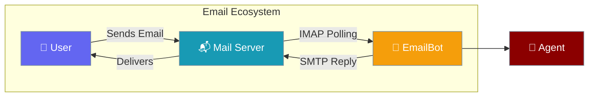

Email Bot enables your AI agents to interact with users through standard email protocols. It handles bidirectional communication using IMAP for polling and SMTP for sending.



## Quick Start

Enable email communication for your agents with a few lines of code.

<Steps>

<Step title="Set Environment Variables">
Configure your email service credentials. For Gmail, use an [App Password](https://support.google.com/accounts/answer/185833).

```bash
export EMAIL_ADDRESS="your-bot@gmail.com"
export EMAIL_APP_PASSWORD="xxxx xxxx xxxx xxxx"
# Optional: defaults to Gmail
export EMAIL_IMAP_SERVER="imap.gmail.com"
export EMAIL_SMTP_SERVER="smtp.gmail.com"
```
</Step>

<Step title="Create and Start Bot">
Simple Python implementation using the `Bot` factory.

```python
from praisonai.bots import Bot
from praisonaiagents import Agent
import asyncio

# Define your agent
agent = Agent(
    name="Professional Assistant",
    instructions="Handle incoming emails professionally and concisely."
)

async def main():
    # Initialize EmailBot via factory
    bot = Bot("email", agent=agent)
    
    # Start polling for emails
    await bot.start()

if __name__ == "__main__":
    asyncio.run(main())
```
</Step>

</Steps>

---

## Key Features

- **Bidirectional Support**: Uses IMAP to poll for new messages and SMTP to send responses.
- **Thread Management**: Correlates responses using `In-Reply-To` and `References` headers to maintain conversation context.
- **Auto-Reply Prevention**: Built-in detection for `Auto-Submitted` headers and common bot addresses to prevent infinite loops.
- **Command Handling**: Supports subject-based commands (e.g., `START:`, `STOP:`) alongside natural language.
- **Session Isolation**: Each sender gets a dedicated `AgentState` for personalized interactions.

---

## Configuration

### Environment Variables

| Variable | Default | Description |
|----------|---------|-------------|
| `EMAIL_ADDRESS` | — | The email address of the bot |
| `EMAIL_APP_PASSWORD` | — | Authentication password (App Password recommended) |
| `EMAIL_IMAP_SERVER` | `imap.gmail.com` | IMAP server for reading emails |
| `EMAIL_IMAP_PORT` | `993` | IMAP SSL port |
| `EMAIL_SMTP_SERVER` | `smtp.gmail.com` | SMTP server for sending emails |
| `EMAIL_SMTP_PORT` | `465` | SMTP SSL port |
| `EMAIL_POLL_INTERVAL` | `60` | Seconds between email checks |

### BotConfig Options

```python
from praisonaiagents import BotConfig

config = BotConfig(
    command_prefix="!",           # Prefix for email commands
    typing_indicator=False,       # N/A for email
    reply_in_thread=True,         # Always use reply headers
    allowed_users=["boss@company.com"], # Restricted access
)
```

---

## Deployment Modes

### CLI Mode

Deploy directly from your `agents.yaml` file:

```bash
praisonai bot email --agent agents.yaml
```

### Script Mode

Full control over headers and attachment handling by extending the `EmailBot` class.

---

## Best Practices

<AccordionGroup>
<Accordion title="Use Dedicated App Passwords">
Never use your main account password. Generate a platform-specific App Password for the bot.
</Accordion>

<Accordion title="Configure Blocked Senders">
Use `BotConfig.blocked_users` to exclude `noreply` addresses or known marketing domains.
</Accordion>

<Accordion title="Subject Line Clarity">
Tell your users to keep subject lines consistent for better thread correlation.
</Accordion>
</AccordionGroup>

---

## Related

<CardGroup cols={2}>
<Card title="Messaging Bots" icon="robot" href="/docs/features/messaging-bots">
Comparison of all messaging platforms
</Card>
<Card title="Bot Commands" icon="terminal" href="/docs/features/bot-commands">
Register custom subject-line commands
</Card>
</CardGroup>
