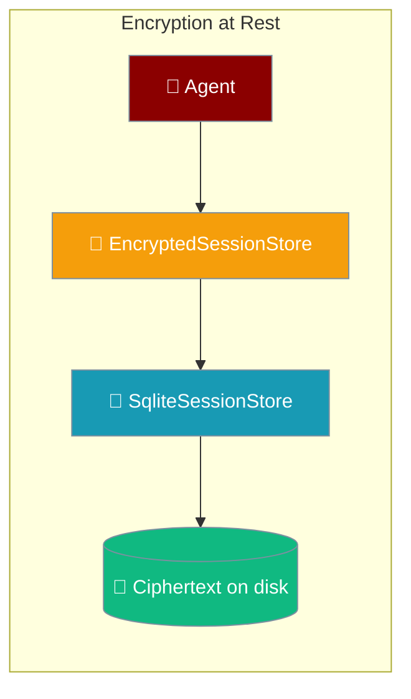
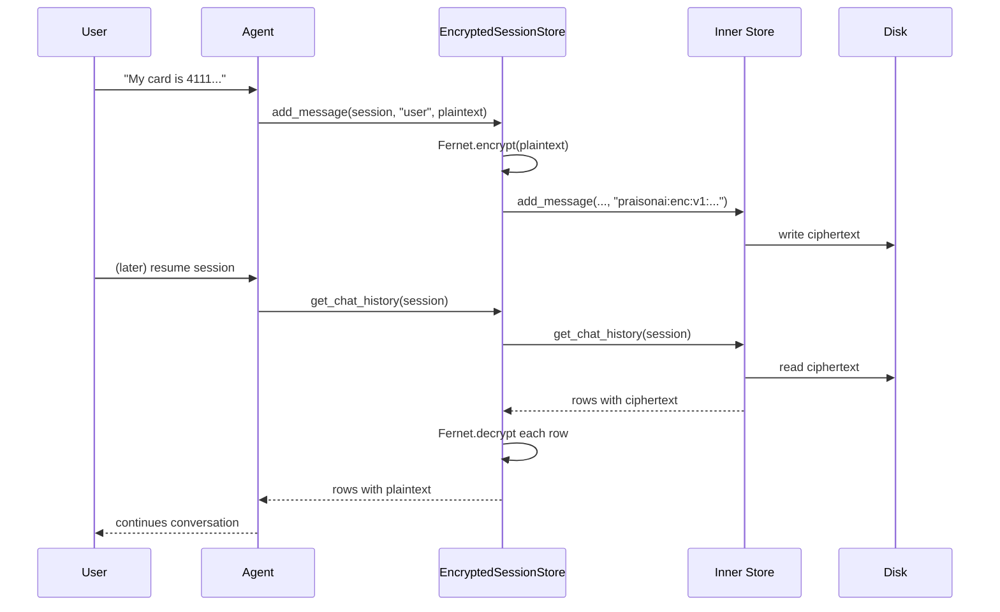
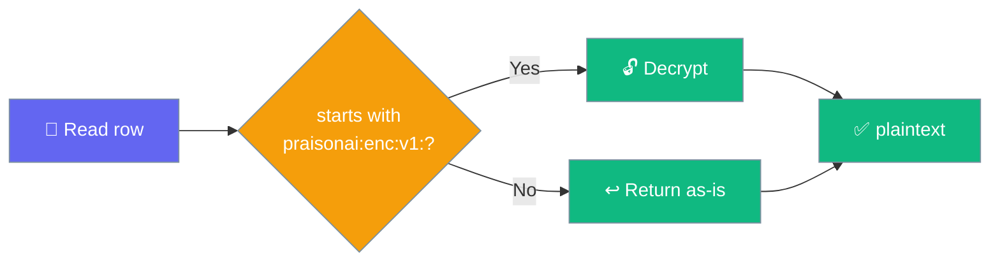

`EncryptedSessionStore` wraps any session store so message content and metadata are encrypted before they reach disk — keys stay in `PRAISONAI_SESSION_KEY`, plaintext never lands on the filesystem.



## Quick Start

<Steps>
<Step title="Enable in three lines">

```python
import os
from praisonaiagents import Agent
from praisonaiagents.session import SqliteSessionStore, EncryptedSessionStore

store = EncryptedSessionStore(
    SqliteSessionStore(path="~/.praisonai/sessions.db"),
    key=os.environ["PRAISONAI_SESSION_KEY"],
)

agent = Agent(name="Assistant", session_store=store)
agent.start("My card is 4111 1111 1111 1111")   # persisted as ciphertext
```

</Step>

<Step title="Generate a key">

```python
from praisonaiagents.session import generate_session_key

print(generate_session_key())   # store this somewhere safe
```

Or on the CLI:

```bash
python -c "from praisonaiagents.session import generate_session_key; print(generate_session_key())"
export PRAISONAI_SESSION_KEY="<paste-the-key>"
```

</Step>
</Steps>

<Note>
Encrypting sessions needs the `cryptography` package (not a hard dependency of PraisonAI). Install it with `pip install cryptography`. If it is missing when the wrapper is instantiated, a `SessionEncryptionError` is raised with the exact install command.
</Note>

---

## How It Works

The wrapper encrypts content on the way in and decrypts it on the way out — the inner store only ever sees ciphertext.



### What is encrypted / not encrypted

| Field | Encrypted? | Why |
|---|---|---|
| `content` (message body) | ✅ Yes | Primary sensitive data |
| `metadata` (dict) | ✅ Yes | May contain PII; wrapped as `{"__enc__": ciphertext}` |
| `tool_calls` (function arguments) | ✅ Yes | Arguments can carry sensitive data |
| `role` (`user` / `assistant` / `system`) | ❌ No | Store indexes and orders on it |
| `session_id` | ❌ No | Store uses it as primary key |
| `timestamp` | ❌ No | Store orders on it |
| `tool_call_id` | ❌ No | Opaque correlation id for turn linking |

<Warning>
Ids, roles, and timestamps stay readable — the store indexes on them. Anyone treating session ids as sensitive needs a different design, not this wrapper.
</Warning>

---

## Configuration Options

The wrapper takes the inner store and a Fernet key. Everything else is inherited from whatever store you wrap.

| Constructor arg | Type | Default | Description |
|---|---|---|---|
| `store` | any session store | — (required) | The inner store to wrap. `SqliteSessionStore`, `DefaultSessionStore`, `HierarchicalSessionStore`, or any custom store. |
| `key` | `str` \| `bytes` | — (required) | Fernet key. Empty string → `SessionEncryptionError`. Malformed → `SessionEncryptionError`. |

| Attribute | Value | Meaning |
|---|---|---|
| `EncryptedSessionStore.PREFIX` | `"praisonai:enc:v1:"` | Marks a value this wrapper produced — plaintext rows written before encryption was enabled are recognised by the absence of this prefix and returned as-is. |

---

## Errors and Honest Limits

These conditions are designed in, not accidental — each fails loudly rather than silently.

**`search()` raises instead of returning `[]`.** Stored content is ciphertext, so substring matching cannot work. An empty list would be indistinguishable from a genuine miss — the more dangerous answer. Callers should `get_chat_history()` and filter in memory, or use an unencrypted store when search matters more than confidentiality.

**Wrong key raises `SessionEncryptionError`** rather than yielding gibberish:

> "the key does not match the one it was written with. Session transcripts are unrecoverable without their original key."

**Empty or malformed key is refused at construction time** — fails fast rather than at first use.

**Losing the key loses the transcripts.** By design — no recovery path.

---

## Enabling encryption on an existing store does not break history

Switching encryption on leaves earlier plaintext rows readable — they are recognised and returned untouched.



- Rows written **before** encryption was switched on lack the `praisonai:enc:v1:` prefix and are returned **as-is** — not fed to the decrypter, not reported as corrupt.
- Legacy metadata containing an `__enc__` key as regular data (not our envelope) is preserved intact — the wrapper recognises only the exact one-key envelope shape with the crypto prefix.
- Unwrapped methods are forwarded via `__getattr__`, so wrapping cannot silently drop capabilities the inner store has.

---

## Common Patterns

### Opt-in via environment

Leaving `PRAISONAI_SESSION_KEY` unset yields the plain store, so existing deployments are unaffected until they set the env var.

```python
import os
from praisonaiagents import Agent
from praisonaiagents.session import SqliteSessionStore, EncryptedSessionStore

def build_store():
    inner = SqliteSessionStore(db_path="~/.praisonai/sessions.db")
    key = os.environ.get("PRAISONAI_SESSION_KEY")
    return EncryptedSessionStore(inner, key=key) if key else inner

agent = Agent(name="Support", session_store=build_store())
```

### Filter in memory instead of `search()`

```python
history = store.get_chat_history("chat-42")
matches = [m for m in history if "refund" in m["content"].lower()]
```

---

## Best Practices

<AccordionGroup>
<Accordion title="Keep the key out of source and out of the container image">
Load from `PRAISONAI_SESSION_KEY` or a secrets manager — never commit a Fernet key.
</Accordion>

<Accordion title="Rotate carefully">
There is no automatic re-encryption path. Rotating requires re-writing existing sessions with the new key (out of scope for this wrapper).
</Accordion>

<Accordion title="Filter in memory instead of using search()">
When you need to find something in an encrypted session, `get_chat_history()` + Python filtering is the supported path.
</Accordion>

<Accordion title="Choose a different design if session ids must also be confidential">
Ids, roles, and timestamps stay readable — the store indexes on them.
</Accordion>
</AccordionGroup>

---

## Related

<CardGroup cols={2}>
  <Card title="Session Store" icon="database" href="/features/session-store">
    Default JSON, SQLite, hierarchical backends
  </Card>
  <Card title="Session Persistence" icon="floppy-disk" href="/features/session-persistence">
    Automatic persistence via session_id
  </Card>
  <Card title="SQLite Transcript Store" icon="table" href="/features/sqlite-transcript-store">
    Gateway-default transcript backend that can also be wrapped
  </Card>
  <Card title="Security Environment Variables" icon="shield" href="/features/security-environment-variables">
    Where PRAISONAI_SESSION_KEY fits
  </Card>
</CardGroup>
