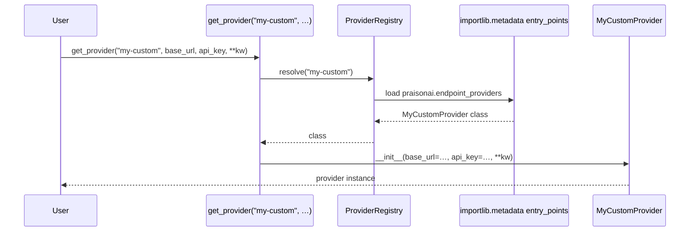
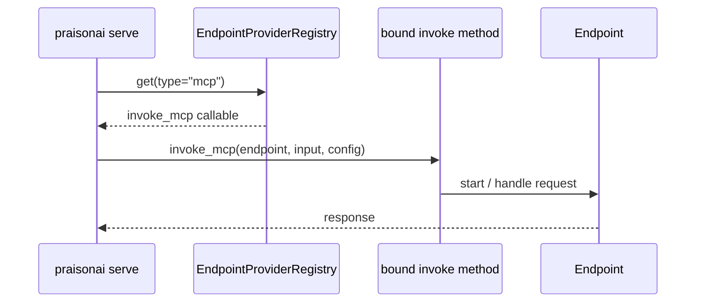

```python
from praisonaiagents import Agent

agent = Agent(name="registry-agent", instructions="Use the endpoint provider registry.")
agent.start("List all registered LLM endpoint providers.")
```


Endpoint Provider Registry lets you plug custom server-side providers (recipe, agents-api, MCP, A2A, and your own) into `praisonai serve` — no fork required.

```bash
export PRAISON_ENDPOINT_URL="http://localhost:8765"
praisonai serve --endpoint mcp
```

```python
from praisonai.endpoints.registry import get_provider

provider = get_provider("mcp", base_url="http://localhost:8765")
```


## Quick Start

<Steps>
<Step title="Use a built-in provider">

```python
from praisonai.endpoints.registry import get_provider

provider = get_provider("recipe", base_url="http://localhost:8765")
```

</Step>

<Step title="Register at runtime">

```python
from praisonai.endpoints.registry import register_provider
from praisonai.endpoints.providers.base import BaseProvider

class MyCustomProvider(BaseProvider):
    def __init__(self, base_url, api_key=None, **kwargs):
        self.base_url = base_url
        self.api_key = api_key

register_provider("my-custom", MyCustomProvider)
provider = get_provider("my-custom", base_url="http://localhost:8765")
```

</Step>

<Step title="Distribute as a pip plugin">

```toml
# pyproject.toml
[project.entry-points."praisonai.endpoint_providers"]
my-custom = "mypkg.endpoints:MyCustomProvider"
```

```bash
pip install my-praisonai-endpoint
```

</Step>
</Steps>

---

## How It Works



The registry is thread-safe and loads plugins lazily. Built-ins are discovered on first access, entry points are loaded when needed, and aliases are case-insensitive. The singleton registry is obtained via `get_default_registry()`.

---

## CLI Endpoint Dispatch Registry

PraisonAI ships **two** endpoint registries. This page documents the top-level **provider registry** (`praisonai.endpoint_providers`). A separate **CLI dispatch registry** resolves how the CLI invokes each endpoint type at runtime.

| Registry | Entry-point group | Purpose |
|----------|-------------------|---------|
| Provider registry (this page) | `praisonai.endpoint_providers` | Instantiate `BaseProvider` classes for serve / discovery |
| CLI dispatch registry | `praisonai.endpoints.providers` | Map endpoint type → bound invoke method in the CLI |

### Built-in CLI Dispatch Keys

| Key | Invoke target | Notes |
|-----|---------------|-------|
| `recipe` | `_invoke_recipe` | Recipe runner endpoint |
| `agents-api` | `_invoke_agents_api` | OpenAI Agents-API compatible |
| `mcp` | `_invoke_mcp` | MCP server endpoint |
| `tools-mcp` | `_invoke_mcp` | Alias of `mcp` |
| `a2a` | `_invoke_a2a` | A2A protocol |
| `a2u` | `_invoke_a2u` | A2U protocol |



<Info>
If you're writing a pip plugin for **CLI dispatch**, use entry-point group `praisonai.endpoints.providers`. For the **top-level provider registry** (instantiating provider classes), use `praisonai.endpoint_providers`.
</Info>

---

## Configuration / API

### Functions

| Function / Method | Signature | Description |
|---|---|---|
| `register_provider(type, cls)` | `(str, Type[BaseProvider]) -> None` | Backwards-compat module function; delegates to `get_default_registry().register(...)` |
| `get_provider(type, base_url, api_key, **kw)` | `(str, str, Optional[str], **Any) -> Optional[BaseProvider]` | Resolve + instantiate; returns `None` for unknown type; raises if loader fails |
| `list_provider_types()` | `() -> List[str]` | List registered + entry-point + built-in types |
| `get_provider_class(type)` | `(str) -> Optional[Type[BaseProvider]]` | Returns the class without instantiating |
| `get_default_registry()` | `() -> ProviderRegistry` | Thread-safe singleton accessor |

### ProviderRegistry Class

| Method | Signature | Description |
|---|---|---|
| `ProviderRegistry.get(type, base_url, api_key, **kw)` | identical to `get_provider` | OOP-style interface |
| `ProviderRegistry.list_types()` | `() -> List[str]` | Back-compat alias for `list_names()` |
| `ProviderRegistry.get_class(type)` | `(str) -> Optional[Type]` | Back-compat alias for `resolve()` |

### Built-in Provider Types

| Type | Loaded From | Purpose |
|---|---|---|
| `recipe` | `endpoints/providers/recipe.py` | Recipe runner endpoint |
| `agents-api` | `endpoints/providers/agents_api.py` | OpenAI Agents-API compatible endpoint |
| `mcp` | `endpoints/providers/mcp.py` | MCP server endpoint |
| `tools-mcp` | `endpoints/providers/tools_mcp.py` | MCP tools-only endpoint |
| `a2a` | `endpoints/providers/a2a.py` | A2A protocol endpoint |
| `a2u` | `endpoints/providers/a2u.py` | A2U protocol endpoint |

---

## Common Patterns

<AccordionGroup>
<Accordion title="Override a Built-in">
Last-write-wins behavior lets you replace built-in providers:

```python
from praisonai.endpoints.registry import register_provider
from praisonai.endpoints.providers.base import BaseProvider

class MyRecipeProvider(BaseProvider):
    def __init__(self, base_url, api_key=None, **kwargs):
        # Custom implementation
        pass

# Override built-in recipe provider
register_provider("recipe", MyRecipeProvider)
```
</Accordion>

<Accordion title="Multiple Aliases">
Use the underlying PluginRegistry for alias support:

```python
from praisonai.endpoints.registry import get_default_registry

registry = get_default_registry()
registry.register_lazy("my-provider", lambda: MyProvider, aliases=["mp", "custom"])
```
</Accordion>

<Accordion title="Per-tenant Isolation">
Instantiate `ProviderRegistry` directly for isolation:

```python
from praisonai.endpoints.registry import ProviderRegistry

# Tenant-specific registry
tenant_registry = ProviderRegistry()
tenant_registry.register("custom", TenantProvider)
```
</Accordion>
</AccordionGroup>

---

## Best Practices

<AccordionGroup>
<Accordion title="Always provide a _loader() function">
Never import your provider class at module top-level — defeats lazy loading and breaks the no-heavy-deps-at-import-time guarantee:

```python
# Good - lazy loader
def _load_my_provider():
    from .heavy_dependency import MyProvider
    return MyProvider

# Bad - top-level import
from .heavy_dependency import MyProvider  # Loaded immediately!
```
</Accordion>

<Accordion title="Subclass BaseProvider">
Required for type compatibility and consistent API:

```python
from praisonai.endpoints.providers.base import BaseProvider

class MyProvider(BaseProvider):
    def __init__(self, base_url, api_key=None, **kwargs):
        super().__init__(base_url, api_key, **kwargs)
```
</Accordion>

<Accordion title="Distinguish missing vs import failure">
`get_provider("unknown")` returns `None`, but import failures propagate:

```python
provider = get_provider("unknown")
if provider is None:
    print("Provider type not registered")
    
try:
    provider = get_provider("registered-but-missing-deps")
except ValueError as e:
    print(f"Provider exists but dependencies missing: {e}")
```
</Accordion>

<Accordion title="Prefer entry points for distributable packages">
Use `pyproject.toml` entry points instead of `register_provider()` calls:

```toml
# Preferred - discoverable via pip install
[project.entry-points."praisonai.endpoint_providers"]
my-provider = "my_package.providers:MyProvider"

# Avoid - requires explicit registration
# register_provider("my-provider", MyProvider)
```
</Accordion>
</AccordionGroup>

---

## Related

<CardGroup cols={2}>
<Card title="Integration Registry" icon="puzzle-piece" href="/docs/features/integration-registry">
  The sibling plugin registry for CLI tools / managed agents
</Card>
<Card title="Framework Adapter Plugins" icon="code" href="/docs/features/framework-adapter-plugins">
  Third sibling plugin registry, for framework adapters
</Card>
</CardGroup>