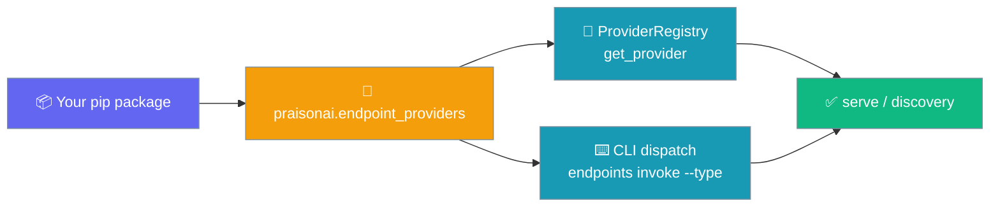
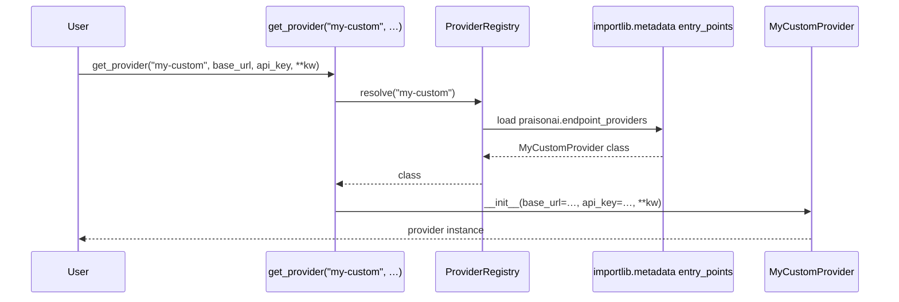
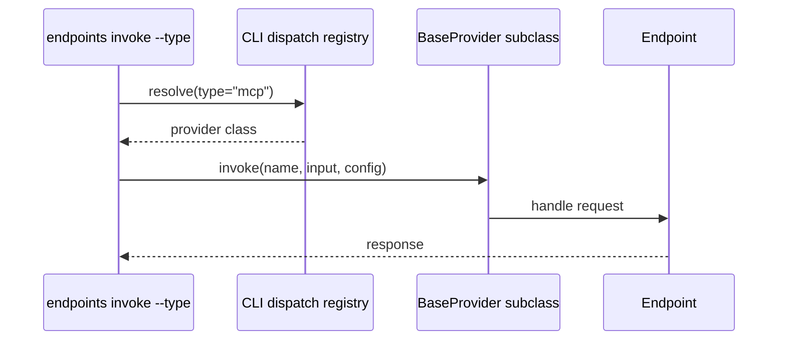
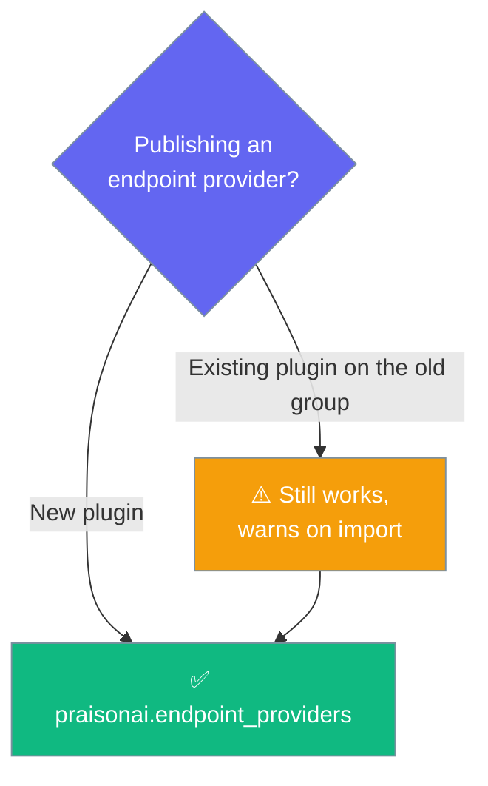

```python
from praisonaiagents import Agent

agent = Agent(
    name="Endpoint Agent",
    instructions="Invoke the acme endpoint provider and summarise the result."
)

agent.start("Call the acme-echo endpoint with {'x': 1}")
```


Endpoint Provider Registry lets you plug custom server-side providers (recipe, agents-api, MCP, A2A, `openai-compat`, and your own) into PraisonAI via a **single** Python entry-point group — no fork required.

Publish once under `praisonai.endpoint_providers`. One plugin is then visible to `get_provider()`, `praisonai endpoints types`, **and** `praisonai endpoints invoke --type`.

```bash
export PRAISON_ENDPOINT_URL="http://localhost:8765"
praisonai serve --endpoint mcp
```

```python
from praisonai.endpoints.registry import get_provider

provider = get_provider("mcp", base_url="http://localhost:8765")
```

A plugin published once under `praisonai.endpoint_providers` reaches both the provider registry and the CLI dispatch surface.


```mermaid
graph LR
    A[📦 Your pip package] --> B[🔌 praisonai.endpoint_providers]
    B --> C[📝 ProviderRegistry<br/>get_provider]
    B --> D[⌨️ CLI dispatch<br/>endpoints invoke --type]
    C --> E[✅ serve / discovery]
    D --> E

    classDef package fill:#6366F1,stroke:#7C90A0,color:#fff
    classDef entrypoint fill:#F59E0B,stroke:#7C90A0,color:#fff
    classDef registry fill:#189AB4,stroke:#7C90A0,color:#fff
    classDef done fill:#10B981,stroke:#7C90A0,color:#fff

    class A package
    class B entrypoint
    class C,D registry
    class E done
```

## Quick Start

<Steps>
<Step title="Use a built-in provider">

```python
from praisonai.endpoints.registry import get_provider

provider = get_provider("recipe", base_url="http://localhost:8765")
```

</Step>

<Step title="Register at runtime">

```python
from praisonai.endpoints.registry import register_provider
from praisonai.endpoints.providers.base import BaseProvider

class MyCustomProvider(BaseProvider):
    def __init__(self, base_url, api_key=None, **kwargs):
        self.base_url = base_url
        self.api_key = api_key

register_provider("my-custom", MyCustomProvider)
provider = get_provider("my-custom", base_url="http://localhost:8765")
```

</Step>

<Step title="Distribute as a pip plugin">

```toml
# pyproject.toml
[project.entry-points."praisonai.endpoint_providers"]
my-custom = "mypkg.endpoints:MyCustomProvider"
```

```bash
pip install my-praisonai-endpoint
```

</Step>
</Steps>

---

## How It Works


```mermaid
sequenceDiagram
    participant User
    participant API as get_provider("my-custom", …)
    participant Reg as ProviderRegistry
    participant EP as importlib.metadata entry_points
    participant Cls as MyCustomProvider

    User->>API: get_provider("my-custom", base_url, api_key, **kw)
    API->>Reg: resolve("my-custom")
    Reg->>EP: load praisonai.endpoint_providers
    EP-->>Reg: MyCustomProvider class
    Reg-->>API: class
    API->>Cls: __init__(base_url=…, api_key=…, **kw)
    Cls-->>User: provider instance
```

The registry is thread-safe and loads plugins lazily. Built-ins are discovered on first access, entry points are loaded when needed, and aliases are case-insensitive. The singleton registry is obtained via `get_default_registry()`.

---

## One Group, Two Readers

There is **one** canonical entry-point group: `praisonai.endpoint_providers`. Two readers scan it — the top-level **provider registry** (instantiates `BaseProvider` classes for serve / discovery) and the **CLI dispatch registry** (resolves `endpoints invoke --type`). One plugin contract serves both surfaces; the CLI adapts your `BaseProvider` subclass into its internal dispatch shape.

| Reader | Surface it powers |
|--------|-------------------|
| `praisonai.endpoints.registry.get_provider()` | `praisonai serve`, discovery |
| CLI dispatch registry | `praisonai endpoints invoke --type`, `praisonai endpoints types` |

### Built-in Dispatch Keys

| Key | Provider | Notes |
|-----|----------|-------|
| `recipe` | Recipe runner | Default when `--type` is omitted |
| `agents-api` | Agents API | OpenAI Agents-API compatible |
| `mcp` | MCP server | MCP server endpoint |
| `tools-mcp` | MCP tools-only | Tools exposed as MCP |
| `a2a` | A2A protocol | Agent-to-agent |
| `a2u` | A2U protocol | Agent-to-user |
| `openai-compat` | OpenAI-compatible HTTP | `/v1/chat/completions`, `/v1/completions`, `/v1/models`, `/v1/tools/invoke` |


```mermaid
sequenceDiagram
    participant CLI as endpoints invoke --type
    participant Reg as CLI dispatch registry
    participant Prov as BaseProvider subclass
    participant EP as Endpoint

    CLI->>Reg: resolve(type="mcp")
    Reg-->>CLI: provider class
    CLI->>Prov: invoke(name, input, config)
    Prov->>EP: handle request
    EP-->>CLI: response
```

<Warning>
`praisonai.endpoints.providers` is a **deprecated alias**. It is still scanned, but importing a plugin published under it emits a `DeprecationWarning` naming the canonical group. On a name clash the canonical group wins. Publish new plugins under `praisonai.endpoint_providers`.
</Warning>

### Which Group Do I Publish Under?


```mermaid
graph TB
    Q{Publishing an<br/>endpoint provider?} -->|New plugin| CANON[✅ praisonai.endpoint_providers]
    Q -->|Existing plugin on the old group| MIG[⚠️ Still works,<br/>warns on import]
    MIG --> CANON

    classDef q fill:#6366F1,stroke:#7C90A0,color:#fff
    classDef warn fill:#F59E0B,stroke:#7C90A0,color:#fff
    classDef ok fill:#10B981,stroke:#7C90A0,color:#fff

    class Q q
    class MIG warn
    class CANON ok
```

---

## Migration From the Deprecated Group

Rename the entry-point group in your `pyproject.toml`. The class and its methods are unchanged.

<CodeGroup>
```toml pyproject.toml (canonical)
[project.entry-points."praisonai.endpoint_providers"]
my-custom = "mypkg.endpoints:MyCustomProvider"
```

```toml pyproject.toml (deprecated — warns)
[project.entry-points."praisonai.endpoints.providers"]
my-custom = "mypkg.endpoints:MyCustomProvider"
```
</CodeGroup>

**Constants** exported by `praisonai/endpoints/registry.py`:

| Name | Value |
|------|-------|
| `ENTRY_POINT_GROUP` | `"praisonai.endpoint_providers"` |
| `LEGACY_ENTRY_POINT_GROUPS` | `("praisonai.endpoints.providers",)` |

---

## Streaming

Implement `invoke_stream` — **not** `invoke(stream=True)` — to support `--stream`. When `--stream` is passed the CLI adapter calls `provider.invoke_stream(name, input_data, config)`, which yields `{"event": ..., "data": ...}` frames. An `event == "error"` frame prints the error and returns exit code `3` (runtime error); other frames print as `[event] data` and it returns `0`.

```python
from typing import Any, Dict, Iterator, Optional
from praisonai.endpoints.providers.base import BaseProvider, InvokeResult

class MyStreamingProvider(BaseProvider):
    def invoke(self, name, input_data=None, config=None, stream=False) -> InvokeResult:
        return InvokeResult(ok=True, status="success", data={"echo": input_data})

    def invoke_stream(
        self,
        name: str,
        input_data: Optional[Dict[str, Any]] = None,
        config: Optional[Dict[str, Any]] = None,
    ) -> Iterator[Dict[str, Any]]:
        yield {"event": "start", "data": {"name": name}}
        yield {"event": "token", "data": "hello"}
        yield {"event": "done", "data": "[DONE]"}
```

```bash
praisonai endpoints invoke chat_completions --type openai-compat \
  --input-json '{"messages": [{"role": "user", "content": "Hi"}]}' \
  --stream
```

---

## Configuration / API

### Functions

| Function / Method | Signature | Description |
|---|---|---|
| `register_provider(type, cls)` | `(str, Type[BaseProvider]) -> None` | Backwards-compat module function; delegates to `get_default_registry().register(...)` |
| `get_provider(type, base_url, api_key, **kw)` | `(str, str, Optional[str], **Any) -> Optional[BaseProvider]` | Resolve + instantiate; returns `None` for unknown type; raises if loader fails |
| `list_provider_types()` | `() -> List[str]` | List registered + entry-point + built-in types |
| `get_provider_class(type)` | `(str) -> Optional[Type[BaseProvider]]` | Returns the class without instantiating |
| `get_default_registry()` | `() -> ProviderRegistry` | Thread-safe singleton accessor |

### ProviderRegistry Class

| Method | Signature | Description |
|---|---|---|
| `ProviderRegistry.get(type, base_url, api_key, **kw)` | identical to `get_provider` | OOP-style interface |
| `ProviderRegistry.list_types()` | `() -> List[str]` | Back-compat alias for `list_names()` |
| `ProviderRegistry.get_class(type)` | `(str) -> Optional[Type]` | Back-compat alias for `resolve()` |

### Built-in Provider Types

| Type | Loaded From | Purpose |
|---|---|---|
| `recipe` | `endpoints/providers/recipe.py` | Recipe runner endpoint |
| `agents-api` | `endpoints/providers/agents_api.py` | OpenAI Agents-API compatible endpoint |
| `mcp` | `endpoints/providers/mcp.py` | MCP server endpoint |
| `tools-mcp` | `endpoints/providers/tools_mcp.py` | MCP tools-only endpoint |
| `a2a` | `endpoints/providers/a2a.py` | A2A protocol endpoint |
| `a2u` | `endpoints/providers/a2u.py` | A2U protocol endpoint |
| `openai-compat` | `endpoints/providers/openai_compat.py` | OpenAI-compatible HTTP endpoint |

---

## Common Patterns

<AccordionGroup>
<Accordion title="Override a Built-in (runtime only)">
The runtime `register_provider()` path is last-write-wins — it can replace a built-in in the current process:

```python
from praisonai.endpoints.registry import register_provider
from praisonai.endpoints.providers.base import BaseProvider

class MyRecipeProvider(BaseProvider):
    def __init__(self, base_url, api_key=None, **kwargs):
        # Custom implementation
        pass

# Override built-in recipe provider at runtime
register_provider("recipe", MyRecipeProvider)
```

<Note>
A **pip-installed plugin cannot** override a built-in. The CLI dispatch registry re-asserts its built-in loaders *after* entry-point discovery, so an entry point may add a new type but never replace a shipped one (`recipe`, `mcp`, `openai-compat`, …). This inverts the base `PluginRegistry` precedence, where entry points normally override built-ins. Only the runtime `register_provider()` call above overrides.
</Note>
</Accordion>

<Accordion title="Multiple Aliases">
Use the underlying PluginRegistry for alias support:

```python
from praisonai.endpoints.registry import get_default_registry

registry = get_default_registry()
registry.register_lazy("my-provider", lambda: MyProvider, aliases=["mp", "custom"])
```
</Accordion>

<Accordion title="Per-tenant Isolation">
Instantiate `ProviderRegistry` directly for isolation:

```python
from praisonai.endpoints.registry import ProviderRegistry

# Tenant-specific registry
tenant_registry = ProviderRegistry()
tenant_registry.register("custom", TenantProvider)
```
</Accordion>
</AccordionGroup>

---

## Best Practices

<AccordionGroup>
<Accordion title="Always provide a _loader() function">
Never import your provider class at module top-level — defeats lazy loading and breaks the no-heavy-deps-at-import-time guarantee:

```python
# Good - lazy loader
def _load_my_provider():
    from .heavy_dependency import MyProvider
    return MyProvider

# Bad - top-level import
from .heavy_dependency import MyProvider  # Loaded immediately!
```
</Accordion>

<Accordion title="Subclass BaseProvider">
Required for type compatibility and consistent API:

```python
from praisonai.endpoints.providers.base import BaseProvider

class MyProvider(BaseProvider):
    def __init__(self, base_url, api_key=None, **kwargs):
        super().__init__(base_url, api_key, **kwargs)
```
</Accordion>

<Accordion title="Distinguish missing vs import failure">
`get_provider("unknown")` returns `None`, but import failures propagate:

```python
provider = get_provider("unknown")
if provider is None:
    print("Provider type not registered")
    
try:
    provider = get_provider("registered-but-missing-deps")
except ValueError as e:
    print(f"Provider exists but dependencies missing: {e}")
```
</Accordion>

<Accordion title="Prefer entry points for distributable packages">
Use `pyproject.toml` entry points instead of `register_provider()` calls:

```toml
# Preferred - discoverable via pip install
[project.entry-points."praisonai.endpoint_providers"]
my-provider = "my_package.providers:MyProvider"

# Avoid - requires explicit registration
# register_provider("my-provider", MyProvider)
```
</Accordion>
</AccordionGroup>

---

## Related

<CardGroup cols={2}>
<Card title="Integration Registry" icon="puzzle-piece" href="/features/integration-registry">
  The sibling plugin registry for CLI tools / managed agents
</Card>
<Card title="Framework Adapter Plugins" icon="code" href="/features/framework-adapter-plugins">
  Third sibling plugin registry, for framework adapters
</Card>
</CardGroup>