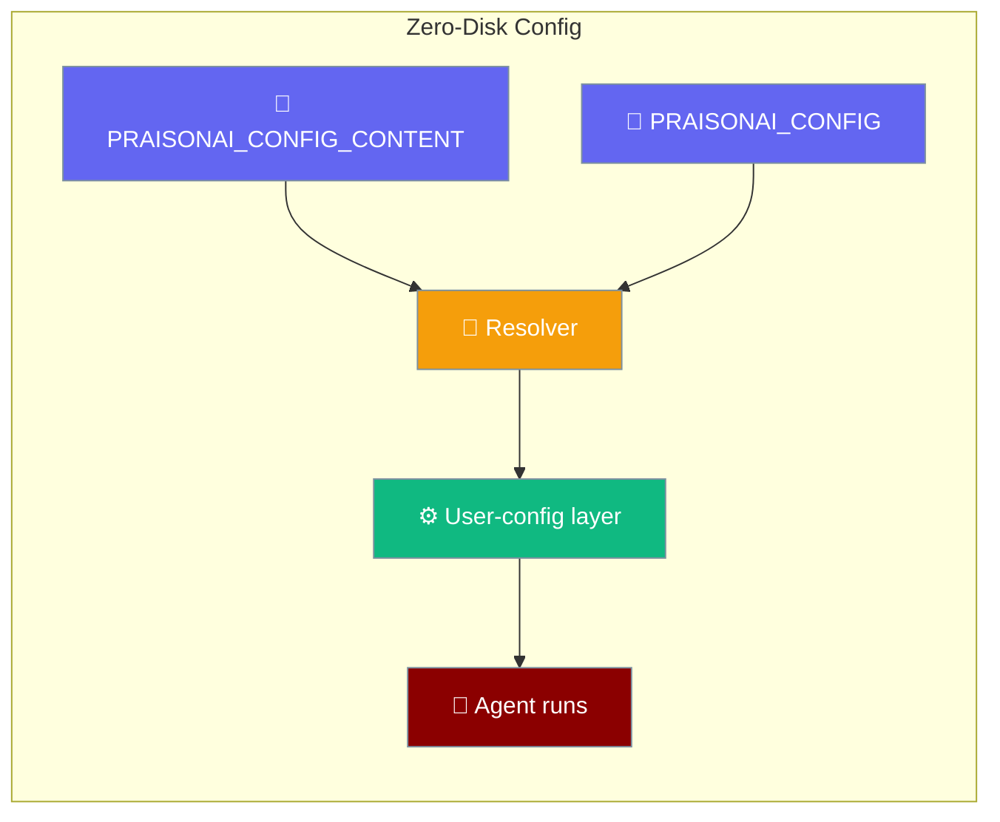
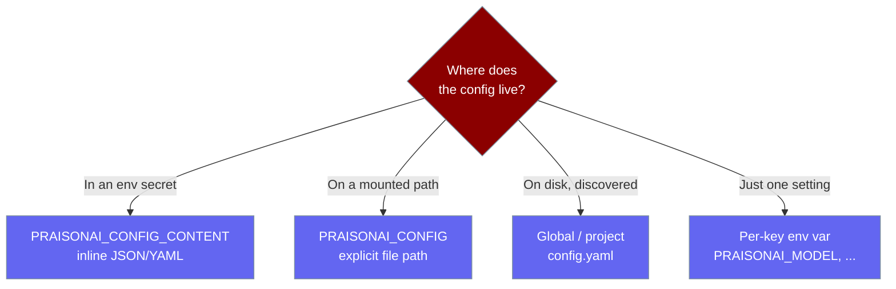
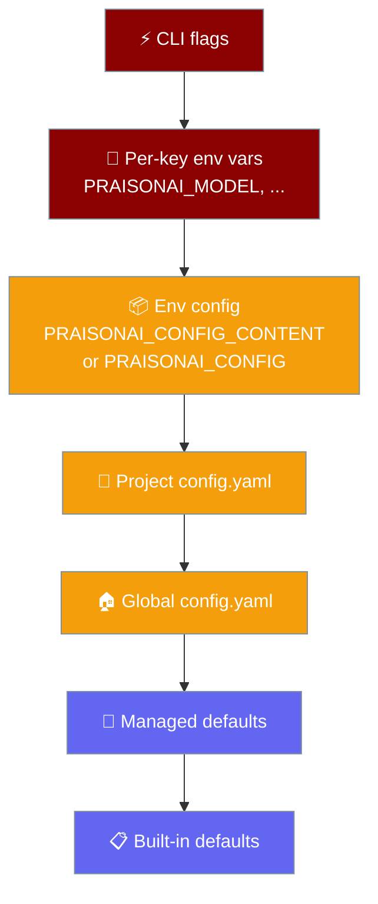

Supply the whole user-config layer from a single environment variable — no `config.yaml` is read or written to disk. Pairs with `PRAISONAI_AUTH_CONTENT` so one CI secret set provides auth **and** config for a stateless run.



## Quick Start

<Steps>
<Step title="Inline (YAML)">

```bash
export PRAISONAI_CONFIG_CONTENT='agent:
  model: gpt-4o-mini
permissions:
  deny:
    - "rm -rf /"'

praisonai run "Summarise this repo"
```

```python
from praisonaiagents import Agent

# Model + permissions come from PRAISONAI_CONFIG_CONTENT — no ~/.praisonai/config.yaml
agent = Agent(name="assistant", instructions="Be helpful.")
agent.start("What model am I using?")
```

</Step>

<Step title="Inline (JSON)">

```bash
export PRAISONAI_CONFIG_CONTENT='{"agent":{"model":"gpt-4o-mini"},"mcp":{"srv":{"url":"https://mcp.example.com"}}}'
praisonai run "List MCP tools"
```

</Step>

<Step title="Explicit path (PRAISONAI_CONFIG)">

```bash
export PRAISONAI_CONFIG=/etc/praisonai/prod.yaml
praisonai run "Ship it"
```

</Step>

<Step title="Auth + config in one env set (zero-disk CI)">

```bash
export PRAISONAI_AUTH_CONTENT='{"openai":{"api_key":"sk-...","auth_method":"apikey"}}'
export PRAISONAI_CONFIG_CONTENT='agent:
  model: gpt-4o-mini'
praisonai run "Run my CI task"
# Nothing is written to ~/.praisonai — both auth and config live in memory only.
```

</Step>
</Steps>

---

## Which one should I use?

Pick the source that matches where your config already lives.



---

## Precedence

The env-config layer occupies the **same slot** as the discovered global/project files, so higher layers still win.



Key rules:

- `PRAISONAI_CONFIG_CONTENT` (inline) **wins over** `PRAISONAI_CONFIG` (path) — inline replaces the path layer entirely.
- When either is set, no global/project `config.yaml` on disk is read for the user-config layer.
- Per-key env vars (`PRAISONAI_MODEL`, `OPENAI_API_BASE`, …) and CLI flags still override the env blob.
- Managed policy (`permissions`, `model_allowlist`) is still enforced on top.

<Warning>
A valid empty mapping (`{}`) is **authoritative** — it suppresses file discovery instead of falling back. Only invalid blobs (non-mapping / unparseable) warn and fall back to discovery.
</Warning>

---

## Configuration Options

| Variable | Type | Default | Description |
|----------|------|---------|-------------|
| `PRAISONAI_CONFIG_CONTENT` | inline JSON or YAML blob | unset | Parsed in memory as the user-config layer. Supports `${VAR}` / `{env:VAR}` / `{file:...}` interpolation, same as an on-disk file. |
| `PRAISONAI_CONFIG` | file path | unset | Explicit config file loaded in place of global/project discovery. Ignored when `PRAISONAI_CONFIG_CONTENT` is set. |

---

## Provenance

See which layer supplied each key with the `env-config:` label.

```bash
praisonai config show --sources
# agent.model            env-config:env:PRAISONAI_CONFIG_CONTENT
# permissions.deny       env-config:env:PRAISONAI_CONFIG_CONTENT
```

```python
from praisonai_code.cli.configuration.resolver import ConfigResolver

prov = ConfigResolver().resolve_with_provenance()
print(prov["agent.model"]["layer"])   # -> "env-config"
```

---

## Fallback & Warning Behaviour

| Situation | Behaviour |
|-----------|-----------|
| `PRAISONAI_CONFIG_CONTENT` is not valid JSON/YAML | `UserWarning` (`Ignoring PRAISONAI_CONFIG_CONTENT: value is not valid JSON/YAML.`), fall back to file discovery |
| `PRAISONAI_CONFIG_CONTENT` parses to a list/scalar (not a mapping) | `UserWarning` (`value must be a mapping.`), fall back to file discovery |
| `PRAISONAI_CONFIG_CONTENT` is `{}` (empty mapping) | Authoritative — file discovery is **not** re-enabled |
| `PRAISONAI_CONFIG` points at a missing file | `UserWarning`, fall back to file discovery |
| `PRAISONAI_CONFIG` points at a valid but non-mapping file | `UserWarning`, fall back to file discovery |
| `PRAISONAI_CONFIG` points at an empty (valid-YAML) file | Authoritative — file discovery is **not** re-enabled |

---

## Best Practices

<AccordionGroup>
<Accordion title="🔒 Treat the blob as a secret">
It can contain provider URLs, tenant IDs, and deny rules. Inject only from a secrets manager; never commit it.
</Accordion>

<Accordion title="📦 Compose with PRAISONAI_AUTH_CONTENT">
An auth blob plus a config blob together give a true zero-disk run — nothing touches `~/.praisonai`.
</Accordion>

<Accordion title="🧭 Use PRAISONAI_CONFIG for mounted volumes">
Kubernetes ConfigMaps mounted as files pair naturally with the explicit path variable.
</Accordion>

<Accordion title="🧪 Verify with praisonai config show --sources">
The `env-config:` label confirms the env layer won for each key.
</Accordion>
</AccordionGroup>

---

## Related

<CardGroup cols={2}>
<Card title="CLI Configuration" icon="gear" href="/features/cli-configuration">
The full layered precedence hierarchy.
</Card>
<Card title="Security Environment Variables" icon="shield" href="/features/security-environment-variables">
`PRAISONAI_AUTH_CONTENT` and other security env vars.
</Card>
<Card title="Managed Config Layer" icon="building" href="/features/managed-config">
Org-enforced policy on top of every layer.
</Card>
<Card title="XDG Base Directories" icon="folder-tree" href="/features/xdg-base-directories">
Where PraisonAI writes its persistent state.
</Card>
</CardGroup>
