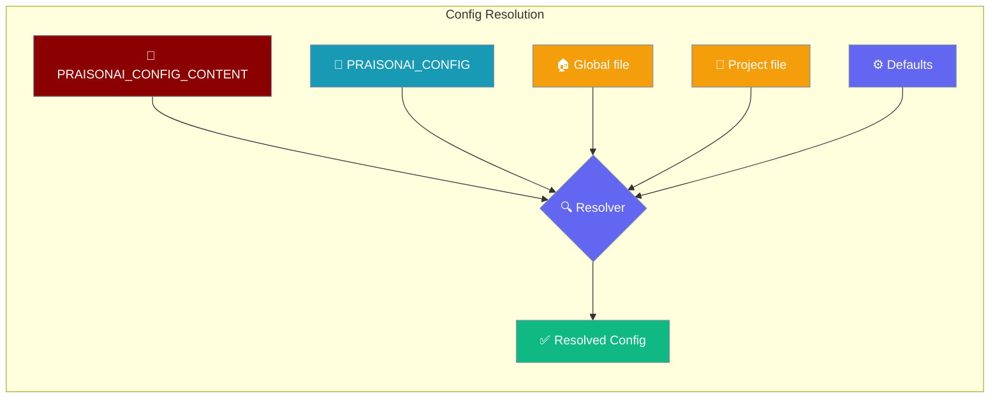
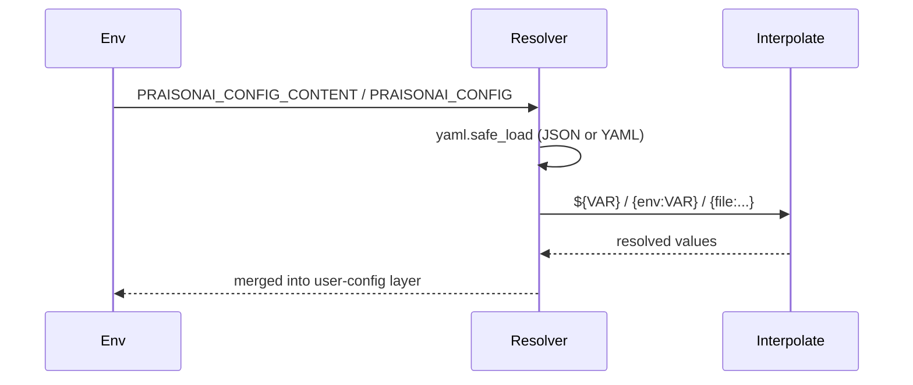

Supply the entire user-config layer from an environment variable, so containers and CI runners need nothing written to disk.



## Quick Start

<Steps>
<Step title="Inline YAML via PRAISONAI_CONFIG_CONTENT">

Pass the whole config as an inline blob — ideal for Docker and CI where no file exists:

```bash
export PRAISONAI_CONFIG_CONTENT='
agent:
  model: gpt-4o
output: verbose
'
praisonai "Summarise today's changes"
```

</Step>

<Step title="Explicit path via PRAISONAI_CONFIG">

Point at a specific config file instead of the discovered global/project files:

```bash
export PRAISONAI_CONFIG=/etc/praisonai/config.yaml
praisonai "Summarise today's changes"
```

</Step>

<Step title="Interpolate secrets and files">

Values support `${VAR}`, `{env:VAR}`, and `{file:...}` so secrets stay out of the blob:

```bash
export OPENAI_API_KEY=sk-...
export PRAISONAI_CONFIG_CONTENT='
agent:
  model: gpt-4o
  api_key: ${OPENAI_API_KEY}
  system_prompt: "{file:/run/secrets/prompt.txt}"
'
praisonai "Run the pipeline"
```

</Step>
</Steps>

---

## How It Works

Both JSON and YAML parse through `yaml.safe_load`, then interpolation runs before the blob joins the resolution ladder.



Both variables fill the **user-config layer** — the same slot the discovered global/project file would occupy. When either is set, no global or project file is read for that layer.

| Setting | Purpose |
|---------|---------|
| `PRAISONAI_CONFIG_CONTENT` | Inline JSON/YAML blob parsed in memory |
| `PRAISONAI_CONFIG` | Explicit path to a config file |

---

## Precedence

Higher layers win. The env-config sources sit in the user-config layer, below per-key env vars and CLI flags.

| Layer | Source | Wins Over |
|-------|--------|-----------|
| 1 | Defaults | — |
| 2 | Managed defaults | Defaults |
| 3 | **User-config layer** (env-config or file discovery) | Managed defaults |
| 4 | Per-key environment variables | User-config layer |
| 5 | CLI arguments | Per-key env vars |
| 6 | Managed policy | Everything |

Within the user-config layer, inline content beats an explicit path, which beats global-file discovery, which beats project-file discovery:

```
PRAISONAI_CONFIG_CONTENT  >  PRAISONAI_CONFIG  >  global file  >  project file
```

<Note>
When the blob is invalid JSON/YAML, or `PRAISONAI_CONFIG` points at a missing file, the resolver warns and falls back to normal file discovery. Behaviour is unchanged when neither variable is set.
</Note>

---

## Common Patterns

### Docker / Kubernetes secret mount

Mount the config as a secret and export it — nothing is written to the image:

```yaml
env:
  - name: PRAISONAI_CONFIG_CONTENT
    valueFrom:
      secretKeyRef:
        name: praisonai-config
        key: config.yaml
```

### GitHub Actions runner

Ship one variable to the job; no `~/.praisonai/` needs to exist:

```yaml
- name: Run agent
  env:
    PRAISONAI_CONFIG_CONTENT: |
      agent:
        model: gpt-4o
      output: silent
  run: praisonai "Analyse the diff"
```

### Ephemeral container with no writable home

Inline content avoids any filesystem write on a read-only container:

```bash
docker run --read-only \
  -e PRAISONAI_CONFIG_CONTENT="$(cat config.yaml)" \
  praisonai "Run once and exit"
```

---

## User Interaction Flow

A team lead ships one environment variable to the CI container. The runner has no `~/.praisonai/` and never writes one — the resolver reads `PRAISONAI_CONFIG_CONTENT`, interpolates any `${VAR}` secrets from the job's environment, and runs the agent with the team's model and output settings. Removing the variable restores default file discovery with no code change.

<Note>
`PRAISONAI_AUTH_CONTENT` is the credentials-only sibling. Use it to inject the auth layer the same way, so a single CI secret set can supply both config and credentials with nothing on disk.
</Note>

---

## Best Practices

<AccordionGroup>
<Accordion title="Keep secrets out of the blob">
Reference secrets with `${VAR}` or `{file:/run/secrets/...}` instead of pasting them inline, so the config blob stays safe to log.
</Accordion>

<Accordion title="Prefer inline content for stateless runners">
`PRAISONAI_CONFIG_CONTENT` needs no writable filesystem, making it ideal for read-only containers and ephemeral CI.
</Accordion>

<Accordion title="Use explicit paths for mounted volumes">
When a config file is already mounted, `PRAISONAI_CONFIG` points at it directly and skips global/project discovery.
</Accordion>

<Accordion title="Rely on graceful fallback">
An invalid blob or missing path warns and falls back to file discovery, so a typo never hard-fails a run.
</Accordion>
</AccordionGroup>

---

## Related

<CardGroup cols={2}>
<Card title="OutputConfig" icon="terminal" href="/configuration/output-config">
  Control agent output verbosity and formatting
</Card>
<Card title="XDG Paths" icon="folder-tree" href="/features/xdg-paths">
  Where config, data, state, and cache live
</Card>
</CardGroup>
