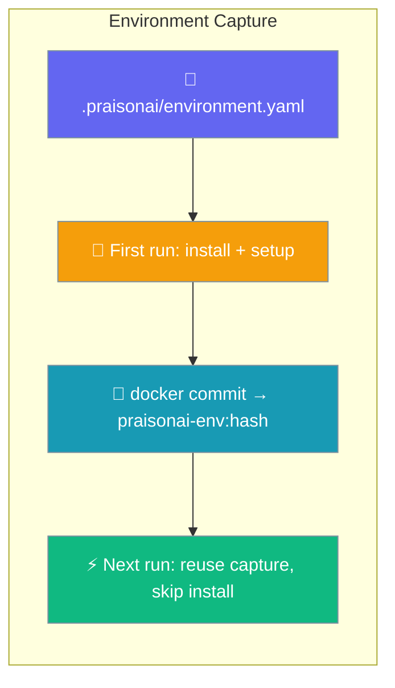
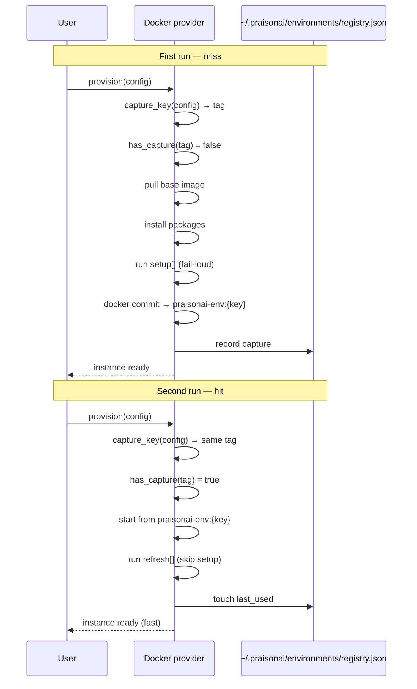
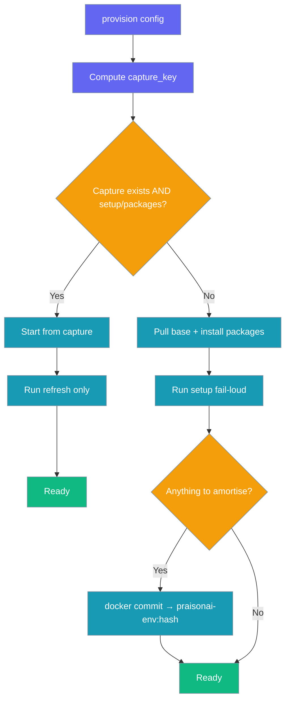
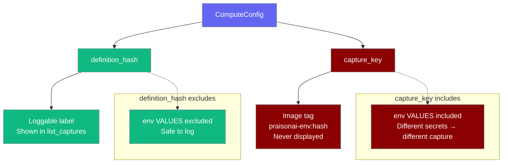

The docker backend commits your provisioned environment after `setup:` runs, then reuses it on the next run — no pull, no install, no setup.



## Quick Start

<Steps>
<Step title="Add setup: to your environment file">
Capture happens automatically — there is nothing to configure. Commit `.praisonai/environment.yaml` with a `setup:` step.

```yaml
# .praisonai/environment.yaml
image: python:3.12-slim
packages:
  pip: [pytest]
setup:
  - pip install -e .
```
</Step>

<Step title="Run twice — the second run is fast">
The first run installs and sets up, then commits the container. The second run starts straight from the capture.

```python
from praisonai import LocalAgent, LocalAgentConfig
from praisonaiagents import Agent

local = LocalAgent(compute="docker", config=LocalAgentConfig(model="gpt-4o-mini"))
agent = Agent(name="assistant", backend=local)

# First run: pulls image, installs pytest, runs setup, then commits to praisonai-env:{key}
agent.start("Run the test suite")

# Second run: starts directly from praisonai-env:{key} — no pull, no install, no setup
agent.start("Run the test suite again")
```
</Step>

<Step title="Add refresh: for cheap incremental steps (optional)">
`refresh:` runs only on a reuse — perfect for a re-editable install that picks up code changes.

```yaml
# .praisonai/environment.yaml
image: python:3.12-slim
packages:
  pip: [pytest]
setup:
  - pip install -e .
refresh:
  - pip install -e .
```
</Step>
</Steps>

---

## How It Works

The backend computes a reuse key from your definition, checks for a matching capture, and either reuses it or builds a fresh one.



| Aspect | Detail |
|--------|--------|
| **Trigger** | Automatic on docker when there is `setup:` or `packages:` to amortise |
| **Key** | `capture_key(config)` — a 12-char hash that binds env values |
| **Image tag** | `praisonai-env:{key}` |
| **Registry** | `~/.praisonai/environments/registry.json` |
| **Fallback** | A failed commit warns and degrades to today's ephemeral behaviour |

---

## Reuse Decision

The backend follows this exact contract on every provision.

1. Compute `capture_key(config)` → look up `praisonai-env:{key}`.
2. **Hit** (capture exists AND there was `setup:` or `packages:` to amortise) → start container from the capture; run **only** `refresh:` (if any); update `last_used`; skip commit.
3. **Miss** (no capture, or nothing to amortise) → pull base image; install packages; run `setup:`; commit to `praisonai-env:{key}` (if there was setup/packages).
4. Any commit failure → warn and degrade to ephemeral. The run never blocks.
5. Any change to the definition → new `capture_key` → miss → full rebuild and new capture. The old capture stays until pruned.



---

## The Two Hashes

You will see two different 12-char strings — one is safe to log, the other never leaves the machine.



| Function | Includes | Excludes | Safe to log? | Purpose |
|----------|----------|----------|--------------|---------|
| `definition_hash(config)` | image, packages, setup, **env variable names**, cpu, memory_mb, gpu, working_dir | `env` values | **Yes** — no secrets | Non-sensitive display label shown in `list_captures()` and logs |
| `capture_key(config)` | Everything above, **plus `env` values** | — | **No** — never surface | Actual reuse key baked into the image tag `praisonai-env:{key}` |

Your `setup:` runs with `env` values injected and may bake env-derived state into the filesystem (tokens, tenant config). A capture is only safe to reuse when those values match too — but the reuse key must never leak the secrets. So `capture_key` binds values (used as the tag) while `definition_hash` stays value-free (used as the loggable label).

Both are stable and order-insensitive: reordering keys or list entries yields the same hash.

```python
from praisonaiagents.managed import (
    ComputeConfig,
    definition_hash,
    capture_key,
)

cfg = ComputeConfig(
    image="python:3.12-slim",
    packages={"pip": ["pytest"]},
    setup=["pip install -e ."],
    env={"TOKEN": "secret"},
)

print("Loggable label:", definition_hash(cfg))   # safe to display
print("Image tag suffix:", capture_key(cfg))      # never display — binds secrets
```

---

## Secrets are scrubbed from captured images

`capture()` blanks every forwarded secret out of the committed image, so a `praisonai-env:{key}` image never contains the model API keys used during setup.

`docker commit` preserves `Config.Env`, so before PR #4107 every forwarded key — plus any name you put in `ComputeConfig.env` — was baked into the image and persisted for days, readable by anyone who could run `docker inspect`. The capture is meant to reuse the installed *packages*, not the credentials that happened to be in the environment when they were installed.

`capture()` now computes the union of the fixed `_FORWARDED_SECRETS` set and your `config.env` keys, then passes `changes=["ENV KEY=" for KEY in names]` to `docker commit` — blanking each value in the committed image.

```python
import subprocess

# After a capture, the forwarded keys are present but empty:
subprocess.run(
    ["docker", "inspect", "-f", "{{json .Config.Env}}", "praisonai-env:<key>"]
)
# → "OPENAI_API_KEY=", "ANTHROPIC_API_KEY=", ... (values blanked)
```

`_FORWARDED_SECRETS` in `praisonai_sandbox.compute.docker` is the source of truth for which names are scrubbed by default. It is kept in step with `ComputeManagedAgent._KEY_VARS` and covers:

`OPENAI_API_KEY`, `ANTHROPIC_API_KEY`, `GEMINI_API_KEY`, `GOOGLE_API_KEY`, `GROQ_API_KEY`, `MISTRAL_API_KEY`, `COHERE_API_KEY`, `OPENROUTER_API_KEY`, `DEEPSEEK_API_KEY`, `XAI_API_KEY`, `OPENAI_BASE_URL`, `OPENAI_API_BASE`, `E2B_API_KEY`, `DAYTONA_API_KEY`, `NOVITA_API_KEY`, `TENKI_API_KEY`, `FLY_API_TOKEN`, `MODAL_TOKEN_ID`, `MODAL_TOKEN_SECRET` — plus every name in your `ComputeConfig.env`.

<Warning>
Images captured **before** this fix still hold the keys. On older versions, prune every stale `praisonai-env:*` image and re-run your pipeline to regenerate a clean capture:

```bash
docker image prune -f
docker images "praisonai-env:*"   # confirm none remain
```
</Warning>

---

## `refresh:` — the incremental step

`refresh:` runs a cheap post-provision step only when the container was started from a capture.

- Accepts a `str` or `List[str]`; a scalar is normalised to `[scalar]`.
- Runs **only** on a reuse. It is skipped on a fresh (miss) provision because `setup:` already runs there.
- Fail-loud — a failing command raises, exactly like `setup:`.

```yaml
# .praisonai/environment.yaml
image: python:3.12-slim
packages:
  pip: [pytest]
setup:                  # runs once, on first provision
  - pip install -e .
refresh:                # runs on every reuse
  - pip install -e .
```

---

## `capture:` — the opt-in flag

`capture:` gates capture on backends where a snapshot carries provider cost.

- Local docker capture always runs when there is work to amortise — docker ignores this flag.
- Cloud backends (where a snapshot may cost money) are opt-in and off by default; set `capture: true` to enable.

```yaml
# .praisonai/environment.yaml
image: python:3.12-slim
packages:
  pip: [pytest]
setup:
  - pip install -e .
backend: e2b
capture: true           # local docker is always-on; cloud backends need this flag
```

---

## Managing Captures

Inspect and prune captures with `list_captures()` and `prune_captures()`.

```python
from praisonai_sandbox.compute import DockerCompute
# Backward-compatible alias (still works):
# from praisonai.integrations.compute import DockerCompute

compute = DockerCompute()

# List everything currently captured
for entry in compute.list_captures():
    print(entry["hash"], entry["ref"], "last_used=", entry["last_used"])

# Remove captures unused for more than a day (default is 14 days)
pruned = compute.prune_captures(max_age_s=24 * 3600)
print(f"Pruned {len(pruned)} captures")
```

The registry lives at `~/.praisonai/environments/registry.json` and records each capture:

```json
{
  "a1b2c3d4e5f6": {
    "backend": "docker",
    "ref": "praisonai-env:a1b2c3d4e5f6",
    "definition": "1122334455aa",
    "created_at": 1734567890.12,
    "last_used": 1734567890.99
  }
}
```

The map key and the `ref` tag suffix are the secret-aware `capture_key`; `definition` is the loggable `definition_hash` shown by `list_captures()`. `prune_captures()` removes captures whose `last_used` is older than `max_age_s` (default **14 days** = `14 * 24 * 3600` seconds), deleting both the docker image and the registry entry, and returns the pruned keys.

---

## Configuration Options

The two capture keys map onto `ComputeConfig.metadata`.

| YAML key | `ComputeConfig` field | Type | Default |
|----------|-----------------------|------|---------|
| `refresh` | `metadata["refresh"]` | `List[str]` | *unset* |
| `capture` | `metadata["capture"]` | `bool` | *unset* |

<Card title="ComputeConfig reference" icon="code" href="/sdk/reference/typescript/classes/ComputeConfig">
  Full `ComputeConfig` field reference
</Card>

---

## Best Practices

<AccordionGroup>
<Accordion title="Add setup: before you add refresh:">
`refresh:` runs only on a reuse, so it is meaningful only once a capture exists. Start with `setup:`, then add `refresh:` for the cheap step you want on every rerun.
</Accordion>

<Accordion title="Keep secrets in env: — captures never share across differing values">
`capture_key` binds `env` values, so two runs with different secrets get different captures and never share a committed filesystem. The loggable `definition_hash` leaves values out, so nothing sensitive appears in logs.
</Accordion>

<Accordion title="Prune periodically">
The registry is unbounded by default. Call `prune_captures()` in a scheduled job, or rely on the 14-day age-based cleanup.
</Accordion>

<Accordion title="Cloud backends need capture: true">
Local docker capture is free and always on. On cloud backends a snapshot may cost money, so set `capture: true` to opt in.
</Accordion>
</AccordionGroup>

---

## Errors

A failed capture degrades to ephemeral and logs a warning — the run still succeeds.

```text
[docker_compute] capture failed for <id> (ephemeral fallback): <err>
```

When this happens nothing is recorded in the registry, and the next run simply rebuilds.

---

## Related

<CardGroup cols={2}>
<Card title="Environment File" icon="file-code" href="/features/environment-yaml">
  The `.praisonai/environment.yaml` reference — image, packages, setup, refresh, capture
</Card>

<Card title="Local Agent" icon="desktop" href="/features/local-agent">
  Run the agent loop locally with any LLM and cloud-sandboxed tools
</Card>

<Card title="Sandbox Guarantees" icon="shield" href="/features/sandbox-guarantees">
  What each sandbox surface isolates — and what it doesn't
</Card>

<Card title="Where Does It Run?" icon="location-dot" href="/features/where-does-it-run">
  See exactly where thinking and tools execute
</Card>
</CardGroup>
