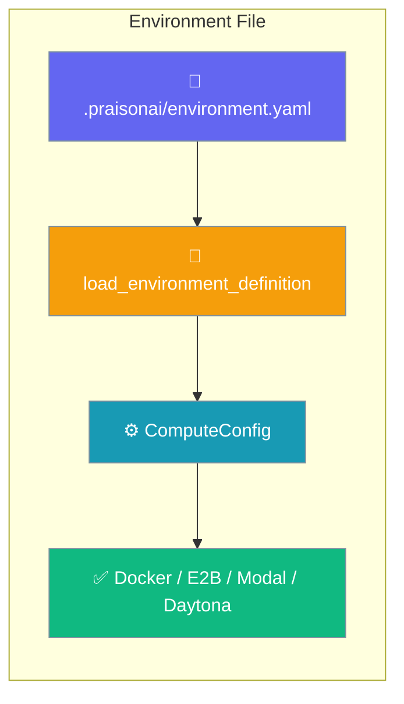
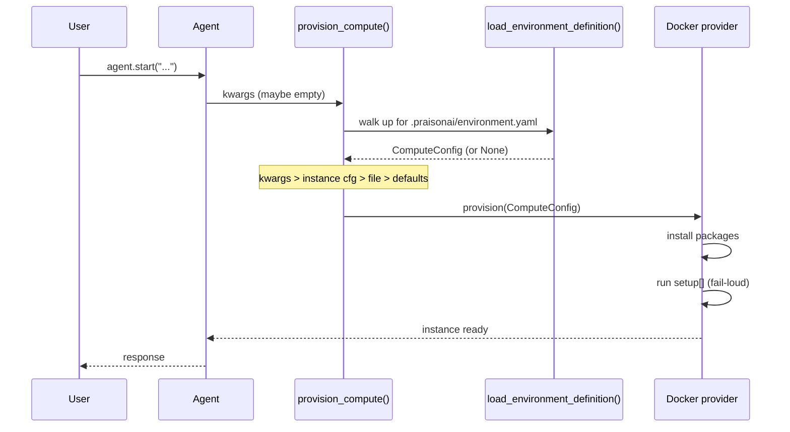
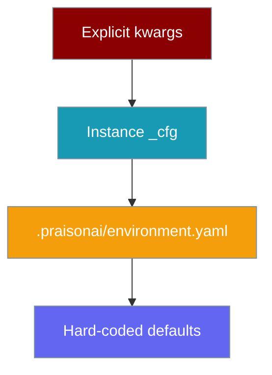
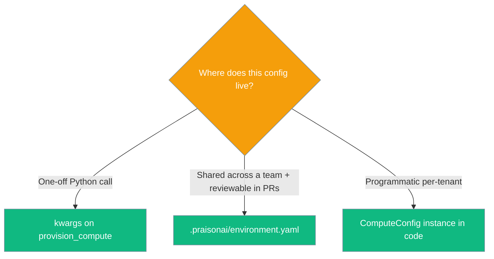

One `.praisonai/environment.yaml` file declares your project's execution environment; every `compute=` backend reads it automatically.



## Quick Start

<Steps>
<Step title="Create the file">
Commit `.praisonai/environment.yaml` at your repo root with an image and one package:

```yaml
# .praisonai/environment.yaml
image: python:3.12-slim
packages:
  pip: [requests]
```
</Step>

<Step title="Enable compute — the file is picked up automatically">
Add `compute="docker"`. No `image` or `packages` kwargs; the file supplies them.

```python
from praisonai import LocalAgent, LocalAgentConfig
from praisonaiagents import Agent

# No image/packages kwargs — the file supplies them
local = LocalAgent(compute="docker", config=LocalAgentConfig(model="gpt-4o-mini"))
agent = Agent(name="assistant", backend=local)
agent.start("Fetch example.com and summarise it")
```
</Step>
</Steps>

---

## How It Works

`provision_compute()` walks up from the current directory, loads the file into a `ComputeConfig`, then provisions the backend.



| Aspect | Detail |
|--------|--------|
| **Location** | `.praisonai/environment.yaml` at (or above) your working directory |
| **Loader** | `load_environment_definition()` returns a `ComputeConfig`, or `None` when no file exists |
| **Consumer** | Every `compute=` backend (Docker, E2B, Modal, Daytona, Flyio, local) |
| **Resolution order** | kwargs > instance cfg > file > defaults |

---

## The Full File

Exactly these top-level keys are accepted; anything else raises `ValueError` with the file path.

```yaml
# .praisonai/environment.yaml
image: python:3.12-slim
packages:
  pip: [pytest, requests]
  apt: [git, curl]
setup:                        # scalar string OR list of strings; scalar is normalised to [scalar]
  - pip install -e .
refresh:                      # optional; runs ONLY on capture-based starts (docker reuse)
  - pip install -e .
capture: true                 # optional; opt-in for cloud backends (docker is always-on)
env:
  PYTHONPATH: src
resources: {cpu: 2, memory_mb: 2048}   # gpu also supported
network: allowlist            # off | allowlist | full   → stored as ComputeConfig.networking = {"type": <value>}
backend: docker               # docker | e2b | modal | daytona | flyio | local → stored as ComputeConfig.metadata["backend"]
working_dir: /workspace
mount_paths: []
```

---

## Configuration Options

Every top-level key maps onto a `ComputeConfig` field.

| YAML key | `ComputeConfig` field | Type | Default |
|----------|-----------------------|------|---------|
| `image` | `image` | `str` | `"python:3.12-slim"` |
| `packages` | `packages` | `Dict[str, List[str]]` | `{}` |
| `setup` | `setup` (**new**) | `List[str]` | `[]` |
| `env` | `env` | `Dict[str, str]` | `{}` |
| `working_dir` | `working_dir` | `str` | `"/workspace"` |
| `mount_paths` | `mount_paths` | `List[str]` | `[]` |
| `resources.cpu` | `cpu` | `int` | `1` |
| `resources.memory_mb` | `memory_mb` | `int` | `1024` |
| `resources.gpu` | `gpu` | `Optional[str]` | `None` |
| `network` | `networking = {"type": <value>}` | `Dict` | `{}` |
| `backend` | `metadata["backend"]` | `str` | *unset* |
| `refresh` | `metadata["refresh"]` | `List[str]` | *unset* |
| `capture` | `metadata["capture"]` | `bool` | *unset* |

<Card title="ComputeConfig fields" icon="code" href="/sdk/reference/typescript/classes/ComputeConfig">
  TypeScript / Python `ComputeConfig` reference
</Card>

---

## Precedence

Explicit kwargs win, then the instance config, then the file, then hard-coded defaults — so no file means today's behaviour, byte-identical.



Pick the surface that matches where your config should live:



---

## `setup:` Commands

`setup:` runs once, post-provision, before any agent work — perfect for bootstrapping the repo.

```yaml
# .praisonai/environment.yaml
image: python:3.12-slim
packages:
  pip: [pytest]
setup:
  - pip install -e .
```

- Runs **once**, after packages install, before the agent starts.
- Output is streamed to logs (`[docker_compute] setup: <cmd>` then `setup output: <stdout>`).
- A failing command **raises** `RuntimeError` — it is not silently swallowed.
- On failure during packages **or** setup, the just-started container is torn down so no orphan is leaked; the caller never receives an `instance_id`.

<Warning>
Do not wrap setup commands in `|| true`. A silent failure leaves a half-built environment; fail-loud surfaces the error immediately.
</Warning>

---

## Faster reruns

The docker backend automatically captures the environment after `setup:` runs and reuses it on the next provision — no pull, no install, no `setup:`. Add `refresh:` if you have a cheap incremental step to run on reuse (e.g. `pip install -e .`).

<Card icon="database" href="/features/environment-capture">
  Reuse a provisioned docker environment across runs — skip pull, install, and setup
</Card>

---

## Common Patterns

### Pin the image

Lock the base image so every teammate and CI run starts identical.

```yaml
# .praisonai/environment.yaml
image: python:3.12-slim
```

### Bootstrap the repo

Install the current project in editable mode before the agent runs.

```yaml
# .praisonai/environment.yaml
image: python:3.12-slim
packages:
  pip: [pytest]
setup:
  - pip install -e .
```

### Per-CI vs per-dev env

Set project variables in the file so they travel with the repo.

```yaml
# .praisonai/environment.yaml
image: python:3.12-slim
env:
  PYTHONPATH: src
  LOG_LEVEL: info
```

### Loader used directly

Read the file yourself when you need the resolved config in code.

```python
from praisonaiagents.managed import (
    load_environment_definition,
    find_environment_definition,
)

path = find_environment_definition()     # walks up like config discovery
cfg = load_environment_definition(path)  # returns ComputeConfig or None
print(cfg.image, cfg.packages, cfg.setup)
```

---

## Best Practices

<AccordionGroup>
<Accordion title="Keep it opt-in">
No file means today's behaviour, byte-identical. Add the file only when you want file-based defaults — nothing else changes.
</Accordion>

<Accordion title="Prefer file over kwargs">
Commit `.praisonai/environment.yaml` so the environment is reviewable in PRs and reproducible across CI and dev. kwargs still win when you need a one-off override.
</Accordion>

<Accordion title="Set explicit resources">
State `resources.cpu` and `resources.memory_mb` in CI instead of relying on the 1 CPU / 1024 MB default.
</Accordion>

<Accordion title="Fail-loud setup">
Let `setup:` commands raise on error. Don't append `|| true` — you'll want the failure surfaced, not hidden.
</Accordion>
</AccordionGroup>

---

## Errors

The loader raises `ValueError` (prefixed with the file path) for malformed files.

```text
ValueError: <path>: unknown key(s) ['imagz']; allowed keys are ['backend', 'env', 'image', 'mount_paths', 'network', 'packages', 'resources', 'setup', 'working_dir']
```

```text
ValueError: <path>: environment definition must be a mapping, got list
```

```text
ValueError: <path>: 'packages' must be a mapping, got list
```

The last shape also applies to `env`, `setup`, `image`, and `resources` when their nested type is wrong.

---

## Related

<CardGroup cols={2}>
<Card title="Environment Capture" icon="database" href="/features/environment-capture">
  Reuse a provisioned docker environment across runs — skip pull, install, and setup
</Card>

<Card title="Local Agent" icon="desktop" href="/features/local-agent">
  Run the agent loop locally with any LLM and cloud-sandboxed tools
</Card>

<Card title="Sandbox" icon="shield" href="/features/sandbox">
  Tool execution sandboxing options
</Card>

<Card title="ComputeConfig reference" icon="code" href="/sdk/reference/typescript/classes/ComputeConfig">
  Full `ComputeConfig` field reference
</Card>
</CardGroup>
