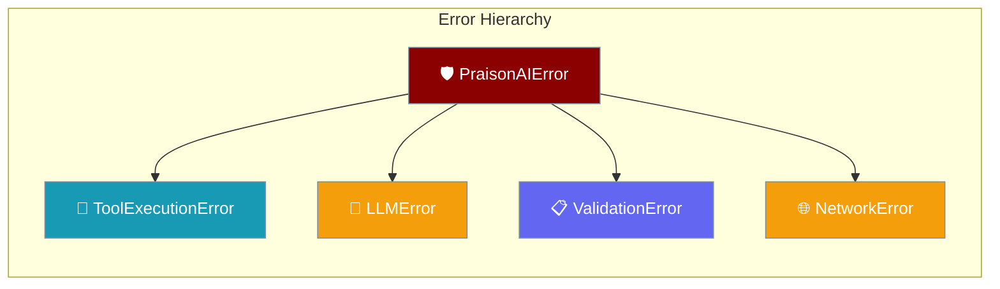
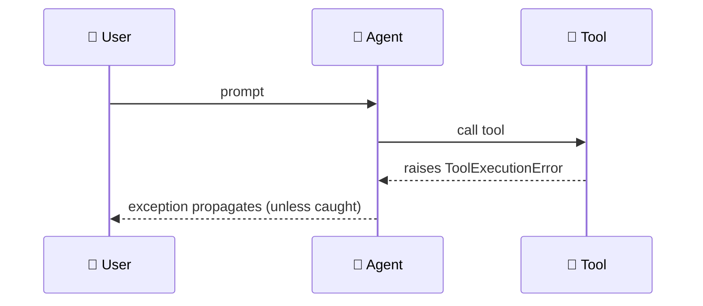

Structured exceptions tell you what failed, whether to retry, and which agent or run was involved — without parsing raw tracebacks.

```python
from praisonaiagents import Agent, PraisonAIError

agent = Agent(name="assistant", instructions="Be helpful")

try:
    print(agent.start("Say hello in one sentence."))
except PraisonAIError as e:
    print(f"{e.error_category}: {e.message} (agent={e.agent_id}, run={e.run_id})")
```



## Quick Start

<Steps>
<Step title="Catch any agent error">

```python
from praisonaiagents import Agent, PraisonAIError

agent = Agent(name="assistant", instructions="Be helpful")

try:
    result = agent.start("Say hello in one sentence.")
    print(result)
except PraisonAIError as e:
    print(f"{e.error_category}: {e.message} (agent={e.agent_id}, run={e.run_id})")
```

</Step>

<Step title="Handle tool errors specifically">

```python
from praisonaiagents import Agent, tool, ToolExecutionError

@tool
def divide(a: float, b: float) -> float:
    """Divide two numbers."""
    return a / b

agent = Agent(instructions="Use divide.", tools=[divide])

try:
    agent.start("Divide 10 by 0.")
except ToolExecutionError as e:
    print(f"Tool {e.tool_name} failed: {e.message}")
    print(f"Retryable: {e.is_retryable}")
```

</Step>
</Steps>

---

## How It Works



Every structured error carries `message`, `agent_id`, `run_id`, `error_category`, and `is_retryable`. Subclasses add domain fields such as `tool_name` or `model_name`.

| Class | When raised | Key fields | Default retryable |
|---|---|---|---|
| `PraisonAIError` | Base — catch-all | `error_category`, `context` | `False` |
| `ToolExecutionError` | Tool fails or loop-guard `HALT` | `tool_name` | `True` |
| `LLMError` | Chat completion fails | `model_name` | `False` |
| `ValidationError` | Invalid config or input | `field_name` | `False` |
| `NetworkError` | External service unreachable | `service_name`, `status_code` | `True` |

`error_category` uses typed kinds such as `rate_limit`, `auth`, `context_overflow`, and `billing`.

---

## Common Patterns

**Retry on transient network failures, fail on config bugs:**

```python
from praisonaiagents import Agent, NetworkError, ValidationError

agent = Agent(name="assistant")

for attempt in range(3):
    try:
        print(agent.start("Summarise today's news."))
        break
    except NetworkError:
        if attempt == 2:
            raise
    except ValidationError:
        raise  # fix config — retry won't help
```

Raised errors stop the run; some callbacks record failures on the output instead. See [Non-Fatal Errors](/docs/features/non-fatal-errors).

---

## Best Practices

<AccordionGroup>
<Accordion title="Catch the most specific class you can handle">
Use `ToolExecutionError` when you only care about tool failures; reserve `PraisonAIError` for top-level logging.
</Accordion>

<Accordion title="Log structured context">
Include `e.error_category`, `e.agent_id`, and `e.run_id` in observability hooks — they correlate across multi-agent runs.
</Accordion>

<Accordion title="Don't swallow ValidationError">
Validation failures usually mean a programming or config bug. Fix the root cause instead of retrying blindly.
</Accordion>

<Accordion title="Pair with loop guard for retry loops">
Loop-guard `HALT` raises `ToolExecutionError`. Combine with [Loop Guard](/docs/features/loop-guard) when tools may repeat indefinitely.
</Accordion>
</AccordionGroup>

---

## Related

<CardGroup cols={2}>
<Card title="Loop Guard" icon="rotate-left" href="/docs/features/loop-guard">
  Stop runaway tool loops with HALT/WARN/BLOCK
</Card>
<Card title="Non-Fatal Errors" icon="triangle-exclamation" href="/docs/features/non-fatal-errors">
  Callback failures captured without crashing
</Card>
</CardGroup>
