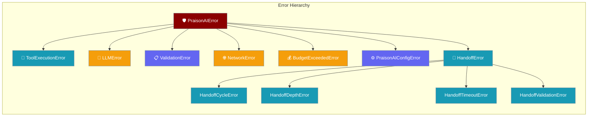
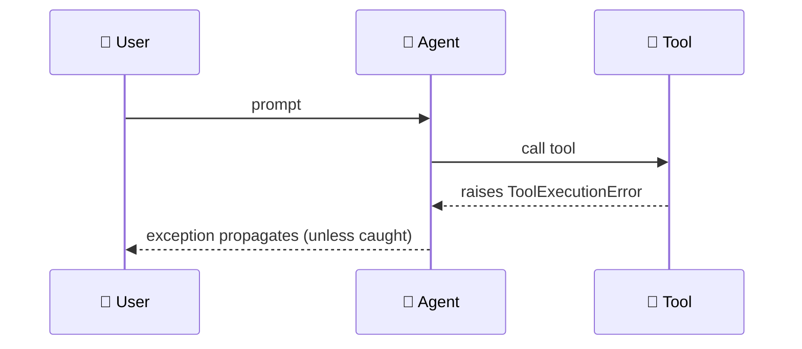
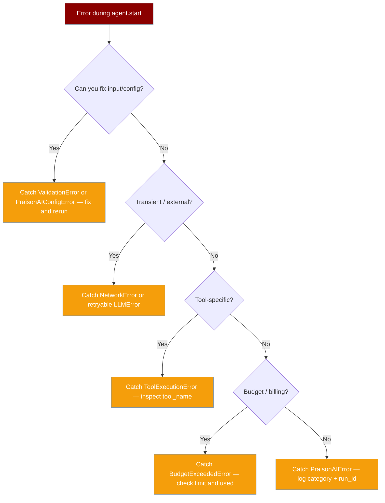

Structured exceptions tell you what failed, whether to retry, and which agent or run was involved — without parsing raw tracebacks.



## Quick Start

<Steps>
<Step title="Catch any agent error">
```python
from praisonaiagents import Agent, PraisonAIError

agent = Agent(name="assistant", instructions="Be helpful")

try:
    result = agent.start("Say hello in one sentence.")
    print(result)
except PraisonAIError as e:
    print(f"{e.error_category}: {e.message} (agent={e.agent_id}, run={e.run_id})")
```
</Step>

<Step title="Handle tool errors specifically">
```python
from praisonaiagents import Agent, tool, ToolExecutionError

@tool
def divide(a: float, b: float) -> float:
    """Divide two numbers."""
    return a / b

agent = Agent(instructions="Use divide.", tools=[divide])

try:
    agent.start("Divide 10 by 0.")
except ToolExecutionError as e:
    print(f"Tool {e.tool_name} failed: {e.message}")
    print(f"Retryable: {e.is_retryable}")
```
</Step>
</Steps>

## How It Works



Every structured error carries `message`, `agent_id`, `run_id`, `error_category`, and `is_retryable`. Subclasses add domain fields such as `tool_name` or `model_name`.

## The Error Hierarchy

| Class | Parent | When raised | Key fields | Default retryable |
|---|---|---|---|---|
| `PraisonAIError` | `Exception` | Base — catch-all | `error_category`, `context` | `False` |
| `ToolExecutionError` | `PraisonAIError` | Tool fails or loop-guard `HALT` | `tool_name` | `True` |
| `LLMError` | `PraisonAIError` | Chat completion fails | `model_name` | `False` |
| `ValidationError` | `PraisonAIError` | Invalid config or input | `field_name` | `False` |
| `NetworkError` | `PraisonAIError` | External service unreachable | `service_name`, `status_code` | `True` |
| `BudgetExceededError` | `PraisonAIError` | Token / cost limits exceeded | `budget_type`, `limit`, `used` | `False` |
| `PraisonAIConfigError` | `PraisonAIError` | Missing API key or bad settings | `config_key`, `remediation_hint` | `False` |
| `HandoffError` | `PraisonAIError` | Agent delegation failed | `source_agent`, `target_agent` | `False` |
| `HandoffCycleError` | `HandoffError` | Circular handoff detected | `chain` | `False` |
| `HandoffDepthError` | `HandoffError` | Max handoff depth exceeded | `max_depth`, `depth` | `False` |
| `HandoffTimeoutError` | `HandoffError` | Handoff timed out | `timeout` | `True` |
| `HandoffValidationError` | `HandoffError` | Handoff payload schema mismatch | `validation_errors` | `False` |

`error_category` is one of: `auth`, `auth_permanent`, `rate_limit`, `overloaded`, `context_overflow`, `idle_timeout`, `billing`, `model_not_found`, `empty_response`, `format_error`, `unknown`.

## Common Patterns

**Retry on transient network failures, fail on config bugs:**

```python
from praisonaiagents import Agent, NetworkError, ValidationError

agent = Agent(name="assistant")

for attempt in range(3):
    try:
        print(agent.start("Summarise today's news."))
        break
    except NetworkError:
        if attempt == 2:
            raise
    except ValidationError:
        raise  # fix config — retry won't help
```

**Handle budget exceeded:**

```python
from praisonaiagents import Agent, BudgetExceededError

agent = Agent(name="assistant")

try:
    agent.start("Write a very long essay.")
except BudgetExceededError as e:
    print(f"Budget hit: {e.budget_type} — used {e.used} of {e.limit}")
```

**Distinguish fatal exceptions from non-fatal results:** raised errors stop the run; some callbacks and memory paths record failures on the output instead. See [Non-Fatal Errors](/features/non-fatal-errors).

## Choose Your Recovery



## Best Practices

<AccordionGroup>
<Accordion title="Catch the most specific class you can handle">
Use `ToolExecutionError` when you only care about tool failures; reserve `PraisonAIError` for top-level logging.
</Accordion>

<Accordion title="Log structured context">
Include `e.error_category`, `e.agent_id`, and `e.run_id` in observability hooks — they correlate across multi-agent runs.
</Accordion>

<Accordion title="Don't swallow ValidationError or PraisonAIConfigError">
Validation and config failures usually mean a programming or setup bug. Fix the root cause instead of retrying blindly.
</Accordion>

<Accordion title="Pair with loop guard for retry loops">
Loop-guard `HALT` raises `ToolExecutionError`. Combine with [Loop Guard](/features/loop-guard) when tools may repeat indefinitely.
</Accordion>

<Accordion title="Check is_retryable before retry logic">
Every error exposes `e.is_retryable`. Use this flag to avoid unnecessary retries on fatal errors like auth failures or billing limits.
</Accordion>
</AccordionGroup>

## Related

<CardGroup cols={2}>
  <Card title="Loop Guard" icon="rotate-left" href="/features/loop-guard">
    Stop runaway tool loops with HALT/WARN/BLOCK
  </Card>
  <Card title="Non-Fatal Errors" icon="triangle-exclamation" href="/features/non-fatal-errors">
    Callback failures captured without crashing
  </Card>
  <Card title="Async Tool Safety" icon="bolt" href="/features/async-tool-safety">
    Circuit breakers for async tool calls
  </Card>
  <Card title="Custom Tools" icon="wrench" href="/tools/custom">
    Build tools that raise clear errors
  </Card>
</CardGroup>
