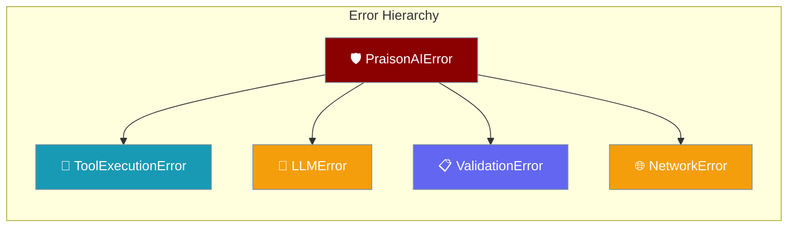
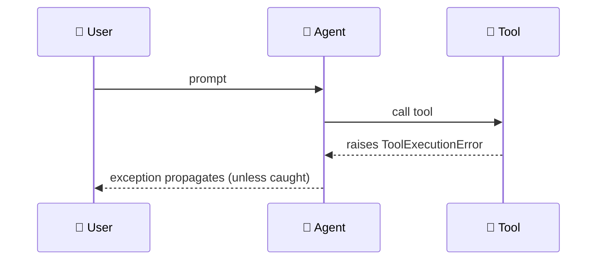
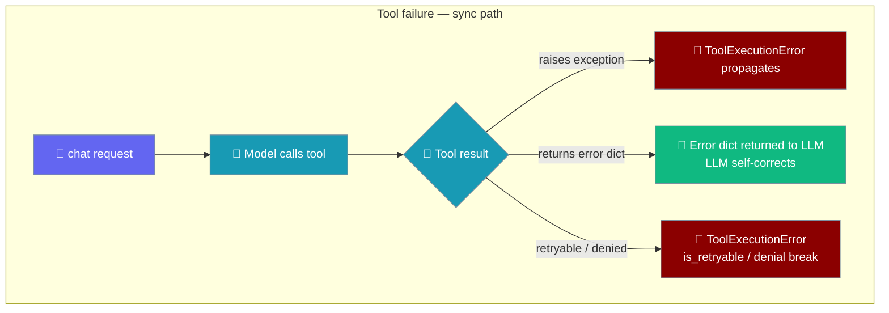

Structured exceptions tell you what failed, whether to retry, and which agent or run was involved — without parsing raw tracebacks.

```python
from praisonaiagents import Agent, PraisonAIError

agent = Agent(name="assistant", instructions="Be helpful")

try:
    print(agent.start("Say hello in one sentence."))
except PraisonAIError as e:
    print(f"{e.error_category}: {e.message} (agent={e.agent_id}, run={e.run_id})")
```

The user runs the agent; failures raise typed `PraisonAIError` with category, message, and run context for recovery.


```mermaid
graph LR
    subgraph "Error Hierarchy"
        Base[🛡 PraisonAIError]
        Base --> Tool[🔧 ToolExecutionError]
        Base --> LLM[🤖 LLMError]
        Base --> Val[📋 ValidationError]
        Base --> Net[🌐 NetworkError]
    end

    classDef base fill:#8B0000,stroke:#7C90A0,color:#fff
    classDef tool fill:#189AB4,stroke:#7C90A0,color:#fff
    classDef err fill:#F59E0B,stroke:#7C90A0,color:#fff
    classDef cfg fill:#6366F1,stroke:#7C90A0,color:#fff

    class Base base
    class Tool tool
    class LLM,Net err
    class Val cfg

    classDef agent fill:#8B0000,color:#fff

    classDef tool fill:#189AB4,color:#fff
```

## Quick Start

<Steps>
<Step title="Catch any agent error">

```python
from praisonaiagents import Agent, PraisonAIError

agent = Agent(name="assistant", instructions="Be helpful")

try:
    result = agent.start("Say hello in one sentence.")
    print(result)
except PraisonAIError as e:
    print(f"{e.error_category}: {e.message} (agent={e.agent_id}, run={e.run_id})")
```

</Step>

<Step title="Handle tool errors specifically">

```python
from praisonaiagents import Agent, tool, ToolExecutionError

@tool
def divide(a: float, b: float) -> float:
    """Divide two numbers."""
    return a / b

agent = Agent(instructions="Use divide.", tools=[divide])

try:
    agent.start("Divide 10 by 0.")
except ToolExecutionError as e:
    print(f"Tool {e.tool_name} failed: {e.message}")
    print(f"Retryable: {e.is_retryable}")
```

</Step>

<Step title="Catch a failed LLM tool-calling loop">

```python
from praisonaiagents import Agent
from praisonaiagents.llm import LLMResponseError

agent = Agent(name="assistant", instructions="Answer clearly.")

try:
    result = agent.start("Summarise the latest project update.")
except LLMResponseError as e:
    # A mid-loop tool-calling error now raises instead of returning ""
    print(f"LLM call failed: {e.message}")
```

</Step>
</Steps>

---

## How It Works


```mermaid
sequenceDiagram
    participant U as 👤 User
    participant A as 🧠 Agent
    participant T as 🔧 Tool

    U->>A: prompt
    A->>T: call tool
    T-->>A: raises ToolExecutionError
    A-->>U: exception propagates (unless caught)
```

Every structured error carries `message`, `agent_id`, `run_id`, `error_category`, and `is_retryable`. Subclasses add domain fields such as `tool_name` or `model_name`.

| Class | When raised | Key fields | Default retryable |
|---|---|---|---|
| `PraisonAIError` | Base — catch-all | `error_category`, `context` | `False` |
| `ToolExecutionError` | Tool fails or loop-guard `HALT` | `tool_name` | `True` |
| `LLMError` | Chat completion fails | `model_name` | `False` |
| `ValidationError` | Invalid config or input | `field_name` | `False` |
| `NetworkError` | External service unreachable | `service_name`, `status_code` | `True` |
| `LLMResponseError` | LLM tool-calling loop fails mid-iteration | `__cause__` (chained) | `False` |

`error_category` uses typed kinds such as `rate_limit`, `auth`, `context_overflow`, and `billing`.

`LLMResponseError` is raised by `LLM.get_response()` when the tool-calling loop fails and cannot produce a response — previously this was swallowed and returned as an empty string. Catch it to distinguish tool-loop failures; a `try/except Exception` already covers it. See [LLMResponseError](/docs/sdk/praisonaiagents/llm/llm#llmresponseerror).

---

## LLM Response Errors

`LLMResponseError` is raised when the LLM tool-calling loop hits an exception it cannot recover from. It lives in `praisonaiagents.llm` alongside the other LLM exceptions:

```python
from praisonaiagents.llm import LLMResponseError
```

<Warning>
**Behaviour change:** a mid-loop tool-calling failure now raises `LLMResponseError`. Previously the loop swallowed the exception and returned an empty string (`""`), so `agent.start()` / `agent.chat()` looked like they succeeded while silently persisting an empty assistant message and burning retries. Wrap calls that must distinguish a real failure from an empty answer.
</Warning>

| Exception | Module | Raised when |
|---|---|---|
| `LLMResponseError` | `praisonaiagents.llm` | The tool-calling loop in `LLM.get_response()` fails mid-iteration and surfaces to the caller |
| `LLMContextLengthExceededException` | `praisonaiagents.llm` | The prompt exceeds the model's context window |

`LLMResponseError` carries a `message` attribute describing the iteration that failed and chains the original exception via `raise … from e`, so `e.__cause__` holds the underlying error.

---

## Tool Failure Behavior

On the sync path, a tool failure resolves down one of three branches:

1. **Tool raises an exception** → the framework wraps it as `ToolExecutionError` and propagates it.
2. **Tool returns `{"error": "..."}`** → the error dict is handed back to the LLM as a normal tool result, so the model can self-correct (new behavior since PR [#4462](https://github.com/MervinPraison/PraisonAI/pull/4462), confirmed in [#4470](https://github.com/MervinPraison/PraisonAI/pull/4470) which fixes issue [#4446](https://github.com/MervinPraison/PraisonAI/issues/4446). The generic-exception branch in `openai_client.py` behaves the same way.).
3. **Tool returns a retryable-transient / denial dict** → `ToolExecutionError` with `is_retryable=True`, or a short-circuit denial.


```mermaid
graph TB
    subgraph "Tool failure — sync path"
        SReq[👤 chat request] --> SLLM[🤖 Model calls tool]
        SLLM --> STool{🔧 Tool result}
        STool -->|raises exception| SRaise[🛑 ToolExecutionError propagates]
        STool -->|returns error dict| SReturn[📄 Error dict returned to LLM<br/>LLM self-corrects]
        STool -->|retryable / denied| SRetry[🔁 ToolExecutionError<br/>is_retryable / denial break]
    end

    classDef req fill:#6366F1,stroke:#7C90A0,color:#fff
    classDef proc fill:#189AB4,stroke:#7C90A0,color:#fff
    classDef err fill:#8B0000,stroke:#7C90A0,color:#fff
    classDef ok fill:#10B981,stroke:#7C90A0,color:#fff

    class SReq req
    class SLLM,STool proc
    class SRaise,SRetry err
    class SReturn ok
```

<Note>
**Behavior change (PraisonAI PR [#4462](https://github.com/MervinPraison/PraisonAI/pull/4462)).** A tool that returns `{"error": "..."}` no longer aborts the run — this was the convention already used by bundled tools like `execute_command`, `tavily_search`, and `exa_search`. Previously the framework raised `ToolExecutionError(is_retryable=False)` for any dict with a truthy `error` key, so an empty-command warning from `execute_command` or a missing-API-key message from a search tool would kill `agent.chat()` mid-turn. Now the LLM sees the error dict as a normal tool result and can self-correct (retry with a real command, ask the user for the missing key, etc.).

Only three cases still raise / short-circuit on the sync path:
- The tool **raised** an exception (framework-level failure).
- The dict is a **denial** (`approval_denied`, `permission_denied`, `approval_error`, `policy_denied`, `guardrail_denied`).
- The dict is a **retryable transient** (`_outer_timeout` on an idempotent tool, `circuit_open`, or a `_praison_retryable` marker outside the tool's retry policy).
</Note>

Wrap sync `chat()` / `start()` calls in `try / except ToolExecutionError` to catch a **raised** tool exception:

```python
from praisonaiagents import Agent, tool, ToolExecutionError

@tool
def fetch(url: str) -> str:
    """Fetch a URL."""
    raise RuntimeError("429 too many requests")

agent = Agent(instructions="Use fetch.", tools=[fetch])

try:
    agent.start("Fetch https://example.com")
except ToolExecutionError as e:
    print(f"Tool {e.tool_name} failed: {e.message}")
```

A tool that **returns** an error dict (instead of raising) no longer aborts the run — the dict flows back to the model, which retries with corrected arguments:

```python
from praisonaiagents import Agent, tool

@tool
def fetch(url: str) -> dict:
    """Fetch a URL — returns an error dict on bad input."""
    if not url:
        return {"error": "Empty URL", "stdout": "", "stderr": ""}
    ...

agent = Agent(instructions="Use fetch.", tools=[fetch])
# The model calling fetch("") no longer aborts the run.
# The error dict flows back to the model and it retries with a real URL.
agent.start("Fetch example.com and summarise.")
```

<Warning>
**Behavior change (fix in PraisonAI PR #4252):** On the sync path, a tool that **raises** now raises `ToolExecutionError`. Previously the sync `Agent.chat()` silently returned `None` and, worse, the tool's error text was treated as an LLM error — so a tool message resembling a rate limit made the framework sleep and re-drive the model with no tool result, then return that hallucinated answer as a success. Callers checking `if agent.chat(...) is None:` should switch to catching the exception — `None` cannot distinguish a guardrail rejection from a tool failure anyway.
</Warning>

Sync and async paths are aligned for plain tool-returned `{"error": ...}` dicts — both hand the error back to the LLM so it can retry with corrected arguments. The two paths still differ for **raised** exceptions: sync `chat()` raises `ToolExecutionError`; async `achat()` returns an error dict. See [Async Tool Safety](/features/async-tool-safety).

---

## Common Patterns

**Retry on transient network failures, fail on config bugs:**

```python
from praisonaiagents import Agent, NetworkError, ValidationError

agent = Agent(name="assistant")

for attempt in range(3):
    try:
        print(agent.start("Summarise today's news."))
        break
    except NetworkError:
        if attempt == 2:
            raise
    except ValidationError:
        raise  # fix config — retry won't help
```

Raised errors stop the run; some callbacks record failures on the output instead. See [Non-Fatal Errors](/features/non-fatal-errors).

---

## Reaching the Step Limit

When the tool-calling loop reaches `ExecutionConfig.max_steps` (or `max_iter` when `max_steps` is unset), the agent does not hard-cut. On the final permitted step it injects a graceful wrap-up instruction, so the model returns a real summary of what it accomplished and what remains — not a placeholder.

Detect truncation with `agent.last_stop_reason` instead of string-matching:

```python
from praisonaiagents import Agent, ExecutionConfig

agent = Agent(
    name="coder",
    instructions="You are a coding assistant.",
    execution=ExecutionConfig(max_steps=50),
)
result = agent.start("Refactor the auth module across all files")

if agent.last_stop_reason == "max_steps":
    result = agent.start("Continue from where you left off.")
```

On a gateway, surface the reason to chat users — see [Turn Completion Notes](/features/turn-completion-notes).

**On the CLI:** when a truncated run reaches `praisonai run` / `praisonai-code run`, the wrapper reports it distinctly from success — exit code `2` (not `0`), `status: "truncated"` under `--output json` / `--output stream-json` with the wrap-up summary preserved in `result`, plus a one-line stderr warning in interactive mode. See [`praisonai run` → Exit Codes](/docs/cli/run#exit-codes).

<Card title="Step Budget" icon="gauge-max" href="/features/max-steps">
  Cap tool-use steps and detect graceful truncation with `last_stop_reason`
</Card>

---

## Best Practices

<AccordionGroup>
<Accordion title="Catch the most specific class you can handle">
Use `ToolExecutionError` when you only care about tool failures; reserve `PraisonAIError` for top-level logging.
</Accordion>

<Accordion title="Log structured context">
Include `e.error_category`, `e.agent_id`, and `e.run_id` in observability hooks — they correlate across multi-agent runs.
</Accordion>

<Accordion title="Don't swallow ValidationError">
Validation failures usually mean a programming or config bug. Fix the root cause instead of retrying blindly.
</Accordion>

<Accordion title="Pair with loop guard for retry loops">
Loop-guard `HALT` raises `ToolExecutionError`. Combine with [Loop Guard](/features/loop-guard) when tools may repeat indefinitely.
</Accordion>

<Accordion title="Treat an LLMResponseError as a real failure, not an empty answer">
A failed tool-calling loop now raises `LLMResponseError` instead of returning `""`. Catch it explicitly (`from praisonaiagents.llm import LLMResponseError`) so retries and observability see the actual error rather than a silent empty string.
</Accordion>
</AccordionGroup>

---

## Related

<CardGroup cols={2}>
<Card title="Loop Guard" icon="rotate-left" href="/features/loop-guard">
  Stop runaway tool loops with HALT/WARN/BLOCK
</Card>
<Card title="Non-Fatal Errors" icon="triangle-exclamation" href="/features/non-fatal-errors">
  Callback failures captured without crashing
</Card>
</CardGroup>
