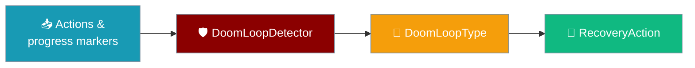
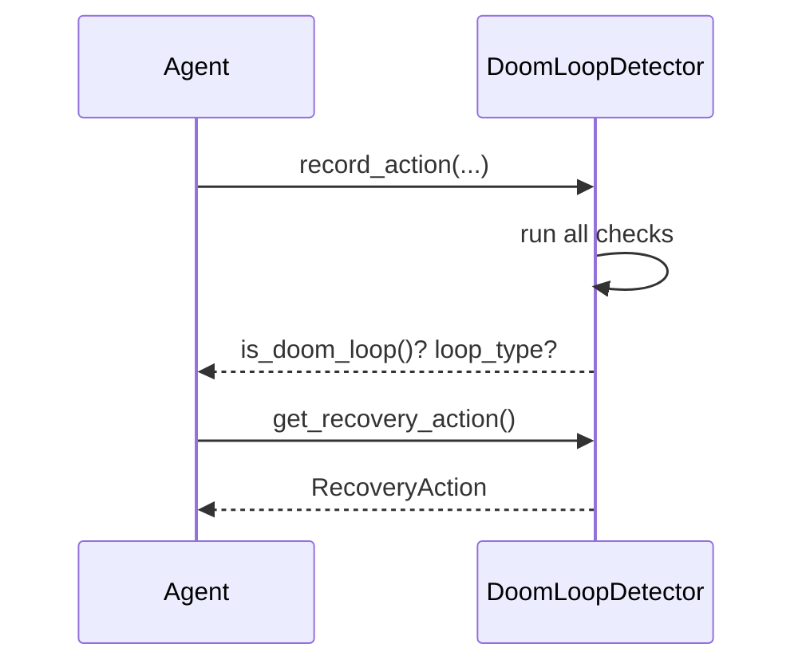

The escalation `DoomLoopDetector` watches a long-running agent session for stuck states — repeated actions, repeated failures, no progress, resource exhaustion, or repeated output — and recommends a `RecoveryAction` so the agent can break out instead of burning its whole iteration budget.

```python
from praisonaiagents.escalation import DoomLoopDetector

detector = DoomLoopDetector()
detector.start_session()

detector.record_action("read_file", {"path": "foo.py"}, "content", success=True)
detector.record_action("read_file", {"path": "foo.py"}, "content", success=True)
detector.record_action("read_file", {"path": "foo.py"}, "content", success=True)

if detector.is_doom_loop():
    print(detector.get_recovery_action())  # e.g. RecoveryAction.RETRY_DIFFERENT
```

The detector consumes the actions and progress markers you feed it, classifies the stuck state into a `DoomLoopType`, and maps that to a `RecoveryAction` on the recovery ladder.



<Note>
This is the **escalation** doom-loop subsystem (session-level, recommends a `RecoveryAction`). It is separate from the always-on per-agent [Loop Detection](/features/doom-loop-detection) that inspects tool-call fingerprints. Use this page for `DoomLoopDetector` / `DoomLoopConfig`.
</Note>

## Quick Start

<Steps>
<Step title="Construct with defaults">
```python
from praisonaiagents.escalation import DoomLoopDetector

detector = DoomLoopDetector()
detector.start_session()
```
</Step>

<Step title="Record actions and progress markers">
```python
detector.record_action("search", {"q": "config"}, "no results", success=False)
detector.mark_progress("wrote initial draft")  # call on real progress
```
</Step>

<Step title="Check for a loop and get the recovery action">
```python
if detector.is_doom_loop():
    event = detector.get_loop_event()
    print(event.loop_type, event.description)
    print(detector.get_recovery_action())
```
</Step>
</Steps>

---

## How It Works

The detector keeps an ordered history of `record_action(...)` calls plus a separate list of `mark_progress(...)` markers. After each recorded action it re-runs every check; `is_doom_loop()` returns `True` as soon as any check fires, and `get_loop_type()` reports which one.



### Loop types

| `DoomLoopType` | What it detects |
|---|---|
| `REPEATED_ACTION` | Same action (name + args) repeated `max_identical_actions` times, or same action type repeated `max_similar_actions` times |
| `REPEATED_FAILURE` | `max_consecutive_failures` failing actions in a row |
| `NO_PROGRESS` | `max_no_progress_steps` steps with identical results and no recent progress marker |
| `CIRCULAR_PLAN` | Plan loops back to a previous state |
| `RESOURCE_EXHAUSTION` | Elapsed time exceeds `max_total_time` |
| `REPEATED_OUTPUT` | Model output repeats — `max_repeated_chunks`+ identical text chunks (content chanting) |

### Recovery ladder

`get_recovery_action()` walks a ladder based on how many recovery attempts have already been made:

| `RecoveryAction` | When it is chosen |
|---|---|
| `CONTINUE` | No loop detected |
| `RETRY_DIFFERENT` | First recovery attempt — try a different approach |
| `ESCALATE_MODEL` | Second attempt, when `escalate_on_loop=True` — try a stronger model |
| `REQUEST_HELP` | After escalation — ask the user for clarification |
| `ABORT` | `RESOURCE_EXHAUSTION` always aborts; also when `max_recovery_attempts` is reached |

---

## Configuration Options

Pass a `DoomLoopConfig` to tune thresholds:

```python
from praisonaiagents.escalation import DoomLoopDetector, DoomLoopConfig

detector = DoomLoopDetector(
    DoomLoopConfig(
        max_no_progress_steps=3,
        max_consecutive_failures=2,
        escalate_on_loop=True,
    )
)
```

| Option | Type | Default | Description |
|---|---|---|---|
| `max_identical_actions` | `int` | `3` | Max identical consecutive actions |
| `max_similar_actions` | `int` | `5` | Max same-type actions (fuzzy match) |
| `max_consecutive_failures` | `int` | `3` | Max failures before intervention |
| `max_no_progress_steps` | `int` | `5` | Max steps without progress |
| `max_time_per_action` | `float` | `60.0` | Max seconds per action |
| `max_total_time` | `float` | `300.0` | Max total execution time (seconds) |
| `enable_auto_recovery` | `bool` | `True` | Auto-attempt recovery |
| `max_recovery_attempts` | `int` | `2` | Max recovery attempts before abort |
| `escalate_on_loop` | `bool` | `True` | Escalate model on loop detection |
| `initial_backoff` | `float` | `1.0` | Initial backoff in seconds |
| `backoff_multiplier` | `float` | `2.0` | Backoff multiplier |
| `max_backoff` | `float` | `30.0` | Maximum backoff in seconds |
| `max_repeated_chunks` | `int` | `8` | Max identical output chunks before flagging |
| `content_chunk_size` | `int` | `50` | Sliding-window chunk size (chars) |

<Note>
`similarity_threshold` (`0.85`) is **retained for backward compatibility only** and is not consulted by any current detector — fuzzy result-similarity is handled by the result-aware [Loop Detection](/features/doom-loop-detection) subsystem.
</Note>

---

## How progress markers work

`mark_progress()` records a `(marker, timestamp)` tuple. When checking `NO_PROGRESS`, the detector only counts markers within the **current no-progress window** — markers older than the window boundary (the timestamp of the action immediately preceding the window) are filtered out.

```python
from praisonaiagents.escalation import DoomLoopDetector, DoomLoopConfig

detector = DoomLoopDetector(DoomLoopConfig(max_no_progress_steps=5))
detector.start_session()

detector.mark_progress("read config.yaml")  # early success

# ... many later steps that repeat the same unproductive result ...
for _ in range(5):
    detector.record_action("retry", {"n": 1}, "same error", success=False)

detector.is_doom_loop()  # True — the early marker no longer suppresses NO_PROGRESS
```

Before this recency filter ([PR #3960](https://github.com/MervinPraison/PraisonAI/pull/3960)), one early `mark_progress(...)` disabled `NO_PROGRESS` detection for the rest of the run, no matter how long the agent then spun on unproductive work. Now `NO_PROGRESS` fires correctly on long runs where an early success previously suppressed it forever.

---

## Common Patterns

### Drive recovery from the detected action

```python
from praisonaiagents.escalation import DoomLoopDetector
from praisonaiagents.escalation.doom_loop import RecoveryAction

detector = DoomLoopDetector()
detector.start_session()

# ... record actions during the run ...

if detector.is_doom_loop():
    action = detector.get_recovery_action()
    if action == RecoveryAction.RETRY_DIFFERENT:
        detector.increment_recovery()
        # switch strategy and continue
    elif action == RecoveryAction.ESCALATE_MODEL:
        detector.increment_recovery()
        # swap in a stronger model
    elif action in (RecoveryAction.REQUEST_HELP, RecoveryAction.ABORT):
        # stop and surface to the user
        pass
```

### Inspect session statistics

```python
stats = detector.get_stats()
print(stats["total_actions"], stats["failed_actions"], stats["progress_markers"])
```

---

## Best Practices

<AccordionGroup>
  <Accordion title="Call mark_progress() on real progress only">
    Mark progress when the agent genuinely advances (file modified, test passed, sub-goal reached) — not on every log line. Markers gate `NO_PROGRESS` detection, so noisy markers hide real stalls.
  </Accordion>
  <Accordion title="Keep max_no_progress_steps small">
    A smaller `max_no_progress_steps` catches stalls sooner. Start at `3–5` for autonomous runs and raise it only if you see false positives.
  </Accordion>
  <Accordion title="Increment recovery between attempts">
    Call `increment_recovery()` after acting on a recommendation so the ladder advances (`RETRY_DIFFERENT → ESCALATE_MODEL → REQUEST_HELP`) and eventually aborts at `max_recovery_attempts`.
  </Accordion>
  <Accordion title="Reset per session">
    Call `start_session()` at the top of each run to clear action history, markers, and recovery counters.
  </Accordion>
</AccordionGroup>

---

## Related

<CardGroup cols={2}>
  <Card title="Loop Detection" icon="rotate" href="/features/doom-loop-detection">
    The always-on, per-agent result-aware tool-loop detector
  </Card>
  <Card title="Autonomy Loop" icon="repeat" href="/features/autonomy-loop">
    `doom_loop_threshold` and the `doom_loop` completion reason
  </Card>
</CardGroup>
