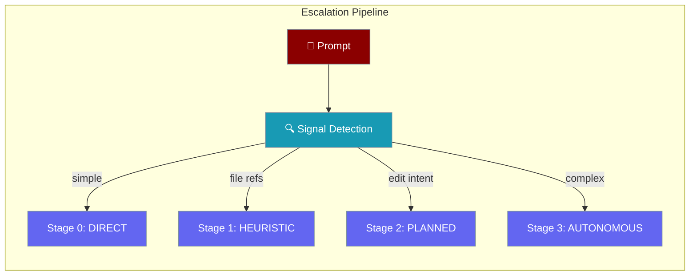

Agent Autonomy implements an "advanced-by-default, fast-by-default" strategy — agents automatically pick the right execution stage for each task.



## Quick Start

<Steps>
<Step title="Enable autonomy on an agent">
```python
from praisonaiagents import Agent

agent = Agent(
    instructions="You are a helpful coding assistant.",
    llm="gpt-4o-mini",
    autonomy=True
)

response = agent.chat("What is Python?")
print(response)
```
</Step>

<Step title="Inspect what stage a prompt triggers">
```python
stage = agent.get_recommended_stage("Refactor the auth module and add tests")
print(f"Stage: {stage}")

signals = agent.analyze_prompt("Read src/main.py")
print(f"Signals: {signals}")
```
</Step>
</Steps>

## Overview

The agent provides 4 autonomy stages:

| Stage | Name | Description | Use Case |
|-------|------|-------------|----------|
| 0 | DIRECT | No tools, immediate response | Simple questions |
| 1 | HEURISTIC | Tool selection based on signals | File references, code blocks |
| 2 | PLANNED | Lightweight planning | Edit/test/build tasks |
| 3 | AUTONOMOUS | Full autonomous loop | Multi-step, refactoring |

## Quick Start

```python
from praisonaiagents import Agent

# Create an agent with autonomy enabled
agent = Agent(
    instructions="You are a helpful coding assistant.",
    llm="gpt-4o-mini",
    autonomy=True  # Enable autonomy features
)

# Analyze a prompt (no API call, fast heuristics)
stage = agent.get_recommended_stage("What is Python?")
print(f"Recommended stage: {stage}")  # direct

# Get signals from a prompt
signals = agent.analyze_prompt("Refactor the auth module")
print(f"Signals: {signals}")  # {'refactor_intent', 'complex_keywords'}

# Use the agent normally - autonomy features work automatically
response = agent.chat("What is Python?")
print(response)
```

## Custom Configuration

```python
from praisonaiagents import Agent

# Create agent with custom autonomy config
agent = Agent(
    instructions="You are a coding assistant.",
    autonomy={
        "max_iterations": 30,
        "doom_loop_threshold": 5,
        "auto_escalate": True
    }
)

print(f"Autonomy enabled: {agent.autonomy_enabled}")
print(f"Config: {agent.autonomy_config}")
```

## Signal Detection

The agent detects signals from prompts using fast heuristics (no LLM calls):

```python
from praisonaiagents import Agent

agent = Agent(instructions="Assistant", autonomy=True)

# Analyze different prompts
signals = agent.analyze_prompt("What is Python?")
# Returns: {'simple_question'}

signals = agent.analyze_prompt("Read src/main.py and explain it")
# Returns: {'file_references'}

signals = agent.analyze_prompt("Refactor the auth module and add tests")
# Returns: {'edit_intent', 'test_intent', 'refactor_intent', 'complex_keywords'}
```

### Available Signals

| Signal | Trigger |
|--------|---------|
| `simple_question` | "what is", "define", "explain" |
| `complex_keywords` | "analyze", "refactor", "optimize" |
| `file_references` | File paths like `src/main.py` |
| `code_blocks` | Markdown code blocks |
| `edit_intent` | "edit", "modify", "fix" |
| `test_intent` | "test", "pytest", "verify" |
| `multi_step` | Multiple steps or "and then" |
| `refactor_intent` | "refactor", "restructure" |

## Stage Recommendation

The agent recommends execution stages based on detected signals:

```python
from praisonaiagents import Agent

agent = Agent(instructions="Assistant", autonomy=True)

# Simple question → DIRECT stage
stage = agent.get_recommended_stage("What is Python?")
print(stage)  # "direct"

# File reference → HEURISTIC stage
stage = agent.get_recommended_stage("Read src/main.py")
print(stage)  # "heuristic"

# Edit task → PLANNED stage
stage = agent.get_recommended_stage("Fix the bug in auth.py")
print(stage)  # "planned"

# Complex refactor → AUTONOMOUS stage
stage = agent.get_recommended_stage("Refactor auth and add tests")
print(stage)  # "autonomous"
```

## Doom Loop Detection

The agent includes built-in doom loop detection to prevent infinite loops:

```python
from praisonaiagents import Agent

# Create agent with custom doom loop threshold
agent = Agent(
    instructions="You are a coding assistant.",
    autonomy={"doom_loop_threshold": 3}  # Trigger after 3 repeated actions
)

# The agent automatically tracks actions and detects loops
# During execution, if a doom loop is detected:
# - The agent will break the loop
# - Report the issue to the user
# - Suggest a different approach

# You can also check manually:
if agent._is_doom_loop():
    print("Doom loop detected!")
    agent._reset_doom_loop()  # Reset for next task
```

## CLI Usage

Use autonomy features from the command line:

```bash
# Simple question (uses DIRECT stage automatically)
praisonai "What is Python?"

# Complex task (escalates to AUTONOMOUS stage)
praisonai "Refactor the auth module and add tests"

# With explicit autonomy options
praisonai chat --autonomy
```

## Best Practices

<AccordionGroup>
<Accordion title="Let the agent decide the stage">
The agent automatically selects the right stage based on prompt signals. Only override when you need guaranteed autonomy levels.
</Accordion>

<Accordion title="Adjust doom_loop_threshold for your workload">
The default threshold of 5 repeated actions works for most tasks. Lower it for safety-critical agents.

```python
agent = Agent(instructions="...", autonomy={"doom_loop_threshold": 3})
```
</Accordion>

<Accordion title="Use analyze_prompt() to understand task complexity">
Call `analyze_prompt()` before execution to see which signals were detected and verify the expected stage.
</Accordion>

<Accordion title="All autonomy is agent-centric">
No standalone pipeline objects are needed. All autonomy features are accessed through the `Agent` class.
</Accordion>
</AccordionGroup>

---

## Related

<CardGroup cols={2}>
<Card title="Specialized Agents" icon="robot" href="/features/specialized-agents">
  Built-in specialized agent patterns
</Card>
<Card title="Stateful Agents" icon="circle-dot" href="/features/stateful-agents">
  Multi-turn stateful conversation agents
</Card>
</CardGroup>
