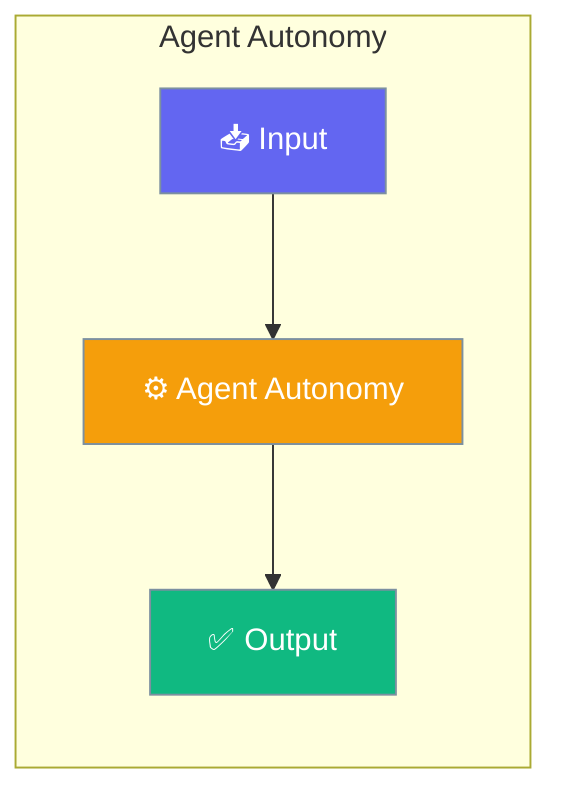

Agent Autonomy implements an "advanced-by-default, fast-by-default" strategy that automatically adjusts execution complexity based on task signals. All features are accessed through the `Agent` class.




## Overview

The agent provides 4 autonomy stages:

| Stage | Name | Description | Use Case |
|-------|------|-------------|----------|
| 0 | DIRECT | No tools, immediate response | Simple questions |
| 1 | HEURISTIC | Tool selection based on signals | File references, code blocks |
| 2 | PLANNED | Lightweight planning | Edit/test/build tasks |
| 3 | AUTONOMOUS | Full autonomous loop | Multi-step, refactoring |

## Quick Start


<Steps>
<Step title="Quick Start">
```python
from praisonaiagents import Agent

# Create an agent with autonomy enabled
agent = Agent(
    instructions="You are a helpful coding assistant.",
    llm="gpt-4o-mini",
    autonomy=True  # Enable autonomy features
)

# Analyze a prompt (no API call, fast heuristics)
stage = agent.get_recommended_stage("What is Python?")
print(f"Recommended stage: {stage}")  # direct

# Get signals from a prompt
signals = agent.analyze_prompt("Refactor the auth module")
print(f"Signals: {signals}")  # {'refactor_intent', 'complex_keywords'}

# Use the agent normally - autonomy features work automatically
response = agent.chat("What is Python?")
print(response)
```
</Step>
</Steps>


## Best Practices

<AccordionGroup>
  <Accordion title="Start simple">
    Enable the feature with a single parameter before adding configuration. Verify it works, then layer in options.
  </Accordion>
  <Accordion title="Use environment variables for secrets">
    Never hardcode API keys or tokens. Use `os.getenv("KEY_NAME")` to read from environment variables.
  </Accordion>
  <Accordion title="Test with minimal examples first">
    Copy the Quick Start example, run it, then extend it. This confirms your environment is set up correctly.
  </Accordion>
  <Accordion title="Check the logs">
    Set `verbose=True` on your agent to see detailed execution logs when debugging unexpected behavior.
  </Accordion>
</AccordionGroup>

## Related

<CardGroup cols={2}>
  <Card title="Features Overview" icon="grid-2" href="/docs/features">
    Browse all PraisonAI features
  </Card>
  <Card title="Quick Start" icon="rocket" href="/docs/introduction">
    Get started with PraisonAI agents
  </Card>
</CardGroup>
