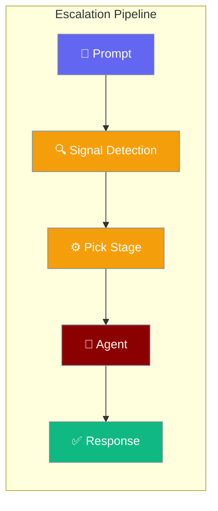
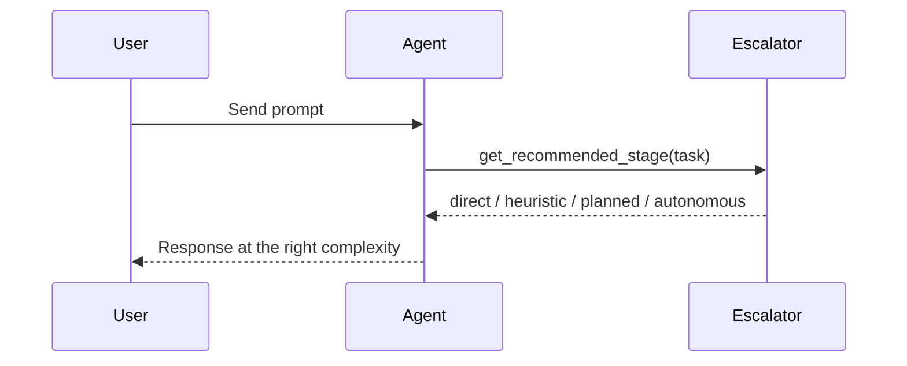
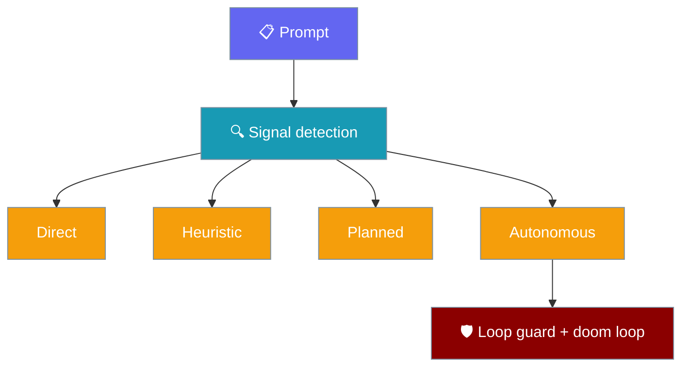

The escalation pipeline adjusts execution complexity from simple answers to full autonomous loops — all via `Agent(autonomy=True)`.

```python
from praisonaiagents import Agent

agent = Agent(
    instructions="You are a helpful coding assistant.",
    llm="gpt-4o-mini",
    autonomy=True,
)

stage = agent.get_recommended_stage("Refactor the auth module")
print(stage)  # "autonomous"

response = agent.start("What is Python?")
print(response)
```

The user sends a prompt; the agent escalates from direct answers to heuristic, planned, or autonomous execution based on task signals.



## How It Works



### Escalation Stages



## Quick Start

<Steps>
<Step title="Enable autonomy">

```python
from praisonaiagents import Agent

agent = Agent(
    instructions="You are a helpful coding assistant.",
    llm="gpt-4o-mini",
    autonomy=True,
)

# Fast heuristics — no LLM call
stage = agent.get_recommended_stage("What is Python?")
signals = agent.analyze_prompt("Refactor the auth module")

print(stage)    # direct
print(signals)  # {'refactor_intent', 'complex_keywords'}

response = agent.start("What is Python?")
print(response)
```

</Step>

<Step title="Custom configuration">

```python
from praisonaiagents import Agent, AutonomyConfig

agent = Agent(
    instructions="You are a coding assistant.",
    autonomy=AutonomyConfig(
        max_iterations=30,
        doom_loop_threshold=5,
        auto_escalate=True,
    ),
)

print(agent.autonomy_enabled)
print(agent.autonomy_config)
```

</Step>
</Steps>

---

## Stages and Signals

| Stage | Name | Typical trigger |
|-------|------|-----------------|
| 0 | DIRECT | Simple questions (`simple_question`) |
| 1 | HEURISTIC | File paths, code blocks |
| 2 | PLANNED | Edit, test, or build intent |
| 3 | AUTONOMOUS | Multi-step refactor, complex keywords |

```python
from praisonaiagents import Agent

agent = Agent(instructions="Assistant", autonomy=True)

agent.get_recommended_stage("What is Python?")           # direct
agent.get_recommended_stage("Read src/main.py")          # heuristic
agent.get_recommended_stage("Fix the bug in auth.py")    # planned
agent.get_recommended_stage("Refactor auth and add tests") # autonomous
```

| Signal | Trigger examples |
|--------|------------------|
| `simple_question` | "what is", "define", "explain" |
| `file_references` | Paths like `src/main.py` |
| `edit_intent` | "edit", "modify", "fix" |
| `refactor_intent` | "refactor", "restructure" |
| `complex_keywords` | "analyse", "optimise", "refactor" |

---

## CLI

```bash
# Simple question — DIRECT stage
praisonai "What is Python?"

# Complex task — escalates to AUTONOMOUS
praisonai "Refactor the auth module and add tests"

praisonai chat --autonomy
```

---

## Pipeline Components

Under `praisonaiagents/escalation/`:

- **Doom loop detector** — identical calls and no-progress patterns
- **Loop guard** — idempotency-aware tool-call guardrails on every `Agent`. See [Loop Guard](/docs/features/loop-guard).
- **Pipeline orchestration** — escalation triggers and recovery
- **Observability hooks** — metrics for escalation events

---

## Best Practices

<AccordionGroup>
<Accordion title="Enable with autonomy=True">
Pass `autonomy=True` or an `AutonomyConfig` — the agent selects the stage automatically during execution.
</Accordion>

<Accordion title="Inspect signals before heavy runs">
Call `analyze_prompt()` to preview complexity without an LLM call when building UIs or routing logic.
</Accordion>

<Accordion title="Tune doom_loop_threshold">
Lower the threshold (e.g. `3`) for agents that may repeat tool calls; raise it for exploratory coding tasks.
</Accordion>

<Accordion title="Stay agent-centric">
No standalone pipeline objects — escalation, loop guard, and doom-loop detection live on `Agent`.
</Accordion>
</AccordionGroup>

---

## Related

<CardGroup cols={2}>
<Card title="Doom Loop Detection" icon="rotate" href="/docs/features/doom-loop-detection">
  Pattern-based detection of stuck agent loops
</Card>
<Card title="Subagent Delegation" icon="users" href="/docs/features/subagent-delegation">
  Delegate subtasks when autonomy escalates
</Card>
</CardGroup>
