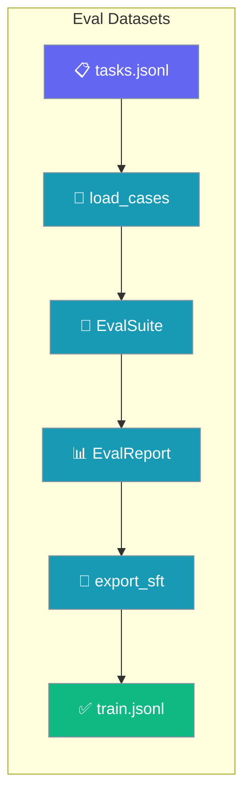
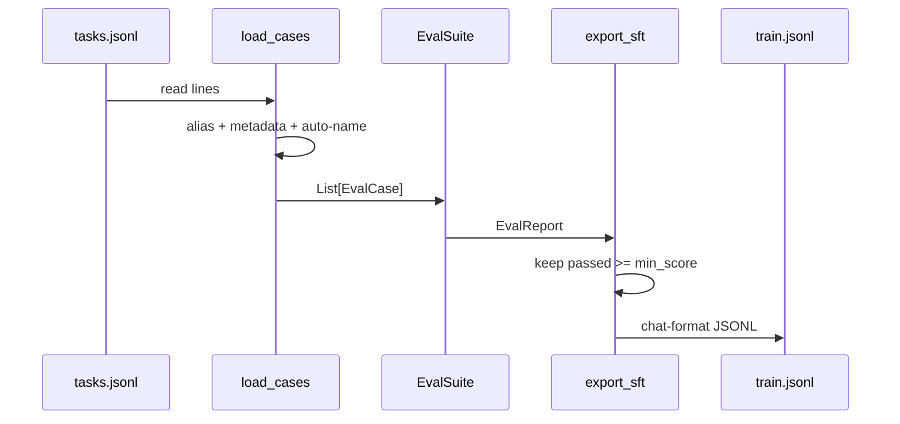

Eval Datasets loads a task set from JSONL, then turns the runs that scored well into a fine-tuning file — closing the loop from task set to trained model.



JSONL sits at both ends — the format Agno, OpenAI's fine-tuning API, and every dataset tool already speak — so a task set is portable in and the training file is portable out.

## Quick Start

<Steps>
<Step title="Load a task set">
Read a JSONL file into `EvalCase` objects.

```python
from praisonaiagents.eval import load_cases

cases = load_cases("tasks.jsonl")
```
</Step>

<Step title="Run the suite on the loaded cases">
Run the cases and get an `EvalReport`.

```python
report = my_runner.run(cases)
```
</Step>

<Step title="Export what passed">
Write the passing runs as chat-format training data.

```python
from praisonaiagents.eval import export_sft

export_sft(report, "train.jsonl", min_score=0.8)
```
</Step>
</Steps>

---

## Input Format

Each line is one JSON object describing a task.

The minimal shape carries a `name`, an `input`, and an `expected` answer.

```jsonl
{"name": "add", "input": "2+2?", "expected": "4"}
{"name": "capital", "input": "capital of France?", "expected": "Paris"}
```

Aliases are accepted and unrecognised columns fold into `metadata`.

```jsonl
{"prompt": "2+2?", "answer": "4", "difficulty": "easy", "source": "sheet1"}
```

Blank lines and `//` comments are skipped.

```jsonl
// Arithmetic set
{"input": "2+2?", "expected": "4"}

{"input": "3+3?", "expected": "6"}
```

---

## Output Format

Export writes one chat-format JSON object per line — the shape OpenAI's fine-tuning API expects.

```jsonl
{"messages":[{"role":"user","content":"2+2?"},{"role":"assistant","content":"4"}]}
```

Pass `system_prompt` to prepend a `system` message to every row.

```jsonl
{"messages":[{"role":"system","content":"Be terse."},{"role":"user","content":"2+2?"},{"role":"assistant","content":"4"}]}
```

The prompt is read from `result.record["input"]`; the completion is `result.actual_output`.

---

## How It Works

`load_cases` maps aliases, folds extra columns into metadata, and auto-names rows; `export_sft` keeps only passing runs at or above `min_score`.



Aliases map friendly column names onto the case fields.

| Field | Accepted aliases |
|-------|------------------|
| `input` | `prompt`, `question`, `query`, `instruction` |
| `expected` | `expected_output`, `answer`, `output`, `completion` |

---

## Behaviour Worth Knowing

The loader is forgiving where it costs nothing and strict where it matters.

- Unrecognised columns fold into `metadata` instead of being dropped, so `source` / `difficulty` / `id` survive into the report.
- Missing `name` auto-populates as `case_1`, `case_2`, … by position among data rows.
- Blank lines and `//` comment lines are skipped; the physical file line is preserved, so `file:900` really is line 900 in the editor.
- A malformed line is reported by `file:line`, not a generic "invalid JSON".
- A non-object line (e.g. `[1, 2, 3]`) is refused with "must be a JSON object".
- An empty file raises `DatasetError` — an empty task set would otherwise report a perfect pass rate over nothing.
- Only `passed=True` runs with `score >= min_score` are exported.
- A run missing either a prompt or a completion is skipped, never silently shrinking the set.
- A zero-record export raises `DatasetError` rather than writing an empty file that looks like success.
- `DatasetError` subclasses `ValueError`, so existing `except ValueError` handlers still catch it.

---

## Python API

Import the five public helpers from the top-level eval package.

```python
from praisonaiagents.eval import (
    load_cases,
    iter_jsonl,
    export_sft,
    sft_records,
    DatasetError,
)
```

### load_cases

`load_cases(path, *, case_cls=None) -> List[EvalCase]` reads a JSONL task set into `EvalCase` objects.

| Param | Type | Default | Description |
|-------|------|---------|-------------|
| `path` | `str` | required | Path to the `.jsonl` file |
| `case_cls` | `type` | `EvalCase` | Override the case class (advanced) |

**Raises:** `DatasetError` on missing file, malformed line, non-object line, or empty file — with `file:line` when the fault is inside the file.

### iter_jsonl

`iter_jsonl(path) -> Iterator[Dict[str, Any]]` yields one dict per data line, with the same error handling but no aliasing or metadata folding.

| Param | Type | Default | Description |
|-------|------|---------|-------------|
| `path` | `str` | required | Path to the `.jsonl` file |

### export_sft

`export_sft(report, path, *, min_score=1.0, system_prompt=None) -> int` writes passing runs to `path` and returns the count written.

| Param | Type | Default | Description |
|-------|------|---------|-------------|
| `report` | `EvalReport` or `List[EvalResult]` | required | Anything exposing `.results`, or a bare list |
| `path` | `str` | required | Destination `.jsonl` (parent dirs are created) |
| `min_score` | `float` | `1.0` | Only runs with `score >= min_score` are exported |
| `system_prompt` | `str \| None` | `None` | Prepended as a `system` message when set |

**Raises:** `DatasetError` if no run scored high enough, or if `report` is not an `EvalReport` / list.

### sft_records

`sft_records(report, *, min_score=1.0, system_prompt=None) -> List[Dict[str, Any]]` applies the same selection logic but returns the records in memory instead of writing them.

| Param | Type | Default | Description |
|-------|------|---------|-------------|
| `report` | `EvalReport` or `List[EvalResult]` | required | Anything exposing `.results`, or a bare list |
| `min_score` | `float` | `1.0` | Only runs with `score >= min_score` are selected |
| `system_prompt` | `str \| None` | `None` | Prepended as a `system` message when set |

### DatasetError

`DatasetError(ValueError)` is raised for every dataset read or write failure. As a `ValueError` subclass, existing `except ValueError` handlers still catch it.

---

## Common Patterns

### Portable in, portable out

Load a Hugging Face-exported JSONL with `prompt` / `answer` columns and export a file OpenAI's fine-tuning API accepts unchanged.

```python
from praisonaiagents.eval import load_cases, export_sft

cases = load_cases("hf_export.jsonl")
report = my_runner.run(cases)
export_sft(report, "train.jsonl", min_score=0.8)
```

### Lower the bar for a small dataset

Keep more attempts when the suite is small by lowering `min_score` — a deliberate trade against SFT quality.

```python
from praisonaiagents.eval import export_sft

export_sft(report, "train.jsonl", min_score=0.5)
```

### Persist a system prompt with each training row

Pass `system_prompt=` so the fine-tuned model learns the same persona the eval was scored under.

```python
from praisonaiagents.eval import export_sft

export_sft(report, "train.jsonl", system_prompt="Be terse.")
```

---

## Best Practices

<AccordionGroup>
<Accordion title="Fold provenance columns into metadata, don't strip them">
The loader keeps `source` / `difficulty` / `id` automatically — leave them in your JSONL so the report carries where each case came from.
</Accordion>

<Accordion title="Set min_score above your CI gate, not equal to it">
A run that barely passed is a fragile teacher. Export above your gate so training data reflects confident wins, not marginal ones.
</Accordion>

<Accordion title="Never edit a training file by hand">
Regenerate `train.jsonl` from the eval report instead of editing it, so provenance stays honest and reproducible.
</Accordion>

<Accordion title="Keep // comment lines in the source dataset">
Comment lines are skipped at load time and make the file self-documenting — describe each section inline without breaking the loader.
</Accordion>
</AccordionGroup>

---

<Warning>
`min_score`-filtered export is *rejection sampling* — it amplifies behaviour the agent already produces and inherits any bias in the judge that decided a run "passed". It cannot teach behaviour the agent never exhibited; treat it as reinforcing verified wins, not as an oracle.
</Warning>

---

## Related

<CardGroup cols={2}>
  <Card title="Evaluation Suite" icon="scale-balanced" href="/features/eval-suite">
    Run every evaluator you enable as one CI gate
  </Card>
  <Card title="Train Package" icon="graduation-cap" href="/features/praisonai-train-package">
    Fine-tune on the JSONL that export_sft produces
  </Card>
  <Card title="Dataset Tooling" icon="table" href="/features/praisonai-train-dataset-tooling">
    Prepare and inspect training datasets
  </Card>
</CardGroup>
