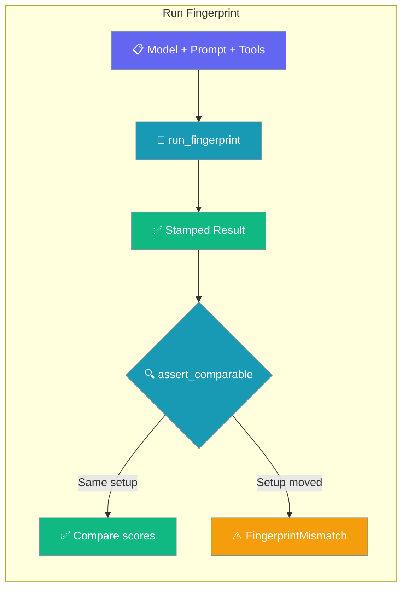
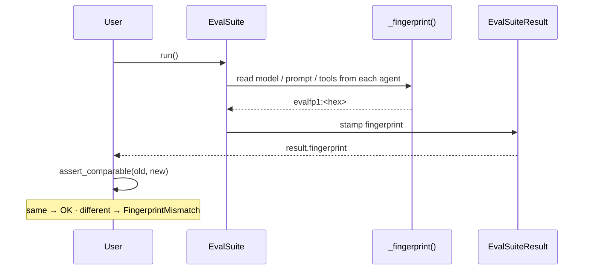

A run fingerprint identifies the setup — model, prompt, tools, evaluators — an evaluation was scored under, so two scores are never put side by side when the thing being scored has moved.



## Quick Start

<Steps>
<Step title="Automatic (recommended)">
Run an `EvalSuite` — the fingerprint is stamped onto the result. Compare two suite results with `assert_comparable`.

```python
from praisonaiagents import Agent
from praisonaiagents.eval import EvalSuite, AccuracyEvaluator, assert_comparable

agent = Agent(name="Assistant", instructions="Be helpful.")
baseline = EvalSuite(evaluators=[
    AccuracyEvaluator(agent=agent, input_text="What is 2+2?", expected_output="4"),
]).run()

# ... later, after any change ...
current = EvalSuite(evaluators=[
    AccuracyEvaluator(agent=agent, input_text="What is 2+2?", expected_output="4"),
]).run()

assert_comparable(baseline.fingerprint, current.fingerprint)  # raises if the setup moved
print(current.overall_score - baseline.overall_score)
```
</Step>

<Step title="Manual">
Compute a fingerprint yourself when you are not using `EvalSuite`.

```python
from praisonaiagents import Agent
from praisonaiagents.eval import run_fingerprint

agent = Agent(name="Assistant", instructions="Be helpful.")

fp = run_fingerprint(
    model="gpt-4o",
    prompt=agent.instructions,
    tools=agent.tools,
    evaluators=["AccuracyEvaluator"],
)
print(fp)  # evalfp1:<16-hex>
```
</Step>

<Step title="Diagnose a mismatch">
Use `fingerprint_parts` to see exactly what changed.

```python
from praisonaiagents import Agent
from praisonaiagents.eval import fingerprint_parts

agent = Agent(name="Assistant", instructions="Be helpful.")

print(fingerprint_parts(model="gpt-4o", prompt=agent.instructions, tools=agent.tools))
# {"version": "evalfp1", "model": "gpt-4o", "prompt": "...16-hex...", "tools": [...], ...}
```
</Step>
</Steps>

---

## How It Works

`EvalSuite.run()` reads `model`, `prompt`, and `tools` from each evaluator's agent and stamps the fingerprint onto the result at the start of the run.



Reading is **best-effort** — anything unreadable is left out rather than raised, so the fingerprint is never the reason an evaluation fails to run. If nothing can be read, `fingerprint` is `""`.

---

## What Goes Into a Fingerprint

Each input is reduced to a stable shape before hashing.

| Parameter | Type | Behavior |
|-----------|------|----------|
| `model` | `Any` | Model id string, or any object with a `.model` or `.name` attribute (an `Agent`, an LLM wrapper). Coerced to `str`. |
| `prompt` | `Any` | Hashed, not stored — SHA-256 first 16 hex chars. The full text is never included. |
| `tools` | `Any` | List/tuple/set of tools, or a single tool. Each reduced to its `.name` / `.__name__` / `str()` fallback. Order-independent — the list is sorted. |
| `evaluators` | `Iterable[str]` | Sorted list of evaluator class names, e.g. `["AccuracyEvaluator", "HarnessEvaluator"]`. |
| `extra` | `Optional[dict]` | Any additional key/value pairs, stringified and sorted. Escape hatch for anything else that affects the setup. |

### Deliberately excluded

- **Timestamps, run ids, sample order, latency.** Anything that varies run to run without changing what a score *means* is left out. A fingerprint that changed every run would refuse every comparison and be switched off.
- **Tool order.** A reordered tool list is the same setup. A guard that changed on reordering would refuse valid comparisons.
- **The prompt text itself.** Hashed, never stored, so fingerprints can safely land in shared result files.

### Public API

| Symbol | Kind | Purpose |
|--------|------|---------|
| `run_fingerprint(...)` | function → `str` | Compute a short, stable id (`"evalfp1:<16-hex>"`) for this setup. |
| `fingerprint_parts(...)` | function → `dict` | The exact inputs a fingerprint is computed from, for diagnosis. |
| `compare_fingerprints(left, right)` | function → `bool` | `True` when two runs were made under the same setup. |
| `assert_comparable(left, right, differing=None)` | function | Raise `FingerprintMismatch` unless two runs are comparable. |
| `FingerprintMismatch` | exception (`ValueError`) | Raised by `assert_comparable`; carries `.left`, `.right`, `.differing`. |
| `FINGERPRINT_VERSION` | `str` constant | `"evalfp1"` — version tag prefixed to every fingerprint. |

<Note>
**Missing fingerprints are unknown, not equal.** `compare_fingerprints("", "")` returns `False`, and `assert_comparable("", "")` raises `FingerprintMismatch`. Assuming legacy unstamped runs are equal would let every old baseline silently pass the check — the guard refuses instead.
</Note>

<Note>
**Prompts are hashed, never stored.** A fingerprint is written to result files and shared, so the full prompt text is never included.

```python
from praisonaiagents.eval import fingerprint_parts

secret = "customer 4111-1111-1111-1111 wants a refund"
parts = fingerprint_parts(prompt=secret)
assert secret not in str(parts)
```
</Note>

---

## Common Patterns

### Gate CI on a stable baseline

Save `result.fingerprint` alongside the score, then guard before comparing numbers on the next run.

```python
from praisonaiagents.eval import assert_comparable

assert_comparable(previous.fingerprint, current.fingerprint)
print(current.overall_score - previous.overall_score)
```

### Persist fingerprints with results

`result.summary` already includes the fingerprint — write it to disk with the score.

```python
import json
from praisonaiagents import Agent
from praisonaiagents.eval import EvalSuite, AccuracyEvaluator

agent = Agent(name="Assistant", instructions="Be helpful.")
result = EvalSuite(evaluators=[
    AccuracyEvaluator(agent=agent, input_text="What is 2+2?", expected_output="4"),
]).run()

with open("eval-report.json", "w") as f:
    json.dump(result.summary, f, indent=2, default=str)  # includes "fingerprint"
```

### Compare setups on purpose

When A/B'ing prompts, skip `assert_comparable` and record both fingerprints so the difference is visible in the graph.

```python
from praisonaiagents.eval import run_fingerprint

a = run_fingerprint(model="gpt-4o", prompt="Be terse.")
b = run_fingerprint(model="gpt-4o", prompt="Be verbose.")
print(a, b)  # two different fingerprints, compared deliberately
```

---

## Best Practices

<AccordionGroup>
<Accordion title="Always call assert_comparable before charting deltas">
A silent side-by-side of two different setups is the failure this guards against. Guard first, then subtract scores.
</Accordion>

<Accordion title="Bump FINGERPRINT_VERSION only when the recipe changes">
Old fingerprints will not compare equal to new ones after a bump — that is intentional, so scores from a changed recipe are never treated as comparable to older runs.
</Accordion>

<Accordion title="Use extra= for anything setup-affecting that isn't model/prompt/tool/evaluator">
Temperature, seed, retrieval index name — pass them through `extra=` so they become part of the fingerprint.
</Accordion>

<Accordion title="Never wrap the fingerprint in try/except and swallow">
The fingerprint code already fails silently at compute time (best-effort). Failing loud at compare time is deliberate — if two runs are not comparable, that is real.
</Accordion>
</AccordionGroup>

---

## Related

<CardGroup cols={2}>
  <Card title="Evaluation Suite" icon="scale-balanced" href="/features/eval-suite">
    Run every evaluator as one CI gate
  </Card>
  <Card title="Harness Evaluator" icon="flask" href="/features/harness-evaluator">
    Score test-harness traces
  </Card>
  <Card title="Loop Evaluator" icon="heart-pulse" href="/features/loop-evaluator">
    Score loop health and convergence
  </Card>
  <Card title="EvalPort Adapter" icon="arrows-left-right" href="/features/evalport-adapter">
    Export and import suites in the EvalPort open spec
  </Card>
</CardGroup>
