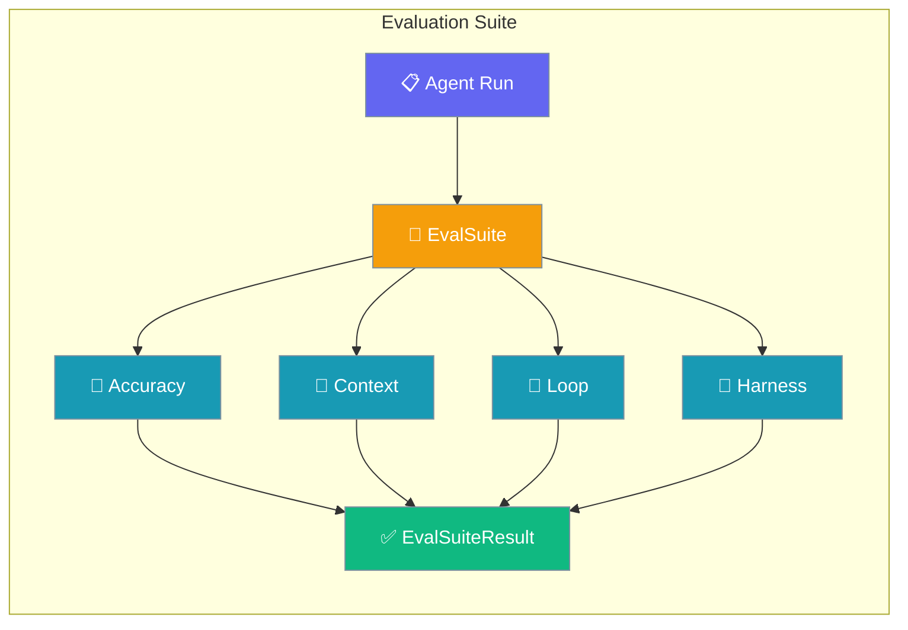
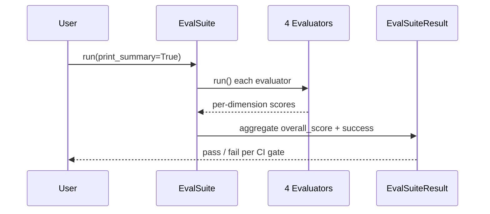

Evaluation Suite runs every evaluator you enable in one pass and returns a single result you can gate CI on.



The four core evaluators — Context, Loop, Harness, Accuracy — share one protocol and roll up into a single `EvalSuiteResult` with an aggregated score and pass/fail.

## Quick Start

<Steps>
<Step title="Run two evaluators as one gate">
Pass evaluators to `EvalSuite` and read the aggregated result.

```python
from praisonaiagents import Agent
from praisonaiagents.eval import EvalSuite, AccuracyEvaluator, HarnessEvaluator

agent = Agent(name="Assistant", instructions="Be helpful.")

suite = EvalSuite(evaluators=[
    AccuracyEvaluator(agent=agent, input_text="What is 2+2?", expected_output="4"),
    HarnessEvaluator(trace={"tool_calls": [{"name": "write_file"}], "artifacts": ["out.txt"]}),
], name="ci-gate")

result = suite.run(print_summary=True)
print(result.overall_score, result.success)
```
</Step>

<Step title="Run all four in one suite">
Reuse artifacts your agent already produces, then score every dimension at once.

```python
from praisonaiagents import Agent
from praisonaiagents.eval import (
    EvalSuite, AccuracyEvaluator, ContextEvaluator,
    HarnessEvaluator, EvaluationLoop, LoopEvaluator,
)

agent = Agent(name="Assistant", instructions="Be helpful.")
loop_result = EvaluationLoop(agent=agent, criteria="Clear plan", threshold=8.0).run("Draft a launch plan.")

suite = EvalSuite(evaluators=[
    AccuracyEvaluator(agent=agent, input_text="What is 2+2?", expected_output="4"),
    ContextEvaluator(trace_events=loop_result.trace_events, agent_order=["Assistant"]),
    HarnessEvaluator(trace={"tool_calls": [{"name": "write_file"}], "artifacts": ["plan.md"]}, required_artifacts=["plan.md"]),
], name="chl-gate")

result = suite.run(print_summary=True)
print(result.overall_score, result.success)
```
</Step>
</Steps>

---

## How It Works

`EvalSuite` fans out to each evaluator, collects every score, and aggregates one weighted `overall_score`.



| Evaluator | Scores |
|-----------|--------|
| `AccuracyEvaluator` | Output correctness against expected output (LLM-as-judge) |
| `ContextEvaluator` | Multi-agent handoff fidelity and context-budget compliance |
| `LoopEvaluator` | Loop health — convergence, wasted iterations, doom-loop guards |
| `HarnessEvaluator` | Test-harness traces — tool calls, artifacts, schema parity |

---

## Configuration Options

Each evaluator is documented on its own page; the suite only orchestrates them.

<CardGroup cols={2}>
  <Card title="Context Evaluator" icon="shuffle" href="/docs/features/context-evaluator">
    Multi-agent handoff and budget scoring
  </Card>
  <Card title="Loop Evaluator" icon="heart-pulse" href="/docs/features/loop-evaluator">
    Loop convergence and doom-loop health
  </Card>
  <Card title="Harness Evaluator" icon="flask" href="/docs/features/harness-evaluator">
    Test-harness trace scoring
  </Card>
  <Card title="Eval SDK Reference" icon="code" href="/docs/sdk/reference/praisonaiagents/modules/eval">
    Auto-generated reference for EvalSuite
  </Card>
</CardGroup>

---

## Common Patterns

### Gate CI on the aggregated score

Exit non-zero when the overall score drops below a threshold so a broken agent fails the build.

```python
import sys
from praisonaiagents.eval import EvalSuite, AccuracyEvaluator

result = EvalSuite(evaluators=[
    AccuracyEvaluator(agent=agent, input_text="What is 2+2?", expected_output="4"),
]).run()

if result.overall_score < 8.0 or not result.success:
    print(f"Eval gate failed: {result.overall_score:.1f}/10")
    sys.exit(1)
```

### Export the result as JSON

Persist the aggregated result for downstream dashboards.

```python
import json
from praisonaiagents.eval import EvalSuite, AccuracyEvaluator

result = EvalSuite(evaluators=[
    AccuracyEvaluator(agent=agent, input_text="What is 2+2?", expected_output="4"),
]).run()

with open("eval-report.json", "w") as f:
    json.dump(result.to_dict(), f, indent=2, default=str)
```

### Skip an evaluator conditionally

Drop `AccuracyEvaluator` when no LLM key is present and run the deterministic evaluators only.

```python
import os
from praisonaiagents.eval import EvalSuite, AccuracyEvaluator, HarnessEvaluator

evaluators = [HarnessEvaluator(trace={"tool_calls": [{"name": "write_file"}], "artifacts": ["out.txt"]})]
if os.getenv("OPENAI_API_KEY"):
    evaluators.append(AccuracyEvaluator(agent=agent, input_text="What is 2+2?", expected_output="4"))

result = EvalSuite(evaluators=evaluators).run()
```

---

## Best Practices

<AccordionGroup>
<Accordion title="Pick evaluators by failure mode">
Add the evaluator that catches the regression you fear — Accuracy for wrong answers, Context for lost handoffs, Loop for runaway iterations, Harness for missing artifacts.
</Accordion>

<Accordion title="Tune the threshold to your baseline">
Run the suite on a known-good agent first, then set the CI gate just below that `overall_score` so real regressions fail the build without flaky false alarms.
</Accordion>

<Accordion title="Prefer deterministic evaluators in CI">
Harness, Context, and Loop make zero LLM calls — they run offline and reproducibly. Keep `AccuracyEvaluator` behind an API-key check so keyless CI stays green.
</Accordion>

<Accordion title="Use EvalSuite over individual evaluators for gates">
Run one evaluator directly while iterating on it; switch to `EvalSuite` once you gate CI on more than one dimension so you get a single aggregated pass/fail.
</Accordion>
</AccordionGroup>

---

## Related

<CardGroup cols={2}>
  <Card title="Context Evaluator" icon="shuffle" href="/docs/features/context-evaluator">
    Score multi-agent handoff fidelity
  </Card>
  <Card title="Loop Evaluator" icon="heart-pulse" href="/docs/features/loop-evaluator">
    Score loop health and convergence
  </Card>
  <Card title="Harness Evaluator" icon="flask" href="/docs/features/harness-evaluator">
    Score Interactive Test Harness traces
  </Card>
  <Card title="Judge" icon="gavel" href="/docs/eval/judge">
    LLM-as-judge used by AccuracyEvaluator
  </Card>
</CardGroup>
