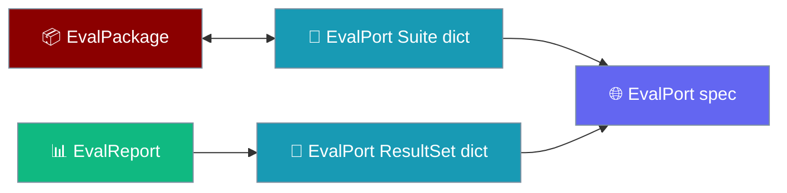
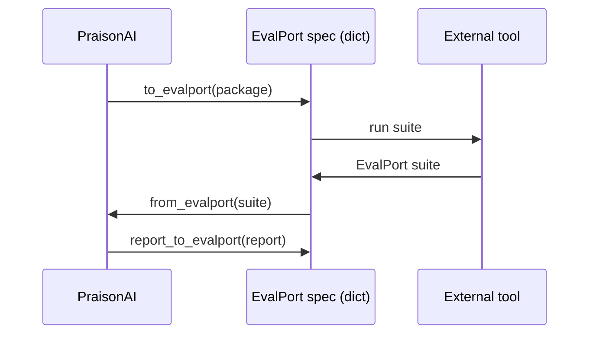
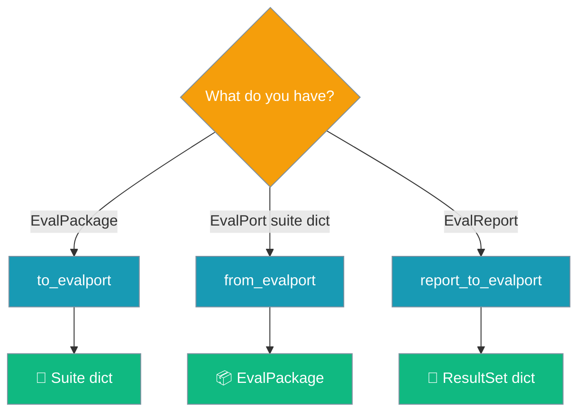

The EvalPort adapter converts native eval suites and reports to and from the [EvalPort](https://github.com/adhabnr-ux/evalport) open spec so your agents interoperate with any EvalPort-compatible tool.

An `Agent` produces an `EvalReport`; one line exports it as an EvalPort ResultSet:

```python
from praisonaiagents.eval import report_to_evalport

result_set = report_to_evalport(report)   # report: EvalReport from a suite run
```



## Quick Start

<Steps>
<Step title="Export a suite">

Build an `EvalPackage` and export it as an EvalPort suite dict:

```python
import json
from praisonaiagents.eval import EvalCase, EvalPackage, to_evalport

package = EvalPackage(
    name="math_eval",
    description="Basic math evaluation",
    cases=[EvalCase(name="addition", input="What is 2 + 2?", expected="4")],
    thresholds={"accuracy": 0.9},
)

suite = to_evalport(package)
print(json.dumps(suite, indent=2))
```

</Step>

<Step title="Import a suite from another tool">

Load an EvalPort suite dict from any compatible tool, then run it:

```python
from praisonaiagents.eval import from_evalport, EvalSuite

suite_dict = {
    "name": "external_suite",
    "cases": [{"id": "greeting", "input": "Say hello"}],
}

package = from_evalport(suite_dict)
print(package.name, len(package))
```

</Step>

<Step title="Export a run report">

Run a suite to get an `EvalReport`, then persist it as an EvalPort ResultSet:

```python
import json
from praisonaiagents.eval import report_to_evalport

result_set = report_to_evalport(report)   # report: EvalReport from a suite run
with open("results.json", "w") as f:
    json.dump(result_set, f, indent=2)
```

</Step>
</Steps>

---

## How It Works

The adapter maps native dataclasses to plain EvalPort dicts and back, so PraisonAI and external harnesses trade suites over the shared spec.



Three module-level functions cover every direction — pick one by what you hold:



| Function | Direction | Returns |
|----------|-----------|---------|
| `to_evalport(package)` | `EvalPackage` → suite | `Dict[str, Any]` |
| `from_evalport(suite)` | suite → `EvalPackage` | `EvalPackage` |
| `report_to_evalport(report)` | `EvalReport` → result set | `Dict[str, Any]` |

A round trip is lossless — `from_evalport(to_evalport(pkg))` reproduces the original package's `to_dict()`.

---

## Spec Mapping

Native models map 1:1 onto EvalPort concepts.

| PraisonAI | EvalPort | Notes |
|-----------|----------|-------|
| `EvalPackage.name` | `suite.name` | required |
| `EvalPackage.description` | `suite.description` | |
| `EvalPackage.version` | `suite.version` | defaults to `"1.0.0"` on import |
| `EvalPackage.cases[*]` | `suite.cases[*]` | see per-case rows |
| `EvalPackage.thresholds` | `suite.thresholds` | dict copy |
| `EvalPackage.seed` | `suite.seed` | passthrough |
| `EvalCase.name` | `case.id` | fallback on import: `case.name` → `"case"` |
| `EvalCase.input` | `case.input` | required |
| `EvalCase.expected` | `case.expected_output` | fallback: `case.expected`; omitted when `None` |
| `EvalCase.criteria` | `case.graders` | fallback: `case.criteria`; omitted when empty |
| `EvalCase.timeout_seconds` | `case.timeout_seconds` (top-level) | falls back to `metadata["timeout_seconds"]` on import; default `30.0` |
| `EvalCase.metadata` | `case.metadata` | dict copy, never mutated on import |
| `EvalReport.package_name` | `result_set.suite_name` | |
| `EvalReport` totals | `result_set.summary.*` | `total`, `passed`, `failed`, `pass_rate`, `average_score`, `thresholds_met` |
| `EvalResult.case_name` | `result.case_id` | |
| `EvalResult.actual_output` / `error` / `criteria_scores` / `record` | optional per-result fields | omitted when `None` / empty |

A suite dict from `to_evalport` looks like this:

```json
{
  "evalport_version": "1.0",
  "kind": "suite",
  "name": "math_eval",
  "description": "Basic math evaluation",
  "version": "1.0.0",
  "cases": [
    {
      "id": "addition",
      "input": "What is 2 + 2?",
      "expected_output": "4",
      "timeout_seconds": 30.0
    }
  ],
  "thresholds": {"accuracy": 0.9},
  "seed": null
}
```

A result set from `report_to_evalport` looks like this:

```json
{
  "evalport_version": "1.0",
  "kind": "result_set",
  "suite_name": "math_eval",
  "summary": {
    "total": 1,
    "passed": 1,
    "failed": 0,
    "pass_rate": 1.0,
    "average_score": 1.0,
    "thresholds_met": {"accuracy": true}
  },
  "results": [
    {"case_id": "addition", "passed": true, "score": 1.0, "latency_ms": 12.0}
  ]
}
```

---

## Configuration Options

The adapter is dependency-free and exposes three functions — no config classes.

<Card icon="code" href="/sdk/reference/praisonaiagents/modules/eval">
  Full Python API for the eval package, including `to_evalport`, `from_evalport`, and `report_to_evalport`
</Card>

---

## Common Patterns

Round-trip a suite locally to prove fidelity:

```python
from praisonaiagents.eval import EvalCase, EvalPackage, to_evalport, from_evalport

package = EvalPackage(name="demo", cases=[EvalCase(name="c1", input="ping")])
restored = from_evalport(to_evalport(package))
assert restored.to_dict() == package.to_dict()
```

Import a third-party EvalPort suite and run it through `HarnessEvaluator`:

```python
from praisonaiagents.eval import from_evalport, HarnessEvaluator, EvalSuite

package = from_evalport(external_suite_dict)   # from a Benchmark Hub / other harness
evaluators = [
    HarnessEvaluator(trace={"tool_calls": 1, "artifacts": ["out.txt"]}, name=case.name)
    for case in package.cases
]
report = EvalSuite(evaluators=evaluators, name=package.name).run(print_summary=True)
```

Export a report and validate it with the external `openeval` package:

```python
from praisonaiagents.eval import report_to_evalport
from openeval.validate import validate_result_set   # opt-in, install separately

result_set = report_to_evalport(report)
validate_result_set(result_set)   # your job — the adapter emits plain dicts
```

---

## Best Practices

<AccordionGroup>
<Accordion title="Timeouts live at the top level, never in metadata">
`to_evalport` writes `timeout_seconds` at the top of each case, so a user-supplied `metadata["timeout_seconds"]` can never clobber the native value. On import the adapter prefers the top-level field and only falls back to `metadata["timeout_seconds"]` for suites emitted by other tools — that is what keeps round trips lossless.
</Accordion>
<Accordion title="Validate with openeval when you need schema guarantees">
The adapter emits plain dicts and validates nothing. Validation is opt-in and lives in your own code via `openeval.validate.validate_suite()` and `validate_result_set()` — install `openeval` only in the environment that runs those checks.
</Accordion>
<Accordion title="Prefer graders / expected_output / id on export">
Exports use the canonical spec keys (`id`, `expected_output`, `graders`). The importer also accepts the fallbacks `name`, `expected`, and `criteria` for compatibility with older or external tools, so external suites with only `name` and `cases[*].id`/`input` still import — missing fields default sensibly.
</Accordion>
<Accordion title="Keep the core SDK dependency-free">
The adapter never imports `evalport-sdk` or `openeval`. Install validation packages only where you validate, so the core SDK stays lightweight everywhere else.
</Accordion>
</AccordionGroup>

---

## Related

<CardGroup cols={2}>
  <Card title="Evaluation Suite" icon="scale-balanced" href="/features/eval-suite">
    Run every evaluator as one CI gate
  </Card>
  <Card title="Harness Evaluator" icon="flask" href="/features/harness-evaluator">
    Score Interactive Test Harness traces
  </Card>
  <Card title="Judge" icon="gavel" href="/eval/judge">
    LLM-as-judge for evaluating outputs
  </Card>
  <Card title="Evaluation" icon="chart-line" href="/concepts/evaluation">
    Evaluators, suites, and reports
  </Card>
</CardGroup>
