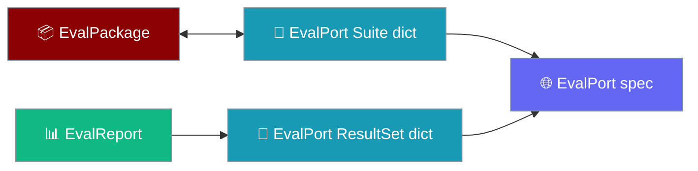
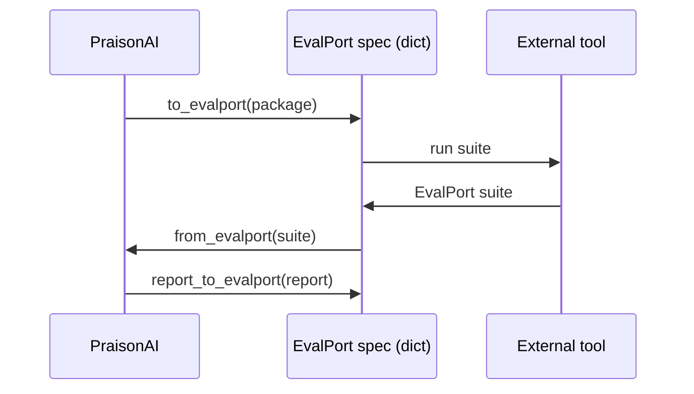
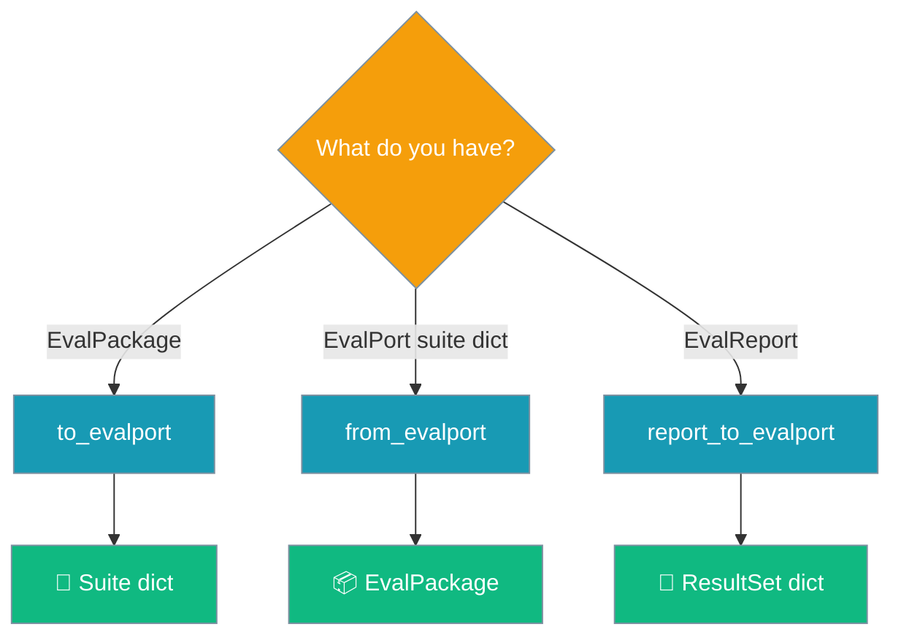

The EvalPort adapter converts native eval suites and reports to and from the [EvalPort](https://github.com/adhabnr-ux/evalport) open spec (version `1.0.0-rc.5`) so your agents interoperate with any EvalPort-compatible tool.

Run an `Agent` through a suite, then export both the suite and results as spec-conformant EvalPort documents:

```python
import json
from praisonaiagents import Agent
from praisonaiagents.eval import (
    EvalCase, EvalPackage, EvalSuite, HarnessEvaluator,
    to_evalport, report_to_evalport,
)

agent = Agent(name="Support", instructions="Answer support questions.")

package = EvalPackage(
    name="support_eval",
    cases=[EvalCase(name="refund", input="refund policy?", expected="30 days")],
)

evaluators = [HarnessEvaluator(trace={"tool_calls": 0}, name=c.name) for c in package.cases]
report = EvalSuite(evaluators=evaluators, name=package.name).run()

with open("suite.json", "w") as f:
    json.dump(to_evalport(package), f, indent=2)
with open("results.json", "w") as f:
    json.dump(report_to_evalport(report, run_id="ci-1"), f, indent=2)
```

An `Agent` produces an `EvalReport`; one line exports it as an EvalPort ResultSet:

```python
from praisonaiagents.eval import report_to_evalport

result_set = report_to_evalport(report)   # report: EvalReport from a suite run
```


```mermaid
graph LR
    Pkg[📦 EvalPackage] <--> Suite[🔌 EvalPort Suite dict]
    Report[📊 EvalReport] --> Rset[🔌 EvalPort ResultSet dict]
    Suite --> Spec[🌐 EvalPort spec]
    Rset --> Spec

    classDef pkg fill:#8B0000,stroke:#7C90A0,color:#fff
    classDef adapter fill:#189AB4,stroke:#7C90A0,color:#fff
    classDef result fill:#10B981,stroke:#7C90A0,color:#fff
    classDef spec fill:#6366F1,stroke:#7C90A0,color:#fff

    class Pkg pkg
    class Report result
    class Suite,Rset adapter
    class Spec spec
```

## Quick Start

<Steps>
<Step title="Export a suite">

Build an `EvalPackage` and export it as an EvalPort suite dict:

```python
import json
from praisonaiagents.eval import EvalCase, EvalPackage, to_evalport

package = EvalPackage(
    name="math_eval",
    description="Basic math evaluation",
    cases=[EvalCase(name="addition", input="What is 2 + 2?", expected="4")],
    thresholds={"accuracy": 0.9},
)

suite = to_evalport(package)
print(json.dumps(suite, indent=2))
```

</Step>

<Step title="Import a suite from another tool">

Load an EvalPort suite dict from any compatible tool, then run it. `from_evalport` prefers spec-shaped `test_cases` but also accepts legacy `cases`:

```python
from praisonaiagents.eval import from_evalport, EvalSuite

suite_dict = {
    "id": "external_suite",
    "test_cases": [{"id": "greeting", "input": "Say hello", "graders": ["praisonai_verdict"]}],
}

package = from_evalport(suite_dict)
print(package.name, len(package))
```

</Step>

<Step title="Export a run report">

Run a suite to get an `EvalReport`, then persist it as an EvalPort ResultSet:

```python
import json
from praisonaiagents.eval import report_to_evalport

result_set = report_to_evalport(report)   # report: EvalReport from a suite run
with open("results.json", "w") as f:
    json.dump(result_set, f, indent=2)
```

</Step>

<Step title="Pin run_id / started_at for CI">

Pass explicit `run_id` and `started_at` so CI runs produce stable, diffable output:

```python
result_set = report_to_evalport(
    report,
    run_id="ci-build-1234",
    started_at="2026-09-30T00:00:00+00:00",
)
```

</Step>
</Steps>

---

## How It Works

The adapter maps native dataclasses to plain EvalPort dicts and back, so PraisonAI and external harnesses trade suites over the shared spec.

<Note>
The **exporter** (`to_evalport`, `report_to_evalport`) now emits the spec-conformant `1.0.0-rc.5` shape. Downstream code that parsed the old fields (`kind`, `suite_name`, `case_id`, `latency_ms`, top-level `score`, `grader_scores`, top-level `thresholds`/`seed`, `timeout_seconds`) must be updated to the new keys. The **importer** (`from_evalport`) stays backward-compatible — it still reads legacy suites (`cases`, `evalport_version`, top-level `thresholds`/`seed`/`timeout_seconds`) and spec-shaped external suites with inline grader objects.
</Note>


```mermaid
sequenceDiagram
    participant PraisonAI
    participant Spec as EvalPort spec (dict)
    participant Tool as External tool

    PraisonAI->>Spec: to_evalport(package)
    Spec->>Tool: run suite
    Tool->>Spec: EvalPort suite
    Spec->>PraisonAI: from_evalport(suite)
    PraisonAI->>Spec: report_to_evalport(report)
```

Three module-level functions cover every direction — pick one by what you hold:


```mermaid
graph TB
    Q{What do you have?} -->|EvalPackage| E[to_evalport]
    Q -->|EvalPort suite dict| I[from_evalport]
    Q -->|EvalReport| R[report_to_evalport]

    E --> SuiteOut[🔌 Suite dict]
    I --> PkgOut[📦 EvalPackage]
    R --> RsetOut[🔌 ResultSet dict]

    classDef q fill:#F59E0B,stroke:#7C90A0,color:#fff
    classDef fn fill:#189AB4,stroke:#7C90A0,color:#fff
    classDef out fill:#10B981,stroke:#7C90A0,color:#fff

    class Q q
    class E,I,R fn
    class SuiteOut,PkgOut,RsetOut out
```

| Function | Direction | Returns |
|----------|-----------|---------|
| `to_evalport(package)` | `EvalPackage` → suite | `Dict[str, Any]` |
| `from_evalport(suite)` | suite → `EvalPackage` | `EvalPackage` |
| `report_to_evalport(report, *, run_id=None, started_at=None)` | `EvalReport` → result set | `Dict[str, Any]` |

A round trip is lossless — `from_evalport(to_evalport(pkg))` reproduces the original package's `to_dict()`.

---

## Spec Mapping

Native models map 1:1 onto EvalPort concepts.

| PraisonAI | EvalPort (spec `1.0.0-rc.5`) | Notes |
|-----------|------------------------------|-------|
| `EvalPackage.name` | `suite.id` **and** `suite.name` | required |
| `EvalPackage.description` | `suite.description` | omitted when empty |
| `EvalPackage.version` | `suite.metadata.praisonai.version` | package version, not the spec version |
| `EvalPackage.cases[*]` | `suite.test_cases[*]` | renamed from `cases` |
| `EvalPackage.thresholds` | `suite.metadata.praisonai.thresholds` | under reserved namespace |
| `EvalPackage.seed` | `suite.metadata.praisonai.seed` | under reserved namespace |
| (implicit) | `suite.graders` | verdict grader + one per unique criterion; required by spec |
| `EvalCase.name` | `test_case.id` | fallback on import: `test_case.name` → `"case"` |
| `EvalCase.input` | `test_case.input` | required |
| `EvalCase.expected` | `test_case.expected_output` | fallback: `expected`; omitted when `None` |
| `EvalCase.criteria` | `test_case.graders` = `["praisonai_verdict", ...criteria]` | always references the verdict grader first, deduplicated |
| `EvalCase.timeout_seconds` (positive) | `test_case.timeout_ms` | integer ms, `max(1, round(sec*1000))`; spec requires `>= 1` |
| `EvalCase.timeout_seconds` (nonpositive) | `test_case.metadata.praisonai.timeout_seconds` | preserves round-trip fidelity |
| `EvalCase.metadata` | `test_case.metadata` | dict copy, never mutated on import |
| `EvalReport.package_name` | `result_set.suite_id` | renamed |
| — | `result_set.run_id` | auto UUID (`uuid.uuid4().hex`) |
| — | `result_set.started_at` | auto RFC 3339 UTC |
| — | `result_set.runner` | `{"name": "praisonaiagents", "version": <pkg version if importable>}` |
| `EvalReport` totals | `result_set.summary.*` | `total`, `passed`, `failed`, `pass_rate`, `avg_score` (renamed, clamped to `[0,1]`) |
| `EvalReport.thresholds_met` | `result_set.metadata.praisonai.thresholds_met` | under reserved namespace |
| `EvalResult.case_name` | `result.test_case_id` | renamed |
| `EvalResult.score` | `result.grader_results[0].score` | verdict grader; clamped to `[0,1]`, raw kept in `grader_result.metadata` |
| `EvalResult.criteria_scores` | `result.grader_results[1:]` | one `grader_result` per criterion |
| `EvalResult.latency_ms` | `result.duration_ms` | integer; omitted when `None` or negative |
| `EvalResult.error` | `result.error = {"type": "runner_error", "message": str}` | structured per spec |
| `EvalResult.actual_output` | `result.actual_output` | coerced to string |
| `EvalResult.record` | `result.metadata.praisonai.record` | under reserved namespace |

Each `grader_result` carries a clamped `[0,1]` score:

```json
{"grader_id": "praisonai_verdict", "type": "custom", "score": 0.95, "passed": true}
```

A suite dict from `to_evalport` looks like this:

```json
{
  "version": "1.0.0-rc.5",
  "id": "math_eval",
  "name": "math_eval",
  "graders": [
    {
      "id": "praisonai_verdict",
      "type": "custom",
      "params": {"handler": "praisonaiagents.eval"},
      "description": "PraisonAI per-case verdict (EvalResult.passed/score)"
    }
  ],
  "test_cases": [
    {
      "id": "addition",
      "input": "What is 2 + 2?",
      "graders": ["praisonai_verdict"],
      "expected_output": "4",
      "timeout_ms": 30000
    }
  ],
  "metadata": {
    "praisonai": {
      "version": "1.0.0",
      "thresholds": {"accuracy": 0.9},
      "seed": null
    }
  },
  "description": "Basic math evaluation"
}
```

A result set from `report_to_evalport` looks like this:

```json
{
  "version": "1.0.0-rc.5",
  "suite_id": "math_eval",
  "run_id": "7f0c8c1a5d3f4a2b9e5c8d6a4b2f1e0c",
  "started_at": "2026-09-30T12:00:00+00:00",
  "runner": {"name": "praisonaiagents", "version": "0.x.y"},
  "results": [
    {
      "test_case_id": "addition",
      "passed": true,
      "grader_results": [
        {"grader_id": "praisonai_verdict", "type": "custom", "score": 1.0, "passed": true}
      ],
      "actual_output": "4",
      "duration_ms": 12
    }
  ],
  "summary": {
    "total": 1,
    "passed": 1,
    "failed": 0,
    "pass_rate": 1.0,
    "avg_score": 1.0
  },
  "metadata": {
    "praisonai": {"thresholds_met": {"accuracy": true}}
  }
}
```

---

## Configuration Options

The adapter is dependency-free and exposes three functions — no config classes.

<Card icon="code" href="/sdk/reference/praisonaiagents/modules/eval">
  Full Python API for the eval package, including `to_evalport`, `from_evalport`, and `report_to_evalport`
</Card>

---

## Common Patterns

Round-trip a suite locally to prove fidelity:

```python
from praisonaiagents.eval import EvalCase, EvalPackage, to_evalport, from_evalport

package = EvalPackage(name="demo", cases=[EvalCase(name="c1", input="ping")])
restored = from_evalport(to_evalport(package))
assert restored.to_dict() == package.to_dict()
```

Import a third-party EvalPort suite and run it through `HarnessEvaluator`:

```python
from praisonaiagents.eval import from_evalport, HarnessEvaluator, EvalSuite

package = from_evalport(external_suite_dict)   # from a Benchmark Hub / other harness
evaluators = [
    HarnessEvaluator(trace={"tool_calls": 1, "artifacts": ["out.txt"]}, name=case.name)
    for case in package.cases
]
report = EvalSuite(evaluators=evaluators, name=package.name).run(print_summary=True)
```

Prove structural conformance for both documents with the external `openeval` package:

```python
from praisonaiagents.eval import to_evalport, report_to_evalport
from openeval.validate import validate_suite, validate_result_set   # opt-in, install separately

suite = to_evalport(package)
result_set = report_to_evalport(report, run_id="ci-build-1234")

assert validate_suite(suite).valid
assert validate_result_set(result_set).valid
```

---

## Best Practices

<AccordionGroup>
<Accordion title="Timeouts export as timeout_ms (integer, >= 1)">
`to_evalport` writes a positive `timeout_seconds` as `timeout_ms` (integer milliseconds, `max(1, round(sec*1000))`) because the spec requires `timeout_ms >= 1`. A nonpositive `timeout_seconds` cannot be represented, so it is preserved under `test_case.metadata.praisonai.timeout_seconds` — the importer restores the original value, keeping round trips lossless.
</Accordion>
<Accordion title="Every test case references praisonai_verdict first">
The exported `graders` list on each test case always starts with `"praisonai_verdict"` (the spec requires at least one grader per case) followed by any criterion names, deduplicated in order. On import the adapter strips `"praisonai_verdict"` before returning `criteria`, so a round trip reproduces the original criteria exactly.
</Accordion>
<Accordion title="Pin run_id / started_at for deterministic CI">
`report_to_evalport` accepts keyword-only `run_id` and `started_at`. Left unset, `run_id` defaults to a random UUID and `started_at` to the current UTC time — pass explicit values in CI so output stays stable and diffable.

```python
result_set = report_to_evalport(
    report,
    run_id="ci-build-1234",
    started_at="2026-09-30T00:00:00+00:00",
)
```
</Accordion>
<Accordion title="Scores are clamped to [0, 1]">
Any raw score outside `[0, 1]` is clamped; the pre-clamp value survives under `grader_result.metadata["openeval.raw_score"]`. When clamping changes the summary average, the raw value is kept under `metadata.praisonai.average_score`. A non-numeric or `NaN` score becomes `null` and forces `passed: false` ("not verified").
</Accordion>
<Accordion title="Keep the core SDK dependency-free">
The adapter never imports `evalport-sdk` or `openeval`. Install validation packages only where you run `validate_suite()` / `validate_result_set()`, so the core SDK stays lightweight everywhere else.
</Accordion>
</AccordionGroup>

---

## Related

<CardGroup cols={2}>
  <Card title="Evaluation Suite" icon="scale-balanced" href="/features/eval-suite">
    Run every evaluator as one CI gate
  </Card>
  <Card title="Harness Evaluator" icon="flask" href="/features/harness-evaluator">
    Score Interactive Test Harness traces
  </Card>
  <Card title="Judge" icon="gavel" href="/eval/judge">
    LLM-as-judge for evaluating outputs
  </Card>
  <Card title="Evaluation" icon="chart-line" href="/concepts/evaluation">
    Evaluators, suites, and reports
  </Card>
</CardGroup>
