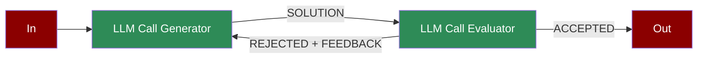

A feedback loop workflow where LLM-generated outputs are evaluated, refined, and optimized iteratively to improve accuracy and relevance.

## Quick Start

<Steps>
    <Step title="Install Package">
        First, install the PraisonAI Agents package:
        ```bash
        pip install praisonaiagents
        ```
    </Step>

    <Step title="Set API Key">
        Set your OpenAI API key as an environment variable in your terminal:
        ```bash
        export OPENAI_API_KEY=your_api_key_here
        ```
    </Step>

    <Step title="Create a file">
        Create a new file `app.py` with the basic setup:
        ```python
        from praisonaiagents import Agent, Workflow, Task
        from praisonaiagents import repeat

        # Create generator agent
        generator = Agent(
            name="Generator",
            role="Content Generator",
            goal="Generate high-quality content",
            instructions="Generate content based on the topic. Improve based on feedback if provided."
        )

        # Create evaluator agent  
        evaluator = Agent(
            name="Evaluator",
            role="Content Evaluator",
            goal="Evaluate and provide feedback on content",
            instructions="Evaluate the content quality. If good, respond with 'APPROVED'. Otherwise provide specific feedback for improvement."
        )

        # Evaluation function to check if content is approved
        def is_approved(ctx) -> bool:
            return "approved" in ctx.previous_result.lower()

        # Create workflow with evaluator-optimizer pattern
        workflow = Workflow(
            steps=[
                generator,  # First, generate content
                repeat(
                    evaluator,  # Evaluate and provide feedback
                    until=is_approved,
                    max_iterations=3
                )
            ]
        )

        # Run optimization workflow
        result = workflow.start("Write a compelling product description for an AI assistant")
        print(f"Final Result: {result['output'][:500]}...")
        ```
    </Step>

    <Step title="Start Workflow">
        Type this in your terminal to run your workflow:
        ```bash
        python app.py
        ```
    </Step>
</Steps>

<Note>
  **Requirements**
  - Python 3.10 or higher
  - OpenAI API key. Generate OpenAI API key [here](https://platform.openai.com/api-keys). Use Other models using [this guide](/models).   
  - Basic understanding of Python
</Note>

## Understanding Evaluator-Optimizer

<Card title="What is Evaluator-Optimizer?" icon="question">
  Evaluator-Optimizer pattern enables:
  - Iterative solution generation and refinement
  - Automated quality evaluation
  - Feedback-driven optimization
  - Continuous improvement loops
</Card>

## Features

<CardGroup cols={2}>
  <Card title="Solution Generation" icon="wand-magic-sparkles">
    Generate solutions based on requirements and feedback.
  </Card>
  <Card title="Quality Evaluation" icon="magnifying-glass-chart">
    Automatically assess solution quality and completeness.
  </Card>
  <Card title="Feedback Loop" icon="rotate">
    Implement iterative improvement through feedback cycles.
  </Card>
  <Card title="Process Control" icon="sliders">
    Monitor and control the optimization process.
  </Card>
</CardGroup>

## Configuration Options

```python
# Create a generator agent
generator = Agent(
    name="Generator",
    role="Solution generator",
    goal="Generate and improve solutions",
    instructions="Step-by-step instructions for generation",
      # Enable detailed logging
)

# Create an evaluator agent
evaluator = Agent(
    name="Evaluator",
    role="Solution evaluator",
    goal="Evaluate and provide feedback",
    instructions="Evaluation criteria and feedback format"
)

# Create tasks with feedback loop
generate_task = Task(
    name="generate",
    description="Generate solution",
    agent=generator,
    is_start=True,
    task_type="decision",
    next_tasks=["evaluate"]
)

evaluate_task = Task(
    name="evaluate",
    description="Evaluate solution",
    agent=evaluator,
    context=[generate_task],
    task_type="decision",
    condition={
        "more": ["generate"],  # Continue optimization
        "done": [""]  # Exit when complete
    }
)
```

## Troubleshooting

<CardGroup cols={2}>
  <Card title="Generation Issues" icon="triangle-exclamation">
    If generation is not improving:
    - Review generator instructions
    - Check feedback integration
    - Enable verbose mode for debugging
  </Card>

  <Card title="Evaluation Flow" icon="diagram-project">
    If evaluation cycle is incorrect:
    - Verify evaluation criteria
    - Check condition mappings
    - Review feedback loop connections
  </Card>
</CardGroup>

## Next Steps

<CardGroup cols={2}>
  <Card title="AutoAgents" icon="robot" href="./autoagents">
    Learn about automatically created and managed AI agents
  </Card>
  <Card title="Mini Agents" icon="microchip" href="./mini">
    Explore lightweight, focused AI agents
  </Card>
</CardGroup>

<Note>
  For optimal results, ensure your generator instructions and evaluation criteria are clear and well-defined to achieve the desired optimization outcomes.
</Note>
