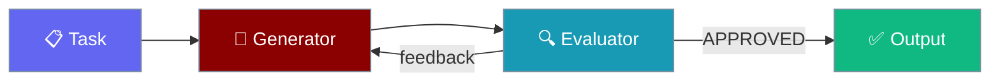
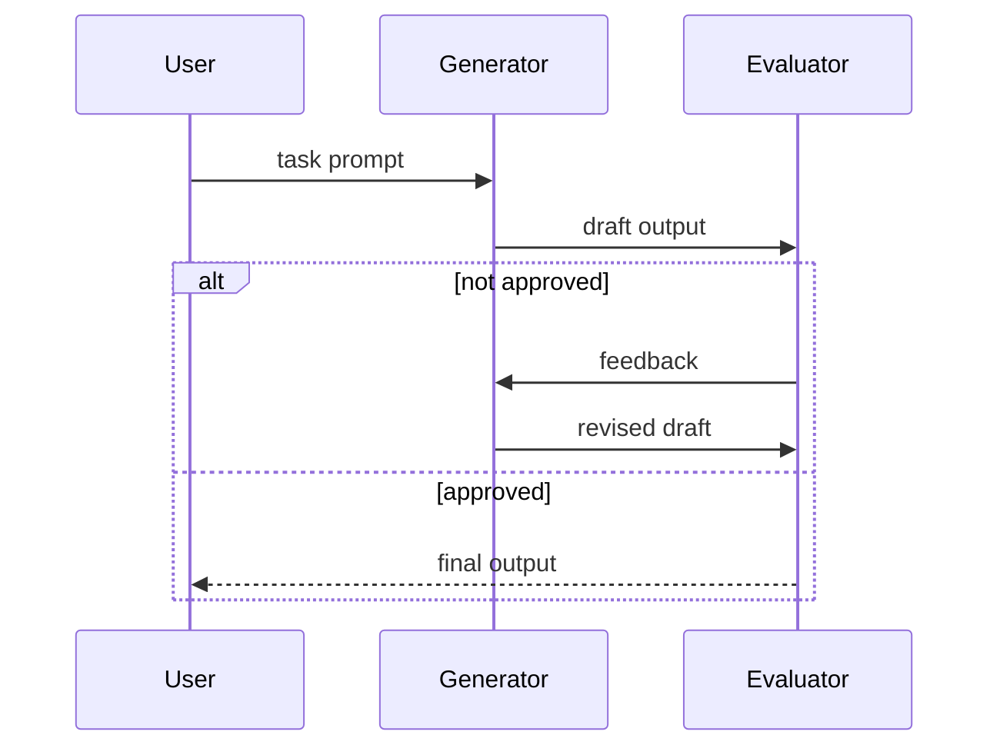

A generator agent produces drafts; an evaluator agent scores them and loops until approved — wired with `AgentFlow` and `repeat`.

```python
from praisonaiagents import Agent, AgentFlow, repeat

generator = Agent(
    name="Generator",
    instructions="Generate content. Improve based on feedback if provided.",
)
evaluator = Agent(
    name="Evaluator",
    instructions="If good, respond with APPROVED. Otherwise give specific feedback.",
)

def is_approved(ctx) -> bool:
    return "approved" in ctx.previous_result.lower()

workflow = AgentFlow(steps=[generator, repeat(evaluator, until=is_approved, max_iterations=3)])
result = workflow.start("Write a compelling product description for an AI assistant")
print(result["output"][:500])
```


```mermaid
graph LR
    In[📋 Task] --> Gen[🧠 Generator]
    Gen --> Eval[🔍 Evaluator]
    Eval -->|APPROVED| Out[✅ Output]
    Eval -->|feedback| Gen

    classDef input fill:#6366F1,stroke:#7C90A0,color:#fff
    classDef agent fill:#8B0000,stroke:#7C90A0,color:#fff
    classDef process fill:#189AB4,stroke:#7C90A0,color:#fff
    classDef output fill:#10B981,stroke:#7C90A0,color:#fff

    class In input
    class Gen,Eval agent
    class Eval process
    class Out output

    classDef tool fill:#189AB4,color:#fff
```

## Quick Start

<Steps>
<Step title="Generator + evaluator loop">

```python
from praisonaiagents import Agent, AgentFlow, repeat

generator = Agent(
    name="Generator",
    instructions="Generate high-quality content. Improve based on feedback if provided.",
)
evaluator = Agent(
    name="Evaluator",
    instructions="Evaluate quality. Respond APPROVED if good; otherwise give specific feedback.",
)

def is_approved(ctx) -> bool:
    return "approved" in ctx.previous_result.lower()

workflow = AgentFlow(
    steps=[
        generator,
        repeat(evaluator, until=is_approved, max_iterations=3),
    ]
)

result = workflow.start("Write a compelling product description for an AI assistant")
print(result["output"][:500])
```

</Step>

<Step title="Tune the feedback loop">

```python
from praisonaiagents import Agent, AgentFlow, repeat

generator = Agent(name="Generator", instructions="Generate and refine content.")
evaluator = Agent(
    name="Evaluator",
    instructions="Respond APPROVED when quality meets the bar; otherwise give feedback.",
)

def is_approved(ctx) -> bool:
    return "approved" in ctx.previous_result.lower()

workflow = AgentFlow(
    steps=[
        generator,
        repeat(evaluator, until=is_approved, max_iterations=5),
    ],
    output="verbose",
)

result = workflow.start("Draft a one-paragraph privacy policy summary")
print(result["output"])
```

</Step>
</Steps>

---

## How It Works


```mermaid
sequenceDiagram
    participant U as User
    participant G as Generator
    participant E as Evaluator

    U->>G: task prompt
    G->>E: draft output
    alt not approved
        E->>G: feedback
        G->>E: revised draft
    else approved
        E-->>U: final output
    end
```

The evaluator-optimiser pattern suits content generation, code refinement, and any task where quality improves with structured feedback.

---

## Best Practices

<AccordionGroup>
<Accordion title="Write clear evaluation criteria">
Tell the evaluator exactly what APPROVED means — tone, length, format, or test coverage — so the loop converges quickly.
</Accordion>

<Accordion title="Cap iterations with max_iterations">
Set `max_iterations` on `repeat()` to avoid runaway loops when the evaluator never approves.
</Accordion>

<Accordion title="Keep generator instructions feedback-aware">
Instruct the generator to incorporate evaluator feedback explicitly on each pass.
</Accordion>

<Accordion title="Use verbose mode while tuning">
Enable verbose output on agents while calibrating criteria, then disable for production runs.
</Accordion>
</AccordionGroup>

---

## Related

<CardGroup cols={2}>
<Card title="Dynamic Judge" icon="gavel" href="/docs/features/dynamic-judge">
  Score outputs against custom rubrics
</Card>
<Card title="Workflows" icon="diagram-project" href="/docs/features/workflows">
  Compose multi-step agent workflows with AgentFlow
</Card>
</CardGroup>
