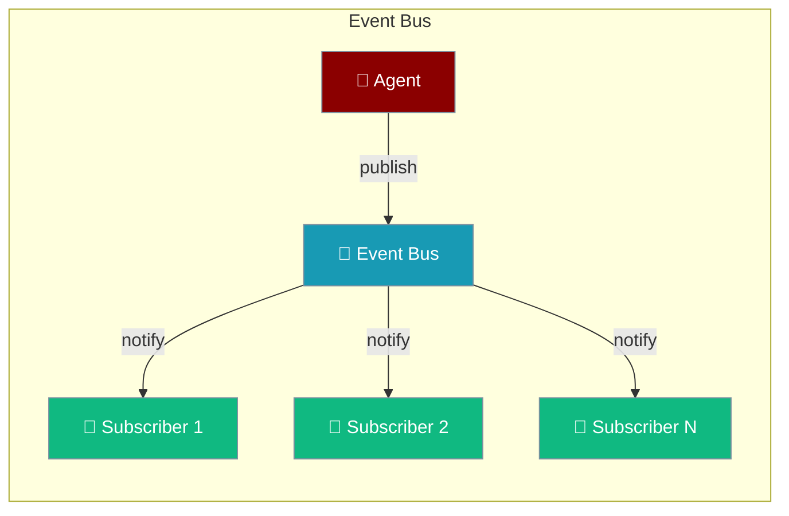
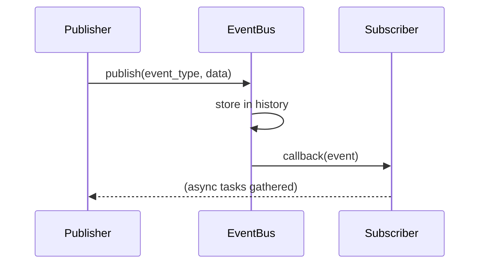

The Event Bus lets agent components talk to each other without being tightly coupled — publish an event once, any number of listeners react.



<Note>
`publish()` and `publish_async()` are zero-overhead when there are no subscribers. Check `bus.subscriber_count > 0` before building expensive payloads to get the same benefit in your own code.
</Note>

## Quick Start

<Steps>
<Step title="Install">
```bash
pip install praisonaiagents
```
</Step>

<Step title="Subscribe and publish">
```python
from praisonaiagents.bus import EventBus, EventType

bus = EventBus()

def on_message(event):
    print(f"Received: {event.data}")

bus.subscribe(on_message, event_types=EventType.MESSAGE_CREATED)

bus.publish(
    EventType.MESSAGE_CREATED,
    data={"text": "Hello, World!"},
    source="demo",
)
```
</Step>

<Step title="Use the global bus with an agent">
```python
from praisonaiagents import Agent
from praisonaiagents.bus import get_default_bus, EventType

bus = get_default_bus()

bus.subscribe(
    lambda e: print(f"Tool used: {e.data}"),
    event_types=EventType.TOOL_COMPLETED,
)

agent = Agent(name="Assistant", instructions="Answer concisely.")
agent.start("What is 2 + 2?")
```
</Step>
</Steps>

---

## How It Works



---

## Event Types

| Event Type | Value | Description |
|------------|-------|-------------|
| `SESSION_CREATED` | `session.created` | New session created |
| `SESSION_UPDATED` | `session.updated` | Session modified |
| `SESSION_DELETED` | `session.deleted` | Session deleted |
| `SESSION_FORKED` | `session.forked` | Session forked |
| `SESSION_REVERTED` | `session.reverted` | Session reverted |
| `MESSAGE_CREATED` | `message.created` | New message added |
| `MESSAGE_UPDATED` | `message.updated` | Message updated |
| `MESSAGE_PART_CREATED` | `message.part.created` | Message part added |
| `MESSAGE_PART_UPDATED` | `message.part.updated` | Message part updated |
| `PERMISSION_ASKED` | `permission.asked` | Permission requested |
| `PERMISSION_REPLIED` | `permission.replied` | Permission answered |
| `AGENT_STARTED` | `agent.started` | Agent execution started |
| `AGENT_COMPLETED` | `agent.completed` | Agent execution completed |
| `AGENT_ERROR` | `agent.error` | Agent execution failed |
| `SUBAGENT_SPAWNED` | `subagent.spawned` | Sub-agent was spawned |
| `SUBAGENT_COMPLETED` | `subagent.completed` | Sub-agent finished successfully |
| `SUBAGENT_ERROR` | `subagent.error` | Sub-agent task failed |
| `TOOL_STARTED` | `tool.started` | Tool execution started |
| `TOOL_COMPLETED` | `tool.completed` | Tool execution completed |
| `TOOL_ERROR` | `tool.error` | Tool execution failed |
| `SNAPSHOT_CREATED` | `snapshot.created` | File snapshot created |
| `SNAPSHOT_RESTORED` | `snapshot.restored` | Snapshot restored |
| `SERVER_STARTED` | `server.started` | Server started |
| `SERVER_STOPPED` | `server.stopped` | Server stopped |
| `CLIENT_CONNECTED` | `client.connected` | Client connected |
| `CLIENT_DISCONNECTED` | `client.disconnected` | Client disconnected |
| `COMPACTION_STARTED` | `compaction.started` | Context compaction started |
| `COMPACTION_COMPLETED` | `compaction.completed` | Context compaction done |
| `CUSTOM` | `custom` | User-defined event |

---

## API Reference

### EventBus

```python
class EventBus:
    def subscribe(
        self,
        callback: Callable[[Event], Any],
        event_types: Optional[Union[str, List[str], Set[str]]] = None,
    ) -> str:
        """Subscribe to events. Returns subscription ID."""

    def unsubscribe(self, subscription_id: str) -> bool:
        """Unsubscribe. Returns True if found and removed."""

    def on(self, *event_types: Union[str, EventType]) -> Callable:
        """Decorator to subscribe a function to one or more event types."""

    def publish(
        self,
        event_type: Union[str, EventType],
        data: Optional[Dict[str, Any]] = None,
        source: Optional[str] = None,
        metadata: Optional[Dict[str, Any]] = None,
    ) -> Event:
        """Publish an event to all matching subscribers."""

    def publish_event(self, event: Event) -> Event:
        """Publish a pre-constructed Event object."""

    async def publish_async(
        self,
        event_type: Union[str, EventType],
        data: Optional[Dict[str, Any]] = None,
        source: Optional[str] = None,
        metadata: Optional[Dict[str, Any]] = None,
    ) -> Event:
        """Publish an event and await all async subscribers."""

    @property
    def subscriber_count(self) -> int:
        """Number of active subscribers (acquires lock)."""

    def get_history(
        self,
        event_type: Optional[str] = None,
        limit: int = 100,
    ) -> List[Event]:
        """Get recent event history, optionally filtered by event_type."""

    def clear_history(self) -> None:
        """Clear the event history."""

    def clear_subscribers(self) -> None:
        """Remove all subscribers."""
```

### Event

```python
@dataclass
class Event:
    type: str                        # Event type string
    data: Dict[str, Any]             # Event payload (default: {})
    id: str                          # Unique event ID (auto-generated)
    timestamp: float                 # Unix timestamp (auto-generated)
    source: Optional[str]            # Source identifier (default: None)
    metadata: Dict[str, Any]         # Additional metadata (default: {})
```

### Module-level helpers

```python
def get_default_bus() -> EventBus:
    """Get (or lazily create) the shared global bus."""

def set_default_bus(bus: EventBus) -> None:
    """Replace the global bus with a custom instance."""
```

---

## Common Patterns

### Async subscriber

```python
import asyncio
from praisonaiagents.bus import EventBus, EventType

bus = EventBus()

async def async_handler(event):
    await asyncio.sleep(0.1)
    print(f"Async received: {event.data}")

bus.subscribe(async_handler, event_types=EventType.TOOL_COMPLETED)

await bus.publish_async(
    EventType.TOOL_COMPLETED,
    data={"tool": "bash", "result": "success"},
)
```

### Decorator-style subscription

```python
from praisonaiagents.bus import EventBus, EventType

bus = EventBus()

@bus.on(EventType.SESSION_CREATED)
def handle_session(event):
    print(f"Session created: {event.data}")
```

### Guard expensive payloads

Check `subscriber_count` before building a costly payload:

```python
from praisonaiagents import Agent
from praisonaiagents.bus import get_default_bus, EventType

bus = get_default_bus()

def expensive_summarise(text: str) -> str:
    return text[:200]

def on_memory_event(event):
    print(event.data)

bus.subscribe(on_memory_event, event_types=EventType.CUSTOM)

text = "Long agent transcript..."
if bus.subscriber_count > 0:
    payload = {
        "memory_type": "long_term",
        "snippet": expensive_summarise(text),
    }
    bus.publish(EventType.CUSTOM, payload, source="memory")

agent = Agent(name="Observer", instructions="You observe events.")
agent.start("Say hello briefly.")
```

### Event history

```python
from praisonaiagents.bus import EventBus, EventType

bus = EventBus()

for i in range(10):
    bus.publish(EventType.CUSTOM, data={"index": i})

history = bus.get_history(limit=5)
print(f"Last 5 events: {len(history)}")

tool_events = bus.get_history(event_type="tool.completed", limit=20)
```

---

## Best Practices

<AccordionGroup>
<Accordion title="Use the global bus for agent-wide events">
Call `get_default_bus()` everywhere instead of creating multiple `EventBus()` instances. All PraisonAI internals emit onto the same default bus.
</Accordion>

<Accordion title="Always store and use subscription IDs">
`subscribe()` returns an ID. Store it so you can call `unsubscribe(id)` when a component shuts down — otherwise handlers accumulate and never get cleaned up.

```python
sub_id = bus.subscribe(my_handler, event_types=EventType.TOOL_COMPLETED)
# later...
bus.unsubscribe(sub_id)
```
</Accordion>

<Accordion title="Guard expensive payload construction">
Before building large dicts or calling costly functions, check `bus.subscriber_count > 0`. If nobody is listening, skip the work entirely.
</Accordion>

<Accordion title="Prefer publish_async in async contexts">
In async code, use `await bus.publish_async(...)` so async subscribers are properly awaited with `asyncio.gather`. Plain `publish()` schedules async callbacks as fire-and-forget tasks.
</Accordion>
</AccordionGroup>

---

## Related

<CardGroup cols={2}>
<Card title="Spawn & Announce" icon="sitemap" href="/docs/features/spawn-announce">
Sub-agent coordination pattern built on the Event Bus
</Card>
<Card title="Agents" icon="user" href="/docs/concepts/agents">
Core agent configuration and execution
</Card>
</CardGroup>
