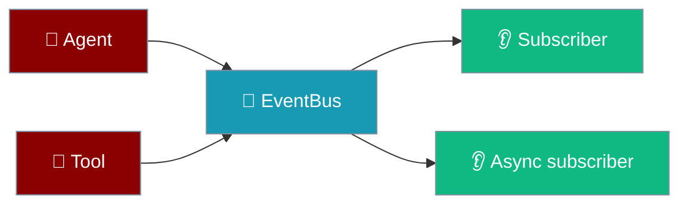

Subscribe to agent lifecycle and tool events with a typed event bus — zero cost when nothing is listening.

```python
from praisonaiagents import Agent
from praisonaiagents.bus import EventBus, EventType

bus = EventBus()

def on_tool_done(event):
    print(f"Tool finished: {event.data}")

bus.subscribe(on_tool_done, event_types=EventType.TOOL_COMPLETED)

agent = Agent(name="assistant", instructions="Be helpful")
agent.start("Say hello briefly.")
```



## Quick Start

<Steps>
<Step title="Subscribe and publish">

```python
from praisonaiagents.bus import EventBus, EventType

bus = EventBus()

def on_message(event):
    print(f"Received: {event.data}")

bus.subscribe(on_message, event_types=EventType.MESSAGE_CREATED)

bus.publish(
    EventType.MESSAGE_CREATED,
    data={"text": "Hello, World!"},
    source="demo",
)
```

</Step>

<Step title="Global bus with an agent">

```python
from praisonaiagents import Agent
from praisonaiagents.bus import get_default_bus, EventType

bus = get_default_bus()

bus.subscribe(
    lambda e: print(f"Agent started: {e.data}"),
    event_types=EventType.AGENT_STARTED,
)
bus.subscribe(
    lambda e: print(f"Tool used: {e.data}"),
    event_types=EventType.TOOL_COMPLETED,
)

agent = Agent(name="Assistant", instructions="Be helpful")
agent.start("Hello!")
```

</Step>
</Steps>

<Note>
`publish()` returns immediately when there are no subscribers — no lock, no UUID, no history. Wrap expensive payload construction in a `has_subscribers` check.
</Note>

---

## Event Types

| Event Type | Description |
|------------|-------------|
| `SESSION_CREATED` / `UPDATED` / `DELETED` / `FORKED` | Session lifecycle |
| `MESSAGE_CREATED` | New message added |
| `TOOL_STARTED` / `TOOL_COMPLETED` | Tool execution |
| `AGENT_STARTED` / `AGENT_COMPLETED` | Agent execution |
| `SUBAGENT_SPAWNED` / `COMPLETED` / `ERROR` | Sub-agent coordination |
| `SNAPSHOT_CREATED` | File snapshot |
| `COMPACTION_COMPLETED` | Context compaction |
| `CUSTOM` | Application-defined events |

---

## Common Patterns

**Async subscriber:**

```python
import asyncio
from praisonaiagents.bus import EventBus, EventType

bus = EventBus()

async def async_handler(event):
    await asyncio.sleep(0.1)
    print(event.data)

bus.subscribe(async_handler, event_types=EventType.TOOL_COMPLETED)
await bus.publish_async(EventType.TOOL_COMPLETED, data={"tool": "bash"})
```

**Guard expensive payloads:**

```python
from praisonaiagents.bus import get_default_bus, EventType

bus = get_default_bus()

if bus.has_subscribers:
    bus.publish(
        EventType.CUSTOM,
        data={"snippet": expensive_summarise(text)},
        source="memory",
    )
```

**Event history:**

```python
bus = EventBus(history_size=1000)
bus.publish(EventType.CUSTOM, data={"index": 1})
recent = bus.get_history(limit=5)
```

---

## Best Practices

<AccordionGroup>
<Accordion title="Check has_subscribers before heavy work">
Building summaries or embeddings for events nobody listens to wastes CPU — guard with `bus.has_subscribers`.
</Accordion>

<Accordion title="Filter by event_types">
Pass `event_types=` to `subscribe()` so handlers only run for relevant events.
</Accordion>

<Accordion title="Use get_default_bus for cross-component wiring">
The shared default bus lets agents, memory, and hooks emit events without passing a bus instance everywhere.
</Accordion>

<Accordion title="Prefer sync handlers unless you need async">
Sync callbacks run inline; async handlers are awaited during `publish_async` only.
</Accordion>
</AccordionGroup>

---

## Related

<CardGroup cols={2}>
<Card title="Hook Events" icon="bolt" href="/docs/features/hook-events">
  Hook lifecycle events alongside the bus
</Card>
<Card title="Spawn & Announce" icon="users" href="/docs/features/spawn-announce">
  Sub-agent events and coordination
</Card>
</CardGroup>
