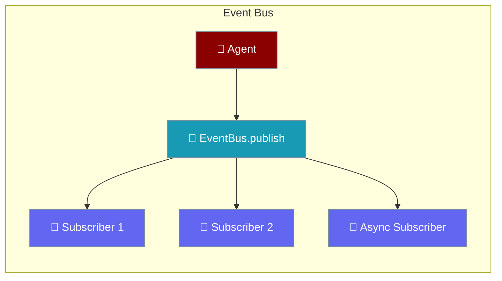

<Note>
The Event Bus is **zero-cost when no one is listening**. `publish()` returns immediately if there are no subscribers. Use `has_subscribers` to skip expensive payload construction.
</Note>

Event Bus provides a typed pub/sub system so agent components can communicate without tight coupling.



## Quick Start

<Steps>
<Step title="Subscribe and publish events">
```python
from praisonaiagents.bus import EventBus, EventType

bus = EventBus()

def on_message(event):
    print(f"Received: {event.data}")

bus.subscribe(on_message, event_types=EventType.MESSAGE_CREATED)

bus.publish(
    EventType.MESSAGE_CREATED,
    data={"text": "Hello, World!"},
    source="demo",
)
```
</Step>

<Step title="Monitor agent execution with the global bus">
```python
from praisonaiagents import Agent
from praisonaiagents.bus import get_default_bus, EventType

bus = get_default_bus()

bus.subscribe(
    lambda e: print(f"Tool used: {e.data}"),
    event_types=EventType.TOOL_COMPLETED,
)

agent = Agent(name="Assistant", instructions="You are helpful.")
agent.chat("Hello!")
```
</Step>
</Steps>

---

## Event Types

The following event types are available:

| Event Type | Description |
|------------|-------------|
| `SESSION_CREATED` | New session created |
| `SESSION_UPDATED` | Session modified |
| `SESSION_DELETED` | Session deleted |
| `SESSION_FORKED` | Session forked |
| `MESSAGE_CREATED` | New message added |
| `TOOL_STARTED` | Tool execution started |
| `TOOL_COMPLETED` | Tool execution completed |
| `AGENT_STARTED` | Agent execution started |
| `AGENT_COMPLETED` | Agent execution completed |
| `SUBAGENT_SPAWNED` | Sub-agent was spawned via the spawn-announce pattern |
| `SUBAGENT_COMPLETED` | Sub-agent finished its task successfully |
| `SUBAGENT_ERROR` | Sub-agent task failed with an error |
| `SNAPSHOT_CREATED` | File snapshot created |
| `COMPACTION_COMPLETED` | Context compaction done |
| `CUSTOM` | Custom event type |

## API Reference

### EventBus

```python
class EventBus:
    def subscribe(
        self,
        callback: Callable[[Event], Any],
        event_types: Optional[Union[str, List[str], Set[str]]] = None,
    ) -> str:
        """Subscribe to events. Returns subscription ID."""
    
    def unsubscribe(self, subscription_id: str) -> bool:
        """Unsubscribe from events."""
    
    def publish(
        self,
        event_type: Union[str, EventType],
        data: Optional[Dict[str, Any]] = None,
        source: Optional[str] = None,
        metadata: Optional[Dict[str, Any]] = None,
    ) -> Event:
        """Publish an event to all subscribers."""
    
    def publish_event(self, event: Event) -> Event:
        """Publish a pre-constructed Event object."""
    
    async def publish_async(
        self,
        event_type: Union[str, EventType],
        data: Optional[Dict[str, Any]] = None,
        source: Optional[str] = None,
        metadata: Optional[Dict[str, Any]] = None,
    ) -> Event:
        """Publish an event asynchronously."""
    
    @property
    def has_subscribers(self) -> bool:
        """True if there are any subscribers (lock-free, O(1))."""
    
    @property
    def subscriber_count(self) -> int:
        """Number of subscribers (takes the lock)."""
    
    def get_history(self, limit: int = 100) -> List[Event]:
        """Get recent event history."""
```

### Event

```python
@dataclass
class Event:
    type: EventType  # Event type
    data: Dict[str, Any]  # Event payload
    source: Optional[str]  # Source identifier
    timestamp: float  # Unix timestamp
    id: str  # Unique event ID
```

## Examples

### Async Subscriber

```python
import asyncio
from praisonaiagents.bus import EventBus, EventType

bus = EventBus()

async def async_handler(event):
    await asyncio.sleep(0.1)
    print(f"Async received: {event.data}")

bus.subscribe(async_handler, event_types=EventType.TOOL_COMPLETED)

# Publish asynchronously
await bus.publish_async(
    EventType.TOOL_COMPLETED,
    data={"tool": "bash", "result": "success"},
)
```

### Global Event Bus

```python
from praisonaiagents.bus import get_default_bus, EventType

# Get the global bus instance
bus = get_default_bus()

# All components can share this bus
bus.publish(EventType.CUSTOM, data={"action": "startup"})
```

### Event History

```python
from praisonaiagents.bus import EventBus, EventType

bus = EventBus(history_size=1000)

# Publish some events
for i in range(10):
    bus.publish(EventType.CUSTOM, data={"index": i})

# Get recent history
history = bus.get_history(limit=5)
print(f"Last 5 events: {len(history)}")
```

### Guard expensive payloads with `has_subscribers`

When your agent builds a heavy payload (summaries, embeddings, large dicts), check `has_subscribers` first so you skip that work when nothing is listening:

```python
from praisonaiagents import Agent
from praisonaiagents.bus import get_default_bus, EventType

bus = get_default_bus()

def expensive_summarise(text: str) -> str:
    return text[:200]  # stand-in for a costly call

def on_memory_event(event):
    print(event.data)

bus.subscribe(on_memory_event, event_types=EventType.CUSTOM)

text = "Long agent transcript..."
if bus.has_subscribers:
    payload = {
        "memory_type": "long_term",
        "snippet": expensive_summarise(text),
    }
    bus.publish(EventType.CUSTOM, payload, source="memory")

agent = Agent(name="Observer", instructions="You observe events.")
agent.start("Say hello briefly.")
```

## Integration with Agents

The Event Bus integrates with PraisonAI Agents to provide real-time notifications:

```python
from praisonaiagents import Agent
from praisonaiagents.bus import get_default_bus, EventType

bus = get_default_bus()

# Monitor agent activity
bus.subscribe(
    lambda e: print(f"Agent started: {e.data}"),
    event_types=EventType.AGENT_STARTED,
)

bus.subscribe(
    lambda e: print(f"Tool used: {e.data}"),
    event_types=EventType.TOOL_COMPLETED,
)

# Agent will emit events during execution
agent = Agent(name="Assistant")
agent.chat("Hello!")

# See also: [Spawn & Announce](/docs/features/spawn-announce) for sub-agent event coordination
```

---

## Best Practices

<AccordionGroup>
<Accordion title="Guard expensive payloads with has_subscribers">
Check `bus.has_subscribers` before constructing costly payloads. If no one is listening, skip the work entirely.

```python
if bus.has_subscribers:
    bus.publish(EventType.CUSTOM, {"data": expensive_call()})
```
</Accordion>

<Accordion title="Use the global bus for cross-component events">
The `get_default_bus()` singleton is shared across all components. Use it for application-wide events to avoid multiple bus instances.

```python
from praisonaiagents.bus import get_default_bus
bus = get_default_bus()
```
</Accordion>

<Accordion title="Use async subscribers for I/O operations">
Async subscribers don't block the agent loop. Use them for writing to databases, sending webhooks, or updating dashboards.
</Accordion>

<Accordion title="Set history_size for debugging">
Enable event history with `EventBus(history_size=1000)` to replay and debug event sequences during development.
</Accordion>
</AccordionGroup>

---

## Related

<CardGroup cols={2}>
<Card title="Agent Server" icon="server" href="/features/agent-server">
  HTTP server that broadcasts agent events via SSE
</Card>
<Card title="Display System" icon="display" href="/features/display-system">
  Custom display callbacks for agent output
</Card>
</CardGroup>
