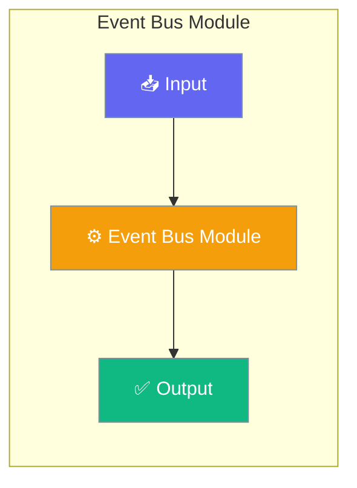

# Event Bus Module

The Event Bus provides a typed, publish-subscribe event system for PraisonAI Agents. It enables decoupled communication between components with support for both synchronous and asynchronous subscribers.




## Features

- **Typed Events** - Predefined event types for common operations
- **Sync/Async Subscribers** - Support for both synchronous and async handlers
- **Event Filtering** - Subscribe to specific event types
- **Event History** - Optional event history tracking
- **Global Default Bus** - Shared bus instance for application-wide events

<Note>
The Event Bus is **zero-cost when no one is listening**. `publish()` and `publish_async()` return immediately without taking a lock, generating a `uuid4`, or recording history if there are no subscribers. Wrap expensive payload construction in a `has_subscribers` check to skip that work too.
</Note>

## Installation

The Event Bus is included in the core `praisonaiagents` package:

```bash
pip install praisonaiagents
```

## Quick Start


<Steps>
<Step title="Quick Start">
```python
from praisonaiagents.bus import EventBus, EventType

# Create an event bus
bus = EventBus()

# Subscribe to events
def on_message(event):
    print(f"Received: {event.data}")

bus.subscribe(on_message, event_types=EventType.MESSAGE_CREATED)

# Publish an event
bus.publish(
    EventType.MESSAGE_CREATED,
    data={"text": "Hello, World!"},
    source="demo",
)
```
</Step>
</Steps>


## Best Practices

<AccordionGroup>
  <Accordion title="Start simple">
    Enable the feature with a single parameter before adding configuration. Verify it works, then layer in options.
  </Accordion>
  <Accordion title="Use environment variables for secrets">
    Never hardcode API keys or tokens. Use `os.getenv("KEY_NAME")` to read from environment variables.
  </Accordion>
  <Accordion title="Test with minimal examples first">
    Copy the Quick Start example, run it, then extend it. This confirms your environment is set up correctly.
  </Accordion>
  <Accordion title="Check the logs">
    Set `verbose=True` on your agent to see detailed execution logs when debugging unexpected behavior.
  </Accordion>
</AccordionGroup>

## Related

<CardGroup cols={2}>
  <Card title="Features Overview" icon="grid-2" href="/docs/features">
    Browse all PraisonAI features
  </Card>
  <Card title="Quick Start" icon="rocket" href="/docs/introduction">
    Get started with PraisonAI agents
  </Card>
</CardGroup>
