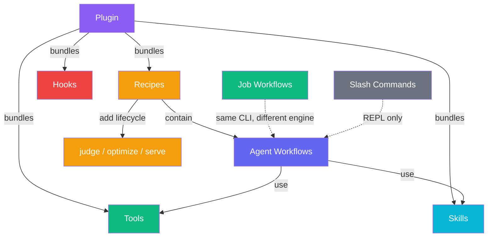
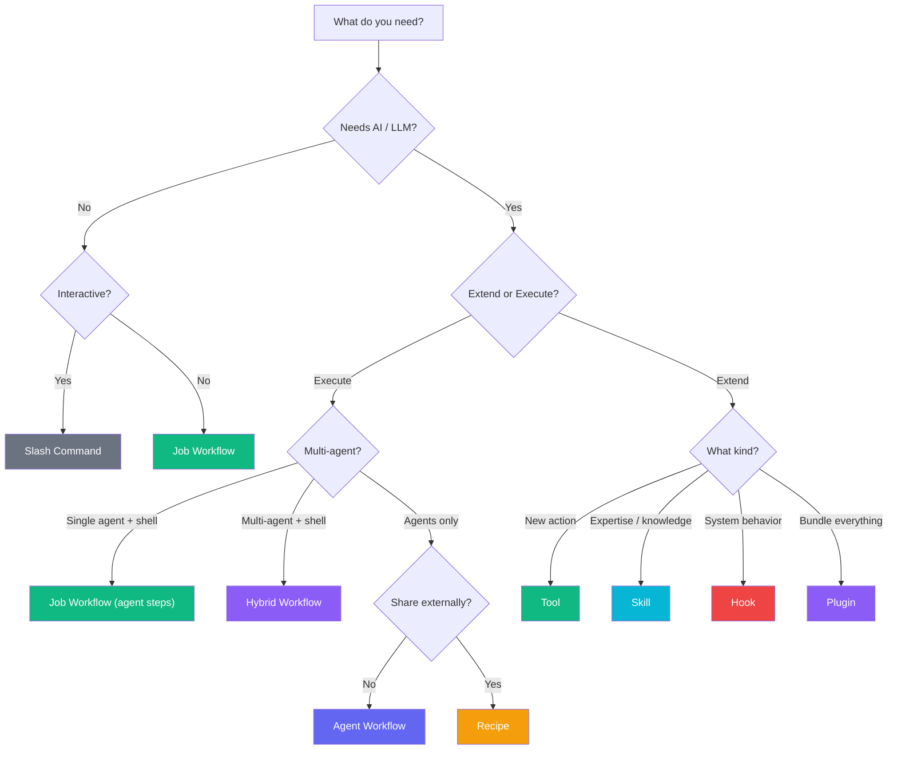

PraisonAI has **9 distinct systems** across two categories: **Execution Systems** (things that run) and **Extension Systems** (things that extend agent capabilities).

## At a Glance

### Execution Systems

| System | CLI | What Runs | Deterministic | Needs API Key |
|--------|-----|-----------|:---:|:---:|
| **Job Workflows** | `praisonai workflow run` | Shell, Python, actions, agent steps | Mostly ✅ | Only for agent steps |
| **Agent Workflows** | `praisonai workflow run` | LLM agents collaborating | ❌ | ✅ |
| **Hybrid Workflows** | `praisonai workflow run` | Job + multi-agent steps | Mixed | ✅ |
| **Recipes** | `praisonai recipe run` | LLM agents + lifecycle | ❌ | ✅ |
| **Slash Commands** | `/cmd` in REPL | Handler functions | ✅ | ❌ |

### Extension Systems

| System | Scope | What It Provides |
|--------|-------|-----------------|
| **Tools** | Per-agent | Callable functions (`@tool`, `BaseTool`) |
| **Skills** | Per-agent | Declarative expertise (`SKILL.md` + prompts) |
| **Plugins** | System-wide | Bundled tools + hooks + skills + recipes |
| **Hooks & Callbacks** | System-wide | Lifecycle interception and notification |

---

## Execution Systems

### 1. Job Workflows

Ordered step execution mixing deterministic automation and AI agent steps.

**Discriminator**: `type: job` in YAML | **Engine**: `JobWorkflowExecutor`

**Deterministic steps**: `run:` (shell), `python:` (script), `script:` (inline Python), `action:` (custom/built-in)

**Agent-centric steps**: `agent:` (AI agent), `judge:` (quality gate), `approve:` (approval gate)

```yaml
type: job
name: smart-release
steps:
  - name: Build
    run: uv build
  - name: Generate changelog
    agent:
      role: Technical Writer
      prompt: Generate changelog
      model: gpt-4o-mini
    output_file: CHANGELOG.md
  - name: Quality check
    judge:
      input_file: CHANGELOG.md
      threshold: 8.0
      on_fail: warn
```

**Key features**: 3-tier action resolution, custom CLI flags, conditional steps, `--dry-run`, agent/judge/approve steps

<CardGroup cols={2}>
  <Card title="Job Workflows" icon="list-check" href="/docs/features/job-workflows">
    Step types, agent steps, flags, conditionals
  </Card>
  <Card title="Custom Actions" icon="puzzle-piece" href="/docs/features/custom-actions">
    YAML-defined, file-based, and built-in actions
  </Card>
</CardGroup>

---

### 2. Agent Workflows

LLM-powered agent pipelines — AI agents collaborate on tasks.

**Discriminator**: No `type` field (default) | **Engine**: Agent Workflow Engine

```yaml
topic: Research AI Trends
roles:
  researcher:
    role: AI Researcher
    goal: Find latest papers
    tools:
      - internet_search
```

```bash
praisonai workflow run research.yaml
```

**Key features**: Agents with roles/goals/backstories, tool integration, multi-agent collaboration, non-deterministic

<Card title="Agent Workflows" icon="robot" href="/docs/features/workflows">
  Agent definitions, tasks, process types
</Card>

---

### 2.5. Hybrid Workflows

Combines job workflow steps (deterministic + agent) with multi-agent collaboration steps.

**Discriminator**: `type: hybrid` in YAML | **Engine**: `HybridWorkflowExecutor`

Supports all job workflow step types **plus**:
- `workflow:` — execute a named agent from the `agents:` block
- `parallel:` — run multiple sub-steps concurrently

```yaml
type: hybrid
agents:
  researcher:
    role: Research Analyst
    instructions: Provide concise findings
steps:
  - name: Setup
    run: echo "Starting..."
  - name: Research
    workflow:
      agent: researcher
      action: Research best practices
  - name: Parallel checks
    parallel:
      - run: echo "Lint passed"
      - run: echo "Tests passed"
```

<Card title="Hybrid Workflows" icon="shuffle" href="/docs/features/hybrid-workflows">
  Multi-agent + deterministic steps in one pipeline
</Card>


### 3. Recipes

Packaged, distributable agent workflows with full lifecycle management.

**CLI**: `praisonai recipe` (separate command group) | **Engine**: `recipe.run()`

**Discovery (5-tier)**: `$PRAISONAI_RECIPE_PATH` → `./recipes/` → `~/.praison/recipes/` → `agent_recipes` pip package → built-in

```bash
praisonai recipe run support-reply --input '{"ticket_id": "T-123"}'
praisonai recipe judge run-abc123 --yaml agents.yaml
praisonai recipe optimize my-recipe --iterations 5
praisonai recipe pack my-recipe
praisonai recipe publish my-recipe.praison
praisonai recipe serve my-recipe
```

**Key features**: `pack`/`publish`/`pull`/`install`, `judge`/`optimize`/`apply` lifecycle, policy packs, SBOM/audit, HTTP serving, trace replay

<Card title="Recipes" icon="book" href="/docs/concepts/recipes">
  Recipe structure, lifecycle, governance
</Card>

---

### 4. Slash Commands

Interactive commands in the PraisonAI REPL. User types `/cmd` — no YAML, no CLI invocation outside REPL.

---

## Extension Systems

### 5. Tools

Functional actions that agents call to interact with the outside world.

**Scope**: Per-agent | **Discovery**: Lazy-loaded via `praisonaiagents.tools.registry.py` entry points

**Implementation options**:
- **Function-based**: `@tool` decorated functions
- **Class-based**: `BaseTool` or Pydantic classes for stateful operations
- **External packages**: Pip packages discovered via `entry_points` (`praisonaiagents.tools` group)

```python
from praisonaiagents import Agent
from praisonaiagents.tools import internet_search

agent = Agent(tools=[internet_search])
```

> **Key distinction**: Tools are **procedural** — Python code that does something.

<Card title="Tools Guide" icon="wrench" href="/docs/tools/tools">
  Built-in tools, custom tools, tool classes
</Card>

---

### 6. Skills

Declarative expertise modules — reusable prompts and knowledge.

**Scope**: Per-agent | **Standard**: Agent Skills (agentskills.io) | **CLI**: `praisonai skill list/install/validate`

```
.praison/skills/
├── code-review/
│   └── SKILL.md
├── seo-expert/
│   └── SKILL.md
```

> **Key distinction**: Skills are **declarative** — `SKILL.md` + prompt templates, not code.

Skills can be generated autonomously using the Identify-Scrape-Synthesize (ISS) pattern.

---

### 7. Plugins

System-wide extension bundles — the marketplace unit.

**Scope**: System-wide | **Manager**: `PluginManager` (global registry + discovery) | **Location**: `.praison/plugins/`, pip packages

A plugin can bundle:
- **Tools** — adds new agent actions
- **Skills** — adds agent expertise templates
- **Recipes** — adds pre-defined agent teams
- **Hooks** — adds logging, security, monitoring
- **Integrations** — connects to Slack, Telegram, APIs

```python
from praisonai import plugins
plugins.enable("slack")
# or via env: PRAISONAI_PLUGINS=slack,logging
```

> **Key distinction**: Plugins are **containers** — they deliver tools, skills, hooks, and recipes as a single installable unit.

---

### 8. Hooks & Callbacks

Lifecycle interception (hooks) and notification (callbacks).

**Hooks** — middleware functions that can **modify** agent requests/responses:

| Category | Hooks |
|----------|-------|
| Lifecycle | `ON_INIT`, `ON_SHUTDOWN` |
| Agent | `BEFORE_AGENT`, `AFTER_AGENT` |
| LLM | `BEFORE_LLM`, `AFTER_LLM` |
| Tools | `BEFORE_TOOL`, `AFTER_TOOL` |
| Messages | `BEFORE_MESSAGE`, `AFTER_MESSAGE` |

**Use for**: Retries, caching, request modification, guardrails.

**Callbacks** — simple functions called **after** a Task completes. Cannot modify execution flow.

**Use for**: Logging, database updates, alerting.

---

## How They Relate



---

## Master Comparison

### Identity & Scope

| | Job Workflows | Hybrid | Agent Workflows | Recipes | Tools | Skills | Plugins | Hooks |
|---|:---:|:---:|:---:|:---:|:---:|:---:|:---:|:---:|
| **Type** | Execution | Execution | Execution | Execution | Extension | Extension | Extension | Extension |
| **AI-powered** | Optional | ✅ | ✅ | ✅ | N/A | N/A | N/A | N/A |
| **Scope** | Project-local | Project-local | Project-local | External | Per-agent | Per-agent | System-wide | System-wide |
| **Deterministic** | Mostly ✅ | Mixed | ❌ | ❌ | ✅ | N/A | ✅ | ✅ |

### Distribution & Lifecycle

| | Job Workflows | Agent Workflows | Recipes | Tools | Skills | Plugins |
|---|:---:|:---:|:---:|:---:|:---:|:---:|
| **Registry** | ❌ | ❌ | ✅ | ✅ (entry_points) | ❌ | ✅ (pip) |
| **pack/publish** | ❌ | ❌ | ✅ | ❌ | ❌ | ✅ (pip) |
| **judge/optimize** | ❌ | ❌ | ✅ | ❌ | ❌ | ❌ |
| **HTTP serve** | ❌ | ❌ | ✅ | ❌ | ❌ | ❌ |
| **SBOM/audit** | ❌ | ❌ | ✅ | ❌ | ❌ | ❌ |
| **Versioned** | ❌ | ❌ | ✅ | ✅ (pip) | ❌ | ✅ (pip) |

### Execution Model

| | Job Workflows | Hybrid | Agent Workflows | Recipes |
|---|:---:|:---:|:---:|:---:|
| **Dry-run** | ✅ | ✅ | ❌ | ✅ |
| **Agent steps** | ✅ `agent`, `judge`, `approve` | ✅ | ✅ (native) | ✅ (native) |
| **Multi-agent** | ❌ | ✅ `workflow:`, `parallel:` | ✅ | ✅ |
| **Streaming** | ❌ | ❌ | ❌ | ✅ `--stream` |
| **Background** | ❌ | ❌ | ❌ | ✅ `--background` |
| **Replay** | ❌ | ❌ | ❌ | ✅ `export`/`replay` |

### Extensibility

| | Job Workflows | Hybrid | Agent Workflows | Recipes |
|---|:---:|:---:|:---:|:---:|
| **Custom actions** | ✅ YAML, file, built-in | ✅ (via job engine) | ❌ | ❌ |
| **Custom tools** | ✅ (agent steps) | ✅ | ✅ Tool plugins | ✅ `tools.py` |
| **Conditionals** | ✅ `if:` expressions | ✅ `if:` | ❌ (LLM decides) | ❌ (LLM decides) |
| **CLI flags** | ✅ Custom `flags:` | ✅ | ❌ | ❌ |
| **Env vars** | ✅ `${{ env.X }}` | ✅ | ❌ | ✅ via config |
| **Variables** | ✅ `vars:` + `--var` | ✅ | ✅ `--var` | ✅ `--var`, `--input` |

---

## Decision Guide



| If you want to... | Use |
|---|---|
| Automate shell commands / CI/CD | **Job Workflow** |
| Create reusable build actions | **Job Workflow** + [Custom Actions](/docs/features/custom-actions) |
| Mix shell + single AI agent in a pipeline | **Job Workflow** (agent steps) |
| Add a quality gate to a pipeline | **Job Workflow** (`judge:` step) |
| Mix shell + multi-agent collaboration | **Hybrid Workflow** |
| Run checks in parallel | **Hybrid Workflow** (`parallel:` step) |
| Orchestrate AI agents on a task | **Agent Workflow** |
| Share an AI workflow as a package | **Recipe** |
| Improve AI output iteratively | **Recipe** (`judge`/`optimize`) |
| Serve an AI workflow as an API | **Recipe** (`serve`) |
| Generate a job workflow from a prompt | `praisonai workflow auto --type job` |
| Give an agent a new capability | **Tool** |
| Give an agent expertise / personality | **Skill** |
| Add logging / security / guardrails | **Hook** |
| Bundle tools + skills + hooks for distribution | **Plugin** |
| Quick interactive commands | **Slash Command** |

---

## Source Files

| System | Core Implementation | CLI |
|--------|-------------------|-----|
| Job Workflows | `cli/features/job_workflow.py` | `cli/commands/workflow.py` |
| Hybrid Workflows | `cli/features/hybrid_workflow.py` | `cli/commands/workflow.py` |
| Agent Workflows | `cli/features/workflow.py` | `cli/commands/workflow.py` |
| Workflow Generation | `auto.py` (`JobWorkflowAutoGenerator`) | `workflow auto --type job` |
| Recipes | `recipe/core.py` + `cli/features/recipe.py` | `cli/commands/recipe.py` |
| Tools | `praisonaiagents/tools/` | Via agent config |
| Skills | `praisonaiagents/skills/` | `praisonai skill` |
| Plugins | `praisonaiagents/plugins/` | `praisonai plugin` |
| Hooks | `praisonaiagents/hooks/` | Programmatic |
| Slash Commands | In-memory registry | `/cmd` in REPL |

---

## Related

<CardGroup cols={2}>
  <Card title="Job Workflows" icon="list-check" href="/docs/features/job-workflows">
    Deterministic + agent-centric steps
  </Card>
  <Card title="Hybrid Workflows" icon="shuffle" href="/docs/features/hybrid-workflows">
    Job + multi-agent in one pipeline
  </Card>
  <Card title="Custom Actions" icon="puzzle-piece" href="/docs/features/custom-actions">
    YAML, file-based, built-in actions
  </Card>
  <Card title="Recipes" icon="book" href="/docs/concepts/recipes">
    Packaged agent workflows
  </Card>
</CardGroup>
