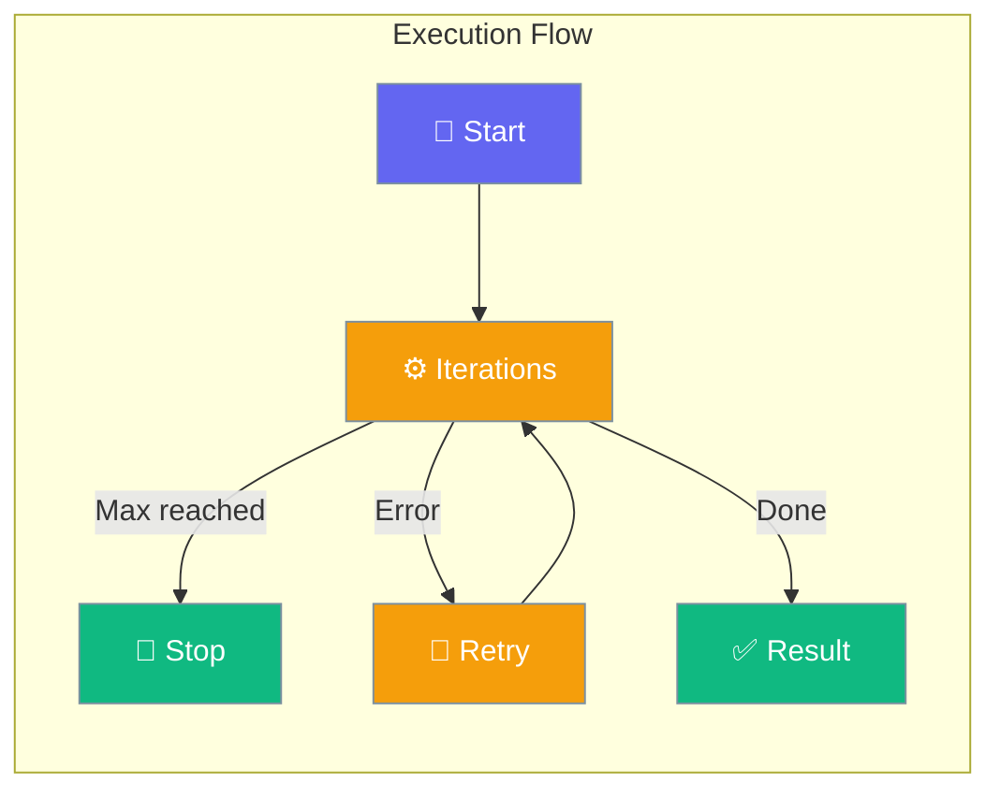
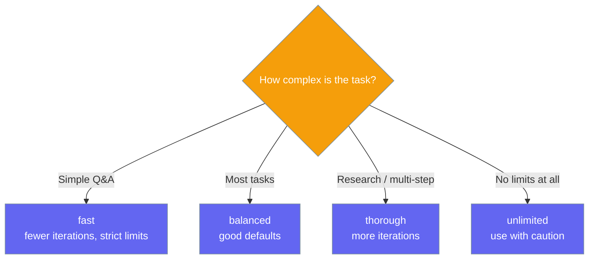
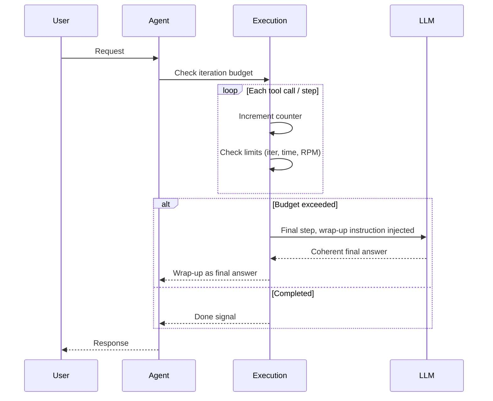

Execution configuration controls how long an agent runs, how many times it retries, and what code it can execute.

```python
from praisonaiagents import Agent

agent = Agent(
    name="Assistant",
    instructions="You are a thorough research assistant.",
    execution="thorough",
)

agent.start("Analyze the competitive landscape of the electric vehicle market.")
```

The user sends a research prompt; iteration limits, retries, and rate limits govern how long the agent runs.



## Quick Start

<Steps>
<Step title="Level 1 — String (preset)">

Pick a named execution profile — the shortest way to set sensible limits.

```python
from praisonaiagents import Agent

agent = Agent(
    name="Researcher",
    instructions="You are a research assistant.",
    execution="thorough",
)
agent.start("Compare five programming languages for web development.")
```
</Step>

<Step title="Level 2 — Config class (full control)">

Use `ExecutionConfig` to set exact iteration, time, and retry limits.

```python
from praisonaiagents import Agent, ExecutionConfig

agent = Agent(
    name="Researcher",
    instructions="You are a research assistant.",
    execution=ExecutionConfig(
        max_iter=50,
        max_execution_time=300,
        max_retry_limit=3,
    ),
)
agent.start("Research and summarize the latest AI safety papers.")
```
</Step>
</Steps>

---

## Execution Presets



---

## How It Works



| Phase | What happens |
|---|---|
| 1. Budget check | Execution tracks iterations against `max_iter` |
| 2. Rate limit | Enforces `max_rpm` requests-per-minute |
| 3. Time limit | Stops if `max_execution_time` seconds elapsed |
| 4. Retry | Retries failed steps up to `max_retry_limit` times |
| 5. Step-limit wrap-up | On the final permitted step (`max_steps`, or `max_iter` when unset), the agent injects a wrap-up instruction so the model produces a coherent final answer summarising progress instead of being hard-cut. Detect truncation with `agent.last_stop_reason == "max_steps"`. See [Step Budget](/docs/features/max-steps). |

---

## Configuration Options

<Card icon="code" href="/docs/sdk/reference/python/ExecutionConfig">
  Full list of options, types, and defaults — `ExecutionConfig`
</Card>

<Note>
Prefer `max_steps` for the tool-use budget — it's the unified knob honoured by both execution loops, and you can detect truncation with `agent.last_stop_reason`. See [Step Budget](/docs/features/max-steps).
</Note>

The most common options at a glance:

| Option | Type | Default | Description |
|---|---|---|---|
| `max_steps` | `int \| None` | `None` | Unified outer-loop step budget honoured by **both** tool-execution loops (OpenAI-native and LiteLLM). `None` falls back to `max_iter`. Must be `>= 1` when set. See [Step Budget](/docs/features/max-steps). |
| `max_iter` | `int` | `20` | Legacy per-loop iteration cap, used when `max_steps` is unset. On the final step the agent receives a graceful wrap-up instruction and returns a coherent summary — not the old canned `"Task completed."` placeholder. |
| `max_tool_calls_per_turn` | `int` | `10` | Cap on tool calls within a **single** LLM response (parallel-tool guardrail). Independent of `max_steps`. |
| `max_rpm` | `int \| None` | `None` | Max requests per minute |
| `max_execution_time` | `int \| None` | `None` | Max seconds per run |
| `max_retry_limit` | `int` | `2` | Max retries on failure |
| `code_execution` | `bool` | `False` | Enable code execution (`code_mode="safe"` by default) |
| `max_budget` | `float \| None` | `None` | Hard USD spend limit per run |

<Warning>
`context_compaction` currently defaults to `False` but will default to `True` in the next release. To opt in early, set `context_compaction=True` in your `ExecutionConfig`. This provides automatic protection against context window overflow.
</Warning>

---

## Common Patterns

### Pattern 1 — Budget-capped agent
```python
from praisonaiagents import Agent, ExecutionConfig

agent = Agent(
    instructions="You are a research assistant.",
    execution=ExecutionConfig(max_budget=0.50, on_budget_exceeded="warn"),
)
response = agent.start("Research the history of computing.")
print(response)
```

### Pattern 2 — Code execution agent
```python
from praisonaiagents import Agent, ExecutionConfig

agent = Agent(
    instructions="You are a Python coding assistant that runs code to verify answers.",
    execution=ExecutionConfig(
        code_execution=True,
        code_mode="safe",
        max_iter=30,
    ),
)
agent.start("Write and test a Python function to find prime numbers.")
```

### Pattern 3 — Parallel tool calls for speed
```python
from praisonaiagents import Agent, ExecutionConfig

agent = Agent(
    instructions="You are a multi-source research agent.",
    execution=ExecutionConfig(parallel_tool_calls=True, max_iter=40),
)
agent.start("Gather weather, news, and stock prices for New York.")
```

### Pattern 4 — Code that calls your tools
```python
from praisonaiagents import Agent, ExecutionConfig

agent = Agent(
    instructions="You solve tasks by writing code that calls the provided tools.",
    tools=[search_web, calculate],
    execution=ExecutionConfig(
        code_execution=True,
        code_tools=True,
        code_tools_allow=["search_web", "calculate"],
    ),
)
agent.start("Search for the population of three cities and sum them.")
```

---

## Best Practices

<AccordionGroup>
<Accordion title="Use presets as a starting point">
`execution="thorough"` works well for most research and multi-step tasks. Only switch to custom `ExecutionConfig` when you need specific limits like budget caps or code execution.
</Accordion>

<Accordion title="Set max_budget for cost control">
For any agent making many API calls, set `max_budget=0.50` to cap spend at 50 cents per run. Use `on_budget_exceeded="warn"` in development and `"stop"` in production.
</Accordion>

<Accordion title="Enable parallel_tool_calls for speed">
When your agent calls multiple independent tools per turn (e.g., search + fetch + calculate), enable `parallel_tool_calls=True` to run them concurrently and cut latency.
</Accordion>

<Accordion title="Code execution safety">
Always use `code_mode="safe"` and `code_sandbox_mode="sandbox"` when enabling code execution. Only switch to `"unsafe"` or `"direct"` in fully isolated environments you control.
</Accordion>

<Accordion title="Scope code_tools with an explicit allow-list">
When `code_tools=True`, always set `code_tools_allow` to the exact tool names code may call. Leaving it `None` exposes no tools (the safe default), so name only what the task needs — never grant blanket access.
</Accordion>

<Accordion title="Detecting truncated runs">
Set `max_steps` and check `agent.last_stop_reason == "max_steps"` to detect truncation — no string-matching needed. The returned text is a real LLM-authored wrap-up ("Here's what I accomplished… here's what remains…"), not a placeholder. See [Step Budget](/docs/features/max-steps).
</Accordion>
</AccordionGroup>

---

## Related

<CardGroup cols={2}>
<Card icon="gauge-max" href="/docs/features/max-steps">
  Step Budget — cap tool-use steps and detect truncation
</Card>
<Card icon="display" href="/docs/features/output">
  Output — control verbosity and response format
</Card>
<Card icon="gauge-max" href="/docs/features/max-steps">
  Step Budget — cap tool-use steps and detect truncation
</Card>
<Card icon="database" href="/docs/features/caching">
  Caching — avoid redundant LLM API calls
</Card>
</CardGroup>
