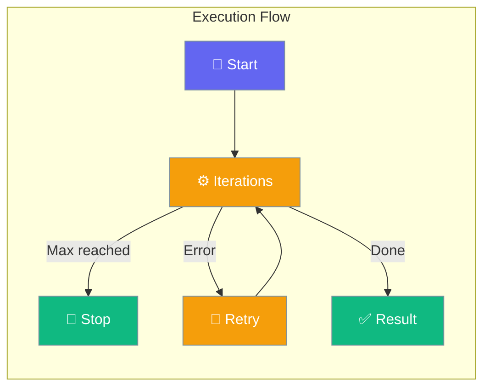
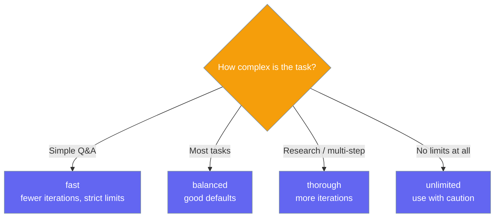
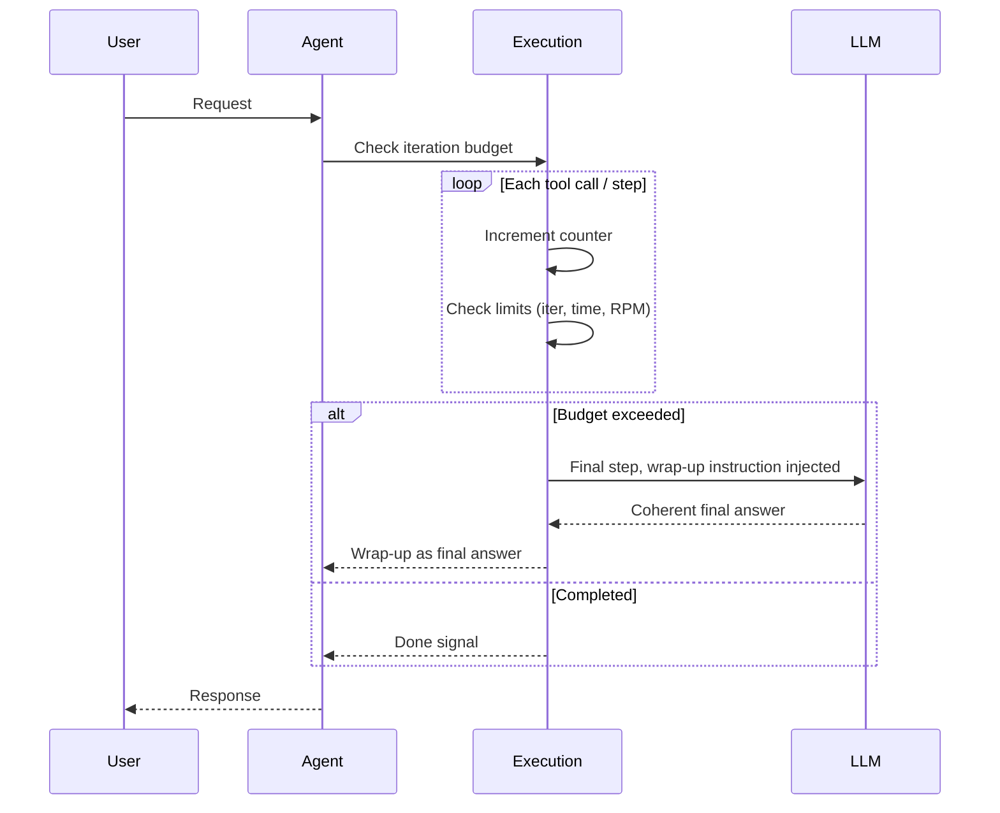

Execution configuration controls how long an agent runs, how many times it retries, and what code it can execute.

<Note>
Replaces the deprecated `allow_code_execution`, `code_execution_mode`, and `rate_limiter` kwargs — see [Legacy Agent Parameters](/features/agent-legacy-params).
</Note>

<Note>
The string form of `execution=` must name a valid preset (`fast`, `balanced`, `thorough`, …). A typo raises `ValueError` at construction time with a "Did you mean ...?" suggestion — see [Fail-Loud Defaults](/features/fail-loud-defaults). Matching is case-insensitive, whitespace-tolerant, and treats `-`/`_` interchangeably.
</Note>

```python
from praisonaiagents import Agent
from praisonaiagents.config.presets import EXECUTION_PRESETS

# All spellings apply the 'thorough' preset (max_iter=50):
for value in ("thorough", " thorough ", "THOROUGH"):
    agent = Agent(instructions="t", execution=value)
    assert agent.max_iter == EXECUTION_PRESETS["thorough"]["max_iter"]
```

| Call (Python) | Before PR #4186 | After PR #4186 |
|---|---|---|
| `Agent(execution="thorough")` | ✅ `max_iter=50` | ✅ `max_iter=50` |
| `Agent(execution=" thorough ")` | ⚠ validated → `max_iter=20` (default) | ✅ `max_iter=50` (`thorough`) |
| `Agent(execution="THOROUGH")` | ⚠ validated → `max_iter=20` (default) | ✅ `max_iter=50` (`thorough`) |

<Note>
Before PraisonAI PR #4186, hyphen / uppercase / padded variants were accepted by the validator but silently fell back to the default `max_iter`. Upgrade to a build that includes PR #4186 to get the behaviour shown above.
</Note>

```python
from praisonaiagents import Agent

agent = Agent(
    name="Assistant",
    instructions="You are a thorough research assistant.",
    execution="thorough",
)

agent.start("Analyze the competitive landscape of the electric vehicle market.")
```

The user sends a research prompt; iteration limits, retries, and rate limits govern how long the agent runs.


```mermaid
graph LR
    subgraph "Execution Flow"
        Start[🚀 Start] --> Iter[⚙️ Iterations]
        Iter -->|Max reached| Stop[🛑 Stop]
        Iter -->|Error| Retry[🔄 Retry]
        Retry --> Iter
        Iter -->|Done| Result[✅ Result]
    end

    classDef input fill:#6366F1,stroke:#7C90A0,color:#fff
    classDef process fill:#F59E0B,stroke:#7C90A0,color:#fff
    classDef output fill:#10B981,stroke:#7C90A0,color:#fff

    class Start input
    class Iter,Retry process
    class Stop,Result output
```

## Quick Start

<Steps>
<Step title="Level 1 — String (preset)">

Pick a named execution profile — the shortest way to set sensible limits.

```python
from praisonaiagents import Agent

agent = Agent(
    name="Researcher",
    instructions="You are a research assistant.",
    execution="thorough",
)
agent.start("Compare five programming languages for web development.")
```
</Step>

<Step title="Level 2 — Config class (full control)">

Use `ExecutionConfig` to set exact iteration, time, and retry limits.

```python
from praisonaiagents import Agent, ExecutionConfig

agent = Agent(
    name="Researcher",
    instructions="You are a research assistant.",
    execution=ExecutionConfig(
        max_iter=50,
        max_execution_time=300,
        max_retry_limit=3,
    ),
)
agent.start("Research and summarize the latest AI safety papers.")
```
</Step>
</Steps>

---

## Execution Presets


```mermaid
graph TB
    Q{How complex is the task?}
    Q -->|Simple Q&A| Fast[fast\nfewer iterations, strict limits]
    Q -->|Most tasks| Balanced[balanced\ngood defaults]
    Q -->|Research / multi-step| Thorough[thorough\nmore iterations]
    Q -->|No limits at all| Unlimited[unlimited\nuse with caution]

    classDef decision fill:#F59E0B,stroke:#7C90A0,color:#fff
    classDef preset fill:#6366F1,stroke:#7C90A0,color:#fff

    class Q decision
    class Fast,Balanced,Thorough,Unlimited preset
```

---

## How It Works


```mermaid
sequenceDiagram
    participant User
    participant Agent
    participant Execution
    participant LLM

    User->>Agent: Request
    Agent->>Execution: Check iteration budget
    loop Each tool call / step
        Execution->>Execution: Increment counter
        Execution->>Execution: Check limits (iter, time, RPM)
    end
    alt Budget exceeded
        Execution->>LLM: Final step, wrap-up instruction injected
        LLM-->>Execution: Coherent final answer
        Execution-->>Agent: Wrap-up as final answer
    else Completed
        Execution-->>Agent: Done signal
    end
    Agent-->>User: Response
```

| Phase | What happens |
|---|---|
| 1. Budget check | Execution tracks iterations against `max_iter` |
| 2. Rate limit | Enforces `max_rpm` requests-per-minute |
| 3. Time limit | Stops if `max_execution_time` seconds elapsed |
| 4. Retry | Retries failed steps up to `max_retry_limit` times |
| 5. Step-limit wrap-up | On the final permitted step (`max_steps`, or `max_iter` when unset), the agent injects a wrap-up instruction so the model produces a coherent final answer summarising progress instead of being hard-cut. Detect truncation with `agent.last_stop_reason == "max_steps"`. See [Step Budget](/features/max-steps). |

---

## Configuration Options

<Card icon="code" href="/sdk/reference/praisonaiagents/modules/feature_configs">
  Full list of options, types, and defaults — `ExecutionConfig`
</Card>

<Note>
Prefer `max_steps` for the tool-use budget — it's the unified knob honoured by both execution loops, and you can detect truncation with `agent.last_stop_reason`. See [Step Budget](/features/max-steps).
</Note>

The most common options at a glance:

| Option | Type | Default | Description |
|---|---|---|---|
| `max_steps` | `int \| None` | `None` | Unified outer-loop step budget honoured by **both** tool-execution loops (OpenAI-native and LiteLLM). `None` falls back to `max_iter`. Must be `>= 1` when set. See [Step Budget](/features/max-steps). |
| `max_iter` | `int` | `20` | Legacy per-loop iteration cap, used when `max_steps` is unset. On the final step the agent receives a graceful wrap-up instruction and returns a coherent summary — not the old canned `"Task completed."` placeholder. |
| `max_tool_calls_per_turn` | `int` | `10` | Cap on tool calls within a **single** LLM response (parallel-tool guardrail). Independent of `max_steps`. |
| `max_rpm` | `int \| None` | `None` | Max requests per minute — when set and no `rate_limiter` is passed, the Agent auto-builds one. `max_rpm <= 0` raises `ValueError` |
| `max_execution_time` | `int \| None` | `None` | Max seconds per run |
| `max_retry_limit` | `int` | `2` | Max retries on failure |
| `code_execution` | `bool` | `False` | Grants the agent an `execute_code` tool (not just a flag). The tool is classed `"critical"`, so it is approval-gated under every preset except `"full"`. |
| `code_mode` | `str` | `"safe"` | `"safe"` runs code in an isolated subprocess with resource limits; `"unsafe"` runs in-process with restricted builtins so code can reach the agent's tools. Any other value raises `ValueError` at construction. |
| `code_tools` | `bool` | `False` | Lets model-generated code call the agent's tools via proxies. Only meaningful with `code_mode="unsafe"` — setting it in `"safe"` mode warns and is ignored. |
| `code_tools_allow` | `List[str] \| None` | `None` | Per-run allow-list of tool names callable from code. A named tool must **also** be present in `Agent(tools=[...])`. `None`/empty = no tools exposed. |
| `max_budget` | `float \| None` | `None` | Hard USD spend limit per run |

### Code-execution options

Setting `code_execution=True` appends a real tool named `execute_code` to the agent's tool list — it is not just a flag. Because the tool is named `execute_code`, the approval registry classes it **`critical`**, so it is approval-gated under every preset except `"full"`.

| Option | Type | Default | Description |
|---|---|---|---|
| `code_execution` | `bool` | `False` | Appends the `execute_code` tool to the agent |
| `code_mode` | `str` | `"safe"` | `"safe"` runs code in a subprocess with resource limits and a clean env (tools **not** reachable). `"unsafe"` runs in-process with restricted builtins so `code_tools_allow` tools become callable. Any other value raises `ValueError` at construction |
| `code_tools` | `bool` | `False` | Let model-generated code call the agent's registered tools (only meaningful with `code_mode="unsafe"`) |
| `code_tools_allow` | `List[str] \| None` | `None` | Per-run allow-list of tool names callable from code. The tool must **also** be in `Agent(tools=[...])`. `None`/empty exposes no tools |
| `timeout` | `int \| None` | `None` | In `"safe"` mode this is a per-call timeout for `execute_code` (enforced by the subprocess). In `"unsafe"` mode there is **no hard timeout** — code runs in-process |

<Warning>
- **Unknown `code_mode` raises `ValueError`** at `Agent(...)` construction. Only `"safe"` and `"unsafe"` are valid.
- **`code_tools=True` without `code_mode="unsafe"` emits a `UserWarning`.** Safe mode runs in a subprocess where the agent's tools do not exist, so `code_tools_allow` is ignored there.
- **`timeout` is only a hard guarantee in `"safe"` mode.** In `"unsafe"` mode a runaway loop can block the worker — use `"safe"` when the timeout must be enforced.
</Warning>

<Warning>
An unknown `code_mode` raises `ValueError` at Agent construction — only `"safe"` and `"unsafe"` are valid. Setting `code_tools=True` without `code_mode="unsafe"` emits a `UserWarning`: safe mode runs in a subprocess where the agent's tools do not exist, so `code_tools_allow` is ignored there.
</Warning>

<Warning>
`ExecutionConfig(timeout=...)` is a **per-call** timeout for `execute_code` only in `"safe"` mode (the subprocess). In `"unsafe"` mode there is **no hard timeout** — code runs in the current process, so a runaway loop can block the worker. Use `code_mode="safe"` when the timeout must be a hard guarantee.
</Warning>

<Note>
The code executor runs a trailing expression **exactly once**. Earlier builds re-evaluated it, so `print(x)` printed twice and a trailing `my_tool(...)` in code mode fired the tool twice. If you worked around that double execution, you no longer need to.
</Note>

<Warning>
`context_compaction` currently defaults to `False` but will default to `True` in the next release. To opt in early, set `context_compaction=True` in your `ExecutionConfig`. This provides automatic protection against context window overflow.
</Warning>

---

## Common Patterns

### Pattern 1 — Budget-capped agent
```python
from praisonaiagents import Agent, ExecutionConfig

agent = Agent(
    instructions="You are a research assistant.",
    execution=ExecutionConfig(max_budget=0.50, on_budget_exceeded="warn"),
)
response = agent.start("Research the history of computing.")
print(response)
```

### Pattern 2 — Code execution agent
```python
from praisonaiagents import Agent, ExecutionConfig

agent = Agent(
    instructions="You are a Python coding assistant that runs code to verify answers.",
    execution=ExecutionConfig(
        code_execution=True,
        code_mode="safe",
        max_iter=30,
    ),
)
agent.start("Write and test a Python function to find prime numbers.")
```

<Note>
`code_execution=True` gives this agent an `execute_code` tool. That tool is classed `critical`, so under any approval preset except `"full"` the first `execute_code` call triggers an approval prompt before the code runs. In `"safe"` mode (shown here) the `timeout` on the `ExecutionConfig` is enforced per call by the subprocess. See [Code Execution with Tools](/features/code-execution-with-tools) for the `"unsafe"` (tool-capable) path.
</Note>

### Pattern 3 — Parallel tool calls for speed
```python
from praisonaiagents import Agent, ExecutionConfig

agent = Agent(
    instructions="You are a multi-source research agent.",
    execution=ExecutionConfig(parallel_tool_calls=True, max_iter=40),
)
agent.start("Gather weather, news, and stock prices for New York.")
```

```python
import asyncio
from praisonaiagents import Agent, ExecutionConfig

agent = Agent(
    instructions="You are a multi-source research agent.",
    execution=ExecutionConfig(parallel_tool_calls=True, max_iter=40),
)

# Since PraisonAI PR #4634, parallel_tool_calls is honoured on the async
# tool loop too — independent tool calls in one turn are dispatched
# concurrently via asyncio.gather instead of running one-at-a-time.
asyncio.run(agent.astart("Gather weather, news, and stock prices for New York."))
```

<Note>
`ExecutionConfig.parallel_tool_calls` is the **single source of truth** for running batched LLM tool calls in parallel. It applies uniformly to `agent.start()` / `agent.chat()` (sync) and `agent.astart()` / `agent.achat()` (async) as of [PraisonAI PR #4634](https://github.com/MervinPraison/PraisonAI/pull/4634); earlier releases silently ignored the setting on the async path and ran tools sequentially. `ToolConfig.parallel` is a deprecated alias for it — prefer this spelling, and never set both to conflicting values (that raises `TypeError`).
</Note>

### Pattern 4 — Code that calls your tools
```python
from praisonaiagents import Agent, ExecutionConfig

agent = Agent(
    instructions="You solve tasks by writing code that calls the provided tools.",
    tools=[search_web, calculate],
    execution=ExecutionConfig(
        code_execution=True,
        code_mode="unsafe",  # required for code to reach the agent's tools
        code_tools=True,
        code_tools_allow=["search_web", "calculate"],
    ),
)
agent.start("Search for the population of three cities and sum them.")
```

### Pattern 5 — The `execute_code` tool and its approval gate
Setting `code_execution=True` appends an `execute_code` tool to the agent. Because that tool is classed `"critical"`, the approval framework prompts before it runs under every preset except `"full"`.

```python
from praisonaiagents import Agent, ExecutionConfig

agent = Agent(
    instructions="You are a Python assistant that runs code to verify answers.",
    execution=ExecutionConfig(code_execution=True),  # code_mode="safe" by default
)

# The agent now has an `execute_code` tool. When it decides to run code,
# the approval prompt fires first (unless the "full" preset is active).
agent.start("Compute the 20th Fibonacci number by running Python.")
```

---

## Best Practices

<AccordionGroup>
<Accordion title="Use presets as a starting point">
`execution="thorough"` works well for most research and multi-step tasks. Only switch to custom `ExecutionConfig` when you need specific limits like budget caps or code execution.
</Accordion>

<Accordion title="Set max_budget for cost control">
For any agent making many API calls, set `max_budget=0.50` to cap spend at 50 cents per run. Use `on_budget_exceeded="warn"` in development and `"stop"` in production.
</Accordion>

<Accordion title="Enable parallel_tool_calls for speed">
When your agent calls multiple independent tools per turn (e.g., search + fetch + calculate), enable `parallel_tool_calls=True` to run them concurrently and cut latency. This is the single source of truth for parallel tool calls; `ToolConfig.parallel` is a deprecated alias for it. Parallel tool calls apply to both sync (`chat()` / `start()`) and async (`achat()` / `astart()`) tool loops as of PR #4634 — before that, async ran tools sequentially even with `parallel_tool_calls=True`. Concurrent writes to the same file fall back to sequential — see the [write-conflict guard](/features/concurrency#write-conflict-guard-for-shell-like-tools).
</Accordion>

<Accordion title="Code execution safety">
`code_mode="safe"` is the right default for `code_execution=True`. It runs code in a subprocess with resource limits, and the `timeout` on your `ExecutionConfig` is enforced there as a hard per-call limit. `"unsafe"` mode runs in the current process — it enforces **no** hard timeout, so a runaway loop can block the worker; only choose it when code must reach your tools, and prefer `"safe"` whenever the timeout must be a guarantee. `Agent(sandbox=…)` only isolates explicit `agent.execute_code(...)` calls — it does **not** give the model a tool. For isolation of code the model runs, use `AgentFlow(run_on="docker")` / `run_on="e2b"` (whole workflow) or `LocalAgent(compute="docker")` (per-agent). See [Placement](/features/placement).
</Accordion>

<Accordion title="Scope code_tools with an explicit allow-list">
When `code_tools=True`, always set `code_tools_allow` to the exact tool names code may call. Leaving it `None` exposes no tools (the safe default), so name only what the task needs — never grant blanket access.
</Accordion>

<Accordion title="Detecting truncated runs">
Set `max_steps` and check `agent.last_stop_reason == "max_steps"` to detect truncation — no string-matching needed. The returned text is a real LLM-authored wrap-up ("Here's what I accomplished… here's what remains…"), not a placeholder. See [Step Budget](/features/max-steps).
</Accordion>
</AccordionGroup>

---

## Related

<CardGroup cols={2}>
<Card title="Where Does It Run" icon="location-dot" href="/features/where-does-it-run">
  Ask any agent where its thinking and tools actually execute
</Card>
<Card icon="gauge-max" href="/features/max-steps">
  Step Budget — cap tool-use steps and detect truncation
</Card>
<Card icon="display" href="/features/output">
  Output — control verbosity and response format
</Card>
<Card icon="gauge-max" href="/features/max-steps">
  Step Budget — cap tool-use steps and detect truncation
</Card>
<Card icon="database" href="/features/caching">
  Caching — avoid redundant LLM API calls
</Card>
</CardGroup>
