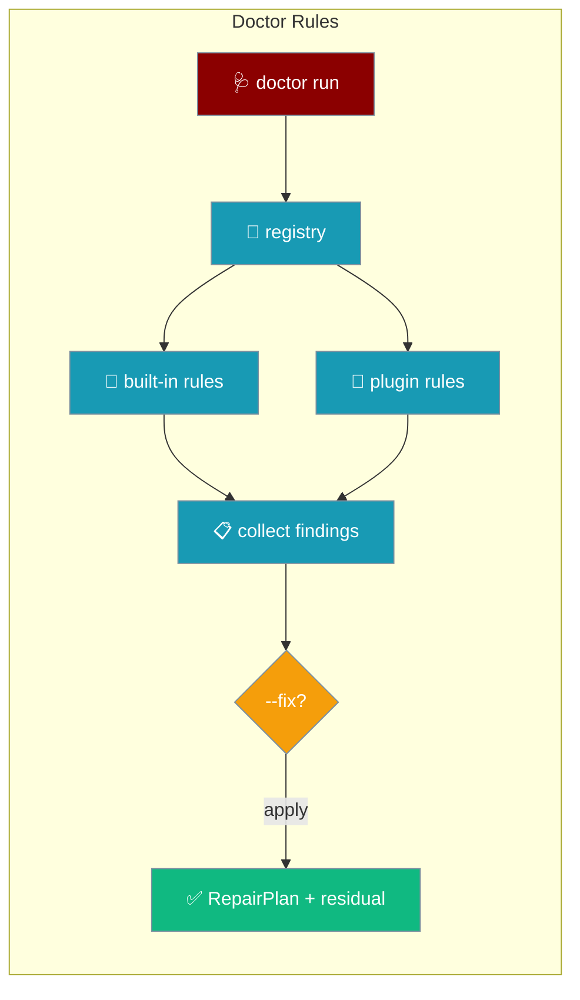
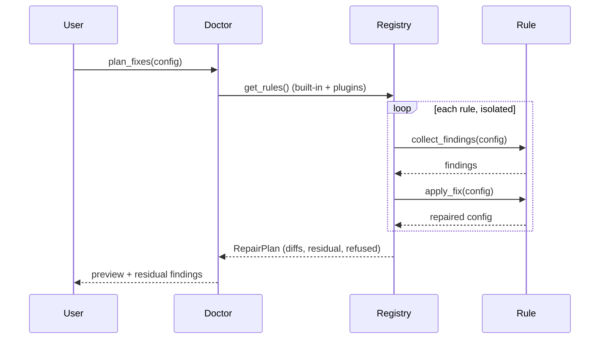

Doctor rules are a plugin surface — any package can register a diagnostic-and-repair rule via the `praisonai.doctor_contracts` entry point and `praisonai doctor` picks it up alongside the built-in checks.



## Quick Start

<Steps>
<Step title="Write a rule">
Implement `DoctorContractProtocol`: a `rule_id`, a `collect_findings()` that returns `Finding`s, and an `apply_fix()` that returns a repaired config.

```python
# my_package/rules.py
from typing import Any, Dict, List
from praisonaiagents.runtime import Finding

class MyServiceRule:
    @property
    def rule_id(self) -> str:
        return "my_service_endpoint"

    def collect_findings(self, config: Dict[str, Any]) -> List[Finding]:
        if config.get("my_service_url", "").startswith("http://"):
            return [Finding(
                rule_id=self.rule_id,
                severity="warning",
                message="my_service_url uses insecure http://",
                fix_description="Rewrite to https://",
            )]
        return []

    def apply_fix(self, config: Dict[str, Any]) -> Dict[str, Any]:
        url = config.get("my_service_url", "")
        if url.startswith("http://"):
            config["my_service_url"] = "https://" + url[len("http://"):]
        return config
```
</Step>

<Step title="Register it via entry point">
Expose the rule under `praisonai.doctor_contracts` in your `pyproject.toml`.

```toml
# pyproject.toml
[project.entry-points."praisonai.doctor_contracts"]
my_service = "my_package.rules:MyServiceRule"
```
</Step>

<Step title="Run the doctor">
Your rule now runs alongside the built-ins — collect findings, or preview and apply repairs.

```python
from praisonaiagents.runtime import collect_findings, plan_fixes

config = {"my_service_url": "http://api.local"}

for finding in collect_findings(config):
    print(f"[{finding.severity}] {finding.rule_id}: {finding.message}")

plan = plan_fixes(config, dry_run=True)   # preview
print(plan.render_diffs())
print("residual:", plan.residual_findings)
```
</Step>
</Steps>

---

## How It Works

The registry loads built-in rules plus every rule discovered on the `praisonai.doctor_contracts` entry point, then runs each in isolation — a rule that raises is recorded in `refused` instead of aborting the whole run.



A repair is a three-phase lifecycle: collect findings → apply fix → re-collect residual findings so callers can report "repair left N finding(s)". In `dry_run` mode nothing is written; the plan's `config` holds the proposed result.

---

## Reference

`Finding` — one diagnostic result:

| Field | Type | Default | Description |
|-------|------|---------|-------------|
| `rule_id` | `str` | — | The rule that produced this finding |
| `severity` | `str` | — | `"warning"`, `"error"`, or `"info"` |
| `message` | `str` | — | Human-readable description shown to operators |
| `fix_description` | `str` | `None` | What the repair would do |
| `context` | `dict` | `None` | Extra structured data (field, value, location) |

`RepairPlan` — the result of `plan_fixes()`:

| Field | Type | Default | Description |
|-------|------|---------|-------------|
| `config` | `dict` | — | The repaired (or proposed, in dry-run) config |
| `diffs` | `list[ConfigDiff]` | — | Per-rule before/after changes |
| `backup_path` | `str` | `None` | Where the original was snapshotted (apply mode + `backup=True`) |
| `residual_findings` | `list[Finding]` | `[]` | Findings still present after repair |
| `refused` | `list[Finding]` | `[]` | Rules that raised and were skipped |
| `applied` | `bool` | `False` | True only when a real change was written |

Rule contract (`DoctorContractProtocol`):

| Member | Signature | Purpose |
|--------|-----------|---------|
| `rule_id` | `property -> str` | Unique id; duplicate ids replace the earlier rule |
| `collect_findings` | `(config) -> list[Finding]` | Analyze config, return findings |
| `apply_fix` | `(config) -> dict` | Return a repaired config |

---

## Common Patterns

Preview before writing — `plan_fixes` defaults to `dry_run=True`:

```python
from praisonaiagents.runtime import plan_fixes

plan = plan_fixes(config)
if plan.has_changes:
    print(plan.render_diffs())
```

Apply with a backup and re-validate:

```python
plan = plan_fixes(config, dry_run=False, backup=True)
if plan.residual_findings:
    print(f"repair left {len(plan.residual_findings)} finding(s)")
```

Register a rule at runtime instead of an entry point:

```python
from praisonaiagents.runtime import register_rule
from my_package.rules import MyServiceRule

register_rule(MyServiceRule())
```

---

## Best Practices

<AccordionGroup>
<Accordion title="Keep collect_findings fast and side-effect-free">
It runs on every doctor invocation. Inspect the config only — no network calls, no writes.
</Accordion>

<Accordion title="Make apply_fix idempotent and re-checkable">
Running the fix twice must produce the same config, and a follow-up `collect_findings` should return no findings for what you repaired.
</Accordion>

<Accordion title="Return actionable message strings">
`message` and `fix_description` show up verbatim in operator output — say what is wrong and what the fix does.
</Accordion>

<Accordion title="Use a stable rule_id prefix">
Prefix ids per package (`my_channel_*`, `my_tool_*`) so operators can filter and duplicate-id replacement is predictable.
</Accordion>
</AccordionGroup>

---

## Related

<CardGroup cols={2}>
<Card title="Runtime Config Migration" icon="stethoscope" href="/features/doctor-runtime-migration">
The built-in cli_backend migration rule.
</Card>
<Card title="Gateway CLI" icon="terminal" href="/features/gateway-cli">
Run doctor and other gateway commands.
</Card>
<Card title="Gateway Config Migration" icon="arrows-rotate" href="/features/gateway-config-migration">
Migrate gateway configuration versions.
</Card>
<Card title="Doctor Optional Deps" icon="box" href="/features/doctor-optional-deps">
Diagnose missing optional dependencies.
</Card>
</CardGroup>
